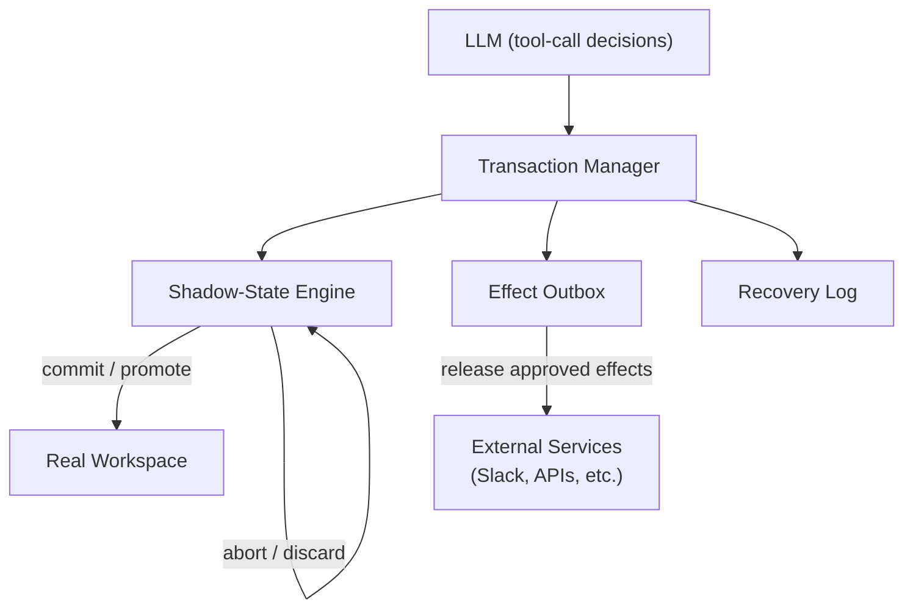
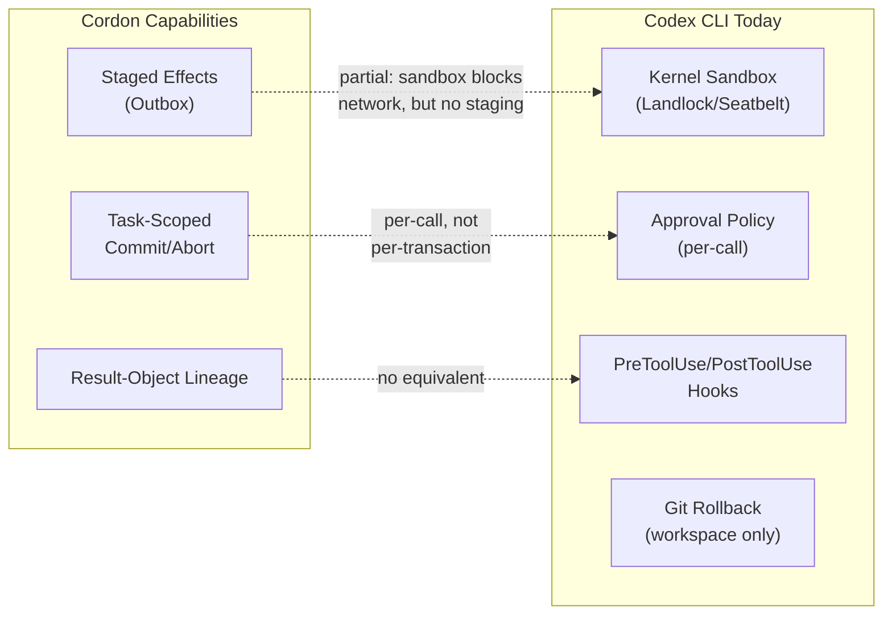

# Semantic Transactions for Tool-Using Agents: What Cordon Reveals About the Staged-Effect Gap — and How Codex CLI's Approval-Sandbox Stack Partially Fills It


---

## The Problem with Isolated Tool Calls

Every mainstream coding agent runtime — Codex CLI, Claude Code, Gemini CLI, OpenCode — exposes tools as isolated RPCs. The model calls `bash`, `apply_patch`, or an MCP tool; the harness executes it; the result streams back. Each call is an atomic unit with no task-scoped boundary linking it to what came before or what follows [^1].

This design works well enough when each tool call is independently harmless. It breaks down badly when multi-step workflows compose results across calls, because the *lineage* of data flowing through a sequence of tool invocations becomes invisible to the harness. A log file containing API keys gets read in step one, summarised in step two, and posted to Slack in step three. No individual step violates a rule — but the composed flow leaks secrets [^1].

Chen et al.'s *Cordon* paper (arXiv:2606.17573, June 2026) formalises this as the **staged-effect gap**: the absence of a task-level execution boundary for commit, rollback, recovery, and audit across multi-step agent workflows [^1]. Their proposed fix — semantic transactions — borrows the commit/abort discipline from database systems and applies it to the agent tool-calling loop.

## Cordon's Architecture

Cordon introduces four components that sit between the LLM's tool-call decisions and the actual execution environment [^1] [^2]:



### Transaction Manager

Creates and maintains active transaction contexts. Each task gets a scope that tracks operation intents, object handles, lineage edges, speculative state, pending effects, scoped authority, and recovery records [^1].

### Shadow-State Engine

Local mutations — file writes, deletes, configuration changes — execute against a transaction-scoped view rather than the real workspace. On commit, approved changes promote to the live filesystem. On abort, they vanish. The implementation uses an application-level manifest system with staged file contents and JSON mappings of workspace paths [^2].

### Effect Outbox

External actions (messages, network requests, API calls) sit in a staging area with metadata: sink, payload handle, lineage handle, authority state, idempotency key, and release status. Nothing leaves the process until validation succeeds and commit releases approved entries [^1] [^2].

### Recovery Log

All commits, aborts, releases, and boundary crossings persist to storage. The prototype uses ZODB FileStorage to record Python objects with explicit commit/abort operations, enabling crash recovery from recorded transaction state [^2].

## Nine Formal Invariants

Cordon defines nine containment invariants (I1–I9) grouped into three families — lineage flow, commit discipline, and authority/accountability — that must hold before a transaction commits [^2]. These form the validation oracle: a composed tool-call sequence that violates any invariant gets blocked at the boundary rather than after irreversible effects have fired.

The invariants encode what existing defences miss. Model-level prompt defences operate pre-execution over text projections. Tool-call gates approve individual operations without seeing lineage or pending effects. Runtime containment (Docker, seccomp) protects the host but does not validate staged effects. Output filters catch literal leaks but fail on summarisation and multi-turn derivation [^1] [^2].

## Evaluation Results

The numbers make the gap concrete [^2]:

| Defence Layer | Cases Intercepted (of 45) | Post-Commit Only | Missed |
|---|---|---|---|
| Plain execution | 0 | 0 | 45 |
| Existing strategy adapters | 14 | 5 | 26 |
| **Cordon** | **45** | **0** | **0** |

Cordon tested five transaction-level risk families [^2]:

1. **Sensitive writes** — direct file mutations containing secrets
2. **Exec-mediated sensitive writes** — shell commands that write sensitive data
3. **Session-secret external effects** — API keys reaching external sinks
4. **Derived-secret exec egress** — summarised secrets escaping via shell
5. **High-fanout deletes** — bulk destructive operations

Performance overhead remained modest: mean task time increased from 25.55s to 31.35s (22.7%) in approve-all mode, with a 23.6–28.4% *reduction* in token usage across transaction modes [^2]. Rollback latency was 4.17ms median across 15 deterministic trajectories [^2].

On standard benchmarks, Cordon preserved or improved task completion: τ-bench rose from 87.5% to 90.0%, and Terminal-Bench held at 100% [^2].

## How Codex CLI's Existing Stack Maps

Codex CLI does not implement semantic transactions, but its layered defence architecture covers some of the same ground through different mechanisms.

### Sandbox as Partial Shadow State

The Landlock (Linux) and Seatbelt (macOS) kernel sandboxes restrict the agent's filesystem and network access at the OS level [^3]. In `workspace-write` mode, edits are confined to the project directory — a coarse-grained version of Cordon's shadow-state isolation [^3].

However, the sandbox operates at the *syscall* level, not the *semantic* level. It cannot distinguish between a benign file write and one that stages a secret for later exfiltration. There is no manifest of pending changes, no lineage tracking, and no task-scoped abort [^3].

### Approval Policy as Scoped Authority

The `approval_policy` configuration provides graduated enforcement [^4]:

```toml
# ~/.codex/config.toml
[security]
approval_policy = "on-request"   # ask before risky operations
```

Available modes — `untrusted`, `on-request`, `never`, and `granular` — control when the human must approve an action [^4]. This maps loosely to Cordon's scoped-approval mechanism, where approval binds to one transaction object, action, sink, and time window [^1].

The key difference: Codex CLI approvals are per-tool-call, not per-transaction. Approving step two does not carry awareness of what step one read or what step three will do with the result.

### Hooks as Validation Points

`PreToolUse` and `PostToolUse` hooks fire before and after supported tool calls (currently reliable for Bash, less so for `apply_patch` and MCP tools) [^5]:

```json
{
  "hooks": [
    {
      "event": "PreToolUse",
      "matcher": { "tool_name": "bash" },
      "command": "python3 /path/to/validate.py"
    }
  ]
}
```

A `PreToolUse` hook can inspect the command about to execute and return an approval/rejection decision. A `PostToolUse` hook can examine the output. Together, they provide insertion points for custom validation logic [^5].

What they lack is *transaction context*. Each hook invocation sees one tool call in isolation. There is no built-in mechanism to accumulate lineage across calls, stage effects, or roll back a composed sequence.

### Git as Recovery Log

For file changes, Codex CLI's practical rollback mechanism is git. Working on a feature branch and keeping `git status` clean before delegating to Codex makes patches easier to isolate and revert [^6]. The `/rewind` feature request (GitHub issue #11626) proposes checkpoint-based revert of both chat context and file edits [^6], but as of v0.143.0 this remains unimplemented.

Git provides recovery for workspace mutations but not for external effects — a Slack message sent, an API call made, a deployment triggered.

## The Gap: What Codex CLI Would Need

Mapping Cordon's architecture against Codex CLI's existing stack reveals three specific gaps:



### 1. Result-Object Lineage

No component in Codex CLI tracks how data flows between tool calls within a session. A `PostToolUse` hook sees the output of the current call but has no record of which previous outputs contributed to the current input. Building a lineage tracker as a hook-based middleware is technically possible — each `PostToolUse` records output hashes, each `PreToolUse` checks input provenance — but it would require significant custom engineering and session-state persistence that hooks do not natively provide [^5].

### 2. Effect Staging

The kernel sandbox blocks network access by default, and `network_proxy` domain allowlisting controls which domains the agent can reach [^3]. But there is no outbox pattern: once network access is granted (via approval or allowlist), the effect fires immediately. There is no "stage this Slack message, show me the composed flow, then release or abort" workflow.

### 3. Task-Scoped Boundaries

Codex CLI's approval decisions are stateless between calls. Approving a file read and later approving a network request are independent decisions with no mechanism to link them into a transaction that can be atomically committed or aborted.

## Practical Mitigation: A Hook-Based Transaction Shim

While waiting for native transaction support, a `PreToolUse` hook chain can approximate some of Cordon's guarantees:

```bash
#!/usr/bin/env bash
# pre-tool-validate.sh — simple lineage-aware pre-tool hook
# Reads accumulated lineage from /tmp/codex-tx-${CODEX_SESSION_ID}.jsonl
# Checks whether the proposed tool call creates a risky composed flow

LINEAGE_FILE="/tmp/codex-tx-${CODEX_SESSION_ID}.jsonl"
TOOL_NAME="$1"
TOOL_ARGS="$2"

# Check for sensitive-data lineage reaching external sinks
if echo "$TOOL_ARGS" | grep -qE "(curl|wget|slack|notify)" ; then
  if grep -q '"sensitivity":"high"' "$LINEAGE_FILE" 2>/dev/null; then
    echo '{"action":"reject","reason":"High-sensitivity data in lineage reaching external sink"}'
    exit 1
  fi
fi

echo '{"action":"approve"}'
```

Combined with a `PostToolUse` hook that records output metadata to the lineage file, this creates a rudimentary cross-call awareness layer. It is fragile — it relies on pattern matching rather than formal invariants — but it catches the most obvious composed-flow violations [^5].

## AGENTS.md Constraints

For teams not ready to build hook infrastructure, AGENTS.md rules can encode transaction-like discipline as natural-language constraints [^7]:

```markdown
## Transaction Discipline

- Before executing any external effect (API call, message, deployment),
  list every file read and command output that contributed to the payload.
- If any contributing source contained credentials, tokens, or PII,
  stop and request explicit human approval with the full lineage visible.
- Never combine destructive operations (delete, overwrite, deploy)
  with data-reading operations in the same turn without checkpoint.
```

These rules depend on model compliance rather than deterministic enforcement — a weaker guarantee than Cordon's formal invariants, but deployable today without code changes [^7].

## What This Means for the Ecosystem

Cordon's contribution is not primarily its prototype implementation. It is the formalisation of what goes wrong when agent runtimes treat tool calls as isolated RPCs. The paper's taxonomy of six defence categories — and where each fails — provides a diagnostic framework for evaluating any agent's security architecture [^1] [^2].

For Codex CLI specifically, the most actionable insight is that **hooks need transaction context**. A `PreToolUse` hook that can query "what sensitive data has flowed through this session so far?" would close the largest single gap. The existing `approval_policy` and sandbox infrastructure then provide the enforcement layer — but only if the validation layer can see across call boundaries.

The 22.7% task-time overhead and 23.6–28.4% token savings from Cordon's evaluation suggest that transaction boundaries need not be expensive [^2]. The token savings arise because the model makes fewer speculative attempts when the runtime provides clear commit/abort semantics — a finding that aligns with the broader pattern of structured harness constraints improving both safety and efficiency.

---

## Citations

[^1]: Chen, Z., Liu, H., Xu, D., Dong, D., Li, J., Pu, B., & Zhai, J. (2026). "Cordon: Semantic Transactions for Tool-Using LLM Agents." arXiv:2606.17573. [https://arxiv.org/abs/2606.17573](https://arxiv.org/abs/2606.17573)

[^2]: Chen, Z. et al. (2026). "Cordon: Semantic Transactions for Tool-Using LLM Agents" — full paper. [https://arxiv.org/html/2606.17573v1](https://arxiv.org/html/2606.17573v1)

[^3]: OpenAI. (2026). "Sandbox — Codex." OpenAI Developers. [https://developers.openai.com/codex/concepts/sandboxing](https://developers.openai.com/codex/concepts/sandboxing)

[^4]: OpenAI. (2026). "Agent Approvals & Security — Codex." OpenAI Developers. [https://developers.openai.com/codex/agent-approvals-security](https://developers.openai.com/codex/agent-approvals-security)

[^5]: OpenAI. (2026). "Hooks — Codex." OpenAI Developers. [https://developers.openai.com/codex/hooks](https://developers.openai.com/codex/hooks)

[^6]: GitHub. (2026). "CLI: Add /rewind checkpoint restore that reverts both chat context and Codex-applied code edits." Issue #11626, openai/codex. [https://github.com/openai/codex/issues/11626](https://github.com/openai/codex/issues/11626)

[^7]: OpenAI. (2026). "Configuration Reference — Codex." OpenAI Developers. [https://developers.openai.com/codex/config-reference](https://developers.openai.com/codex/config-reference)
