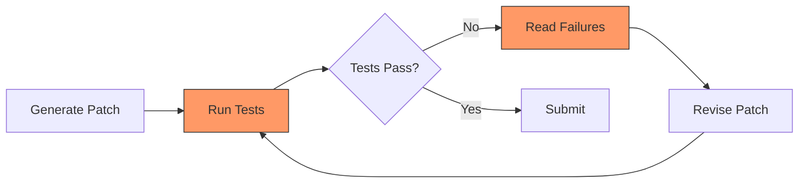

# To Run or Not to Run: What 7,745 Agent Traces Reveal About the Cost-Effectiveness of Code Execution — and How to Wire Selective Testing into Codex CLI


---

Every coding agent you use today follows the same loop: generate a patch, run the tests, read the failures, revise, repeat. It feels right — tight feedback loops are a cornerstone of good engineering. But what if most of those test runs are burning tokens and wall-clock time for negligible gain?

That is the question Lin et al. answer in *"To Run or Not to Run: Analyzing the Cost-Effectiveness of Code Execution in LLM-Based Program Repair"*, accepted at ISSTA 2026 [^1]. Their study analyses 7,745 public agent traces from the SWE-bench leaderboard and runs 3,000 controlled repair attempts across three agents — Claude Code, Codex, and OpenCode — under four execution paradigms. The headline finding is uncomfortable: for frontier models, restricting execution to zero test runs costs only 1.25 percentage points of resolve rate, a gap that is not statistically significant.

This article unpacks the evidence and maps it to Codex CLI's cost-control surface: `rollout_budget`, `model_reasoning_effort`, PostToolUse hooks, and named profiles.

## The Generate-Run-Revise Tax

The standard agent loop treats test execution as a free resource. Lin et al. show it is anything but. Across the 7,745 public traces, agents average **8.8 test executions per task**, with individual agents ranging from 2 to 19 [^1]. Each run consumes tokens for the test command, its output, and the model's interpretation of that output — plus the wall-clock time to run the suite itself.



The orange nodes — *Run Tests* and *Read Failures* — are the expensive steps. For a complex SWE-bench instance, a single test execution can inject thousands of tokens of output into the context window, compounding the cost of every subsequent turn.

## Four Execution Paradigms

The study tests each agent under four regimes [^1]:

| Paradigm | Description | Execution allowed? |
|---|---|---|
| **Prohibited** | Soft prompt constraint: no project runtime access | No |
| **Quota-Limited (K=1, K=3)** | Point-budget system limiting total executions | Limited |
| **Budget-Guided** | Unrestricted but cost-aware prompting | Yes (nudged) |
| **Unrestricted** | Standard behaviour, no constraints | Yes |

### Results on Frontier Models

The resolve rates tell a striking story:

| Agent | Model | Prohibited | Unrestricted | Gap |
|---|---|---|---|---|
| **Claude Code** | Sonnet 4.5 | 63–64% | 64–67% | 1–3 pp |
| **Codex** | GPT-5.2 (xhigh) | 73–74% | 73–75% | 0–2 pp |
| **OpenCode** | Qwen2.5-Coder-32B | 7–13% | 6–14% | ≤1 pp |

The average gap across all agents and benchmarks is **1.25 percentage points** — not statistically significant at p > 0.05 [^1]. For the two frontier agents (Claude Code and Codex), the gap is even smaller.

### Where the Cost Savings Land

Restricting execution produces dramatic cost reductions:

- **Claude Code (Prohibited vs Unrestricted):** 56–62 per cent token savings, 48–54 per cent wall-clock time savings [^1]
- **Codex (Quota K=1):** 21–25 per cent token savings with minimal time difference [^1]
- **OpenCode (Prohibited vs Unrestricted):** 26–68 per cent token savings, 43–67 per cent time savings [^1]

For Claude Code, the prohibited paradigm essentially halves both cost and time whilst losing at most three percentage points of resolve rate.

## Why Frontier Models Do Not Need the Training Wheels

The paper offers two explanations for why strong models shrug off execution restrictions.

First, **54–66 per cent of successful repairs complete in a single edit** regardless of paradigm [^1]. When the model's internal world model is accurate enough to produce a correct patch on the first attempt, test execution adds nothing except confirmation — confirmation the official evaluation will provide anyway.

Second, execution benefits concentrate on **specific hard instances** rather than uniformly improving all attempts. The model either "knows" the fix or it does not; iterative test-and-revise helps only a narrow band of cases that sit between trivially correct and fundamentally beyond the model's capability.

### The Validation Illusion

A sobering finding: **81–100 per cent of failed cases pass the agent's own validation but fail the official evaluation** [^1]. Agents are running tests, seeing green, and submitting broken patches. This is not a testing problem — it is a test selection problem. The agent chooses which tests to run, and it consistently chooses tests that confirm its patch rather than challenge it.

## Late Beats Early

When execution does help, timing matters. The study segments execution into three phases [^1]:

| Phase | Conversation position | Success rate |
|---|---|---|
| Early | 0–33% | ~42% |
| Middle | 33–66% | ~55% |
| Late | 66–100% | ~72% |

Late-stage execution — after the model has explored the codebase, formed hypotheses, and drafted a patch — consistently outperforms early-stage execution. This aligns with the intuition that running tests before you understand the problem is pure waste.

## Mapping to Codex CLI

Codex CLI (v0.142.x) already exposes every lever needed to implement selective execution strategies [^2][^3].

### Rollout Token Budgets

The `rollout_budget` configuration key caps total token consumption across agent threads [^2]. Setting a lower budget forces the agent to be more selective about what it executes:

```toml
# .codex/config.toml — cost-conscious repair profile
[profile.lean-repair]
model = "gpt-5.4"
model_reasoning_effort = "medium"
rollout_budget = 50000
```

When the budget runs low, the agent receives remaining-budget reminders and must prioritise high-value actions over speculative test runs [^2].

### Model Reasoning Effort as a Cost Lever

The `model_reasoning_effort` setting directly controls reasoning chain length and therefore per-turn cost [^3]. The paper's finding that frontier models do not need execution feedback aligns with Codex CLI's tiered effort model:

```toml
# xhigh reasoning compensates for restricted execution
[profile.no-exec-repair]
model = "gpt-5.4"
model_reasoning_effort = "xhigh"
rollout_budget = 30000
```

At `xhigh`, the model invests more reasoning tokens upfront — potentially producing correct patches without any test feedback, exactly as Lin et al. observed with GPT-5.2 at xhigh reasoning effort [^1].

### PostToolUse Hooks for Selective Execution

Codex CLI's hook system lets you gate test execution at the PostToolUse checkpoint [^4]. A hook can implement the paper's "late-stage only" strategy:

```toml
# .codex/hooks/selective-test.toml
[hook]
name = "late-stage-test-gate"
event = "PreToolUse"
command = "bash .codex/hooks/check-test-budget.sh"
```

The hook script can track how many test executions have occurred in the current session and block early-stage runs:

```bash
#!/usr/bin/env bash
# .codex/hooks/check-test-budget.sh
# Allow at most 2 test executions per task

COUNTER_FILE="/tmp/codex-test-counter"
TOOL_NAME="$CODEX_TOOL_NAME"

if [[ "$TOOL_NAME" != *"test"* && "$TOOL_NAME" != *"pytest"* ]]; then
  exit 0  # Not a test command, allow
fi

COUNT=$(cat "$COUNTER_FILE" 2>/dev/null || echo 0)
if (( COUNT >= 2 )); then
  echo '{"decision": "deny", "reason": "Test budget exhausted. Reason about the fix without execution."}'
  exit 0
fi

echo $(( COUNT + 1 )) > "$COUNTER_FILE"
exit 0
```

### Named Profiles for Cost-Quality Trade-offs

The paper's four paradigms map neatly to Codex CLI named profiles [^3]:

```toml
# Prohibited: maximum cost savings, minimal accuracy loss
[profile.prohibited]
model = "gpt-5.4"
model_reasoning_effort = "xhigh"
rollout_budget = 25000

# Quota-limited: one verification run allowed
[profile.quota-1]
model = "gpt-5.4"
model_reasoning_effort = "high"
rollout_budget = 40000

# Budget-guided: unrestricted but cost-aware
[profile.budget-guided]
model = "gpt-5.4"
model_reasoning_effort = "medium"
rollout_budget = 80000

# Unrestricted: standard behaviour
[profile.unrestricted]
model = "gpt-5.4"
model_reasoning_effort = "medium"
```

Switch profiles based on the task:

```bash
# Quick bug fix — skip most execution
codex --profile prohibited "Fix the null check in auth.py"

# Complex refactor — allow full execution
codex --profile unrestricted "Refactor the payment module to use the new billing API"
```

## Practical Recommendations

The paper's findings translate into three actionable rules for Codex CLI practitioners:

**1. Default to restricted execution for routine fixes.** The data shows frontier models lose almost nothing from skipping tests on straightforward patches. Reserve unrestricted execution for genuinely complex tasks.

**2. Invest in reasoning effort, not execution loops.** If your budget is fixed, spend it on `model_reasoning_effort = "xhigh"` rather than on eight rounds of test-and-revise. The paper shows this produces comparable resolve rates at lower total cost [^1].

**3. Gate execution to late-stage only.** If you do allow test runs, concentrate them in the final third of the conversation. Early-stage execution has a 42 per cent success rate versus 72 per cent for late-stage [^1] — the model needs to understand the problem before tests become useful.

### The Validation Trap

The 81–100 per cent false-positive validation rate [^1] is a warning for anyone relying on agent-reported test results. Codex CLI's `auto_review` subagent and AGENTS.md constraints can partially mitigate this by requiring the agent to run the repository's full test suite rather than cherry-picking tests that confirm its patch [^4]:

```markdown
<!-- AGENTS.md -->
## Testing Constraints

- NEVER run individual test files to validate a patch
- ALWAYS run the full test suite: `make test` or `pytest`
- Report the complete test output, not a summary
```

## The Broader Implication

Lin et al. frame their conclusion precisely: "Execution should be treated as a resource with an explicit cost-benefit tradeoff, not a default capability" [^1]. This is a direct challenge to the industry's assumption that more execution feedback always equals better patches.

For Codex CLI users, the practical consequence is clear: your `config.toml` is a cost-quality dial. The default settings — unrestricted execution, moderate reasoning effort — optimise for convenience, not efficiency. The evidence says you can halve your token spend by restricting execution and raising reasoning effort, with negligible impact on outcomes for frontier models.

The caveat matters: this applies to frontier models on well-structured repositories. Weaker models (the paper's OpenCode results with Qwen2.5-Coder-32B show 7–14 per cent resolve rates regardless of paradigm) and unusual codebases may still benefit from unrestricted execution. Know your model, know your codebase, and configure accordingly.

---

## Citations

[^1]: Lin, Z., Zhu, J., Zhou, M., Wang, X., Sun, Z., Yang, R., Lo, D. & Li, L. (2026). "To Run or Not to Run: Analyzing the Cost-Effectiveness of Code Execution in LLM-Based Program Repair." *ISSTA 2026*. arXiv:2606.26978. [https://arxiv.org/abs/2606.26978](https://arxiv.org/abs/2606.26978)

[^2]: OpenAI. (2026). "Codex CLI Changelog — v0.142.x." [https://developers.openai.com/codex/changelog](https://developers.openai.com/codex/changelog)

[^3]: OpenAI. (2026). "Codex CLI Configuration Reference." [https://developers.openai.com/codex/config-reference](https://developers.openai.com/codex/config-reference)

[^4]: OpenAI. (2026). "Codex CLI Features — Hooks and Automation." [https://developers.openai.com/codex/cli/features](https://developers.openai.com/codex/cli/features)
