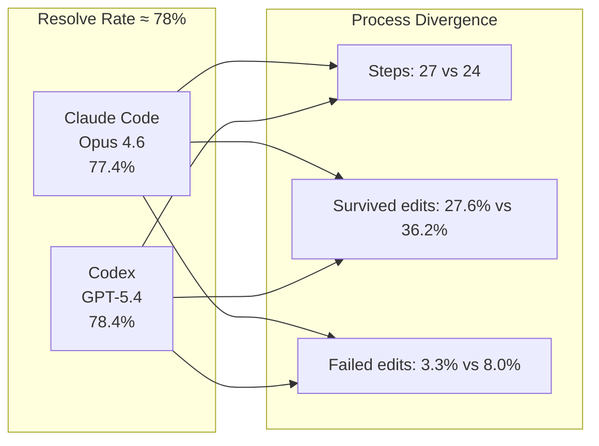

# What Resolve Rate Hides: Trajectory Diagnostics Reveal Why Two 78% Agents Are Nothing Alike — and How to Wire the Insight into Codex CLI


---

## The Resolve-Rate Illusion

Codex CLI scores 78.4% on SWE-bench Verified. Claude Code scores 77.4%[^1]. By the metric that dominates every leaderboard, they are statistically indistinguishable. Yet anyone who has watched both agents work knows they behave nothing alike: Codex tends toward fewer, more deliberate edits; Claude Code explores broadly before converging. A single number — *did the patch pass the tests?* — erases that distinction entirely.

Shu et al. formalise this intuition in "What Resolve Rate Hides: Trajectory Structure Diagnostics for Coding Agents," published on arXiv on 7 July 2026[^1]. Their contribution is **TraceProbe**, an open framework that normalises 2,500 agent trajectories across five production settings on SWE-bench Verified into a canonical action taxonomy, then applies structural detectors to surface anti-patterns invisible to outcome-only evaluation. The headline finding: agents with near-identical resolve rates diverge dramatically in step count, edit stability, wasted effort, and anti-pattern prevalence.

This article unpacks what TraceProbe measures, what its detectors reveal about current coding agents, and how you can wire equivalent trajectory diagnostics into Codex CLI using session JSONL logs, PostToolUse hooks, and AGENTS.md constraints.

---

## The Nine-Type Action Taxonomy

TraceProbe's normalisation layer converts raw tool-call traces — regardless of harness — into nine canonical action types[^1]:

| Action Type | Description |
|---|---|
| `FILE_READ` | Read a file's contents |
| `FILE_WRITE` | Create or modify a file |
| `SEARCH` | Grep, find, or semantic code search |
| `COMMAND` | Shell command execution (tests, builds) |
| `PLAN` | Structured planning tool call |
| `NAVIGATE` | Directory listing or tree traversal |
| `FETCH` | Web or API data retrieval |
| `AGENT_SPAWN` | Subagent delegation |
| `REASON` | Explicit chain-of-thought or scratchpad |

This taxonomy maps cleanly onto Codex CLI's tool surface. Every Codex session JSONL event under `~/.codex/sessions/` carries a tool-call type that can be classified into one of these nine categories[^2]. The normalisation is lossless for Codex because its tool vocabulary is already compact — `shell`, `apply_patch`, `read_file`, `list_dir`, `search_files`, and MCP calls cover the space.

---

## Five Structural Anti-Patterns

TraceProbe defines five detectors, each triggered by a specific action-sequence signature[^1]:

### 1. Search Loop

**Trigger:** At least 10 consecutive `SEARCH` or `FILE_READ` actions with no `FILE_WRITE` and no validation `COMMAND` between them.

**Prevalence:** 41.1% of resolved tasks, 56.1% of failed tasks.

This is the most stable detector across benchmarks — its outcome correlation held at 0.64 when transferred from SWE-bench Verified to SWE-bench Pro[^1]. In Codex CLI terms, a search loop looks like a chain of `search_files` and `read_file` calls with no `apply_patch` or `shell` invocation. It signals the agent is stuck in a reconnaissance loop, burning tokens without making progress.

### 2. Re-read Churn

**Trigger:** The same canonical file path is read at least 3 times within a 10-action window.

**Prevalence:** 34.0% resolved, 44.7% failed.

Re-read churn typically indicates context loss — the agent forgot what a file contained and needs to re-examine it. With Codex CLI's `model_auto_compact_token_limit` controlling compaction, this anti-pattern often appears immediately after a compaction event strips file contents from the context window[^3].

### 3. Tool Oscillation

**Trigger:** For one file, at least 2 READ–WRITE–READ cycles where the middle write is failed or reverted.

This represents the classic "edit, check, undo, re-edit" loop. In Codex CLI, tool oscillation manifests as repeated `apply_patch` calls to the same file interspersed with `read_file` calls to verify the edit landed correctly — often because the patch format was malformed or the edit conflicted with surrounding code.

### 4. Redundant Search

**Trigger:** The same exact-normalised `SEARCH` query recurs at least 2 times within a 10-action window.

A sign that the agent is issuing identical searches because it either discarded the previous result or failed to act on it. Codex CLI's `tool_output_token_limit` truncation can exacerbate this: if a search result is clipped, the model may re-issue the same query expecting different output[^3].

### 5. Structured Plan Absence

**Trigger:** At least 5 `FILE_WRITE` actions occur with no preceding structured-plan tool call.

Agents that write code without planning first tend to produce more reverts. This maps directly to whether developers use Codex CLI's plan mode (`--approval-mode plan`) or jump straight into full-auto editing[^4].

---

## Process Profiles: Same Score, Different Behaviour

The most striking result from TraceProbe is the process-profile comparison across five agent configurations[^1]:



| Metric | Claude Code | Codex | OpenCode-GLM | OpenCode-GPT | OpenCode-Opus |
|---|---|---|---|---|---|
| Resolve rate | 77.4% | 78.4% | 71.6% | 64.2% | 71.4% |
| Median steps | 27 | 24 | 33 | 14 | 17 |
| Survived edits (%) | 27.6% | 36.2% | 26.1% | 16.7% | 23.1% |
| Failed edits (%) | 3.3% | 8.0% | 8.3% | 17.6% | 4.4% |

**Codex has a higher survived-edit ratio (36.2% vs 27.6%) but also a higher failed-edit ratio (8.0% vs 3.3%).** It writes more code that sticks, but also more code that breaks. Claude Code explores more cautiously — more steps, fewer failures, but also fewer edits that survive to the final patch. Neither pattern is universally superior; they represent different trade-offs between exploration breadth and edit commitment[^1].

OpenCode on GPT-5.4 is particularly revealing: only 14 median steps and a 17.6% failed-edit rate. It commits early and fails fast — a pattern that explains its 64.2% resolve rate despite using the same underlying model as Codex[^1].

---

## Same-Task Divergence

When two agents solve the same task, how similar are their paths? TraceProbe's convergence module quantifies this[^1]:

- **File selection:** 38.5%–95.0% moderate/weak agreement across contrasts
- **Function selection:** 17.0%–52.4% moderate/weak agreement
- **Edit stability:** 15.4%–42.4% moderate/weak agreement
- **Completion behaviour:** 38.5%–57.4% moderate/weak agreement

File-level localisation is the easiest dimension — most agents find the right files. But function-level precision and edit stability vary enormously, suggesting that the harness and scaffold matter as much as the model for fine-grained code changes[^1].

---

## Wiring Trajectory Diagnostics into Codex CLI

Codex CLI already generates the raw data TraceProbe needs. Every session is persisted as a JSONL file under `~/.codex/sessions/YYYY/MM/DD/rollout-<session-id>.jsonl`, containing the complete event stream: user prompts, model responses, tool calls, tool results, approval decisions, and token-usage counters[^2]. The gap is in the analysis layer.

### Step 1: Classify Actions from JSONL

A lightweight post-hoc analyser can map Codex tool calls to the nine-type taxonomy:

```python
ACTION_MAP = {
    "read_file": "FILE_READ",
    "list_dir": "NAVIGATE",
    "search_files": "SEARCH",
    "apply_patch": "FILE_WRITE",
    "shell": "COMMAND",
    # MCP tool calls default to FETCH
}

def classify_event(event: dict) -> str:
    tool = event.get("tool_call", {}).get("name", "")
    return ACTION_MAP.get(tool, "FETCH")
```

### Step 2: Detect Anti-Patterns with PostToolUse Hooks

Rather than waiting for post-hoc analysis, you can detect anti-patterns in real time using Codex CLI's PostToolUse hooks[^5]. A hook that tracks the last N actions and fires a warning when a search loop is detected:

```toml
# ~/.codex/config.toml
[[hooks]]
event = "PostToolUse"
command = "python3 ~/.codex/hooks/trajectory-monitor.py"
timeout_ms = 2000
```

The hook script maintains a sliding window of recent actions and injects guidance when an anti-pattern is detected — for example, injecting a `"message"` field suggesting the agent switch from searching to editing.

### Step 3: Constrain Anti-Patterns via AGENTS.md

AGENTS.md constraints can encode anti-pattern avoidance rules directly into the agent's instruction set[^6]:

```markdown
## Trajectory Discipline

- Before your sixth consecutive search or file-read, you MUST either
  write a patch or run a validation command.
- Never re-read the same file within a 10-action window unless
  the file has been modified since the last read.
- Before writing to more than 3 files, produce a structured plan
  summarising which files you will modify and why.
```

These constraints won't eliminate anti-patterns — some tasks genuinely require extensive search — but they force the agent to justify continuation rather than drifting into a search loop by default.

### Step 4: Use Named Profiles for Diagnostic Sessions

Codex CLI's named profiles let you create a diagnostic configuration that enables verbose trajectory logging[^3]:

```toml
# ~/.codex/diagnostic.config.toml
model_reasoning_effort = "high"
[history]
persistence = "full"

[[hooks]]
event = "PostToolUse"
command = "python3 ~/.codex/hooks/trajectory-monitor.py"
timeout_ms = 2000

[[hooks]]
event = "Stop"
command = "python3 ~/.codex/hooks/trajectory-report.py"
timeout_ms = 5000
```

Invoke with `codex --profile diagnostic "fix the failing test in auth.py"` to get a trajectory report at session end.

---

## Cross-Benchmark Transfer and Stability

A critical question for any diagnostic is whether it generalises. TraceProbe validated its detectors on 266 SWE-bench Pro Python tasks (1,330 runs)[^1]. Results were mixed:

- **Search Loop:** Outcome correlation 0.64 — stable across benchmarks
- **Re-read Churn:** Rose to 0.84 on Pro (from 0.64 on Verified) — potentially inflated by Pro's harder tasks requiring more exploration

The authors caution that anti-patterns function primarily as **difficulty indicators** at the corpus level rather than per-task predictors of failure[^1]. A search loop in a genuinely complex codebase is rational behaviour; the same loop in a single-file bug fix is wasted effort. Context matters.

---

## Practical Implications

TraceProbe's contribution is not a new agent or a new benchmark — it is a **diagnostic lens** that reveals what binary metrics hide. For Codex CLI users, the implications are concrete:

1. **Resolve rate is necessary but not sufficient.** Two agents with identical scores may differ dramatically in token efficiency, edit stability, and wasted effort. When choosing between models or configurations, examine trajectory profiles.

2. **Anti-pattern detectors are actionable.** Search loops and re-read churn are detectable in real time via PostToolUse hooks. Early intervention — injecting a "stop searching and start editing" nudge — can redirect the agent before it burns through the token budget.

3. **Compaction triggers anti-patterns.** Re-read churn correlates with context compaction. If you lower `model_auto_compact_token_limit` aggressively, expect more re-reads. The trade-off is explicit: smaller context windows save money but introduce re-read overhead.

4. **Plan mode reduces structured-plan-absence.** The simplest defence against the no-plan anti-pattern is to use `--approval-mode plan` for complex tasks, forcing the agent to produce a structured plan before writing code[^4].

5. **Session JSONL is an underused diagnostic asset.** Every Codex CLI session already contains the data TraceProbe needs. Community tools like codex-trace and TrajLens can render these into visual timelines[^2][^7].

---

## Citations

[^1]: Shu, R., Chong, C. Y., Zhou, X., Peng, Y., Wu, Z., Han, X., Zhuang, Z., Yuan, G. & Wang, Y. (2026). "What Resolve Rate Hides: Trajectory Structure Diagnostics for Coding Agents." arXiv:2607.06184. [https://arxiv.org/abs/2607.06184](https://arxiv.org/abs/2607.06184)

[^2]: Codex CLI Log Files and Debug Tracing: The Complete Diagnostic Toolkit. Codex Knowledge Base, May 2026. [https://codex.danielvaughan.com/2026/05/21/codex-cli-log-files-debug-tracing-diagnostic-toolkit-troubleshooting/](https://codex.danielvaughan.com/2026/05/21/codex-cli-log-files-debug-tracing-diagnostic-toolkit-troubleshooting/)

[^3]: OpenAI. Configuration Reference — Codex CLI. [https://developers.openai.com/codex/config-reference](https://developers.openai.com/codex/config-reference)

[^4]: OpenAI. Features — Codex CLI. [https://developers.openai.com/codex/cli/features](https://developers.openai.com/codex/cli/features)

[^5]: OpenAI. Codex CLI Hooks: Complete Guide to Events, Policy Engines and Production Patterns. Codex Knowledge Base, April 2026. [https://codex.danielvaughan.com/2026/04/15/codex-cli-hooks-complete-guide-events-policy-patterns/](https://codex.danielvaughan.com/2026/04/15/codex-cli-hooks-complete-guide-events-policy-patterns/)

[^6]: Cai, X. et al. (2026). "Rule Taxonomy and Evolution in AI IDEs: A Mining and Survey Study." arXiv:2606.12231. [https://arxiv.org/abs/2606.12231](https://arxiv.org/abs/2606.12231)

[^7]: TrajLens: Visualise, inspect, and debug agent trajectories. GitHub. [https://github.com/cubicYYY/TrajLens](https://github.com/cubicYYY/TrajLens)
