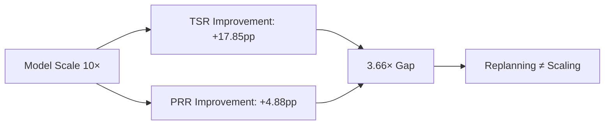
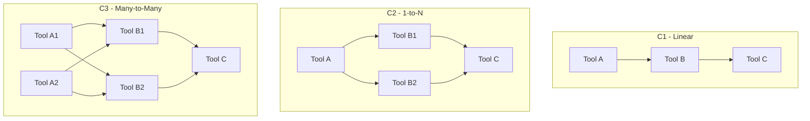

# When Tools Fail: What TOOLMAZE Reveals About the Replanning Deficit in LLM Agents — and How to Wire Fault Tolerance into Codex CLI


---

Your agent calls a tool. The tool returns a 200 with perfectly structured JSON — except every value is wrong. What happens next?

If you are running a coding agent in production, the answer matters more than you think. Three independent benchmarks published in mid-2026 converge on an uncomfortable finding: LLM agents are dramatically worse at recovering from tool failures than they are at completing tasks on the happy path, and simply scaling model size does not close the gap.

This article unpacks the TOOLMAZE benchmark [^1], triangulates it against ToolBench-X [^2] and ToolFailBench [^3], and maps the findings onto Codex CLI's hook architecture to show where you can wire fault tolerance into your agent workflows today.

## The Happy-Path Evaluation Fallacy

Most agent benchmarks assume tools work. SWE-bench [^4] gives the agent a clean repository and functioning test harness. BFCL evaluates function-call accuracy against a gold schema. Even multi-step benchmarks like API-Bank test whether the agent *can* call tools correctly — not whether it can recover when tools misbehave.

TOOLMAZE challenges this assumption directly. Zhu et al. constructed 400 base tasks across six domains (financial, travel, office, shopping, IoT, general) backed by 270 curated tools, then subjected each task to four perturbation types across four DAG complexity levels, yielding 2,000 evaluation instances [^1].

The perturbation taxonomy is the paper's most useful contribution:

| Mode | Type | Example |
|------|------|---------|
| **P1** Explicit-Transient | Machine-readable error, resolves on retry | HTTP 503, timeout |
| **P2** Explicit-Permanent | Machine-readable error, requires rerouting | Tool deprecated, endpoint removed |
| **P3** Implicit-Transient | Structurally valid but semantically wrong, temporary | Stale cache returning yesterday's prices |
| **P4** Implicit-Permanent | Semantically corrupted output, persistent | Tool trained on wrong dataset |

The results are stark. Claude Sonnet 4.6, the best-performing model, achieved 77.00% task success rate (TSR) on unperturbed tasks but dropped to 42.00% under perturbation — a 35-point collapse [^1]. Its Perturbation Recovery Rate (PRR) under explicit-transient failures (P1) was a respectable 90.61%, but under implicit-permanent failures (P4) it plummeted to 26.63% [^1].

## The 3.66× Scaling Gap

The most consequential finding is about scaling. Across six open-weight models ranging from 3B to 397B parameters, TSR on clean tasks improved by 17.85 percentage points per order-of-magnitude parameter increase, while PRR under perturbation improved by only 4.88 points [^1]. Fault tolerance scales 3.66× slower than raw task completion.

This means you cannot buy your way out of the resilience problem with a bigger model. Dynamic replanning is a distinct capability — one that emerges sluggishly from pretraining and is not addressed by standard prompting strategies [^1].



## Implicit Failures Are the Real Threat

Across all nine models tested, the explicit-implicit gap averaged 37.15 percentage points [^1]. Agents handle HTTP 404s and timeouts reasonably well — the error code is right there in the response. But when a tool returns valid JSON with wrong data (P3/P4), most agents accept the output and proceed blindly.

ToolBench-X corroborates this with its five-hazard taxonomy. Specification Drift and Output Drift — both implicit failure modes — caused the sharpest performance degradation, while Invocation Errors (explicit) were the most recoverable [^2]. The authors found that "failures stem primarily from inadequate hazard diagnosis and ineffective recovery strategies rather than insufficient computational resources" [^2].

ToolFailBench adds a third data point: across 1,000 diagnostic tasks in finance, medicine, law, cybersecurity, and real estate, implicit tool failures consistently produced the lowest recovery rates [^3].

## DAG Complexity Compounds the Problem

TOOLMAZE varies task topology across four complexity levels:

| Level | Structure | Agent Behaviour |
|-------|-----------|-----------------|
| **C1** Linear | Single execution path | No alternatives; single point of failure |
| **C2** 1-to-N | Functionally equivalent substitutes | Best recovery rates — agents can reroute |
| **C3** Many-to-many | Combinatorial recovery paths | Agents enter futile trial-and-error loops |
| **C4** Integrated multi-branch | Multiple C2/C3 subgraphs | Combinatorial explosion overwhelms planning |

The sweet spot for recovery is C2 — when the agent has one clear alternative tool [^1]. At C3 and C4, agents loop through combinations without converging, burning tokens on dead-end retries. This directly mirrors what practitioners observe in Codex CLI sessions where multiple MCP tools offer overlapping functionality.



## Mapping to Codex CLI: Where Hooks Close the Gap

Codex CLI's hook architecture [^5] provides four intervention points relevant to tool-failure resilience:

### 1. PostToolUse: Detect Implicit Failures

PostToolUse fires after every tool execution, including non-zero exits [^5]. This is your primary surface for catching P3/P4 implicit failures — structurally valid responses with semantically wrong data.

```toml
# config.toml — implicit failure detector
[[hooks.PostToolUse]]
matcher = ".*"

[[hooks.PostToolUse.hooks]]
type = "command"
command = "/usr/bin/python3 .codex/hooks/validate-tool-output.py"
timeout = 10
statusMessage = "Validating tool output..."
```

The validation script receives `tool_name`, `tool_input`, and `tool_response` via stdin. It can return a JSON object with `"decision": "block"` and a `reason` field that replaces the tool output with diagnostic context, effectively forcing the agent to replan:

```python
#!/usr/bin/env python3
"""PostToolUse hook: detect semantically invalid tool responses."""
import json, sys

event = json.load(sys.stdin)
response = event.get("tool_response", "")

# Domain-specific validation — e.g. check prices are positive,
# dates are not in the past, required fields are present
if looks_semantically_wrong(response):
    json.dump({
        "decision": "block",
        "reason": f"Tool output failed semantic validation: {diagnosis}. "
                  f"Consider retrying or using an alternative tool.",
    }, sys.stdout)
else:
    json.dump({"continue": True}, sys.stdout)
```

When a PostToolUse hook returns `"decision": "block"`, Codex replaces the tool result with the hook's feedback, which forces the model to acknowledge the failure and replan rather than proceeding with corrupted data [^5].

### 2. PreToolUse: Gate Retries and Prevent Loops

The C3/C4 trial-and-error loop problem maps directly to PreToolUse. A stateful hook can track tool invocations per turn and block repeated calls to the same failing tool:

```toml
[[hooks.PreToolUse]]
matcher = ".*"

[[hooks.PreToolUse.hooks]]
type = "command"
command = "/usr/bin/python3 .codex/hooks/retry-gate.py"
timeout = 5
statusMessage = "Checking retry budget..."
```

```python
#!/usr/bin/env python3
"""PreToolUse hook: enforce per-tool retry budget."""
import json, sys, os

RETRY_LIMIT = 3
state_file = os.path.expanduser("~/.codex/retry-state.json")

event = json.load(sys.stdin)
tool = event.get("tool_name", "")
turn = event.get("turn_id", "")

# Load and update state
state = json.load(open(state_file)) if os.path.exists(state_file) else {}
key = f"{turn}:{tool}"
count = state.get(key, 0) + 1
state[key] = count

with open(state_file, "w") as f:
    json.dump(state, f)

if count > RETRY_LIMIT:
    print(json.dumps({
        "permissionDecision": "deny",
        "reason": f"Tool '{tool}' has been called {count} times this turn. "
                  f"Retry budget exhausted — try an alternative approach."
    }))
else:
    print(json.dumps({"continue": True}))
```

### 3. AGENTS.md: Declare Failure-Handling Constraints

TOOLMAZE found that failure-aware prompting improved recovery by 1.5–20.8 percentage points across models [^1]. Codex CLI's `AGENTS.md` provides a natural location for these instructions:

```markdown
## Tool Failure Policy

- When a tool returns an error, retry ONCE. If the retry fails, try an
  alternative tool or ask the user for guidance.
- When a tool returns data that seems inconsistent with the task context
  (e.g. negative prices, future timestamps for historical queries),
  treat the result as suspect and cross-validate with a second source.
- Never call the same failing tool more than 3 times in a single turn.
- If you exhaust all tool alternatives, stop and report the failure
  rather than guessing.
```

### 4. PostToolUseFailure: The Missing Hook

OpenAI has acknowledged a gap in Codex CLI's hook surface: there is currently no dedicated event for the tool-failure branch [^6]. A proposed `PostToolUseFailure` hook would fire when a tool invocation errors, exits non-zero, times out, or returns an unsuccessful result, carrying the same contract as PostToolUse plus an `error_message` field [^6].

Until this ships, practitioners can partially cover the gap by having PostToolUse inspect `tool_response` for error indicators. But a first-class failure hook would enable cleaner separation of happy-path and failure-path logic — precisely the kind of "System 2-style autonomous anomaly detection" that TOOLMAZE calls for [^1].

## A Fault-Tolerance Configuration Profile

Combining these techniques into a named Codex CLI profile:

```toml
# ~/.codex/profiles/fault-tolerant.toml

model = "o4-mini"
approval_policy = "unless-allow-listed"

# Keep context tight to leave room for replanning tokens
model_auto_compact_token_limit = 80000
tool_output_token_limit = 8000

# MCP tool search — let the agent discover alternatives
[mcp_tool_search]
enabled = true

# Hooks for fault tolerance
[[hooks.PostToolUse]]
matcher = ".*"
[[hooks.PostToolUse.hooks]]
type = "command"
command = "/usr/bin/python3 .codex/hooks/validate-tool-output.py"
timeout = 10
statusMessage = "Validating tool output"

[[hooks.PreToolUse]]
matcher = ".*"
[[hooks.PreToolUse.hooks]]
type = "command"
command = "/usr/bin/python3 .codex/hooks/retry-gate.py"
timeout = 5
statusMessage = "Checking retry budget"
```

Activate it with:

```bash
codex --profile fault-tolerant "Migrate the payment service to the new API"
```

## The Resilience Research Cluster

TOOLMAZE does not stand alone. Mid-2026 has produced a convergent cluster of tool-failure research:

| Benchmark | Focus | Scale | Key Metric |
|-----------|-------|-------|------------|
| **TOOLMAZE** [^1] | Dynamic replanning under perturbation | 2,000 instances, 270 tools | PRR (37% implicit gap) |
| **ToolBench-X** [^2] | Five hazard types in multi-step tasks | Diverse domains | Reliability gap under hazards |
| **ToolFailBench** [^3] | Diagnostic failure analysis | 1,000 tasks, 5 verticals | Recovery rate by failure type |
| **ToolMisuseBench** [^7] | Misuse and recovery under budgets | 6,800 tasks | CRUD/retrieval fault injection |
| **AgentNoiseBench** [^8] | Robustness under user/tool noise | Chaos-engineering injection | Noise resilience score |

The collective message: evaluating agents only on the happy path systematically overstates their production readiness. Any serious deployment needs to account for tool unreliability.

## What This Means for Your Codex CLI Workflows

Three practical takeaways:

1. **Instrument the failure path.** Add PostToolUse validation hooks that catch semantically invalid responses, not just HTTP errors. The 37-point PRR gap between explicit and implicit failures is your biggest exposure.

2. **Budget retries explicitly.** Use PreToolUse hooks or AGENTS.md constraints to prevent the trial-and-error loops that TOOLMAZE observed at C3/C4 complexity. Three retries per tool per turn is a reasonable starting point.

3. **Enable tool search.** Codex CLI v0.142.2+ makes MCP tool search the default [^9]. When a tool fails permanently (P2/P4), having alternative tools discoverable via search gives the agent a C2-style rerouting path — the topology with the best recovery rates.

The 3.66× scaling gap means you cannot wait for GPT-6 to solve this. Fault tolerance is an architecture problem, not a model problem.

---

## Citations

[^1]: Zhu, D., Ma, X., Shen, Y., Li, X., Zhao, Y., Wang, S., Yan, L. & Yin, D. (2026). "When Tools Fail: Benchmarking Dynamic Replanning and Anomaly Recovery in LLM Agents." arXiv:2606.05806. [https://arxiv.org/abs/2606.05806](https://arxiv.org/abs/2606.05806)

[^2]: Tian, Y., Shi, Z., Zhou, Y. & Zhao, B. (2026). "Beyond Function Calling: Benchmarking Tool-Using Agents under Tool-Environment Unreliability." arXiv:2606.25819. [https://arxiv.org/abs/2606.25819](https://arxiv.org/abs/2606.25819)

[^3]: ToolFailBench Authors (2026). "ToolFailBench: Diagnosing Tool-Use Failures in LLM Agents." arXiv:2607.04686. [https://arxiv.org/abs/2607.04686](https://arxiv.org/abs/2607.04686)

[^4]: Jimenez, C. E. et al. (2024). "SWE-bench: Can Language Models Resolve Real-World GitHub Issues?" ICLR 2024. [https://arxiv.org/abs/2310.06770](https://arxiv.org/abs/2310.06770)

[^5]: OpenAI (2026). "Hooks — Codex CLI Developer Documentation." [https://developers.openai.com/codex/hooks](https://developers.openai.com/codex/hooks)

[^6]: OpenAI/Codex GitHub Issue #24907 (2026). "Feature: PostToolUseFailure hook (failure-branch sibling of PostToolUse)." [https://github.com/openai/codex/issues/24907](https://github.com/openai/codex/issues/24907)

[^7]: ToolMisuseBench Authors (2026). "ToolMisuseBench: An Offline Deterministic Benchmark for Tool Misuse and Recovery in Agentic Systems." arXiv:2604.01508. [https://arxiv.org/abs/2604.01508](https://arxiv.org/abs/2604.01508)

[^8]: AgentNoiseBench Authors (2026). "AgentNoiseBench: Benchmarking Robustness of Tool-Using LLM Agents Under Noisy Condition." arXiv:2602.11348. [https://arxiv.org/abs/2602.11348](https://arxiv.org/abs/2602.11348)

[^9]: OpenAI (2026). "Codex Changelog — 2026-06-25: MCP tool search default." [https://developers.openai.com/codex/changelog](https://developers.openai.com/codex/changelog)
