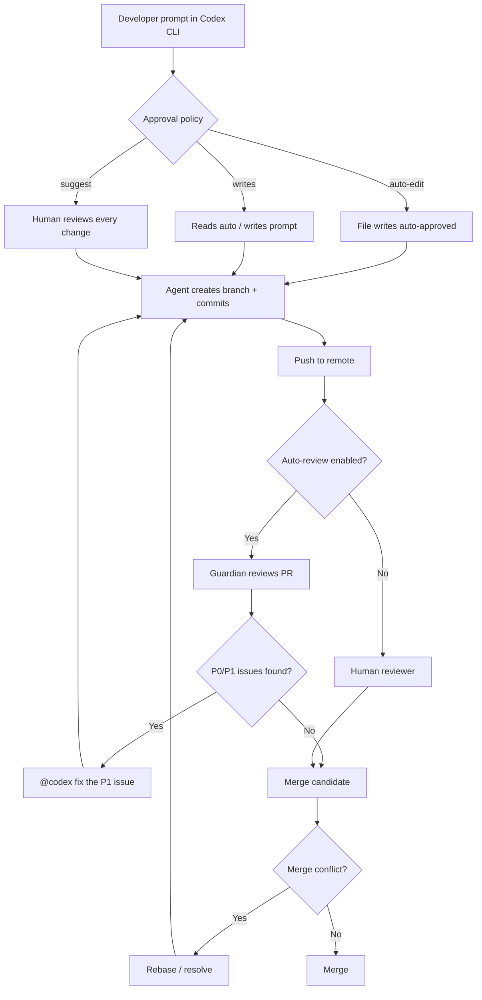
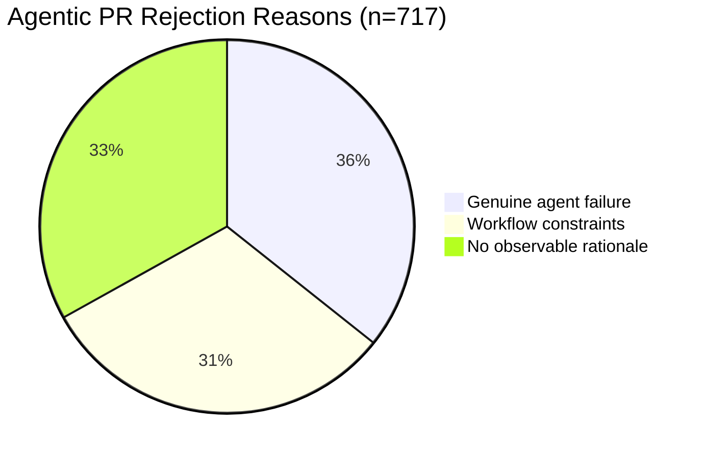

# What 153K Agentic Pull Requests Reveal About Merge, Rejection, and Conflict — and How to Configure Codex CLI's PR Stack Accordingly


## Introduction

Coding agents now author pull requests at industrial scale. Three empirical studies published between February and May 2026 — spanning over 153,000 agentic PRs across tens of thousands of repositories — have produced the first rigorous picture of how agent-authored contributions actually fare in open-source review pipelines. The findings challenge several assumptions that practitioners carry into their Codex CLI workflows.

This article synthesises the headline numbers, identifies the patterns that matter for day-to-day practice, and maps each finding to specific Codex CLI configuration knobs — from `auto_review` and `AGENTS.md` review guidelines to approval policies and merge-conflict prevention.

## The Data: Three Studies, Three Lenses

### Merge and Rejection Outcomes Are Misleading

Peralta et al. analysed 11,048 closed agentic PRs (refined to 9,799 human-reviewed cases) for the MSR 2026 Mining Challenge [^1]. After manually inspecting 717 representative cases to recover decision rationale from interaction artefacts, they found that **rejection outcomes substantially overstate agent error**:

| Rejection reason | Share |
|---|---|
| Genuine agentic failure | 35.7% |
| Workflow constraints (duplicate, superseded, policy) | 31.2% |
| No observable rationale | 33.1% |

Among merged PRs, 15.4 per cent required explicit reviewer involvement through feedback or direct commits, and 5.5 per cent showed no visible interaction trace at all [^1]. The study also exposed systematic differences across agents: Copilot and Devin PRs were more often embedded in reviewer-mediated workflows, whilst Codex and Cursor PRs were typically merged with minimal interaction [^1].

**The practitioner takeaway:** a raw rejection rate is not a reliability metric. If roughly two-thirds of rejections stem from workflow friction or missing context rather than code quality, the lever to pull is upstream specification — not model capability.

### Merge Conflicts Are Frequent and Agent-Specific

Ogenrwot and Businge built a deterministic merge-simulation pipeline across 142,000+ agentic PRs from 59,000+ repositories, identifying 29,000+ PRs with textual merge conflicts — a conflict rate of **27.67 per cent** — and extracting 336,000+ fine-grained conflict regions [^2]. The conflict rates varied sharply by agent:

| Agent | Conflict rate |
|---|---|
| GitHub Copilot | 15.43% |
| Cursor | 22.8% |
| Devin | 26.4% |
| OpenAI Codex | 32.31% |

Codex's higher conflict rate is partially explained by its tendency to produce larger, more structurally ambitious diffs [^2]. The paper was presented at AIware 2026 and the full dataset is available on Zenodo [^2].

**The practitioner takeaway:** nearly one in three Codex PRs will conflict at merge time. This is not a model deficiency — it is a consequence of agent-generated diffs landing on branches that have diverged whilst the agent was working. The fix is architectural: shorter-lived branches, more frequent rebases, and AGENTS.md constraints on diff scope.

### Reviewer Bots Produce Clear but Moderate-Relevance Feedback

Fatima et al. examined 7,416 reviewer-bot comments across 4,532 agentic PRs from the AI_Dev dataset [^3]. Bot feedback concentrated on bug fixes, testing, and documentation, was civil and prescriptive in tone, and generally clear and concise. However, **semantic relevance to the underlying code changes was only moderate** [^3].

Critically, higher comment volume correlated with longer resolution times and degraded feedback quality [^3]. The recommendation: reviewer bots should emphasise targeted, high-relevance feedback over generating large numbers of comments.

**The practitioner takeaway:** when configuring Codex's `@codex review` integration or auto-review Guardian, severity filtering matters more than volume. Codex already filters to P0/P1 issues by default [^4] — resist the temptation to lower the threshold.

## The Agentic PR Lifecycle Through Codex CLI



## Configuring Codex CLI to Match the Evidence

### 1. Tighten Scope with AGENTS.md to Reduce Conflicts

Codex's 32.31 per cent conflict rate [^2] is driven by large, structurally ambitious diffs landing on stale branches. The primary defence is constraining diff scope in `AGENTS.md`:

```markdown
## PR guidelines

- Each task targets ONE module or package. Do not cross module boundaries.
- Maximum diff size: 500 lines. If the change exceeds this, split into stacked PRs.
- Always rebase onto the target branch before committing.
- Do not modify files outside the task's directory without explicit approval.

## Review guidelines

- Focus on authentication flows and PII handling.
- Flag any new dependency additions for security review.
```

The `AGENTS.md` file is read by both the CLI agent during code generation and by the `@codex review` integration during PR review [^4]. A `## Review guidelines` section shapes review focus; a `## PR guidelines` section constrains generation scope.

### 2. Use the writes Approval Mode for MCP-Heavy Workflows

Codex CLI v0.144.0 introduced the `writes` approval mode, which auto-approves read operations (file reads, search, MCP queries) whilst prompting on any write [^5]. For PR workflows where the agent reads extensively before committing:

```toml
# ~/.codex/config.toml
approval_policy = "writes"
```

This maps directly to the Peralta et al. finding that merged PRs with minimal human interaction (Codex and Cursor) still benefit from a write-gating checkpoint [^1]. The `writes` mode provides that checkpoint without the friction of `suggest` mode's approval-on-every-action.

### 3. Configure auto_review for Targeted Feedback

The Fatima et al. evidence that high comment volume degrades resolution time [^3] argues for keeping auto-review strict and severity-filtered:

```toml
[auto_review]
enabled = true
# Guardian already filters to P0/P1 by default
# Do not lower the severity threshold
```

For enterprise teams, `requirements.toml` can enforce Guardian policy overrides [^6]:

```toml
[auto_review.guardian_policy_config]
deny_patterns = ["sudo", "rm -rf", "curl.*|.*sh"]
require_test_for_new_functions = true
max_files_per_pr = 20
```

### 4. Rebase Before Push to Pre-empt Conflicts

Given the 27.67 per cent base conflict rate [^2], a pre-push rebase should be standard practice. In AGENTS.md:

```markdown
## Git workflow

Before pushing any branch:
1. Run `git fetch origin` and `git rebase origin/main`
2. If conflicts arise, resolve them before pushing
3. Never force-push to shared branches
```

For Codex CLI's goal-mode long-running tasks, where the agent may work for hours before pushing, the rebase instruction is particularly critical. Without it, the probability of conflict rises with session duration.

### 5. Use Granular Approval for PR-Adjacent Operations

The `granular` approval policy lets you auto-approve low-risk categories whilst keeping PR-related operations gated [^6]:

```toml
[approval_policy.granular]
sandbox = "auto"          # File reads, grep, test runs
mcp = "prompt"            # MCP tool calls require approval
exec_policy = "prompt"    # Shell commands require approval
```

This configuration acknowledges the Peralta et al. finding that workflow constraints — not code quality — drive a third of rejections [^1]. By auto-approving sandbox operations, you reduce the interaction overhead that inflates session duration without sacrificing safety on write operations.

## Understanding Why Rejections Happen



The 31.2 per cent workflow-constraint rejections include duplicates, superseded PRs, and policy violations [^1]. These are preventable with better upstream coordination:

- **Duplicate prevention:** use `AGENTS.md` to instruct the agent to check for existing PRs addressing the same issue before starting work
- **Policy compliance:** encode branch-naming conventions, commit-message formats, and required CI checks in `AGENTS.md`
- **Supersession awareness:** for long-running goal-mode tasks, instruct the agent to pull and check for merged PRs that overlap with its planned changes

## The Interaction Spectrum Across Agents

The Peralta et al. study revealed a spectrum of human–agent interaction intensity [^1]:

| Agent | Interaction pattern | Implication |
|---|---|---|
| Copilot | Reviewer-mediated, high interaction | PRs require human shepherding |
| Devin | Reviewer-mediated, structured workflow | Built-in review cycles |
| Codex | Minimal interaction, direct merge | High autonomy, needs guardrails |
| Cursor | Minimal interaction, direct merge | High autonomy, needs guardrails |

Codex's minimal-interaction pattern means the quality gate must be **before** the PR is created, not during review. This reinforces the importance of:

1. **AGENTS.md constraints** shaping generation behaviour
2. **auto_review Guardian** as an automated first-pass reviewer
3. **Sandbox isolation** preventing unintended side effects during generation
4. **Pre-push hooks** catching obvious issues before they reach the review pipeline

## Practical Recommendations

Based on the combined evidence from all three studies:

1. **Do not use rejection rate as a quality metric.** Only 35.7 per cent of rejections reflect genuine failures [^1]. Track resolution time and reviewer effort instead.

2. **Expect and plan for merge conflicts.** At 32.31 per cent, Codex's conflict rate is the highest among major agents [^2]. Short-lived branches and aggressive rebasing are non-negotiable.

3. **Keep review feedback targeted.** High comment volume correlates with slower resolution [^3]. Codex's P0/P1 filtering is the right default — do not weaken it.

4. **Front-load quality into AGENTS.md.** For minimal-interaction agents like Codex, the specification is the review [^1]. Invest in detailed `## PR guidelines` and `## Review guidelines` sections.

5. **Use the `writes` approval mode for balanced autonomy.** It gives the agent freedom to explore (reads) whilst maintaining a checkpoint on all mutations [^5].

## Gaps and Open Questions

Several questions remain unanswered by the current evidence:

- **Cross-session conflict prediction:** no tool currently predicts whether a long-running Codex session will produce a conflicting diff before the work is done. ⚠️ A pre-commit conflict-risk estimator integrated into PostToolUse hooks would be valuable but does not yet exist in the Codex CLI ecosystem.

- **Rejection-reason classification at scale:** the Peralta et al. manual inspection covered 717 of 9,799 PRs [^1]. Automating rejection-reason taxonomy with an LLM judge remains an open research problem.

- **Optimal diff size:** the AgenticFlict data shows larger diffs correlate with higher conflict rates [^2], but the optimal maximum diff size for Codex CLI's AGENTS.md constraint has not been empirically determined. ⚠️ The 500-line recommendation above is a practitioner heuristic, not a research finding.

## Citations

[^1]: Peralta, S.R.O. et al. "Why Are Agentic Pull Requests Merged or Rejected? An Empirical Study." *Proceedings of the 23rd International Conference on Mining Software Repositories (MSR 2026)*. arXiv:2605.22534. [https://arxiv.org/abs/2605.22534](https://arxiv.org/abs/2605.22534)

[^2]: Ogenrwot, D. and Businge, J. "AgenticFlict: A Large-Scale Dataset of Merge Conflicts in AI Coding Agent Pull Requests on GitHub." *3rd ACM International Conference on AI-Powered Software (AIware 2026)*. arXiv:2604.03551. [https://arxiv.org/abs/2604.03551](https://arxiv.org/abs/2604.03551)

[^3]: Fatima, S.K. et al. "On the Footprints of Reviewer Bots' Feedback on Agentic Pull Requests in OSS GitHub Repositories." *Mining Software Repositories (MSR'26)*. arXiv:2604.24450. [https://arxiv.org/abs/2604.24450](https://arxiv.org/abs/2604.24450)

[^4]: OpenAI. "Code review in GitHub — Codex." OpenAI Developers Documentation. [https://developers.openai.com/codex/integrations/github](https://developers.openai.com/codex/integrations/github)

[^5]: OpenAI. "Codex CLI v0.144.0 Release Notes." GitHub Releases. [https://github.com/openai/codex/releases](https://github.com/openai/codex/releases)

[^6]: OpenAI. "Agent approvals & security — Codex." OpenAI Developers Documentation. [https://developers.openai.com/codex/agent-approvals-security](https://developers.openai.com/codex/agent-approvals-security)
