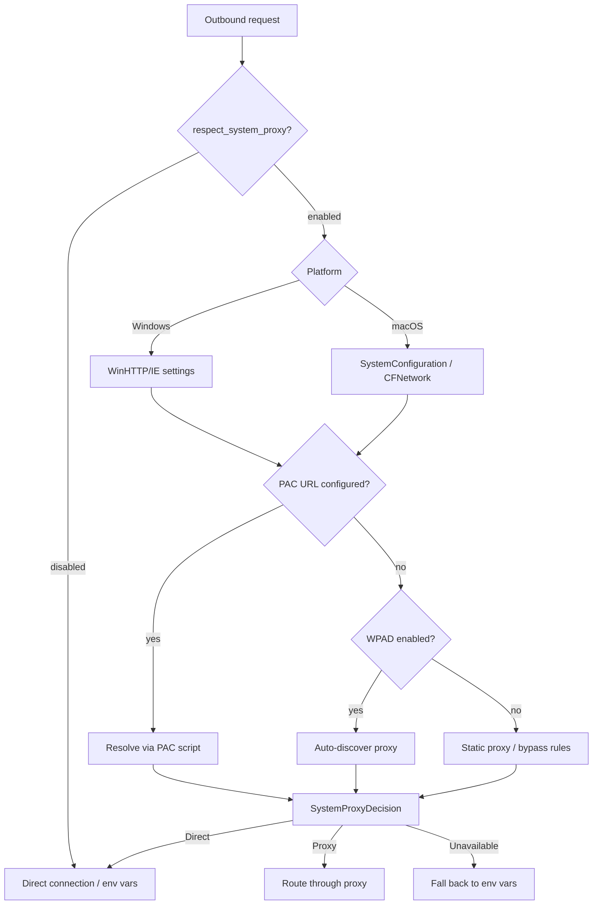

# Codex CLI v0.143 Stable Release Guide: Remote Plugins by Default, System Proxy Support, Bedrock GPT-5.6, and MCP Tool Search as Standard


---

Codex CLI v0.143.0, released 8 July 2026, flips two defaults that change how every session begins: remote plugins are now enabled without an opt-in flag, and MCP tool search is the standard discovery mechanism for all connected servers[^1]. The release also lands full system proxy support on macOS and Windows — the last piece enterprises needed to route Codex traffic through PAC and WPAD infrastructure without custom plumbing — and adds first-class Amazon Bedrock support for the GPT-5.6 Sol, Terra, and Luna model family[^2].

This guide covers every production-relevant change in v0.143, grouped by theme.

## Remote Plugins Enabled by Default

Since v0.117 introduced plugins as a first-class primitive, remote plugins required an explicit opt-in via `features.remote_plugins: true` in `config.toml`[^3]. That flag is now irrelevant. Every Codex CLI installation discovers, lists, and installs plugins from the npm marketplace and git sources without configuration.

The `/plugins` catalogue has been overhauled alongside this change:

- **Richer catalogue rows** — each entry now shows the marketplace source (npm, git, or local), the remote version, and the locally installed version side by side[^1]
- **Version drift visibility** — stale local installations are flagged immediately, eliminating the silent divergence that plagued teams pinning plugin versions across fleets
- **npm marketplace sources** — plugins published to npm are now first-class citizens alongside git-based and local plugins

### What This Means for Teams

If your `requirements.toml` pins specific plugin versions for fleet-wide consistency, the new version-drift indicators surface mismatches at catalogue-browse time rather than at runtime failure. Teams that previously avoided remote plugins due to the opt-in friction can now rely on the marketplace as the default distribution channel.

```toml
# config.toml — features.remote_plugins is no longer needed
# The following line has no effect from v0.143 onwards:
# features.remote_plugins = true

# Plugin version pinning in requirements.toml still works as before
[plugins.required]
"@team/lint-hooks" = "^2.1.0"
"@team/deploy-guard" = "~1.4.0"
```

## System Proxy Support: PAC, WPAD, and Enterprise Networks

The v0.142 release introduced the `respect_system_proxy` configuration key and proxy-capable TLS with P-521 certificate support[^4]. v0.143 completes the implementation with platform-specific proxy resolvers for both Windows and macOS[^5][^6].

### How It Works

When `respect_system_proxy` is enabled, Codex's authentication and Responses API clients query the operating system's proxy configuration before every outbound connection:



The resolver follows a strict priority order[^5]:

1. **Explicit PAC URL** — if the OS has a configured PAC script, it is evaluated first
2. **WPAD auto-discovery** — if PAC is absent but WPAD is enabled, the proxy is discovered automatically
3. **Static proxy and bypass rules** — including `<local>`, wildcard, and suffix matching on Windows
4. **Environment variable fallback** — `HTTPS_PROXY` / `HTTP_PROXY` / `NO_PROXY` are used only when system resolution returns `Unavailable`

### Security Considerations

The Windows implementation hashes cache keys with SHA-256 to preserve URL-specific proxy decisions without storing raw URLs in memory[^5]. Native resource handles are properly cleaned up via `GlobalFree` and `WinHttpCloseHandle`, preventing handle leaks in long-running daemon sessions.

### Configuration

```toml
# config.toml
[features]
respect_system_proxy = true
```

The feature remains **disabled by default** to preserve backward compatibility[^5][^6]. Enterprise teams deploying behind inspection proxies should enable it globally via `requirements.toml`:

```toml
# requirements.toml — fleet-wide proxy enforcement
[features]
respect_system_proxy = true
```

## Amazon Bedrock GPT-5.6 Sol, Terra, and Luna

GPT-5.6, announced 26 June 2026, ships in three tiers — Sol (flagship), Terra (GPT-5.5 performance at roughly half cost), and Luna (high-throughput, lowest cost)[^7]. Codex CLI v0.143 adds first-class Bedrock provider support for all three, including `max` reasoning effort[^1].

### Model Selection

```toml
# config.toml — using Bedrock GPT-5.6 models
[model]
provider = "bedrock"

# Flagship — complex agentic workflows, multi-file refactors
model = "gpt-5.6-sol"
model_reasoning_effort = "max"

# Cost-optimised — routine coding tasks
# model = "gpt-5.6-terra"
# model_reasoning_effort = "high"

# High-throughput — batch linting, formatting, simple fixes
# model = "gpt-5.6-luna"
# model_reasoning_effort = "medium"
```

The `max` reasoning effort tier is new to the GPT-5.6 family and represents a step above the previous `xhigh` ceiling[^1]. For Bedrock users, this requires appropriate IAM permissions and model access grants in your AWS account.

### Named Profiles for Multi-Tier Routing

Combining the three tiers with Codex CLI's named profiles creates a natural cost-routing strategy:

```toml
# config.toml — profile-based model routing
[profiles.architect]
model = "gpt-5.6-sol"
model_reasoning_effort = "max"
provider = "bedrock"

[profiles.workhorse]
model = "gpt-5.6-terra"
model_reasoning_effort = "high"
provider = "bedrock"

[profiles.batch]
model = "gpt-5.6-luna"
model_reasoning_effort = "medium"
provider = "bedrock"
```

```bash
# Use the architect profile for complex refactoring
codex --profile architect "Refactor the payment service to event-driven architecture"

# Use the batch profile for routine formatting
codex --profile batch "Format all Python files to Black style"
```

## MCP Tool Search as Default

Prior to v0.143, MCP tool discovery required manual registration of every tool from every connected server. From v0.143, tool search is the default mechanism: Codex indexes all tools across connected MCP servers and selects the most relevant tools per turn using semantic matching[^1][^8].

This matters most for setups with many MCP servers. Rather than loading every tool definition into the context window — an approach that consumed thousands of tokens before the first user message — Codex now loads tool schemas on demand as the model requests them.

### ChatGPT-Hosted MCP Session Authentication

A related change: ChatGPT-hosted MCP servers can now explicitly use session authentication[^1]. This means MCP servers running within the ChatGPT platform can authenticate using the session token rather than requiring separate API keys, reducing credential sprawl for teams using both the Codex app and CLI.

## Remote Control Pairing

The `codex remote-control pair` command generates manual pairing codes from a running daemon, addressing a long-standing gap on Linux where the GUI pairing flow was unavailable[^9]. Previously, Linux users running headless Codex instances had no reliable mechanism to pair with the ChatGPT mobile app for remote monitoring and approval.

```bash
# Start the remote control daemon
codex remote-control start

# Generate a pairing code for mobile app connection
codex remote-control pair
# Output: Pairing code: XXXX-XXXX-XXXX
# Enter this code in ChatGPT mobile > Codex > Add device
```

## App-Server Client Enhancements

For teams building on the Codex app-server API, v0.143 adds three capabilities[^1]:

- **Environment inspection** — clients can query the full environment configuration of a running Codex instance
- **Descendant thread listing** — subagent threads spawned from a parent are now enumerable, enabling external monitoring dashboards
- **History forking through a specific turn** — fork a session from any turn, not just the latest, enabling branching workflows and A/B experimentation on agent strategies

### UUID7 Thread and Turn IDs

v0.143 formally documents that thread and turn identifiers follow the UUID7 specification[^1]. UUID7 embeds a Unix timestamp in the high bits, making IDs naturally sortable by creation time. This is significant for log analysis and session replay tooling — you can now sort threads chronologically without querying metadata.

## Bug Fixes and Stability

The release addresses several production-relevant issues[^1]:

- **Windows ConPTY input handling** — line endings and backspace are now processed correctly, fixing garbled terminal output in Windows Terminal and PowerShell ISE sessions
- **Sandbox credential retry** — edge cases where credential refresh loops caused session hangs are resolved
- **Stale TUI safety prompts** — cancelled review prompts no longer linger and block MCP server startup indicators
- **Exec server offline recovery** — the exec server reconnects more reliably after network interruptions
- **Remote-control token refresh** — retry storms that could saturate auth endpoints during network instability are eliminated
- **Trailing realtime transcript preservation** — transcript text and terminal rollout events are no longer truncated during graceful shutdown
- **Installer rate-limit resilience** — release metadata is reused across installation steps, reducing GitHub API rate-limit failures during fresh installs

## Dependency and Security Updates

OpenSSL, Hono, fast-uri, quick-xml, and crossbeam-epoch have all been updated to address published security advisories[^1]. The OpenSSL update is particularly relevant for enterprise deployments behind TLS-inspecting proxies, where outdated cipher suites were occasionally causing handshake failures.

## Migration Checklist

For teams upgrading from v0.142:

1. **Remove `features.remote_plugins = true`** from `config.toml` — it is now a no-op
2. **Review plugin version drift** — the new catalogue indicators may surface previously invisible mismatches
3. **Test `respect_system_proxy = true`** if deploying behind corporate proxies — this was available in v0.142 but the platform resolvers are now complete
4. **Evaluate GPT-5.6 tiers** via Bedrock if your organisation has AWS model access grants
5. **Audit MCP tool count** — with tool search as default, large tool catalogues no longer inflate context windows, but verify that semantic matching selects the tools you expect
6. **Update Linux remote-control workflows** to use `codex remote-control pair` instead of workarounds

## Citations

[^1]: OpenAI, "Release 0.143.0," *GitHub — openai/codex*, 8 July 2026. [https://github.com/openai/codex/releases/tag/rust-v0.143.0](https://github.com/openai/codex/releases/tag/rust-v0.143.0)

[^2]: Codex Releases (@CodexReleases), "System proxy + Bedrock," *X (Twitter)*, 8 July 2026. [https://x.com/CodexReleases/status/2074668191851454471](https://x.com/CodexReleases/status/2074668191851454471)

[^3]: OpenAI, "Plugins System," *DeepWiki — openai/codex*, accessed 9 July 2026. [https://deepwiki.com/openai/codex/5.11-plugins-system](https://deepwiki.com/openai/codex/5.11-plugins-system)

[^4]: Daniel Vaughan, "Codex CLI v0.142 Stable Release Guide," *Codex Knowledge Base*, 26 June 2026. [https://codex.danielvaughan.com/2026/06/26/codex-cli-v0142-stable-release-guide/](https://codex.danielvaughan.com/2026/06/26/codex-cli-v0142-stable-release-guide/)

[^5]: canvrno-oai, "PAC 3 — Add Windows system proxy resolver," *GitHub PR #26708 — openai/codex*, 2026. [https://github.com/openai/codex/pull/26708](https://github.com/openai/codex/pull/26708)

[^6]: canvrno-oai, "PAC 4 — Add macOS system proxy resolver," *GitHub PR #26709 — openai/codex*, 2026. [https://github.com/openai/codex/pull/26709](https://github.com/openai/codex/pull/26709)

[^7]: ExplainX, "GPT-5.6 Guide: Sol, Terra, Luna Models, Pricing, and Benchmarks," accessed 9 July 2026. [https://explainx.ai/blog/gpt-5-6-release-date-features-benchmarks-2026](https://explainx.ai/blog/gpt-5-6-release-date-features-benchmarks-2026)

[^8]: OpenAI, "Model Context Protocol — Codex," *OpenAI Developers*, accessed 9 July 2026. [https://developers.openai.com/codex/mcp](https://developers.openai.com/codex/mcp)

[^9]: OpenAI, "Remote connections — Codex," *OpenAI Developers*, accessed 9 July 2026. [https://developers.openai.com/codex/remote-connections](https://developers.openai.com/codex/remote-connections)
