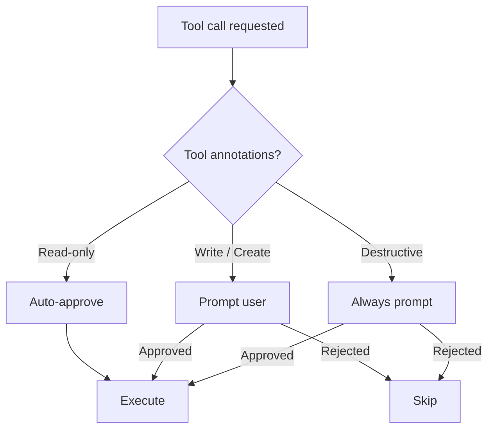
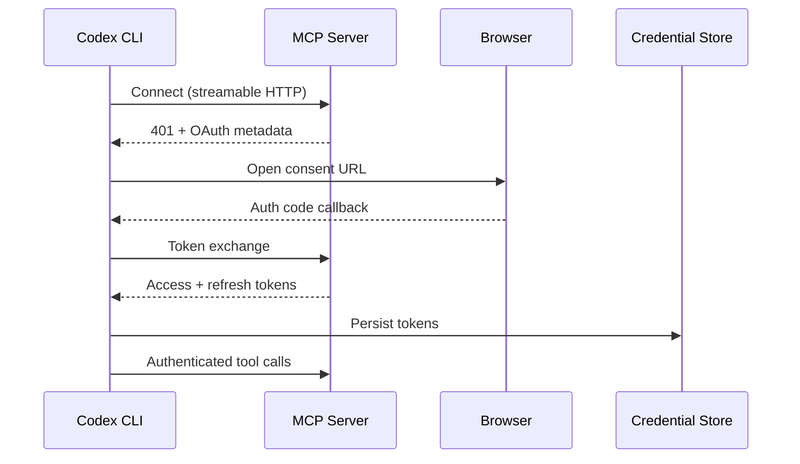

# Codex CLI v0.144.0 Release Guide: The `writes` Approval Mode, MCP Authentication GA, and Usage-Credit Redemption


---

Codex CLI v0.144.0 landed on 9 July 2026, one day after v0.143.0 [^1]. Where v0.143 was about breadth — remote plugins by default, system proxy support, Bedrock GPT-5.6 — v0.144 tightens the operational controls that matter once an agent is running autonomously for hours at a stretch. The headline additions are a new `writes` app-approval mode for MCP and connector tools, the graduation of interactive MCP tool authentication out of experimental, usage-limit reset credit management with type and expiration visibility, and an ultra-reasoning concurrency warning that prevents accidental budget blowouts.

This guide covers every practitioner-relevant change, with configuration examples you can drop into `~/.codex/config.toml` or a project-level `.codex/config.toml` today.

## The `writes` App-Approval Mode

### The Problem It Solves

Until v0.143, the `default_tools_approval_mode` key for MCP servers and app connectors offered three values: `auto` (approve everything silently), `prompt` (ask the human every time), and `approve` (block unless pre-approved) [^2]. The missing middle ground was obvious: let the agent read freely — list files, query databases, fetch metadata — but require explicit approval before it mutates state.

Issue #3710 had tracked this request since early 2025 [^3]. v0.144.0 closes it with a fourth value: `writes`.

### How It Works

When `default_tools_approval_mode = "writes"`, Codex inspects the tool's declared annotations. Tools that advertise only read operations execute without prompting. Tools that declare write, create, or delete side effects trigger an approval prompt [^4]. Destructive annotations always require approval regardless of mode — that invariant holds across all four modes.



### Configuration

Set it globally for all MCP servers:

```toml
[apps._default]
default_tools_approval_mode = "writes"
```

Or scope it to a specific MCP server:

```toml
[mcp_servers.my-db-server]
default_tools_approval_mode = "writes"
```

You can also override at the individual tool level when a single tool needs different treatment:

```toml
[mcp_servers.my-db-server.tools.drop_table]
approval_mode = "prompt"
```

### Practical Recommendation

For most development workflows, `writes` is now the sensible default for MCP servers. It eliminates the approval fatigue of `prompt` mode during read-heavy operations (querying APIs, listing resources, reading documentation) whilst retaining the safety gate for mutations. Pair it with `approvals_reviewer = "auto_review"` if you want the guardian subagent to handle write approvals rather than interrupting your flow [^5].

## MCP Tool Authentication Reaches GA

### What Changed

Interactive MCP tool authentication — where a remote MCP server can request credentials at runtime via an OAuth or device-code flow — no longer requires the `experimental.mcp_auth` feature flag [^1]. In v0.143 and earlier, you needed:

```toml
[experimental]
mcp_auth = true
```

In v0.144, delete that line. Authentication requests from MCP servers simply work.

### How It Works in Practice

When Codex connects to a streamable HTTP MCP server that requires authentication, the server responds with an OAuth challenge. Codex opens the browser for the consent flow, stores the resulting tokens in your configured credential store (`keyring`, `file`, or `auto`), and attaches the bearer token to subsequent requests [^6].

ChatGPT-hosted MCP servers can also use session authentication explicitly, meaning credentials flow through the existing ChatGPT session rather than requiring a separate OAuth dance [^7].



### App-Server Authentication at Runtime

A related change (#28745, #31274) allows app-server hosts to provide Codex authentication during execution [^1]. If a hosted session's token expires mid-run, v0.144 refreshes it transparently rather than failing the turn. This is particularly relevant for long-running goal-mode sessions where a single task may span hours.

### Credential Store Configuration

```toml
# Choose where OAuth tokens are stored
cli_auth_credentials_store = "keyring"  # "keyring" | "file" | "auto"
```

The `keyring` option uses the OS keychain (macOS Keychain, Windows Credential Manager, or `secret-tool` on Linux). The `file` option stores encrypted tokens under `~/.codex/credentials/`. The `auto` option tries keyring first, falling back to file [^6].

## Usage-Limit Reset Credits: Type, Expiry, and Redemption

### Background

OpenAI introduced saveable rate-limit resets in June 2026, granting eligible ChatGPT plan subscribers (Go, Plus, Pro, Business) one free reset credit, with additional credits earnable through the referral programme [^8]. The `/usage` TUI command gained redemption capability shortly after [^9].

### What v0.144 Adds

Credits now display their **type** (e.g. referral, promotional, subscription) and **expiration date** — credits expire 30 days after being granted [^1]. When multiple credits are available, `/usage` presents a selection interface rather than blindly consuming the oldest one.

The underlying app-server endpoints are:

- `account/rateLimits/read` — returns `rateLimitResetCredits.availableCount` plus per-credit metadata
- `account/rateLimitResetCredit/consume` — redeems a specific credit by `idempotencyKey` [^9]

### Using It

From the TUI, type `/usage` and follow the prompts. The display now shows:

```
Usage limits
├── Current period: 72% consumed
├── Reset credits available: 2
│   ├── [1] Referral — expires 2026-08-02
│   └── [2] Subscription — expires 2026-07-28
└── Redeem? (1/2/n)
```

⚠️ The exact TUI rendering may vary; the above is illustrative based on the documented API fields.

## Ultra Reasoning Concurrency Warning

v0.144 adds a system warning when high multi-agent concurrency is combined with ultra reasoning effort [^1]. Running six subagents concurrently, each configured with `model_reasoning_effort = "ultra"`, can consume tokens at a rate that exhausts usage limits within minutes.

The warning triggers when the product of concurrent agent count and reasoning effort exceeds an internal threshold, alerting you before the budget disappears. This is a guardrail, not a hard block — you can proceed, but you have been warned.

### Recommended Configuration for Heavy Concurrency

```toml
# Profile: concurrent-work.config.toml
model = "o4-mini"
model_reasoning_effort = "medium"

[features.rollout_budget]
limit_tokens = 500000
reminder_interval_tokens = 50000
```

Reserve `model_reasoning_effort = "ultra"` for single-agent sessions where the reasoning quality justifies the cost, and drop to `medium` or `high` when running parallel subagents [^10].

## Additional Fixes Worth Noting

### Retired Model Recovery

Resumed threads that reference retired models now automatically retry with the current model selection rather than failing (#30319) [^1]. This matters if you resume a session from weeks ago that originally used a model that has since been deprecated.

### Intel macOS Code Mode Fix

Code Mode crashed on Intel macOS release binaries due to a missing V8 signing entitlement (#30953) [^1]. If you were affected, update and the crash is resolved.

### Terminal Control Sequence Sanitisation

Pasted terminal control sequences can no longer corrupt TUI rendering (#31494) [^1]. A subtle but important fix — prior to v0.144, pasting output containing ANSI escape sequences could corrupt the conversation display, sometimes requiring a session restart.

### Windows Sandbox Improvements

Files are now deletable in writable roots on Windows (#31138), and managed primary runtime access is enabled (#31574) [^1]. Windows users running Codex in workspace-write sandbox mode should find file operations noticeably more reliable.

### Responses WebSocket and Proxy Compatibility

The low-latency WebSocket transport now respects system proxies and custom certificate authorities (#31441, #31622) [^1]. This completes the enterprise proxy story begun in v0.142 and extended in v0.143 — TLS inspection proxies with custom CAs no longer force a fallback to slower HTTP polling.

## Migration Checklist

1. **Update**: `npm update -g @openai/codex` or equivalent for your package manager. v0.144 now auto-detects global pnpm installations for updates [^1].
2. **Remove experimental flags**: Delete `[experimental] mcp_auth = true` from your config — MCP auth is GA.
3. **Adopt `writes` mode**: Set `default_tools_approval_mode = "writes"` for MCP servers you trust to read but want gated on mutations.
4. **Review concurrency settings**: If running parallel subagents with ultra reasoning, expect a warning. Adjust `model_reasoning_effort` or acknowledge the cost.
5. **Check usage credits**: Run `/usage` to see credit types and expiry dates before they lapse.

## Citations

[^1]: OpenAI, "Codex CLI v0.144.0 Release Notes", GitHub Releases, 9 July 2026. [https://github.com/openai/codex/releases/tag/rust-v0.144.0](https://github.com/openai/codex/releases/tag/rust-v0.144.0)

[^2]: OpenAI, "Agent Approvals & Security — Codex", OpenAI Developers Documentation. [https://developers.openai.com/codex/agent-approvals-security](https://developers.openai.com/codex/agent-approvals-security)

[^3]: "Separate approval policies for read vs write operations", GitHub Issue #3710, openai/codex. [https://github.com/openai/codex/issues/3710](https://github.com/openai/codex/issues/3710)

[^4]: OpenAI, "Configuration Reference — Codex", `apps._default.default_tools_approval_mode` key documentation. [https://developers.openai.com/codex/config-reference](https://developers.openai.com/codex/config-reference)

[^5]: OpenAI, "Configuration Reference — Codex", `approvals_reviewer` key documentation. [https://developers.openai.com/codex/config-reference](https://developers.openai.com/codex/config-reference)

[^6]: OpenAI, "Codex CLI Authentication: OAuth, Device Code, API Keys, and CI/CD Credential Management", Codex Knowledge Base. [https://codex.danielvaughan.com/2026/04/01/codex-cli-authentication-flows-credential-management/](https://codex.danielvaughan.com/2026/04/01/codex-cli-authentication-flows-credential-management/)

[^7]: OpenAI, "Codex Changelog", July 2026 entry on MCP tool search and session authentication. [https://developers.openai.com/codex/changelog](https://developers.openai.com/codex/changelog)

[^8]: "Codex CLI Rate-Limit Reset Banking and Usage Optimisation", Codex Knowledge Base, 12 June 2026. [https://codex.danielvaughan.com/2026/06/12/codex-cli-rate-limit-reset-banking-usage-optimisation-cost-control-profiles-token-budgets/](https://codex.danielvaughan.com/2026/06/12/codex-cli-rate-limit-reset-banking-usage-optimisation-cost-control-profiles-token-budgets/)

[^9]: "feat(tui): add rate-limit reset redemption to /usage", GitHub PR #28154, openai/codex. [https://github.com/openai/codex/pull/28154](https://github.com/openai/codex/pull/28154)

[^10]: OpenAI, "Configuration Reference — Codex", `model_reasoning_effort` and `features.rollout_budget` keys. [https://developers.openai.com/codex/config-reference](https://developers.openai.com/codex/config-reference)
