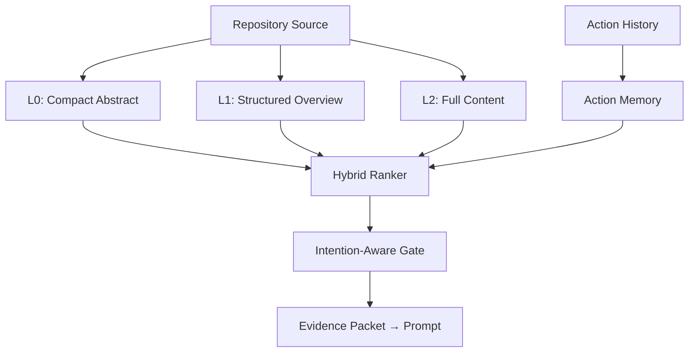
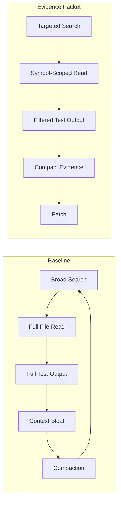

# ContextSniper and the Evidence Packet Pattern: Why 51 per cent Token Savings Don't Cost Resolution Rate — and How to Wire Equivalent Retrieval into Codex CLI


---

Every coding agent shares the same dirty secret: the majority of tokens consumed during a repository-level repair session are noise. Whole-file reads, broad grep sweeps, and raw terminal dumps accumulate context that the model never meaningfully attends to — yet you pay for every token twice, once on input and once in the cache-miss penalty when compaction invalidates the prefix. Luk et al.'s ContextSniper, accepted at ICML 2026, quantifies the waste and offers a surgical alternative: a three-level memory hierarchy that retrieves compact evidence packets, cutting total token use by 51.5 per cent on OpenClaw and 38.9 per cent on Claude Code without meaningfully degrading resolution rate on SWE-bench Lite [^1].

This article unpacks the architecture, maps each mechanism to a Codex CLI configuration or hook surface, and provides concrete patterns for wiring equivalent token discipline into your own workflows.

## The Problem: Context Bloat in Repository Repair

Production repair sessions on repositories of any real size follow a predictable arc. The agent searches broadly, reads multiple files in their entirety, runs tests that produce hundreds of lines of output, then repeats several of those steps when earlier context has scrolled out of attention or been compacted away. Luk et al. report that on a 50-task SWE-bench Lite subset, an unmodified OpenClaw agent consumed 67.80 million tokens across the session — an average of 1.36 million tokens per task [^1].

The token cost is only half the problem. Aggressive context compaction — the standard response when the window fills — invalidates prompt cache prefixes, triggering cache misses that compound API cost. TokenPilot (Xu et al., June 2026) documented a cache hit rate drop from 79.2 per cent to 38.7 per cent under naïve compaction strategies [^2]. The core insight is that **curating what enters the context window matters more than expanding the window itself**.

## ContextSniper Architecture

ContextSniper operates as an external memory layer backed by AGFS (Agent-Grounded File System), storing repository and action evidence outside the prompt and retrieving only the fragments relevant to the current repair step [^1].

### Three-Level Memory Hierarchy



Each memory node is stored as a directory with three text views [^1]:

- **L0 (Compact Abstract):** A short, model-facing summary used for broad recall. Returned as the sniped view for long outputs.
- **L1 (Structured Overview):** Metadata including paths, line ranges, symbol signatures, ctags-style symbol kinds, BM25 lexical documents, and graph relations (imports, calls, containment).
- **L2 (Full Content):** Source-grounded chunks with path and line headers. Python files use AST chunking at function and class boundaries; other languages use overlapping line windows.

Action memory follows the same tripartite structure: compact action views, action metadata, and recoverable original tool output [^1].

### Hybrid Ranker

Rather than relying on a single retrieval signal, ContextSniper combines four signals through weighted reciprocal rank fusion [^1]:

1. **Semantic embeddings** for conceptual similarity
2. **BM25 lexical scoring** for exact keyword matching
3. **ctags-style symbol metadata** (names, kinds, locations) for structural navigation
4. **Graph relations** (imports, calls, containment, neighbours) for dependency-aware retrieval

A ripgrep text-search fallback fires when none of the indexed signals cover a query, ensuring coverage even for string literals and configuration values absent from the symbol index [^1].

### Intention-Aware Context Gate

The gate classifies each tool invocation by intent and strips output accordingly [^1]:

| Intent | Preserved | Stripped |
|--------|-----------|----------|
| File read | Requested region, local definitions, imports, class/function bodies, nearby code | Unrelated functions, boilerplate, licence headers |
| Command output | Command line, exit status, assertion messages, tracebacks, failing paths | Passing test output, verbose logging, progress bars |

Critically, the original unfiltered output is stored in action memory with sniping markers, allowing the agent to recover any stripped content if a later step requires it [^1].

## Benchmark Results

On a 50-task SWE-bench Lite subset [^1]:

| Agent | Token Reduction | Cost Reduction | Resolution Rate (Baseline → ContextSniper) | Action Count Reduction |
|-------|----------------|----------------|---------------------------------------------|----------------------|
| OpenClaw | 51.5% (67.80M → 32.91M) | 36.4% | 26.0% → 24.0% | 46.4% |
| Claude Code | 38.9% (85.97M → 52.55M) | 27.3% (\$15.09 → \$10.97) | 32.0% → 30.0% | — |

The 2-percentage-point resolution drop is within the confidence interval for a 50-task sample. The action count reduction is arguably the more telling metric: the agent executes 46.4 per cent fewer tool calls because it no longer needs to re-read files or re-run searches to recover evidence lost to compaction [^1].

These results complement SWE-Pruner's findings (Luk et al., January 2026), which demonstrated 23–54 per cent token reduction through task-aware line-level pruning using a lightweight neural skimmer [^3]. The key distinction is granularity: SWE-Pruner operates within individual file reads, whilst ContextSniper operates across the entire session, managing what evidence enters the prompt in the first place.

## Mapping to Codex CLI

Codex CLI does not ship a built-in AGFS-style memory layer, but its configuration and hook surfaces cover each of ContextSniper's three mechanisms at varying levels of fidelity.

### 1. Ingestion Gating via `tool_output_token_limit`

The simplest analogue to ContextSniper's intention-aware gate is Codex CLI's `tool_output_token_limit` configuration [^4]:

```toml
# ~/.codex/config.toml
tool_output_token_limit = 12000
```

This caps the tokens stored per tool output. When a test run produces 50,000 tokens of output, Codex truncates to the configured limit before injecting into context. The default is generous; lowering it to 8,000–12,000 tokens for repair-focused sessions forces the agent to work with compressed evidence rather than raw dumps [^4].

⚠️ Unlike ContextSniper's gate, `tool_output_token_limit` applies a uniform cap rather than an intent-classified filter. Tracebacks and passing tests receive the same truncation budget.

### 2. Compaction Threshold Tuning

```toml
# ~/.codex/config.toml
model_auto_compact_token_limit = 64000
```

This triggers context compaction when the session reaches the configured threshold [^4]. Setting it lower pushes compaction earlier, reducing peak context size but increasing compaction frequency. The trade-off mirrors ContextSniper's design: smaller evidence packets reduce noise but risk losing relevant context.

The 90 per cent ceiling rule applies — Codex silently ignores values exceeding 90 per cent of the model's context window [^4].

### 3. PreToolUse Hooks for Evidence Filtering

Codex CLI's `PreToolUse` hook can implement intent-aware filtering deterministically [^5]:

```toml
# ~/.codex/config.toml
[hooks.pre_tool_use.file_read_gate]
command = "python3 /opt/hooks/evidence-gate.py"
```

A hook script can inspect the tool name and arguments, then modify the output through `updatedInput` to request only specific line ranges rather than full files. For shell commands, the hook can wrap the command to pipe output through a filter that preserves only tracebacks and error summaries [^5].

```python
#!/usr/bin/env python3
"""PreToolUse hook: narrow file reads to relevant regions."""
import json, sys

event = json.load(sys.stdin)
tool = event.get("tool_name", "")

if tool == "read_file":
    args = event.get("tool_arguments", {})
    path = args.get("path", "")
    # If reading a test file, restrict to failing test functions
    if "test_" in path:
        result = {
            "decision": "approve",
            "updatedInput": {
                "path": path,
                "line_range": "1-50"  # Read only the header
            }
        }
        json.dump(result, sys.stdout)
        sys.exit(0)

json.dump({"decision": "approve"}, sys.stdout)
```

### 4. AGENTS.md Evidence Discipline

Encoding retrieval discipline in `AGENTS.md` constrains the agent's search behaviour at the instruction level [^6]:

```markdown
## Evidence Retrieval Rules

- NEVER read entire files when investigating a bug. Use line ranges.
- ALWAYS grep for the specific error message before reading source.
- LIMIT test output review to failing tests only — pipe through
  `grep -A 20 'FAILED\|ERROR\|assert'`.
- When a file exceeds 200 lines, read only the function containing
  the relevant symbol, not the full file.
```

This is the cheapest approximation of ContextSniper's L0/L1/L2 hierarchy: rather than indexing and retrieving programmatically, you instruct the model to self-restrict its reads to the evidence level appropriate to the current step.

### 5. Named Profiles for Repair Sessions

```toml
# ~/.codex/profiles/repair.toml
model = "gpt-5.5"
model_reasoning_effort = "high"
model_auto_compact_token_limit = 48000
tool_output_token_limit = 8000
```

A dedicated repair profile can combine aggressive output capping with a lower compaction threshold, approximating ContextSniper's compact evidence packet pattern without requiring an external memory service [^7].

## The Evidence Packet Pattern



The architectural lesson from ContextSniper is not that you need an AGFS-backed memory service. It is that the default "read everything, let the model sort it out" pattern wastes roughly half your token budget on evidence the model will never use. The counter-pattern — the evidence packet — is achievable today through Codex CLI's existing configuration surfaces:

1. **Cap ingestion** with `tool_output_token_limit`
2. **Scope reads** through `AGENTS.md` discipline and `PreToolUse` hooks
3. **Compact earlier** with a lower `model_auto_compact_token_limit`
4. **Separate concerns** with named profiles that encode token discipline per workflow

## Gaps and Forward Look

ContextSniper's three features that Codex CLI cannot fully replicate today:

- **Three-level memory hierarchy with recovery.** Codex CLI's compaction is lossy — once context is compacted, the original evidence is gone. ContextSniper's AGFS stores full content at L2 and allows recovery through sniping markers. The `history.persistence = "save-all"` setting preserves session logs but does not make them available for mid-session retrieval [^4].

- **Graph-aware retrieval.** ContextSniper's hybrid ranker uses import and call graphs for dependency-aware evidence selection. Codex CLI's `grep`-based search operates at the text level only. MCP servers providing AST or graph-based search (e.g., a tree-sitter MCP) could close this gap [^8].

- **Intent classification on tool output.** The intention-aware gate distinguishes file reads from command output and applies different filtering strategies. Codex CLI's hooks can approximate this, but the logic must be implemented in the hook script rather than provided as a built-in capability [^5].

The `PostToolUse` hook surface (proposed in GitHub issue #24907) would be the natural integration point for a ContextSniper-style output gate — filtering tool results after execution but before injection into context [^5].

## Citations

[^1]: Luk, C., Najafi, M. M., Jia, Z., Yang, W., Li, X., Zhu, J., Ren, Y., Chen, L. & Cong, G. (2026). "ContextSniper: AntTrail's Token-Efficient Code Memory for Repository-Level Program Repair." arXiv:2607.01916v2. Accepted at ICML 2026. [https://arxiv.org/abs/2607.01916](https://arxiv.org/abs/2607.01916)

[^2]: Xu, C. et al. (2026). "TokenPilot: Cache-Efficient Context Management for LLM Agents." arXiv:2606.17016. [https://arxiv.org/abs/2606.17016](https://arxiv.org/abs/2606.17016)

[^3]: Luk, C. et al. (2026). "SWE-Pruner: Self-Adaptive Context Pruning for Coding Agents." arXiv:2601.16746. [https://arxiv.org/abs/2601.16746](https://arxiv.org/abs/2601.16746)

[^4]: OpenAI. (2026). "Sample Configuration — Codex CLI." [https://developers.openai.com/codex/config-sample](https://developers.openai.com/codex/config-sample)

[^5]: OpenAI. (2026). "Codex CLI Hooks Documentation." [https://developers.openai.com/codex/cli](https://developers.openai.com/codex/cli)

[^6]: OpenAI. (2026). "AGENTS.md — Codex CLI Developer Documentation." [https://developers.openai.com/codex/agents-md](https://developers.openai.com/codex/agents-md)

[^7]: OpenAI. (2026). "Codex CLI v0.143.0 Release Notes." [https://github.com/openai/codex/releases/tag/rust-v0.143.0](https://github.com/openai/codex/releases/tag/rust-v0.143.0)

[^8]: Ma, W. et al. (2026). "LLM Agents Can See Code Repositories." arXiv:2606.14061. [https://arxiv.org/abs/2606.14061](https://arxiv.org/abs/2606.14061)
