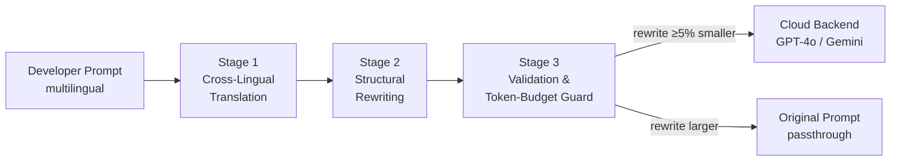
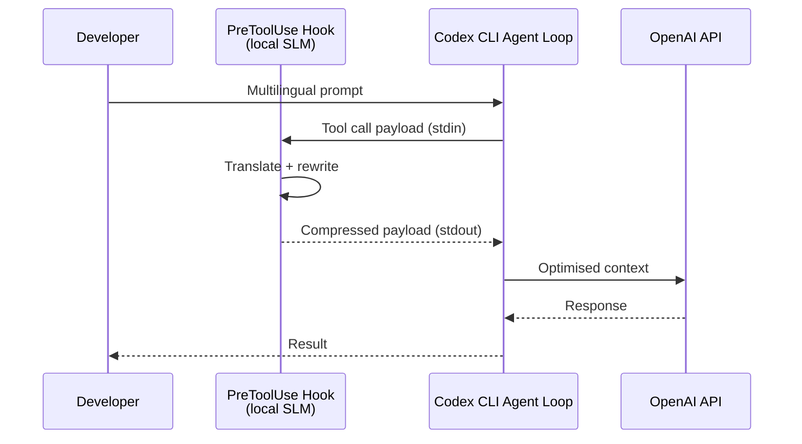

# Cross-Lingual Token Arbitrage: Why Non-English Prompts Cost 3× More — and How to Wire a Preprocessing Middleware into Codex CLI


---

Frontier LLM tokenisers are optimised for English. That single design decision inflates prompt costs for every non-English developer on the planet — and for every coding agent that ingests multilingual specifications, comments, or issue trackers. A recent paper quantifies the penalty, proposes a local preprocessing fix, and opens a design space that Codex CLI's hook and compaction architecture can exploit today.

## The Tokenisation Tax

Subword tokenisers like `cl100k_base` (used by GPT-4o and derivatives) split text into tokens trained predominantly on English corpora [^1]. The consequence is a measurable per-character cost multiplier for non-English text:

| Language | Relative cost per character (cl100k_base) |
|----------|------------------------------------------|
| English  | 1.00×                                     |
| Spanish  | 1.50×                                     |
| Turkish  | 2.16×                                     |
| Chinese  | 2.41×                                     |
| Arabic   | 3.00×                                     |

These are not edge-case numbers. Arabic input costs three times as many tokens as semantically equivalent English text [^1]. In a long-running Codex CLI session where the context window accumulates repository comments, commit messages, issue descriptions, and AGENTS.md constraints written in a non-English working language, the compounding effect is severe: earlier compaction triggers, more frequent context loss, and higher API bills.

## What the Paper Proposes

Çolak's "Cross-Lingual Token Arbitrage" (arXiv:2606.03618, submitted to EMNLP 2026) introduces a lightweight middleware that sits between the developer and the cloud model [^1]. The architecture is a three-stage pipeline running on a local Llama 3.2 (3B) model via Ollama:



### Stage 1: Cross-Lingual Translation

The local SLM translates non-English segments into English, exploiting the tokenisation bias rather than fighting it. This is not machine translation for human consumption — it is a lossy compression step whose sole metric is downstream task accuracy [^1].

### Stage 2: Structural Rewriting

Raw conversational prompts are rewritten into a compact block format. For benchmarking, Çolak uses a Bi-Block schema:

```
[CONTEXT]
Single generic sentence describing the problem domain.

[TASK]
SLM-generated one-to-two sentence instruction.
Verbatim assert lines preserved from original.
```

For IDE integration, a Tri-Block variant adds a `[CONSTRAINTS]` section for style guides and performance targets [^1]. Function names are extracted deterministically from assert lines and supplied as hints — a detail that proves critical in ablation.

### Stage 3: Validation and Token-Budget Guard

A regex-based validator checks for empty output, accidental code blocks, and missing structural markers. A token-budget guard estimates the rewritten prompt's cost (1 token per non-ASCII character, 0.25 per ASCII character) and reverts to the original when the rewrite fails to achieve at least a 5 per cent reduction [^1]. This fallback prevents the middleware from ever making things worse.

## Benchmark: OMH-Polyglot

The paper introduces OMH-Polyglot, a 200-instance multilingual coding benchmark spanning 20 algorithmic cores (knapsack, longest common subsequence, topological sort, and others) across 10 style indices [^1]. Languages include pure Turkish, Arabic, and Simplified Chinese, plus three pairwise code-switched mixes (TR↔AR, TR↔ZH, AR↔ZH), a tri-language rotation, and three narrative registers with embedded English jargon.

Mean tokenisation overhead on OMH-Polyglot is 2.05× compared to the English-only control (0.96×), with a maximum of 6.15× [^1].

## Results: Savings Without Accuracy Loss

Across three commercial backends, the middleware delivers consistent prompt compression whilst maintaining or improving accuracy:

| Backend             | Prompt tokens | Total tokens | Accuracy        |
|---------------------|---------------|--------------|-----------------|
| GPT-3.5-turbo       | −46.6%        | −8.3%        | 99.5% (baseline)|
| GPT-4o              | −34.0%        | −8.3%        | 99.5% (+1.17 pp)|
| Gemini-2.5-flash-lite | −34.5%      | −18.8%       | 98.0% (+3.00 pp)|

The total-token savings are lower than prompt savings because some backends generate longer answers from cleaner prompts — GPT-3.5-turbo's answer tokens increase by 42.3 per cent [^1]. This is the accuracy-verbosity trade-off: cleaner input yields more complete output.

### The Function-Name Oracle Ablation

Stripping the SLM rewrite and supplying only regex-extracted function names reveals that the translation step drives the accuracy gain, not the oracle alone. GPT-3.5-turbo drops to 79.0 per cent (−20.5 pp) and Gemini-2.5-flash-lite to 76.5 per cent (−18.5 pp) without the full rewrite pipeline [^1]. GPT-4o is robust (+0.17 pp), suggesting that stronger models compensate for tokenisation noise at the cost of more compute.

### Versus LLMLingua-2

At a matched 40 per cent compression target, the middleware outperforms LLMLingua-2 on all three backends. The gap is dramatic on weaker models: OckScore 99.08 versus 76.91 on GPT-3.5-turbo, and 97.54 versus 33.85 on Gemini-2.5-flash-lite [^1]. LLMLingua-2's compression latency is also 3.9× higher (689 ms versus 176 ms on identical hardware) [^1].

## How This Maps to Codex CLI

Codex CLI v0.143.0 already has the architectural surface area to integrate preprocessing middleware at several points [^2] [^3]:

### 1. PreToolUse Hooks as a Rewrite Intercept

The `PreToolUse` hook fires before each tool call, receiving the command payload on stdin and returning a JSON response on stdout [^3]. Although the current implementation only intercepts Bash tool calls and does not yet support `updatedInput` for prompt rewriting (GitHub issue #18491), the architectural pattern is correct [^4]. A preprocessing hook could translate and compress non-English segments in the prompt before they reach the model.



### 2. Context Compaction Integration

Codex CLI's `model_auto_compact_token_limit` triggers automatic context summarisation when the session approaches a configured threshold [^5]. A preprocessing layer that reduces prompt inflation by 34–47 per cent effectively delays compaction triggers, preserving more conversational history and reducing the information loss that comes with summarisation.

A typical configuration for a multilingual team might look like:

```toml
# ~/.codex/config.toml
model_auto_compact_token_limit = 180000
model_context_window = 200000
tool_output_token_limit = 12000
```

With the tokenisation tax removed, these budgets stretch 1.5–3× further for non-English content [^5].

### 3. Named Profiles for Language-Specific Workflows

Codex CLI's named profiles allow per-project or per-language configuration [^2]. A team working with a Turkish-language codebase could define a profile that enables the preprocessing middleware:

```toml
# ~/.codex/profiles/turkish-project.toml
model = "o4-mini"
model_reasoning_effort = "high"

# Custom compact prompt that accounts for translation overhead
compact_prompt = """
Summarise in English only. Current task, files modified,
decisions made, and next steps. No Turkish text in summary.
"""
```

### 4. Plugin Architecture

Since v0.143.0, remote plugins are enabled by default with npm marketplace sources [^2]. A cross-lingual preprocessing plugin could be distributed through the marketplace, bundling the local SLM configuration, the three-stage pipeline, and language-specific validation rules. The plugin hook system supports `PreToolUse` event interception, making this a natural extension point [^3].

## Practical Implications

### Cost Impact Is Asymmetric

The paper's dollar-cost analysis reveals a counterintuitive result: preprocessing does not always save money. On GPT-3.5-turbo, the longer answers generated from cleaner prompts actually increase total cost by 15.1 per cent. On GPT-4o, savings are negligible (−0.4 per cent). Only on Gemini-2.5-flash-lite is the saving material (−12.4 per cent) [^1]. The real value is not in raw API cost reduction but in **context window efficiency** — fitting more useful information into the same token budget before compaction fires.

### Latency Overhead Is Manageable

The local SLM rewrite adds 118–279 ms per prompt depending on the backend [^1]. For interactive Codex CLI sessions where a developer is watching the output, this is imperceptible. For batch workflows using `codex --quiet`, it is negligible against network round-trip times.

### The 3.4 GB Deployment Question

The middleware requires Llama 3.2 (3B) running locally via Ollama, consuming approximately 3.4 GB of memory [^1]. On a developer workstation this is trivial. On CI runners or constrained environments, it may be prohibitive. A lighter quantised variant or a purpose-built 1B translation model could address this.

## What Is Missing

The paper evaluates on algorithmic coding tasks with well-defined assert-based correctness criteria. Real-world Codex CLI workflows involve ambiguous natural-language specifications, multi-file refactoring, and tool-call chains where the translation step could introduce semantic drift. The Bi-Block and Tri-Block schemas assume a single-turn interaction; multi-turn sessions with accumulated context require a different rewriting strategy.

The OMH-Polyglot benchmark covers three languages and their code-switched variants. Coverage of languages with right-to-left scripts mixed with code (Hebrew, Farsi), logographic scripts beyond Chinese (Japanese, Korean), and low-resource languages with extreme tokenisation overhead remains untested [^1].

⚠️ The paper does not test against Codex CLI specifically — the backends are GPT-3.5-turbo, GPT-4o, and Gemini-2.5-flash-lite. Whether the accuracy preservation holds for o4-mini or GPT-5.5 reasoning models under `xhigh` reasoning effort is unverified.

## Takeaway

For teams running Codex CLI against multilingual codebases, the tokenisation tax is a measurable drag on context efficiency. The cross-lingual arbitrage pattern — a local SLM translating and restructuring prompts before they hit the cloud — is architecturally sound and empirically validated. Codex CLI's hook system, compaction controls, and plugin marketplace provide the integration surface. The gap is in `PreToolUse` hook coverage: until `updatedInput` rewriting ships beyond Bash tool calls, the middleware must operate as an external proxy rather than a native hook.

---

## Citations

[^1]: Çolak, M.U. (2026). "Cross-Lingual Token Arbitrage: Optimizing Code Agent Context Windows via Local LLM Preprocessing." arXiv:2606.03618. Submitted to EMNLP 2026. [https://arxiv.org/abs/2606.03618](https://arxiv.org/abs/2606.03618)

[^2]: OpenAI (2026). "Codex CLI v0.143.0 Release Notes." GitHub. [https://github.com/openai/codex/releases/tag/rust-v0.143.0](https://github.com/openai/codex/releases/tag/rust-v0.143.0)

[^3]: OpenAI (2026). "Hooks — Codex CLI Developer Documentation." [https://developers.openai.com/codex/hooks](https://developers.openai.com/codex/hooks)

[^4]: OpenAI/codex (2026). "Feature request: Extend PreToolUse hooks beyond Bash + implement updatedInput rewrite." GitHub Issue #18491. [https://github.com/openai/codex/issues/18491](https://github.com/openai/codex/issues/18491)

[^5]: OpenAI (2026). "Configuration Reference — Codex CLI." [https://developers.openai.com/codex/config-reference](https://developers.openai.com/codex/config-reference)
