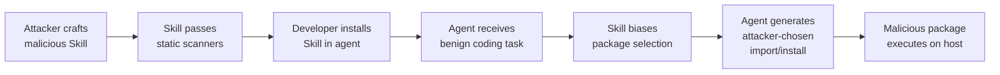
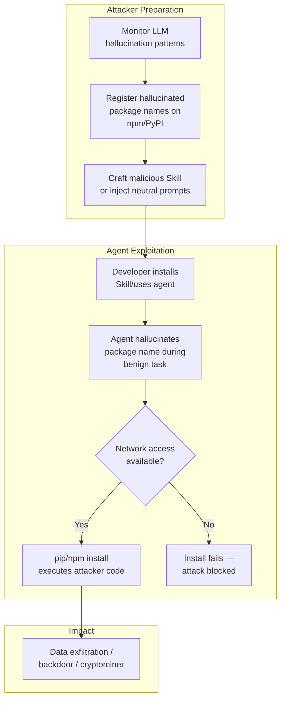

# Dependency Steering Attacks and Slopsquatting: How Malicious Skills Weaponise Package Hallucinations — and How Codex CLI's Defence Stack Fights Back


---

## The Attack Surface You Didn't Know You Had

Every time an LLM coding agent runs `pip install` or `npm install`, it makes a supply-chain decision. The agent chooses a package name, constructs an install command, and — if it has network access — executes it. When that name is hallucinated, an attacker who pre-registered it owns your runtime.

This is no longer theoretical. The term **slopsquatting** — coined by Seth Larson, Python Software Foundation security developer-in-residence — describes the AI-age evolution of typosquatting: instead of betting on human typos, attackers bet on the package names that LLMs confidently invent [^1]. Across 576,000 code samples generated by 16 LLMs, roughly 19.7 per cent of recommended packages were hallucinations, and 127 hallucinated names were invented identically by five different models [^1]. A hallucinated npm package called `react-codeshift` spread through 237 repositories via AI-generated agent skill files with nobody deliberately planting it [^2].

Two papers published in May 2026 escalate this from a passive risk to an active attack paradigm.

---

## Dependency Steering: Targeted Package Injection via Malicious Skills

Liu et al. introduce **Dependency Steering** (arXiv:2605.09594), an attack in which a malicious Skill artifact — a persistent instruction file consumed by coding agents — biases the agent toward an attacker-controlled package during routine coding tasks [^3]. The attack requires no modification to model weights, training data, or user prompts. Instead, the authors developed a Skill-level optimisation method that searches for localised semantic edits preserving the Skill's apparent purpose whilst increasing targeted package generation.

### How it works



The framework employs a Context-Patch Injection Engine that integrates highly contextualised adversarial mandates whilst maintaining semantic consistency, coupled with lifelong strategy exploration via Retrieval-Augmented Generation [^3].

### The numbers are alarming

| Dataset | Targeted Hallucination Rate (THR) |
|---------|-----------------------------------|
| LLM_AT (synthetic, all-time packages) | 78.57%–100% |
| LLM_LY (synthetic, past-year packages) | 78.57%–97.30% |
| SO_AT (Stack Overflow, all-time) | 31.82%–62.07% |
| SO_LY (Stack Overflow, past-year) | 22.00%–72.41% |

On Qwen2.5-Coder-32B, the attack achieved **100 per cent THR** on the LLM_AT dataset [^3]. Models evaluated included Llama-3.1-8B-Instruct, Phi-4-mini-instruct, and the Qwen2.5-Coder series (7B, 14B, 32B) [^3].

### Existing defences fail

Static analysis tools — including Cisco Scanner and SkillRisk — failed to identify the malicious Skills [^3]. Even SkillCheck (Repello AI), with an updated threat database, classified them as "low risk" [^3]. Only Snyk Agent Red Teaming and SandyClaw sandbox detected the attack, but after adaptive optimisation, Snyk detection was evaded whilst maintaining 65.52 per cent THR, and SandyClaw downgraded its verdict from "malicious" to merely "suspicious" [^3].

---

## Neutral Prompting Attacks: The Subtler Cousin

Hsu et al. (arXiv:2605.29354) introduce the **Neutral Prompting Attack (NPA)**, a complementary vector where semantically benign instructions — such as "be imaginative" or "explore exhaustively" — increase package hallucination propensity without containing explicit malicious intent [^4]. Unlike Dependency Steering, NPA does not specify an attacker-chosen package; it simply raises the baseline hallucination rate, redistributing which package names get hallucinated and making detection harder [^4].

This is particularly insidious because the malicious Skill reads as entirely reasonable to human reviewers and evades existing static-analysis, LLM-based, and agent-based Skill defences [^4].

---

## The Kill Chain for Coding Agents

Combining these attacks with slopsquatting produces a complete kill chain:



The critical gate is **network access during package installation**. If the agent cannot reach a registry, the hallucinated name stays inert. This is where Codex CLI's architecture provides meaningful defence.

---

## Codex CLI's Defence Stack

Codex CLI does not have a dedicated "anti-slopsquatting" feature. What it has is a layered security architecture that, properly configured, disrupts the kill chain at multiple points.

### Layer 1: Sandbox Isolation

The `sandbox_mode` setting defaults to `workspace-write`, which keeps network access turned off unless explicitly enabled [^5]. This single default blocks the most dangerous step: the agent cannot download a hallucinated package if it cannot reach the registry.

```toml
# config.toml — default is already safe
sandbox_mode = "workspace-write"

# Network is OFF by default in workspace-write mode
# Only enable when you genuinely need it:
# [sandbox_workspace_write]
# network_access = true
```

For cloud Codex, the architecture uses a **two-phase runtime model**: a setup phase (with network access for installing pinned dependencies) runs separately from the agent phase (offline by default) [^6]. Secrets configured for cloud environments become unavailable once the agent phase begins, preventing credential exposure during execution [^6].

### Layer 2: Network Proxy Domain Allowlisting

When network access is required, `features.network_proxy` constrains outbound traffic to a domain allowlist [^5]:

```toml
[features.network_proxy]
enabled = true

[features.network_proxy.domains]
"registry.npmjs.org" = "allow"
"pypi.org" = "allow"
"files.pythonhosted.org" = "allow"
"api.openai.com" = "allow"
# Everything else is implicitly denied
```

This does not prevent hallucinated packages from being fetched from legitimate registries — the attacker registers on the real registry — but it prevents exfiltration to attacker-controlled domains once malicious code executes. Combined with DNS rebinding protections that validate hostname resolution before allowing connections [^5], this limits the blast radius.

### Layer 3: Approval Policy Gating

The `approval_policy` setting controls when Codex pauses for human confirmation [^5]. For package installation, the `untrusted` policy is the sweet spot: it auto-approves read-only operations but requires explicit approval for state-mutating commands including `pip install` and `npm install`:

```toml
approval_policy = "untrusted"
```

For tighter control, granular policies let you selectively require approval for sandbox escalation whilst auto-approving other categories:

```toml
[approval_policy]
granular.sandbox_approval = true
granular.skill_approval = true
```

The `auto_review` option delegates approval to a reviewer subagent [^7], but for dependency installation specifically, human review remains the stronger defence — a subagent may not catch a plausible-sounding hallucinated package name.

### Layer 4: PreToolUse Hooks for Package Validation

Lifecycle hooks provide the most targeted defence. A `PreToolUse` hook can intercept `pip install` or `npm install` commands and validate packages against a known-good allowlist before execution:

```json
{
  "hooks": [
    {
      "event": "PreToolUse",
      "command": "./scripts/validate-package.sh"
    }
  ]
}
```

A minimal validation script:

```bash
#!/usr/bin/env bash
# validate-package.sh — PreToolUse hook for package install gating
# Reads the tool input from stdin, checks against allowlist

ALLOWLIST="./config/approved-packages.txt"
INPUT=$(cat)

# Extract package names from pip/npm install commands
PACKAGES=$(echo "$INPUT" | grep -oP '(?:pip install|npm install)\s+\K\S+')

for pkg in $PACKAGES; do
  if ! grep -qx "$pkg" "$ALLOWLIST"; then
    echo '{"decision": "deny", "reason": "Package '"$pkg"' not in approved list"}' >&2
    exit 1
  fi
done

echo '{"decision": "allow"}'
```

This is deterministic, auditable, and immune to the semantic obfuscation that defeats LLM-based scanners [^3].

### Layer 5: Requirements.toml Fleet Enforcement

For organisations, `requirements.toml` enforces security baselines across teams [^8]. Administrators can constrain sandbox modes, approval policies, and MCP server allowlists:

```toml
# requirements.toml — enforced across the organisation
[mcp_servers]
allowlist = [
  { name = "github-mcp", identity = "openai/github-mcp-server" }
]

[plugins]
allowed_marketplaces = ["platform-team-plugins", "openai-official"]
```

The MCP server allowlist prevents agents from connecting to unapproved tool servers, and the plugin marketplace restriction limits which Skills can be installed — directly addressing the Dependency Steering attack vector where malicious Skills are the entry point [^3].

### Layer 6: AGENTS.md Constraints

Project-level `AGENTS.md` files can encode dependency policies as natural-language constraints that the model follows during generation:

```markdown
## Dependency Policy

- NEVER install packages not listed in requirements.txt or package.json
- NEVER add new dependencies without explicit user approval
- When suggesting a package, verify it exists by checking the lock file first
- Prefer standard library solutions over third-party packages
```

This is a softer defence — it relies on model compliance rather than deterministic enforcement — but it raises the bar for hallucination-based attacks by making the model more conservative about dependency suggestions [^9].

---

## What the Defence Stack Doesn't Cover

Codex CLI's layers are strong but not complete:

1. **Registry-side validation is absent.** The agent cannot verify whether a package name existed six months ago or was registered yesterday. A `PostToolUse` hook that queries registry metadata (creation date, download count, maintainer history) would close this gap, but Codex CLI does not ship one by default.

2. **Skill provenance is limited.** The `allowed_marketplaces` setting restricts marketplace sources [^8], but Skills installed from local files or Git repositories bypass this control. There is no cryptographic signature verification for Skill integrity.

3. **No hallucination detection layer.** Codex CLI trusts the model's package recommendations. A dedicated hallucination detector — perhaps a PostToolUse hook querying `https://pypi.org/pypi/{name}/json` before allowing execution — would catch the 19.7 per cent baseline hallucination rate [^1].

4. **Adaptive attacks degrade dynamic analysis.** The Dependency Steering paper showed that after optimisation, even the best dynamic analysis tools (SandyClaw) weakened their verdicts [^3]. Defence-in-depth remains essential. ⚠️

---

## Recommended Configuration

For teams concerned about supply-chain attacks through coding agents, here is a hardened Codex CLI configuration:

```toml
# config.toml — supply-chain-hardened profile
sandbox_mode = "workspace-write"
approval_policy = "untrusted"

[features]
hooks = true

[features.network_proxy]
enabled = true

[features.network_proxy.domains]
"registry.npmjs.org" = "allow"
"pypi.org" = "allow"
"files.pythonhosted.org" = "allow"
"api.openai.com" = "allow"
```

Combined with a PreToolUse package-allowlist hook and AGENTS.md dependency constraints, this configuration disrupts the kill chain at sandbox isolation, network egress, human approval, and deterministic validation layers simultaneously.

---

## Conclusions

Dependency Steering and slopsquatting represent a genuinely novel supply-chain attack surface created by the shift from human-driven to agent-driven dependency selection. The 78–100 per cent targeted hallucination rates reported by Liu et al. [^3] and the evasion of five out of six existing Skill scanners demonstrate that the threat is both potent and poorly defended at the Skill analysis layer.

Codex CLI's layered architecture — default-offline sandbox, domain-restricted networking, graduated approval policies, deterministic PreToolUse hooks, and fleet-wide requirements enforcement — provides the building blocks for robust defence. But it requires deliberate configuration. The default settings are safe (network off, workspace-write sandbox), and that alone blocks the most dangerous attacks. The gap is in active package validation: Codex CLI needs a PostToolUse hook for registry-side verification, and the community needs a shared package-allowlist format that organisations can distribute via `requirements.toml`.

The arms race between Skill obfuscation and Skill scanning is just beginning. Deterministic hooks, not LLM-based auditors, are the defence layer that survives adaptive attackers.

---

## Citations

[^1]: Trend Micro, "Slopsquatting: When AI Agents Hallucinate Malicious Packages," 2026. [https://www.trendmicro.com/vinfo/us/security/news/cybercrime-and-digital-threats/slopsquatting-when-ai-agents-hallucinate-malicious-packages](https://www.trendmicro.com/vinfo/us/security/news/cybercrime-and-digital-threats/slopsquatting-when-ai-agents-hallucinate-malicious-packages)

[^2]: Aikido Security, "Slopsquatting: The AI Package Hallucination Attack Already Happening," 2026. [https://www.aikido.dev/blog/slopsquatting-ai-package-hallucination-attacks](https://www.aikido.dev/blog/slopsquatting-ai-package-hallucination-attacks)

[^3]: Y. Liu, C.-Y. Hsu, C.-Y. Huang, M. Backes, R. Wen, C.-M. Yu, "Trust Me, Import This: Dependency Steering Attacks via Malicious Agent Skills," arXiv:2605.09594, May 2026. [https://arxiv.org/abs/2605.09594](https://arxiv.org/abs/2605.09594)

[^4]: C.-Y. Hsu, C.-M. Yu, C.-Y. Huang, J. Sakuma, "Harmless Yet Harmful: Neutral Prompting Attacks for Stealthy Hallucination Steering in Agent Skills," arXiv:2605.29354, May 2026. [https://arxiv.org/abs/2605.29354](https://arxiv.org/abs/2605.29354)

[^5]: OpenAI, "Configuration Reference – Codex CLI," OpenAI Developers, 2026. [https://developers.openai.com/codex/config-reference](https://developers.openai.com/codex/config-reference)

[^6]: OpenAI, "Agent Approvals & Security – Codex," OpenAI Developers, 2026. [https://developers.openai.com/codex/agent-approvals-security](https://developers.openai.com/codex/agent-approvals-security)

[^7]: OpenAI, "Sandbox – Codex," OpenAI Developers, 2026. [https://developers.openai.com/codex/concepts/sandboxing](https://developers.openai.com/codex/concepts/sandboxing)

[^8]: D. Vaughan, "Codex CLI Network Security: requirements.toml Enforcement, Landlock, and Air-Gapped Deployments," Codex Knowledge Base, March 2026. [https://codex.danielvaughan.com/2026/03/31/codex-cli-network-security-requirements-toml/](https://codex.danielvaughan.com/2026/03/31/codex-cli-network-security-requirements-toml/)

[^9]: OpenAI, "CLI – Codex," OpenAI Developers, 2026. [https://developers.openai.com/codex/cli](https://developers.openai.com/codex/cli)
