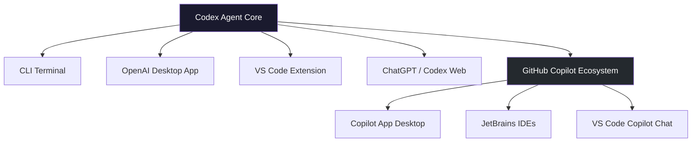
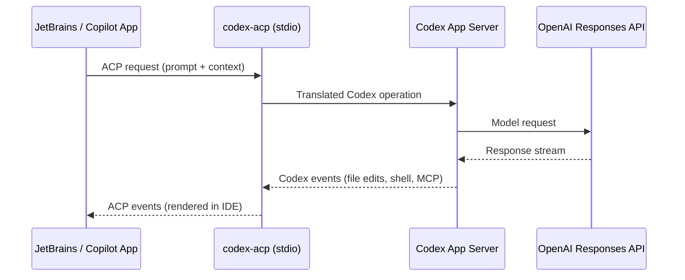
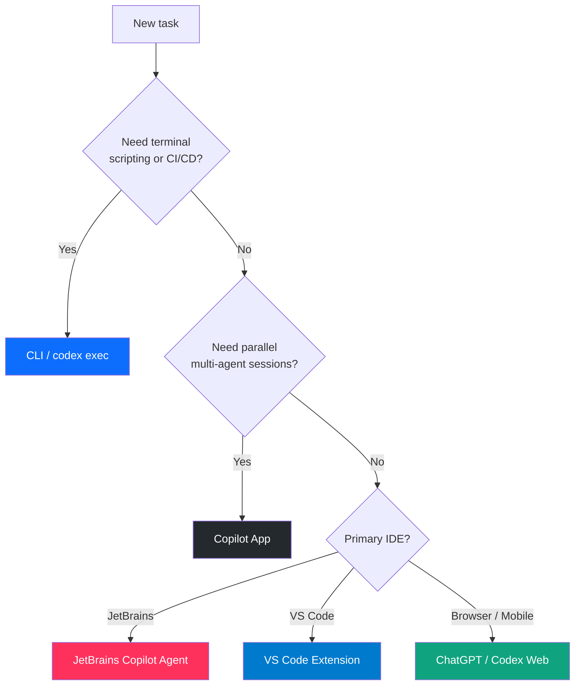

# Five Surfaces, One Agent: How Codex CLI's July 2026 Copilot Integration Completes the Multi-Surface Architecture


---

On 7 July 2026, two announcements landed within hours of each other. GitHub made the Copilot Desktop App available to every plan tier — including Copilot Free and GitHub Education accounts[^1]. Simultaneously, Codex appeared as a selectable agent provider inside JetBrains IDEs, accessible from the Copilot Chat panel's agent picker[^2]. The same day, `codex-acp` — the open-source ACP adapter that bridges Codex CLI to any Agent Client Protocol host — shipped v1.1.2 on npm[^3].

Together, these moves complete a structural shift. Codex is no longer a standalone terminal tool with a few IDE extensions bolted on. It is now a pluggable agent that runs inside five distinct surfaces — each with its own strengths, configuration quirks, and cost profile. For practitioners already invested in Codex CLI, the question is no longer "which tool?" but "which surface, for this task, right now?"

## The Five-Surface Map

When OpenAI first shipped Codex, it had four official entry points: CLI, the OpenAI desktop app, the VS Code extension, and the cloud surface (ChatGPT/Codex web)[^4]. The July 2026 Copilot integration adds a fifth category — Codex as an embedded agent inside GitHub's Copilot ecosystem.



The first four surfaces share a direct relationship with OpenAI's backend — the Codex App Server spawns locally, reads `~/.codex/config.toml`, and communicates with the Responses API. The fifth surface operates differently. It runs through `codex-acp`, an ACP adapter that translates between GitHub Copilot's Agent Client Protocol and Codex's internal operations[^3].

## How codex-acp Bridges the Gap

The `codex-acp` adapter is a TypeScript npm package (`@agentclientprotocol/codex-acp`) that acts as a stdio ACP agent server[^3]. When a Copilot-enabled IDE selects Codex as its agent provider, the IDE spawns `codex-acp`, which in turn starts the Codex App Server and handles bidirectional translation:



The adapter supports the full range of Codex events: shell commands, file modifications, permission requests, MCP tool calls, terminal output, reasoning traces, planning steps, web search, image generation, and token usage tracking[^3].

### Configuration Divergence

This is where practitioners need to pay attention. The CLI and the OpenAI desktop app share configuration from `~/.codex/config.toml` and `~/.codex/auth.json`. JetBrains IDEs using the Copilot integration store their own copies in `<IDE system dir>/aia/codex/`[^5]. The two paths do not share login sessions or configuration state.

In practice, this means:

```toml
# ~/.codex/config.toml — used by CLI, OpenAI app, VS Code extension
model = "o3"
approval_policy = "unless-allow-listed"

# <IDE system dir>/aia/codex/config.toml — used by JetBrains via Copilot
# Must be configured separately
```

The `codex-acp` adapter also accepts configuration via the `CODEX_CONFIG` environment variable (a JSON object merged into session config) and `INITIAL_AGENT_MODE` for setting the default permission level[^3]. For teams running Codex across multiple surfaces, the recommendation is to keep `AGENTS.md` as the single source of truth — it is read from the project root regardless of which surface loads it[^6].

## Three Permission Modes in JetBrains

The JetBrains integration exposes three distinct permission levels, mapped to Codex CLI's existing approval model[^7]:

| Mode | File Access | Command Execution | Equivalent CLI Setting |
|------|-------------|-------------------|----------------------|
| **Read-only** | Browse and explain only | None | `approval_policy = "never"` with read-only sandbox |
| **Agent** | Project workspace only | With approval | `approval_policy = "unless-allow-listed"` |
| **Agent (full access)** | Anywhere on machine | Minimal restrictions | `approval_policy = "auto-edit"` with full sandbox |

The **Agent** mode is the sensible default for most development work. It constrains file modifications to the project workspace and requires approval for anything outside that boundary — mirroring the `sandbox_mode = "workspace-write"` behaviour CLI users are familiar with[^8].

A subtle difference: the JetBrains integration currently ignores `.aiignore` files. Files listed in `.aiignore` can still be processed by Codex when running through the Copilot agent picker[^7]. CLI users relying on `.aiignore` for sensitive file exclusion should be aware of this gap. ⚠️

## The Copilot App: Multi-Agent Orchestration with Codex

The GitHub Copilot App deserves special attention because it is not merely another IDE integration — it is an orchestration layer. Each session runs in its own git worktree, providing physical isolation with a separate branch, files, and index[^1]. Multiple agents (Codex, Claude Code, Copilot's own cloud agent) can operate in parallel on the same codebase without file conflicts[^9].

Key capabilities relevant to Codex CLI practitioners:

- **My Work dashboard**: Unified visibility across active sessions, issues, pull requests, and background automations[^1]
- **Agent Merge**: Automated PR progression — monitors CI/CD, tracks reviewers, addresses failing checks, orchestrates merges[^1]
- **Local and cloud sandboxes**: Local sandboxes restrict filesystem, network, and system capabilities; cloud sandboxes provide ephemeral Linux environments for device-agnostic sessions[^1]
- **Canvas surfaces**: Bidirectional interfaces where agents update plans and developers can edit, reorder, approve, or redirect work[^1]

### Availability and Cost

Since 7 July 2026, the Copilot App is available on every plan, including Copilot Free[^1]. Free users receive 50 premium requests per month. Each agent-mode prompt costs one premium request; Copilot coding agent invocations (cloud-based) typically consume 30–50 premium requests[^10]. As of June 2026, Copilot billing moved to AI Credits (1 credit = \$0.01), so practitioners should factor in the per-invocation cost when choosing between direct CLI usage (billed against OpenAI API credits) and Copilot-mediated Codex sessions (billed against GitHub AI credits)[^10].

## The Decision Matrix: Which Surface, When?

With five surfaces available, the choice depends on four factors: isolation requirements, cost model, IDE preference, and orchestration needs.



| Criterion | CLI | OpenAI App | VS Code | JetBrains (Copilot) | Copilot App |
|-----------|-----|-----------|---------|-------------------|-------------|
| **Config source** | `~/.codex/` | `~/.codex/` | `~/.codex/` | `<IDE>/aia/codex/` | Copilot settings |
| **Billing** | OpenAI API | OpenAI API | OpenAI API | OpenAI API | GitHub AI Credits |
| **Hooks support** | Full (11 events) | Full | Full | Via Copilot customisations[^2] | Copilot hooks |
| **MCP servers** | Native | Native | Native | Via Copilot MCP panel[^2] | Via Copilot |
| **AGENTS.md** | Read from project root | Read from project root | Read from project root | Read from project root | Read from project root |
| **Worktree isolation** | Manual (`git worktree add`) | Automatic | Manual | Manual | Automatic per session |
| **Parallel sessions** | Manual (tmux/multiple terminals) | Single | Single | Single | Built-in orchestration |

## Practical Configuration for Multi-Surface Teams

For teams where some developers use the CLI, others use JetBrains, and CI/CD pipelines use `codex exec`, the configuration strategy is:

1. **AGENTS.md at the project root** — the one config file guaranteed to be read by every surface[^6]. Encode safety rules, coding conventions, and model preferences here.

2. **Named profiles for the CLI** — store environment-specific overrides in `~/.codex/<profile>.config.toml` and invoke with `--profile`[^11].

3. **JetBrains config via CODEX_CONFIG** — for teams using managed IDE deployments, set the `CODEX_CONFIG` environment variable to inject configuration without touching `<IDE>/aia/codex/config.toml`[^3].

4. **requirements.toml for enterprise guardrails** — admin-enforced constraints that apply across CLI, OpenAI App, and VS Code surfaces. Note that Copilot-mediated sessions (JetBrains, Copilot App) use Copilot's own policy layer instead[^12]. ⚠️

```toml
# AGENTS.md — universal across all five surfaces
# Enforce consistent behaviour regardless of entry point

## Build & Test
- Run `make test` before committing
- Never modify files outside src/ and tests/

## Model Selection
- Use o3 for complex refactoring
- Use o4-mini for test generation and linting

## Safety
- Never install packages without explicit approval
- Never modify CI/CD configuration files
```

## What This Means for the CLI

The multi-surface architecture does not diminish the CLI — it strengthens its position. The CLI remains the only surface that offers:

- **`codex exec`** for non-interactive CI/CD pipelines with `--output-schema` structured verdicts[^13]
- **Full hook control** with all eleven lifecycle events (six interception + five observation events from v0.133)[^14]
- **Direct `config.toml` management** without IDE abstraction layers
- **`codex remote-control pair`** for headless Linux pairing (v0.143)[^15]
- **Shell completion and scripting integration** for automation workflows

The Copilot integration is additive. It brings Codex to developers who live in JetBrains and would never open a terminal for agentic coding. For CLI practitioners, it means your AGENTS.md instructions, your MCP servers, and your approval policies now reach colleagues who operate in a fundamentally different environment — without those colleagues needing to learn terminal workflows.

## Looking Ahead

The convergence is not complete. Configuration remains fragmented across surfaces — a `config.toml` change in the CLI does not propagate to JetBrains. The `.aiignore` gap in JetBrains is a concrete security concern for projects with sensitive files[^7]. And the billing split between OpenAI API credits and GitHub AI credits creates cost-tracking complexity for enterprises running both.

But the direction is clear: Codex is becoming surface-agnostic. The agent is the constant; the interface is the variable. For senior developers, the actionable takeaway is to invest in the portable configuration layer — AGENTS.md, MCP server definitions, and approval policies — because those are the artefacts that travel with your project, regardless of which surface a team member opens next.

## Citations

[^1]: GitHub Blog, "GitHub Copilot app: The agent-native desktop experience," July 2026. [https://github.blog/news-insights/product-news/github-copilot-app-the-agent-native-desktop-experience/](https://github.blog/news-insights/product-news/github-copilot-app-the-agent-native-desktop-experience/)
[^2]: GitHub Changelog, "Codex as agent provider and agentic enhancements in JetBrains IDEs," 7 July 2026. [https://github.blog/changelog/2026-07-07-codex-as-agent-provider-and-agentic-enhancements-in-jetbrains-ides/](https://github.blog/changelog/2026-07-07-codex-as-agent-provider-and-agentic-enhancements-in-jetbrains-ides/)
[^3]: GitHub, "agentclientprotocol/codex-acp — ACP server implementation that exposes Codex CLI functionality," v1.1.2, July 2026. [https://github.com/agentclientprotocol/codex-acp](https://github.com/agentclientprotocol/codex-acp)
[^4]: OpenAI Developers, "Features — Codex CLI," July 2026. [https://developers.openai.com/codex/cli/features](https://developers.openai.com/codex/cli/features)
[^5]: JetBrains YouTrack, "How does Codex CLI integration (Codex Agent) work in JetBrains IDEs?" [https://youtrack.jetbrains.com/articles/SUPPORT-A-3134/How-does-Codex-CLI-integration-Codex-Agent-work-in-JetBrains-IDEs](https://youtrack.jetbrains.com/articles/SUPPORT-A-3134/How-does-Codex-CLI-integration-Codex-Agent-work-in-JetBrains-IDEs)
[^6]: OpenAI Developers, "AGENTS.md — Codex," July 2026. [https://developers.openai.com/codex/agents-md](https://developers.openai.com/codex/agents-md)
[^7]: JetBrains, "Codex — AI Assistant Documentation." [https://www.jetbrains.com/help/ai-assistant/codex-agent.html](https://www.jetbrains.com/help/ai-assistant/codex-agent.html)
[^8]: OpenAI Developers, "Agent approvals & security — Codex," July 2026. [https://developers.openai.com/codex/agent-approvals-security](https://developers.openai.com/codex/agent-approvals-security)
[^9]: InfoQ, "GitHub Copilot Desktop App Targets Parallel Agentic Workflows," June 2026. [https://www.infoq.com/news/2026/06/github-copilot-app/](https://www.infoq.com/news/2026/06/github-copilot-app/)
[^10]: GitHub Docs, "About individual GitHub Copilot plans and benefits." [https://docs.github.com/en/copilot/concepts/billing/individual-plans](https://docs.github.com/en/copilot/concepts/billing/individual-plans)
[^11]: OpenAI Developers, "Advanced Configuration — Codex," July 2026. [https://developers.openai.com/codex/config-advanced](https://developers.openai.com/codex/config-advanced)
[^12]: OpenAI Developers, "Managed configuration — Codex," July 2026. [https://developers.openai.com/codex/config-managed](https://developers.openai.com/codex/config-managed)
[^13]: OpenAI Developers, "Non-interactive Mode — Codex CLI," July 2026. [https://developers.openai.com/codex/cli/non-interactive](https://developers.openai.com/codex/cli/non-interactive)
[^14]: OpenAI Developers, "Hooks — Codex CLI," July 2026. [https://developers.openai.com/codex/cli/hooks](https://developers.openai.com/codex/cli/hooks)
[^15]: GitHub, "openai/codex releases — rust-v0.143.0," 8 July 2026. [https://github.com/openai/codex/releases](https://github.com/openai/codex/releases)
