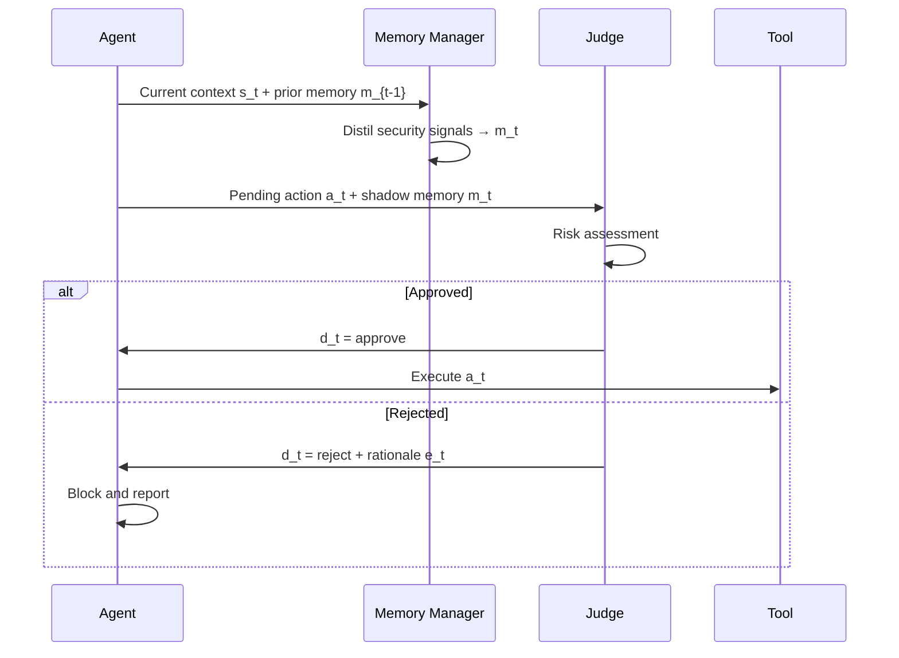
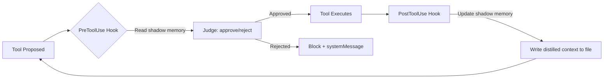
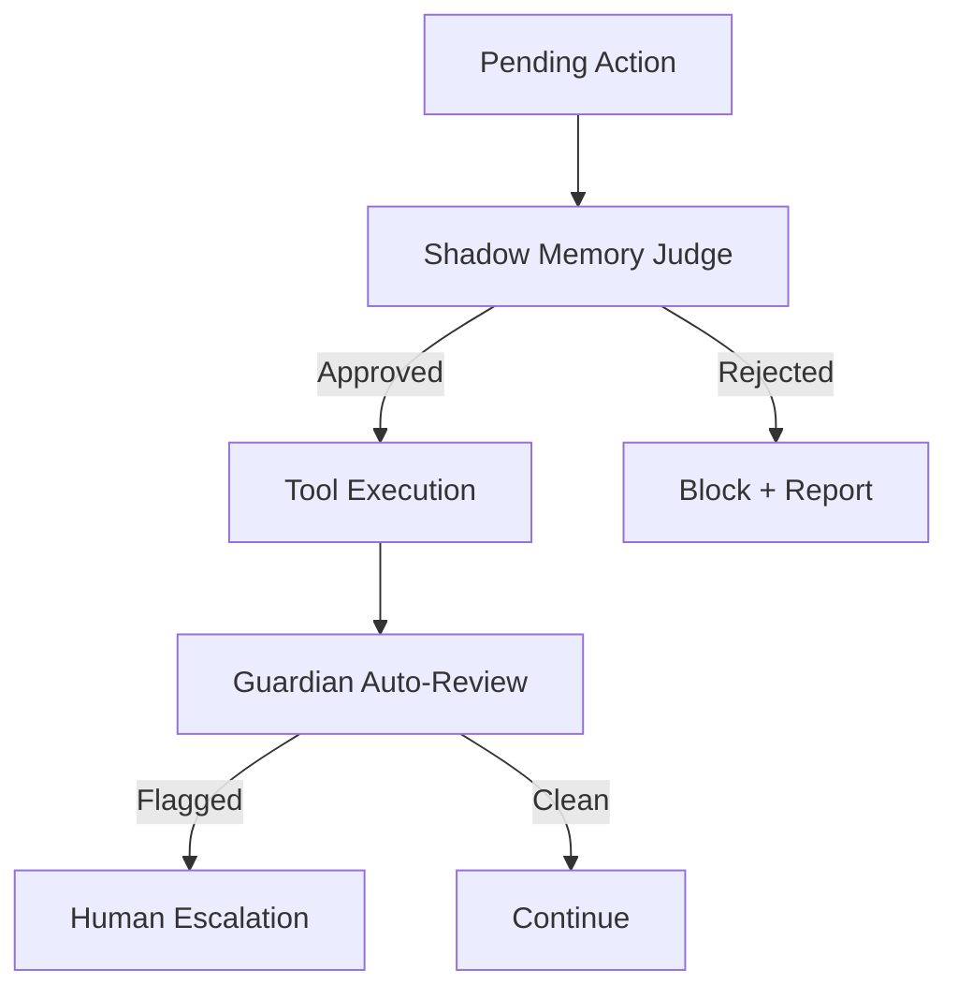

# Shadow Memory for Long-Horizon Agent Safety: What MAGE Reveals About Persistent Threat Detection — and How to Wire Equivalent Guardrails into Codex CLI


---

## The Problem: Single-Turn Defences Fail Over Long Horizons

Most agent safety mechanisms evaluate each tool call in isolation. A single `rm -rf` is easy to catch; a twenty-turn attack chain where each step looks benign individually is not. As coding agents like Codex CLI take on longer sessions — median 2.5 hours of daily runtime, with the 99th percentile exceeding 71 hours [^1] — the attack surface shifts from single malicious actions to *trajectories* where intent emerges only across accumulated turns.

Wang et al.'s MAGE framework (arXiv:2605.03228, May 2026) [^2] is the first published defence that tackles this trajectory-level threat using an agentic memory approach. The core insight: maintain a compact, safety-focused "shadow memory" that distils security-critical context across the agent's full execution, then gate every pending action against it.

The results are striking. Against sequential tool-attack chaining (STAC), MAGE reduces attack success rate from 100 per cent to 8.3 per cent using a Qwen3-4B backbone, whilst preserving 94.4 per cent benign utility at a cost of just 7.0K extra tokens per task [^2].

## How MAGE Works

### The Shadow Stack Analogy

MAGE borrows from systems security's shadow stack — a protected copy of return addresses that prevents control-flow hijacking. The agent equivalent: a protected copy of *safety-critical context* that prevents intent hijacking.



### Shadow Memory Update

At each turn, the memory manager distils the current interaction into a compact representation tracking three components [^2]:

1. **User intent reference** — the original benign task objectives and constraints
2. **Attack pattern catalogue** — previously encountered injection attempts, policy violations, and escalation chains
3. **Safety-critical observations** — tool sensitivity levels, credential inconsistencies, deviation signals

The update follows a simple recurrence:

```
m_t = M(m_{t-1}, s_{t-1})
```

Length penalties keep the shadow memory compact — under 2,500 characters by default, with aggressive penalties above 25,000 [^2]. This is critical: the shadow memory must *not* become another unbounded context that itself suffers governance decay [^3].

### Training via Turn-wise GRPO

Both components (memory manager and judge) share a single small model with role-specific prompting, trained via Group Relative Policy Optimisation with temporally-discounted rewards [^2]:

```
R_mem(m_t) = Σ(k=t to T) γ^(k-t) · 𝟙[d_k = d*_k]
```

This propagates future judge correctness backward with exponential decay, teaching the memory manager to retain signals that *will matter* several turns hence — precisely the information that naive compaction drops.

## MAGE's Threat Coverage

MAGE addresses two distinct adversary classes [^2]:

### User-as-Adversary: Sequential Tool-Attack Chaining

STAC maintains a stateful, context-aware attack chain that progressively steers the agent toward policy violations. Average attack horizon: 3.43 turns; maximum: 24 turns [^2]. Against STAC with a GPT-5.1 target agent:

| Defence | ASR | Benign Utility | Token Overhead |
|---------|-----|----------------|----------------|
| No defence | 100.0% | — | 0 |
| Judge only (no memory) | 16.7% | 77.8% | 12.9K |
| **MAGE (full)** | **8.3%** | **94.4%** | **7.0K** |

The shadow memory actually *reduces* token overhead versus judge-only by 1.8× — the distilled context is cheaper than re-reading the full trajectory every turn [^2].

### Environment-as-Adversary: Indirect Prompt Injection

Across five injection attack types on the AgentDojo benchmark (7,682 test cases), MAGE achieves 0.4 per cent average ASR with 73.0 per cent benign utility — outperforming every baseline [^2]:

| Defence | PI2 ASR | Avg Benign Utility |
|---------|---------|--------------------|
| Spotlighting | 98.2% | 46.1% |
| Repeated-Prompt | 71.4% | 25.4% |
| PI-Detector | 35.7% | 11.4% |
| MELON | Variable (0–42.1%) | Variable |
| IPIGuard | 0.0% | 56.8% |
| **MAGE** | **0.0%** | **73.0%** |

Detection latency averages 0.05 turns — MAGE catches attacks at or immediately after the first attack turn [^2].

### Adaptive Attack Resilience

Even under adaptive attacks targeting the shadow memory itself (memory poisoning + judge targeting), MAGE's ASR rises only to 12.5 per cent [^2]. The shadow memory's compressed format makes it harder to manipulate than the full conversation context.

## Mapping MAGE to Codex CLI's Defence Stack

Codex CLI v0.143.0 [^4] does not ship a shadow memory, but its hook architecture provides the scaffolding to build one.

### Layer 1: PreToolUse as the Checkpoint Gate

MAGE's judge evaluates every pending action before execution. Codex CLI's `PreToolUse` hook fires before every tool call and can return a `systemMessage` to inject context or block execution [^5]:

```toml
# config.toml
[hooks.pre_tool_use]
command = "python3 /opt/guardrails/shadow_judge.py"
events = ["PreToolUse"]
```

The hook receives the pending tool call (command, file path, MCP tool name) and can return a decision:

```json
{
  "decision": "reject",
  "reason": "Action deviates from stated intent: user requested test scaffolding but tool targets production credentials"
}
```

⚠️ Note: `PreToolUse` hooks currently support `systemMessage` injection but the `updatedInput` field is not yet supported (GitHub #18491 [^6]), limiting the ability to rewrite actions in-flight.

### Layer 2: PostToolUse for Memory Update

After each tool execution, `PostToolUse` can update the shadow memory with the latest safety-critical observations [^5]:

```toml
[hooks.post_tool_use]
command = "python3 /opt/guardrails/shadow_memory_update.py"
events = ["PostToolUse"]
```



### Layer 3: Persistent Shadow Memory via Session Files

MAGE's shadow memory must persist across turns but remain compact. A practical implementation for Codex CLI:

```python
#!/usr/bin/env python3
"""shadow_memory_update.py — PostToolUse hook that maintains
a file-backed shadow memory à la MAGE."""

import json
import sys
from pathlib import Path

SHADOW_FILE = Path("/tmp/.codex-shadow-memory.json")
MAX_CHARS = 2500

def load_memory() -> dict:
    if SHADOW_FILE.exists():
        return json.loads(SHADOW_FILE.read_text())
    return {
        "user_intent": "",
        "attack_patterns": [],
        "observations": [],
        "turn_count": 0
    }

def distil(memory: dict, tool_event: dict) -> dict:
    """Extract safety-critical signals from the tool event."""
    memory["turn_count"] += 1

    # Track sensitive tool invocations
    cmd = tool_event.get("command", "")
    if any(sig in cmd for sig in ["curl", "wget", "ssh", "scp",
                                   "credentials", "token", ".env"]):
        memory["observations"].append({
            "turn": memory["turn_count"],
            "signal": f"Sensitive command: {cmd[:200]}"
        })

    # Enforce compactness — prune oldest observations
    serialised = json.dumps(memory)
    while len(serialised) > MAX_CHARS and memory["observations"]:
        memory["observations"].pop(0)
        serialised = json.dumps(memory)

    return memory

def main():
    event = json.load(sys.stdin)
    memory = load_memory()
    memory = distil(memory, event)
    SHADOW_FILE.write_text(json.dumps(memory, indent=2))

if __name__ == "__main__":
    main()
```

### Layer 4: AGENTS.md as the Pinned Intent Anchor

MAGE's user intent reference — the benign task objectives that the judge compares actions against — maps directly to Codex CLI's `AGENTS.md` file, which survives compaction and is re-read every turn [^7]:

```markdown
<!-- AGENTS.md -->
## Security Constraints

- This session targets test scaffolding ONLY
- No production credentials may be read or transmitted
- Network calls restricted to test endpoints at test.example.com
- Any deviation from test scaffolding scope must be rejected
```

This is MAGE's "user intent reference" in declarative form. Combined with the shadow memory hook, the judge can compare pending actions against both the static intent anchor and the accumulated trajectory context.

### Layer 5: Sandbox as the Hardware Backstop

MAGE is a software defence — it can be bypassed if the judge fails. Codex CLI's Landlock/Seatbelt sandbox provides a hardware-enforced backstop [^8]:

```toml
# config.toml
sandbox_mode = "workspace-write"  # Network disabled by default

[features]
network_proxy = "https://proxy.example.com"  # Domain allowlisting
```

Even if a twenty-turn attack chain fools the shadow memory judge, the sandbox prevents network exfiltration and filesystem escape. MAGE's authors acknowledge this gap: their framework "does not address sandbox evasion or hardware-level threats" [^2].

### Layer 6: Guardian Auto-Review as a Second Judge

Codex CLI's Guardian subagent performs automatic code review with four-tier risk classification [^9]. This acts as a second, independent judge — MAGE with two judges rather than one:

```toml
# config.toml
auto_review = true
```



## What Codex CLI Still Lacks

MAGE exposes three architectural gaps in Codex CLI's current defence stack:

### 1. No Native Trajectory-Level Memory

Codex CLI's session JSONL logs capture the full trajectory but are not distilled into a security-focused summary [^10]. Each hook invocation must independently reconstruct context from the log or maintain its own file-backed state (as shown above). A native `shadow_memory` configuration key that manages distillation, compaction, and persistence would eliminate boilerplate.

### 2. No Trained Risk Scoring

MAGE's judge is trained via GRPO with turn-wise rewards, achieving calibrated risk scores. Codex CLI's hooks execute deterministic scripts — powerful for pattern matching, but unable to assess the *trajectory-level probability* that a sequence of individually benign actions constitutes an attack. Integrating a small local model (Qwen3-4B achieves MAGE's results) as a hook backend would bridge this gap.

### 3. No Cross-Session Attack Pattern Transfer

MAGE's shadow memory resets per task. Codex CLI could go further: `history.persistence` already stores session histories [^10], and a cross-session attack pattern database would let the judge learn from previous incidents without retraining.

## Practitioner Checklist

For teams running long-horizon Codex CLI sessions today:

| Layer | MAGE Equivalent | Codex CLI Implementation |
|-------|----------------|--------------------------|
| Intent anchor | User intent reference | `AGENTS.md` security constraints |
| Shadow memory | Memory manager | `PostToolUse` hook → file-backed JSON |
| Pre-execution gate | Judge | `PreToolUse` hook reading shadow memory |
| Compactness guard | Length penalty | Pruning logic in hook script |
| Hardware backstop | *(not in MAGE)* | `sandbox_mode = "workspace-write"` |
| Second judge | *(not in MAGE)* | `auto_review = true` (Guardian) |
| Domain restriction | *(not in MAGE)* | `network_proxy` domain allowlisting |

## Conclusion

MAGE demonstrates that trajectory-level safety requires *memory* — not just per-action filtering. The shadow memory pattern reduces attack success by 91.7 percentage points against sequential attack chains whilst *lowering* token overhead compared to memoryless judges [^2]. Codex CLI's hook architecture provides the wiring to implement this pattern today, though a native shadow memory abstraction would make it production-grade rather than bespoke. The combination of MAGE-style trajectory distillation with Codex CLI's existing sandbox, approval policy, and Guardian review creates a defence-in-depth stack that addresses threats at every layer — from software-level intent drift to hardware-enforced containment.

---

## Citations

[^1]: Johnston et al., "The Shift to Agentic AI: Evidence from OpenAI Codex Usage Patterns," arXiv:2606.26959, June 2026. [https://arxiv.org/abs/2606.26959](https://arxiv.org/abs/2606.26959)

[^2]: Wang, Y., Jiang, T., Liang, J., Fleming, C., Wang, T., "MAGE: Safeguarding LLM Agents against Long-Horizon Threats via Shadow Memory," arXiv:2605.03228, May 2026. [https://arxiv.org/abs/2605.03228](https://arxiv.org/abs/2605.03228)

[^3]: Chen, S., "Governance Decay: How Context Compaction Silently Erases Safety Constraints in Long-Horizon LLM Agents," arXiv:2606.22528, June 2026. [https://arxiv.org/abs/2606.22528](https://arxiv.org/abs/2606.22528)

[^4]: OpenAI, "Codex CLI v0.143.0 Release Notes," GitHub Releases, July 8, 2026. [https://github.com/openai/codex/releases](https://github.com/openai/codex/releases)

[^5]: OpenAI, "Hooks — Codex Developer Documentation," 2026. [https://developers.openai.com/codex/hooks](https://developers.openai.com/codex/hooks)

[^6]: OpenAI/codex, "PreToolUse updatedInput not yet supported," GitHub Issue #18491. [https://github.com/openai/codex/issues/18491](https://github.com/openai/codex/issues/18491)

[^7]: OpenAI, "CLI — Codex Developer Documentation: AGENTS.md," 2026. [https://developers.openai.com/codex/cli](https://developers.openai.com/codex/cli)

[^8]: OpenAI, "Codex CLI Sandbox Configuration," 2026. [https://developers.openai.com/codex/cli](https://developers.openai.com/codex/cli)

[^9]: OpenAI, "Codex CLI Auto-Review and Guardian Subagent," 2026. [https://developers.openai.com/codex/cli](https://developers.openai.com/codex/cli)

[^10]: OpenAI, "Codex CLI Session Persistence and History," 2026. [https://developers.openai.com/codex/cli](https://developers.openai.com/codex/cli)
