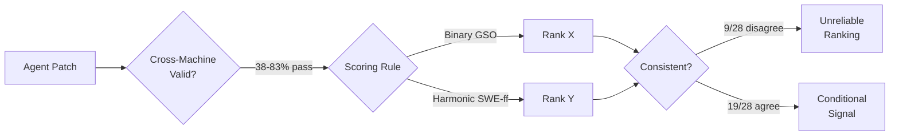
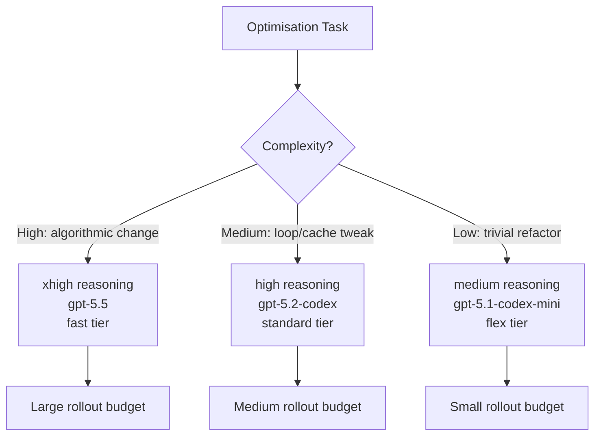

# Are Performance-Optimisation Benchmarks Reliably Measuring Coding Agents? What Practitioners Should Know — and How to Configure Codex CLI Accordingly


---

## The Problem with Performance Leaderboards

If you have been tracking coding-agent progress through aggregate leaderboard scores on GSO, SWE-Perf, or SWE-fficiency, you may be drawing the wrong conclusions. A July 2026 study by Chen et al. from Singapore Management University and Shanghai Jiao Tong University systematically audited all three benchmarks and found that runtime instability, inconsistent scoring rules, and near-saturation effects make headline numbers unreliable guides for choosing agents or models [^1].

This matters for Codex CLI practitioners. When you select a model, set `model_reasoning_effort`, or configure a `rollout_budget`, you are implicitly betting on a capability profile that these benchmarks claim to measure. If the measurements are fragile, your configuration choices need a more nuanced evidence base.

## What the Benchmarks Do

All three benchmarks evaluate coding agents on **performance optimisation**: given a repository and a slow workload, generate a patch that makes the code faster without breaking tests.

- **GSO** uses a binary gate — match or exceed the reference patch's speedup to score [^2].
- **SWE-Perf** measures runtime delta against unoptimised baselines across 140 tasks [^1].
- **SWE-fficiency** uses a continuous harmonic-mean scoring rule with a floor of `f = 0.001`, calculated as `HM = N / Σ(1 / max(SR, 0.001))` [^3].

Each benchmark applies patches to real repositories, runs workloads, and compares wall-clock times against reference patches and unoptimised baselines.

## Three Reliability Failures

### 1. Cross-Machine Validity Collapse

Chen et al. replayed official reference patches on four Google Cloud machine configurations [^1]:

| Machine Type | CPU | Year |
|---|---|---|
| n2-standard-64 | Intel Cascade Lake | 2019 |
| n2d-standard-64 | AMD Milan | 2021 |
| n4-standard-64 | Intel Emerald Rapids | 2024 |
| n4d-standard-64 | AMD Turin | 2025 |

All machines had 64 vCPUs and 256 GB memory. Reference patches satisfied original validity rules **across all replays** for:

- **GSO:** 39 / 102 tasks (38.2 per cent)
- **SWE-Perf:** 11 / 140 tasks (7.9 per cent)
- **SWE-fficiency:** 411 / 498 tasks (82.5 per cent)

SWE-Perf is especially fragile because many reference patches produce near-zero runtime changes. Its median signal was just −0.03 per cent, with a standard-deviation-to-signal ratio of 43.23× [^1]. Put differently, the measurement noise drowns the signal on the majority of tasks.

### 2. Scoring-Rule Disagreement

Among eight public submissions shared by GSO and SWE-fficiency, the official rankings **disagreed on 9 of 28 pairwise comparisons** [^1]. An agent ranked third on one leaderboard can appear fifth on another — not because it performed differently, but because the aggregation formula weighted tasks differently.

SWE-fficiency's harmonic-mean formula amplifies this: the worst ten tasks carried **58.5–82.8 per cent** of total score weight [^1]. A single near-floor task could carry approximately 33.6 per cent of a submission's weight alone. This means a marginal improvement on one pathological task can vault an agent up the leaderboard whilst revealing nothing about general optimisation capability.

### 3. Near-Saturation

Across 450 replay-valid tasks from GSO and SWE-fficiency combined, at least one public submission matched or beat the reference patch on **85.3 per cent** of tasks, and beat the unoptimised base code on **99.8 per cent** [^1]. The remaining headroom is concentrated in a shrinking tail of difficult tasks — precisely the tasks most affected by runtime variance and scoring-weight distortion.



## Runtime Variance: The Numbers

The paper quantifies signal strength per benchmark:

| Benchmark | Median Signal | Std / Signal Ratio |
|---|---|---|
| GSO | −54.20% | 0.07× |
| SWE-Perf | −0.03% | 43.23× |
| SWE-fficiency | −56.04% | 0.04× |

GSO and SWE-fficiency produce genuine runtime improvements on most tasks. SWE-Perf's reference patches are statistically indistinguishable from noise on the majority of tasks [^1]. If you have been using SWE-Perf scores to select models for performance-sensitive work, those scores were likely measuring hardware jitter rather than agent capability.

## What This Means for Codex CLI Configuration

### Choose Models at Task Granularity, Not Leaderboard Position

The authors recommend interpreting improvements **at task granularity** rather than relying on aggregate leaderboard positions [^1]. For Codex CLI, this translates to using **named profiles** to match model and reasoning effort to task type rather than picking a single "best" model based on a headline score.

```toml
# ~/.codex/perf-optimise.config.toml
# Profile for performance-critical refactoring tasks
model = "gpt-5.5"
model_reasoning_effort = "xhigh"
service_tier = "fast"

[features.rollout_budget]
enabled = true
limit_tokens = 500000
reminder_interval_tokens = 100000
```

```toml
# ~/.codex/batch-review.config.toml
# Profile for bulk code review where marginal perf gains don't matter
model = "gpt-5.1-codex-mini"
model_reasoning_effort = "medium"
service_tier = "flex"

[features.rollout_budget]
enabled = true
limit_tokens = 200000
```

Switch between profiles with `codex --profile perf-optimise` or `codex --profile batch-review` [^4].

### Use Rollout Budgets to Contain Benchmark-Chasing Waste

The saturation finding — 85.3 per cent of tasks already solved by at least one submission — means that throwing more tokens at performance optimisation yields diminishing returns on well-trodden ground. Codex CLI's `rollout_budget` feature (introduced mid-2026) tracks cumulative token spend across agent threads and aborts turns when exhausted [^5]. Set a budget ceiling that matches the economic value of the optimisation, not the theoretical maximum.

```toml
[features.rollout_budget]
enabled = true
limit_tokens = 300000
prefill_token_weight = 1.0
sampling_token_weight = 1.0
reminder_interval_tokens = 50000
```

### Validate on Your Hardware, Not the Benchmark's

The cross-machine validity collapse demonstrates that a patch proven fast on Cascade Lake may not be fast on Turin. When using Codex CLI for performance work, always benchmark patches on your **target production hardware** [^6].

Wire this into your workflow with an `AGENTS.md` constraint:

```markdown
## Performance Optimisation Rules

- Every performance patch MUST include a benchmark script runnable via `codex --profile perf-optimise`
- Speedup claims MUST be validated on the target deployment hardware, not CI runners
- Report median and p99 wall-clock times across 10+ runs, not single-run deltas
- Flag any optimisation with < 5% median improvement as noise-range
```

### Treat Reasoning Effort as a Variable, Not a Constant

The weight-distortion problem shows that harder tasks disproportionately affect scores. For Codex CLI, this maps to `model_reasoning_effort`: use `xhigh` for complex optimisations where the model needs deep analysis, but drop to `medium` or `low` for straightforward refactoring where over-thinking burns tokens without benefit [^4].



## Broader Implications: Benchmark Hygiene for Practitioners

Chen et al. recommend three concrete steps for benchmark consumers [^1]:

1. **Distinguish cross-machine verified tasks from unstable tasks** — only trust scores on the subset of tasks that reproduce across hardware configurations.
2. **Show per-task score weight** — reject aggregate numbers that hide pathological weight concentration.
3. **Compare submissions under aggregation rules that match your use case** — a binary pass/fail gate (GSO-style) answers "can the agent optimise this at all?", whilst a continuous score (SWE-fficiency-style) answers "by how much?" These are different questions.

This is not unique to performance benchmarks. The same structural issues — runtime variance, scoring-rule sensitivity, saturation — affect SWE-bench Verified [^7], SWE-bench Pro, and similar functional-correctness benchmarks, though with different magnitudes. The lesson is universal: **treat benchmark scores as noisy signals, not ground truth, and configure your tools accordingly**.

## Practical Checklist

- [ ] Audit which benchmarks influenced your current model/profile selection
- [ ] Create separate Codex CLI profiles for different task complexities
- [ ] Set `rollout_budget` limits proportional to expected economic value
- [ ] Add `AGENTS.md` rules requiring multi-run validation on target hardware
- [ ] Re-evaluate model choices at task granularity, not aggregate rank
- [ ] Treat SWE-Perf scores with extreme scepticism (43× noise-to-signal ratio)

## Citations

[^1]: Chen, Z., Sun, Z., Shi, Y., Lo, D., & Jiang, L. (2026). "Are Performance-Optimization Benchmarks Reliably Measuring Coding Agents?" arXiv:2607.01211. [https://arxiv.org/abs/2607.01211](https://arxiv.org/abs/2607.01211)

[^2]: GSO Benchmark. "GSO: Software Optimization Benchmark for SWE-Agents." [https://gso-bench.github.io/](https://gso-bench.github.io/)

[^3]: SWE-fficiency. "Can Language Models Optimize Real-World Repositories on Real Workloads?" arXiv:2511.06090. [https://arxiv.org/abs/2511.06090](https://arxiv.org/abs/2511.06090)

[^4]: OpenAI. "Configuration Reference — Codex CLI." [https://developers.openai.com/codex/config-reference](https://developers.openai.com/codex/config-reference)

[^5]: OpenAI. "Changelog — Codex." [https://developers.openai.com/codex/changelog](https://developers.openai.com/codex/changelog)

[^6]: OpenAI. "Advanced Configuration — Codex CLI." [https://developers.openai.com/codex/config-advanced](https://developers.openai.com/codex/config-advanced)

[^7]: Jimenez, C. E., et al. (2024). "SWE-bench: Can Language Models Resolve Real-World GitHub Issues?" arXiv:2310.06770. [https://arxiv.org/abs/2310.06770](https://arxiv.org/abs/2310.06770)
