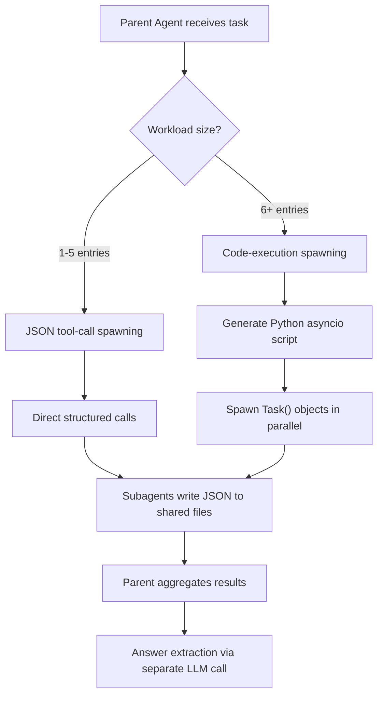
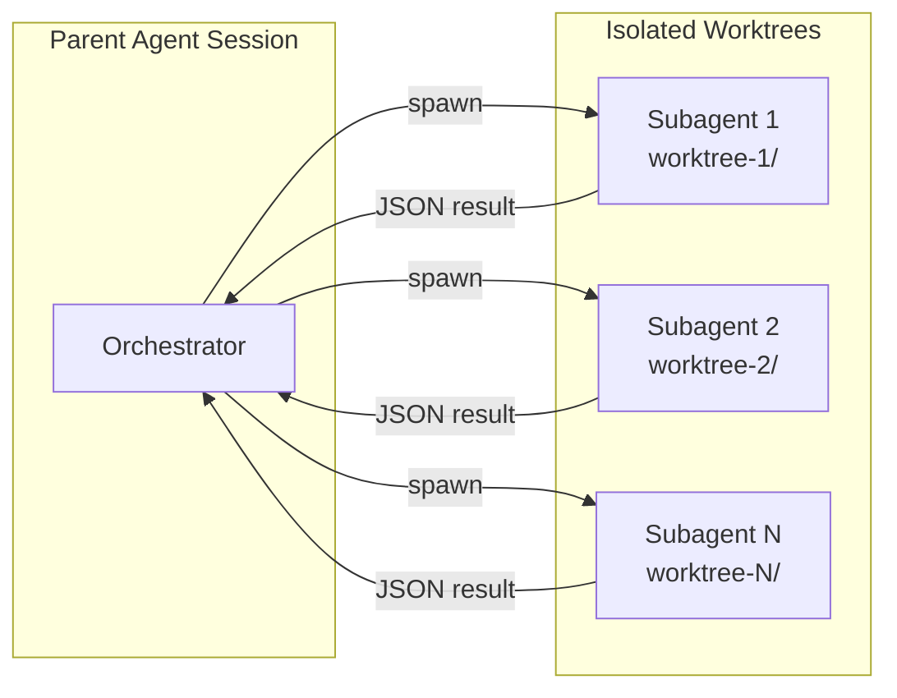

# Recursive Agent Harnesses: Why Harness Recursion Outperforms Model Recursion and Flat Coding Agents — and How to Configure Codex CLI's Subagent Stack Accordingly


---

## The Problem with Flat Agent Architectures

Production coding agents face a fundamental scaling problem. Hand a single agent a repository with hundreds of files or a dataset with thousands of entries, and it must either read everything into one enormous context window or rely on regex heuristics that throw away per-entry reasoning depth [^1]. Recursive language models (RLMs) partially solved this by decomposing problems through recursive model calls, but RLMs operate without tools — no filesystem access, no code execution, no planning [^2].

Lumer et al.'s *Recursive Agent Harnesses* paper (arXiv:2606.13643, June 2026) names and formalises the pattern that sits between these two approaches: **harness recursion**, where the recursive unit is not a bare model call but a full agent harness equipped with filesystem tools, code execution, and planning capabilities [^1].

## What Is a Recursive Agent Harness?

A Recursive Agent Harness (RAH) treats each subagent invocation as a complete agent session — not merely a function call. The parent agent evaluates workload size and selects between two spawning paths [^1]:



**JSON tool-call spawning** handles small workloads (1–5 entries) through direct structured calls, avoiding script generation overhead [^1].

**Code-execution spawning** is where RAH diverges sharply from conventional patterns. The parent generates Python scripts using `asyncio` that instantiate `Task()` objects for parallel execution. This bypasses API per-turn tool-call limits, enabling thousands of subagents without fixed caps [^1]. Each subagent operates in an isolated workspace with `read_file`, `write_file`, `ls`, `glob`, `grep`, `execute`, and `web_search` tools [^1].

Crucially, sibling subagents share no memory — preventing interference but requiring explicit result aggregation through structured JSON written to shared files [^1].

## The Numbers: RAH vs. the Alternatives

The paper benchmarks against the Oolong-Synthetic validation split — 199 stratified samples across 13 context-length buckets (averaging 629K tokens per instance, reaching up to 4M tokens) [^1].

| Method | Accuracy | Notes |
|--------|----------|-------|
| Full-context baseline | 59.22% | Single pass, entire document |
| RLM (model recursion) | 64.38% | Recursive calls, no tools |
| Codex coding agent | 71.75% | Tools but flat architecture |
| **RAH (GPT-5)** | **81.36%** | Harness recursion |
| **RAH (Claude Sonnet 4.5)** | **89.77%** | Harness recursion |

RAH with GPT-5 delivers a 9.61-point gain over the Codex baseline (95% CI [4.2, 14.8]) and a 16.98-point gain over RLMs (95% CI [11.5, 22.0]) [^1]. The gains are architectural, not model-dependent — swapping GPT-5 for Claude Sonnet 4.5 pushes accuracy to 89.77 per cent using the identical harness design [^1].

### Per-Category Breakdown

Performance varies by answer type. USER answers reach 87.27 per cent, COMPARISON 89.29 per cent, and LABEL 86.54 per cent. NUMERIC tasks trail at 69.33 per cent due to continuous-quantity scoring penalties on off-by-one errors, whilst DATE tasks show high variance with only five samples [^1].

### Context Length Scaling

RAH with Claude Sonnet 4.5 maintains above 76 per cent accuracy through 4M tokens — a regime where flat agents collapse [^1]. The recursion naturally decomposes long contexts into manageable subagent workloads rather than attempting single-pass reasoning over the full document.

## Why This Matters for Codex CLI

Codex CLI shipped subagents as generally available in v0.115.0 (March 2026) [^3], supporting up to six concurrent subagent threads by default [^4]. The RAH paper validates this architecture empirically, but also reveals that Codex CLI's default configuration is conservative relative to what harness recursion can achieve.

### Default Subagent Configuration

Codex CLI's subagent system lives under `[agents]` in `config.toml` [^4]:

```toml
# ~/.codex/config.toml
[features]
multi_agent = true

[agents]
max_threads = 6              # concurrent open agent threads (default: 6)
max_depth = 1                # nesting depth; 0 = root only (default: 1)
job_max_runtime_seconds = 1800  # per-worker timeout (default: 30 min)
```

The critical gap: `max_depth` defaults to 1, which allows a single level of child agents but **prevents deeper recursion** [^4]. RAH defaults to depth 3 [^1]. If you want harness recursion in Codex CLI, you must explicitly raise this.

### Configuring for Harness Recursion

To approximate RAH-style recursive subagent behaviour:

```toml
[agents]
max_threads = 8              # raise for parallel-heavy workloads
max_depth = 3                # enable recursive delegation
job_max_runtime_seconds = 900  # tighter timeout prevents runaway chains
```

⚠️ The official documentation warns that raising `max_depth` "can turn broad delegation instructions into repeated fan-out, which increases token usage, latency, and local resource consumption" [^4]. This is precisely the trade-off RAH accepts deliberately — more tokens per task in exchange for substantially higher accuracy on complex, multi-entry workloads.

### Spawning Patterns in Practice

Codex CLI supports two spawning patterns that map to RAH's dual-path architecture [^5]:

**Interactive spawning** — prompt Codex with explicit delegation: "spawn one agent per review point, wait for all of them, and summarise each." Codex opens one thread per point and consolidates the answers [^5].

**CSV batch processing** — the `spawn_agents_on_csv` tool creates one worker per row, each calling `report_agent_job_result` exactly once [^5]:

```toml
# agent-definition.toml
name = "row-processor"
description = "Processes a single CSV row for structured extraction"
developer_instructions = """
Read the assigned entry. Extract the required fields.
Write structured JSON output. Call report_agent_job_result once.
"""
```

### Isolation and Result Aggregation

Each Codex CLI subagent operates in its own isolated environment — typically a git worktree created automatically by the subagent runtime [^5]. This mirrors RAH's no-shared-memory design. Results flow back only when all requested agents complete, with Codex consolidating responses before returning to the user [^5].



## Practitioner Decision Framework

The RAH paper offers a clean heuristic for choosing recursion strategy [^1]:

| Workload Type | Strategy | Codex CLI Pattern |
|---------------|----------|-------------------|
| Few independent entries (1–5) | Direct tool calls | Single-depth subagents (`max_depth = 1`) |
| Many independent entries (6+) | Code-execution spawning | `spawn_agents_on_csv` or explicit parallel prompts |
| Nested decomposition required | Full harness recursion | `max_depth = 2–3` with custom agent definitions |
| Tool-free reasoning | Model recursion (RLM) | Standard single-agent with high `rollout_budget` |

### When Not to Recurse

RAH exposes three failure modes practitioners should watch for [^1]:

1. **Parent skip** — at extreme context lengths, the parent occasionally fails to spawn subagents, collapsing to single-agent behaviour. Mitigate with explicit AGENTS.md instructions mandating decomposition for large inputs.
2. **Numeric precision** — off-by-one errors in continuous quantities compound through recursive aggregation. Keep numeric extraction in the parent agent where possible.
3. **Cost scaling** — token costs scale with subagent count and document re-reads. The paper notes prompt caching could reduce costs by up to 80 per cent on long-horizon agentic workloads [^1]. Codex CLI's prompt caching (available since v0.138.0) applies automatically [^6].

### AGENTS.md for Recursive Workloads

Wire decomposition discipline into your repository's `AGENTS.md`:

```markdown
## Subagent Decomposition Policy

When processing files, datasets, or review items exceeding 5 entries:
1. Enumerate all entries before processing
2. Spawn one subagent per entry (or per logical batch of 10)
3. Each subagent writes structured JSON to `.codex/results/`
4. Parent aggregates and validates before reporting

Never process >5 independent items in a single context window.
```

## The Broader Pattern: Harness Engineering as Architecture

RAH sits within a broader 2026 trend of treating the agent harness — not the model — as the primary lever for capability gains. Lilian Weng's "Harness Engineering for Self-Improvement" survey (July 2026) catalogues this shift [^7], and the concurrent HarnessX paper (arXiv:2606.14249) proposes composable harness foundries [^8]. The message is consistent: model improvements alone are insufficient. Architecture matters.

For Codex CLI practitioners, the implication is clear. The default `max_depth = 1` is appropriate for simple delegation but leaves significant capability on the table for complex, multi-entry workloads. Raising `max_depth` to 2 or 3, combined with explicit decomposition instructions in AGENTS.md and appropriate timeout tuning, unlocks the recursive architecture that RAH demonstrates is worth nearly 10 percentage points of accuracy.

---

## Citations

[^1]: Lumer, E., Sen, S., Paul, K., & Subbiah, V.K. (2026). "Recursive Agent Harnesses." arXiv:2606.13643. [https://arxiv.org/abs/2606.13643](https://arxiv.org/abs/2606.13643)

[^2]: Recursive Language Models reference as cited in Lumer et al. (2026), establishing model recursion as a baseline for long-context reasoning without tool access.

[^3]: OpenAI. (2026). "Codex CLI Release Notes — Subagents GA in v0.115.0." [https://github.com/openai/codex/releases](https://github.com/openai/codex/releases)

[^4]: OpenAI. (2026). "Subagents — Codex Developer Documentation." [https://developers.openai.com/codex/subagents](https://developers.openai.com/codex/subagents)

[^5]: OpenAI. (2026). "Configuration Reference — Codex Developer Documentation." [https://developers.openai.com/codex/config-reference](https://developers.openai.com/codex/config-reference)

[^6]: OpenAI. (2026). "Codex CLI Changelog." [https://developers.openai.com/codex/changelog](https://developers.openai.com/codex/changelog)

[^7]: Weng, L. (2026). "Harness Engineering for Self-Improvement." Lil'Log, July 4, 2026. [https://lilianweng.github.io/posts/2026-07-04-harness/](https://lilianweng.github.io/posts/2026-07-04-harness/)

[^8]: HarnessX: A Composable, Adaptive, and Evolvable Agent Harness Foundry. arXiv:2606.14249. [https://arxiv.org/abs/2606.14249](https://arxiv.org/abs/2606.14249)
