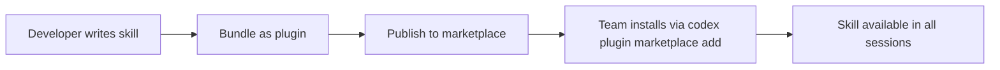
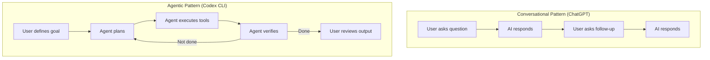

# The Shift to Agentic AI: What OpenAI's Own Usage Data Reveals — and What It Means for Your Codex CLI Configuration


---

On 25 June 2026, a team from OpenAI and Duke University published *The Shift to Agentic AI: Evidence from Codex*, the first large-scale empirical study of how people actually use autonomous coding agents [^1]. The paper analyses three populations — individual users, organisational accounts, and OpenAI employees — and the picture it paints is striking: users are not simply typing longer prompts. They are delegating multi-hour tasks, running concurrent agents, and building reusable skills at a pace that doubles every few months.

For Codex CLI practitioners, the paper is more than academic interest. Its data points directly to configuration choices that separate power users from everyone else. This article walks through the key findings and maps each one to concrete Codex CLI settings and workflows.

## Five-fold Growth and the Non-Developer Surge

Weekly active Codex users grew **more than fivefold** between January and June 2026 [^1]. That alone is remarkable, but the composition shift matters more: non-developer adoption is growing faster than developer adoption [^2]. Legal staff at OpenAI generated **13× more monthly output tokens** between November 2025 and June 2026; researchers produced **more than 50×** as many [^1].

This has a practical implication. If your team includes non-developers who interact with Codex, your `AGENTS.md` files need to accommodate audiences who think in domain terms, not code terms. Consider structuring your repository's `AGENTS.md` with role-specific sections:

```markdown
## For Legal Reviewers
- Always explain contract clause changes in plain English before editing
- Never modify files outside the /contracts directory
- Use the compliance-check skill before committing

## For Engineers
- Run tests before every commit
- Prefer small, focused changes
```

This pattern maps directly to the paper's finding that skills and instructions are being shared across organisational roles [^1].

## The 60.3 per cent Tool Invocation Rate

In the week preceding 11 June 2026, **60.3 per cent of Codex turns** invoked at least one external tool, compared to **21.9 per cent of ChatGPT turns** [^1]. Codex is fundamentally a tool-using system, not a conversational one.

For CLI users, this means your MCP server configuration is not optional infrastructure — it is the primary interface between Codex and your development environment. Since v0.143.0, MCP tool search is enabled by default [^3], but you still need to wire up the servers that matter:

```toml
# config.toml — essential MCP servers for a tool-heavy workflow
[mcp_servers.context7]
command = "npx"
args = ["-y", "@upstash/context7-mcp"]

[mcp_servers.github]
command = "npx"
args = ["-y", "@modelcontextprotocol/server-github"]
env = { GITHUB_PERSONAL_ACCESS_TOKEN = "..." }
```

The paper's 60.3 per cent figure also validates running Codex CLI with `approval_policy = "unless-allow-listed"` rather than blanket auto-approval. When six out of ten turns invoke tools, you want a policy that approves known-safe tools automatically whilst gating unfamiliar ones [^4].

## Concurrent Agents: The Power-User Signal

The paper's most revealing statistic is about concurrency. Among OpenAI employees, **28.6 per cent managed five or more concurrent agents weekly** [^1]. The 99th-percentile user accumulated roughly **71 hours of daily runtime** — only possible through heavy parallelism [^1]. The paper notes that power users are "not submitting more requests — they are running more parallel agents" [^2].

This maps directly to Codex CLI's multi-agent patterns. The simplest approach is multiple terminal sessions, but the structured approach uses `codex exec` in parallel:

```bash
# Run three agents concurrently against different parts of the codebase
codex exec "Refactor the auth module to use OAuth 2.1" \
  --profile backend &

codex exec "Add Playwright tests for the checkout flow" \
  --profile testing &

codex exec "Update API documentation for v3 endpoints" \
  --profile docs &

wait
```

Named profiles (`--profile`) are essential here. Each concurrent agent should have its own model selection, token budget, and sandbox scope [^4]:

```toml
# profiles/backend.toml
model = "gpt-5.6-sol"
model_reasoning_effort = "high"
approval_policy = "unless-allow-listed"

# profiles/testing.toml
model = "o4-mini"
model_reasoning_effort = "medium"
sandbox_mode = "workspace-write"

# profiles/docs.toml
model = "gpt-5.3-codex-spark"
model_reasoning_effort = "low"
```

The paper's data suggests this is not a niche pattern. If a quarter of organisational power users run five or more agents, profile-per-role configuration is production infrastructure, not experimentation.

## The Eight-Hour Task Explosion

Perhaps the paper's most consequential finding: the share of individual users submitting tasks estimated to require **more than eight hours** of experienced-human effort grew from **2.1 per cent to 25.6 per cent** — a near-tenfold increase [^1]. Simultaneously, **70.2 per cent** of individual users now submit tasks requiring at least one hour of human effort, up from **35.4 per cent** in December 2025 [^1].

This is the use case Goal Mode was built for. Shipped in v0.128.0 and reaching GA on 21 May 2026 [^5], `/goal` transforms Codex CLI from a single-turn tool into a persistent agentic loop:

```bash
codex goal "Migrate the payment service from Stripe v2 to v3, \
  update all tests, verify no regressions, and update CHANGELOG.md"
```

For long-horizon work, the supporting configuration matters as much as the command itself:

```toml
# Long-horizon task configuration
rollout_budget = 500000          # Token ceiling for the entire goal
model = "gpt-5.6-sol"           # Full-power model for complex reasoning
model_reasoning_effort = "high"
sandbox_mode = "workspace-write" # Network off by default

# Compaction settings to survive long sessions
model_auto_compact_token_limit = 80000
compact_prompt = "Summarise progress, open issues, and next steps"
```

The `rollout_budget` parameter is critical for eight-hour tasks. Without it, a runaway goal can consume your entire token allocation. The paper's data shows this is not a theoretical risk — users are actively submitting day-length tasks [^1].

## Skills: From 5.4 per cent to 26.6 per cent in Three Months

Skills usage among individual users grew from **5.4 per cent** on 1 March to **26.6 per cent** by 11 June 2026 [^1]. Among organisational users, **30.4 per cent** invoked at least one skill. Among OpenAI employees, the figure is **96.2 per cent** [^1].

The trajectory is clear: skills are becoming the standard mechanism for encoding reusable workflows. In Codex CLI, skills map to plugins — combinations of hooks, MCP servers, and `AGENTS.md` instructions bundled for reuse [^4]:



Since v0.143.0, remote plugins are enabled by default [^3]. This means skills published to the npm marketplace or a Git-hosted catalogue are immediately discoverable:

```bash
# Install a shared team skill
codex plugin marketplace add your-org/code-review-skill

# List installed skills
codex plugin list
```

The paper's 96.2 per cent adoption among OpenAI employees is the leading indicator. If your team is not building and sharing skills yet, the data suggests you are roughly where the broader ecosystem was in March 2026.

## The Delegation Model: Coordinator, Not Executor

The paper draws a sharp distinction between conversational AI and agentic AI. Users "delegate work" rather than seek consultation — a shift from asking questions to assigning tasks [^1]. The human role becomes "defining tasks, reviewing outputs, and redirecting agents" [^2].



This delegation model has configuration implications. The `auto_review` setting in Codex CLI controls whether the agent self-reviews its output before presenting it [^4]. For delegation-style workflows where you will not be watching every step, enabling auto-review adds a verification layer:

```toml
auto_review = true
```

Combined with `approval_policy = "unless-allow-listed"`, this creates a trust boundary appropriate for delegated work: the agent can operate autonomously within defined limits, self-reviews its output, and escalates when it encounters something outside its approved scope.

## Runtime Reality: 2.5 Hours Median Daily

The median OpenAI employee runs Codex for **2.5 cumulative hours daily** [^1]. The 99th percentile reached approximately 71 hours through concurrent agents — a figure that increased **88 per cent** since April 2026 [^1].

For practitioners, this means session stability is a production concern. Long-running sessions need:

1. **Context compaction** — `model_auto_compact_token_limit` prevents context window overflow during multi-hour sessions
2. **History persistence** — `history.persistence = true` enables session recovery if the CLI process is interrupted
3. **Named profiles** — switching models mid-session based on task phase (Spark for rapid iteration, Sol for complex reasoning) [^4]

```toml
# Session resilience configuration
[history]
persistence = true

model_auto_compact_token_limit = 80000
compact_prompt = "Preserve all file paths, test results, and pending tasks"
```

## Limitations and What the Data Does Not Show

The authors are candid about limitations [^1]. OpenAI's internal usage is not representative of typical organisations — their 96.2 per cent skill adoption reflects a company that builds the tool. Complexity estimates are model-predicted, not human-validated. The analysis is restricted to users who opted into data use for training, introducing potential selection bias.

The paper also cannot tell us about quality. A tenfold increase in eight-hour task submissions does not mean those tasks are completed successfully. The `rollout_budget` and `auto_review` settings exist precisely because autonomous agents can pursue goals inefficiently or incorrectly. ⚠️ The paper provides no data on task completion rates or output quality for delegated work.

## Practitioner Checklist

Based on the paper's findings, here is a configuration audit for teams adopting agentic workflows:

| Finding | CLI Configuration | Status |
|---|---|---|
| 60.3% tool invocation | MCP servers configured, tool search enabled | ☐ |
| 28.6% run 5+ concurrent agents | Named profiles per workflow type | ☐ |
| 25.6% submit 8+ hour tasks | Goal mode with `rollout_budget` set | ☐ |
| 26.6% use skills | Plugin marketplace configured, team skills shared | ☐ |
| 2.5 hours median daily runtime | Context compaction and history persistence enabled | ☐ |
| Non-developer adoption growing | Role-specific `AGENTS.md` sections | ☐ |

## Conclusion

*The Shift to Agentic AI* provides the first empirical confirmation of what many CLI practitioners have felt anecdotally: the tool is evolving from interactive assistant to autonomous worker, and the user's role is shifting from executor to coordinator. The data is unambiguous — five-fold user growth, ten-fold increase in complex task delegation, and near-universal skill adoption among power users.

The Codex CLI configuration surface already supports these patterns. Named profiles, goal mode, MCP tool search, plugin marketplaces, and context compaction are not future features — they are the infrastructure that the paper's power users are already relying on. The question for most teams is not whether to adopt these patterns, but how quickly to systematise them.

## Citations

[^1]: Johnston, D., Holtz, D., Richmond, A.M., Ong, C., Tambe, P., & Chatterji, A. (2026). *The Shift to Agentic AI: Evidence from Codex*. arXiv:2606.26959. [https://arxiv.org/abs/2606.26959](https://arxiv.org/abs/2606.26959)

[^2]: TechTimes. (2026). *OpenAI Codex Data Shows Non-Developers Now Driving Enterprise AI Agent Surge*. [https://www.techtimes.com/articles/319120/20260626/openai-codex-data-shows-non-developers-now-driving-enterprise-ai-agent-surge.htm](https://www.techtimes.com/articles/319120/20260626/openai-codex-data-shows-non-developers-now-driving-enterprise-ai-agent-surge.htm)

[^3]: OpenAI. (2026). *Codex CLI v0.143.0 Release Notes*. GitHub. [https://github.com/openai/codex/releases/tag/rust-v0.143.0](https://github.com/openai/codex/releases/tag/rust-v0.143.0)

[^4]: OpenAI. (2026). *Codex CLI Advanced Configuration*. OpenAI Developers. [https://developers.openai.com/codex/config-advanced](https://developers.openai.com/codex/config-advanced)

[^5]: OpenAI. (2026). *Codex Goal Mode General Availability*. [https://developers.openai.com/codex/changelog](https://developers.openai.com/codex/changelog)
