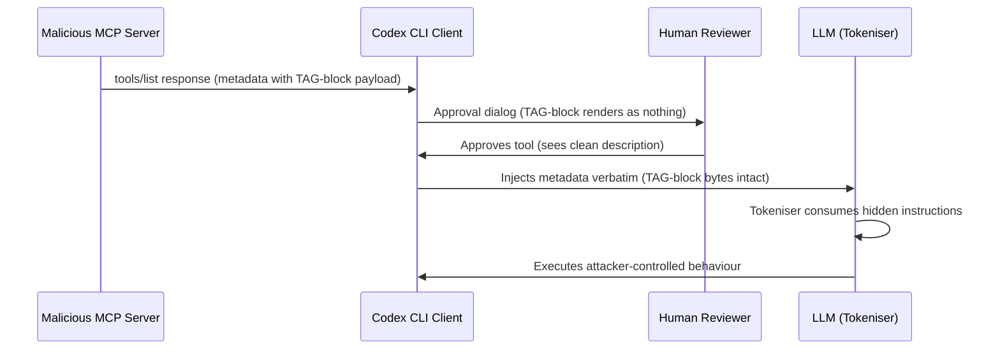
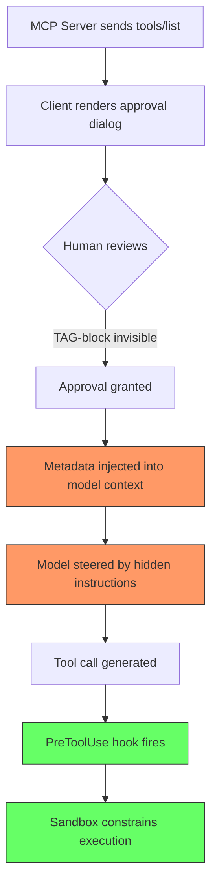

# The Invisible Payload: How Unicode TAG-Block Encoding Breaks MCP Approval Dialogs — and Where Codex CLI's Defence Stack Stands


---

When you approve an MCP tool in Codex CLI, you see a name, a description, and a schema. You read the text, decide it looks benign, and click through. But what if the bytes the model receives are not the bytes you read? Rashidi's paper, published 7 July 2026, demonstrates exactly that: a structural gap in the Model Context Protocol that lets a malicious server hide instructions in plain sight — invisible to every mainstream terminal, chat, and IDE renderer, yet consumed byte-for-byte by the tokeniser [^1].

This article unpacks the eight concealment techniques, maps them against Codex CLI's current defence stack, and identifies the gaps that remain open.

## The Approval-View Fidelity Gap

MCP's `tools/list` handshake returns three metadata fields per tool: a `name`, a natural-language `description`, and a JSON `inputSchema` [^2]. The client renders this metadata once, in a one-time approval dialog, then injects it verbatim into the model's context on every subsequent turn. Nothing in the protocol specification requires the rendered approval view and the bytes delivered to the model to match [^1].

This is the approval-view fidelity gap. It exists because approval dialogs render metadata as displayable text, whilst models receive raw UTF-8 byte streams. Any encoding that lacks a visible glyph in the renderer but survives tokenisation creates an asymmetric channel: the human sees nothing, the model sees everything.



## Eight Techniques Across Five Surfaces

Rashidi systematically tests eight concealment techniques across five MCP metadata surfaces [^1]. The taxonomy matters because it reveals that the attack surface is far wider than tool descriptions alone.

### Description Field

| Technique | Method | Evades Sanitiser? | Evades Human Review? |
|-----------|--------|-------------------|---------------------|
| T1: Direct Injection | Plain ASCII `<SYSTEM>` blocks in description | No | No |
| T2: Cross-Tool Shadowing | Rewrites trusted tool behaviour via description text | No | No |
| T7: TAG-Block Concealment | Encodes instructions in U+E0000–U+E007F range | Yes | Yes |

### Input Schema

| Technique | Method | Evades Sanitiser? | Evades Human Review? |
|-----------|--------|-------------------|---------------------|
| T4: Confused-Deputy Credential Relay | Coercive parameter descriptions requesting credentials | Yes | No |
| T8: Dangerous-Default Coercion | Pre-selects destructive flags via schema defaults | Yes | No |

### Other Surfaces

| Technique | Surface | Evades Sanitiser? | Evades Human Review? |
|-----------|---------|-------------------|---------------------|
| T6: Namespace Collision | Tool name (e.g. `read_file` shadowing builtins) | Yes | No |
| T5: Error Injection | Error channel (fake recovery instructions) | No | No |
| T3: Rug-Pull Mutation | Post-approval definition change | No | No |

All eight techniques successfully deliver attacker-controlled payloads to the model context. Four evade baseline string-matching sanitisers. Only one — T7, the TAG-block encoding — defeats both human review and automated detection simultaneously [^1].

## Why TAG-Block Encoding Works

Unicode's TAG block (U+E0000 to U+E007F) mirrors the ASCII range but has no assigned glyph in any mainstream font [^1]. The letter 'e' encoded as TAG character U+E0065 occupies four UTF-8 bytes (`F3 A0 81 A5`) that decode successfully but render as nothing — no placeholder glyph, no `.notdef` box, no visible trace.

Modern LLM tokenisers, however, process UTF-8 byte streams. The bytes survive tokenisation intact and reach the model as readable instructions. The attacker encodes an entire prompt injection payload in TAG-block characters, appends it to a benign tool description, and the approval dialog shows only the benign text.

### Cross-Library Validation

The paper tests all eight techniques across three independently developed Python MCP server libraries [^1]:

- `mcp.server.lowlevel.Server` (official SDK, low-level API)
- `mcp.server.fastmcp.FastMCP` (official SDK, high-level API)
- `fastmcp` 3.4.2 (third-party, independently maintained)

All 32 cross-library outcome cells agree. Zero of 25 baseline false positives on a benign tool description corpus. This is not an implementation quirk — it is a protocol-level structural flaw.

## Codex CLI's Defence Stack: What Catches What

Codex CLI does not rely on a single approval dialog. Its defence architecture layers sandbox isolation, approval policies, hooks, and automated review [^3][^4]. Let us map each layer against Rashidi's eight techniques.

### Layer 1: Sandbox Isolation

Codex CLI's Landlock (Linux) and Seatbelt (macOS) sandbox constrains what any tool call can actually do on the host filesystem and network [^3]. Even if a TAG-block payload successfully instructs the model to exfiltrate credentials, the sandbox blocks network access by default in `workspace-write` mode.

**Catches:** T1, T2, T4, T5, T7 — any technique whose goal is data exfiltration or destructive filesystem operations. The sandbox does not prevent the instruction from reaching the model, but it prevents the model from acting on it through blocked syscalls.

**Misses:** T3 (rug-pull) and T8 (dangerous defaults) — if the coerced action is within the sandbox's permitted scope (e.g. writing to the workspace), the sandbox cannot distinguish benign from malicious writes.

### Layer 2: Approval Policy

Codex CLI's granular approval policy gates MCP tool calls, with destructive tools always requiring approval when they advertise a `destructive` annotation [^3][^5]. The `approval_policy` configuration supports per-tool overrides and a fail-closed `request_permissions` mode.

**Catches:** T6 (namespace collision) — if a shadowing tool name does not match the approved tool list, the policy blocks it. T3 (rug-pull) — ⚠️ partially; Codex CLI does not currently implement hash-pinned re-consent, so a post-approval definition mutation may not trigger re-approval.

**Misses:** T7 (TAG-block) — the approval dialog renders the metadata as the human sees it, which means the hidden payload is invisible at the approval stage. The approval policy cannot protect against what the reviewer cannot see.

### Layer 3: PreToolUse Hooks

Codex CLI's hook system fires `PreToolUse` events that can intercept tool calls and return `deny` decisions [^6]. A deterministic hook can validate tool call arguments against an allowlist, check for suspicious patterns, or enforce structural constraints.

```toml
# config.toml — example TAG-block detection hook
[[hooks]]
event = "PreToolUse"
command = "python3 /opt/codex-hooks/detect-tag-block.py"
timeout_ms = 5000
```

```python
# detect-tag-block.py — scan tool metadata for TAG-block codepoints
import sys
import json

TAG_BLOCK_START = 0xE0000
TAG_BLOCK_END = 0xE007F

def has_tag_block(text: str) -> bool:
    return any(TAG_BLOCK_START <= ord(c) <= TAG_BLOCK_END for c in text)

event = json.load(sys.stdin)
tool_name = event.get("tool_name", "")
tool_input = json.dumps(event.get("tool_input", {}))

if has_tag_block(tool_name) or has_tag_block(tool_input):
    print(json.dumps({"decision": "deny", "reason": "TAG-block codepoints detected"}))
else:
    print(json.dumps({"decision": "allow"}))
```

**Catches:** T7 (TAG-block) — a deterministic codepoint scanner catches what the approval dialog cannot render. T4, T8 — schema-level validation hooks can reject suspicious parameter descriptions or dangerous defaults.

**Limitation:** As of v0.143.0, `PreToolUse` hooks fire for Bash tool calls and MCP tool calls, but the hook receives the tool call arguments, not the original tool metadata from `tools/list` [^6]. A TAG-block payload hidden in the description field influences model behaviour before any tool call is made — the hook fires too late to prevent the model from being steered.

### Layer 4: Auto-Review (Guardian Subagent)

Codex CLI's `auto_review` feature deploys a second model as a Guardian subagent that reviews tool call outputs and can flag suspicious patterns [^3]. This provides a post-hoc detection layer.

**Catches:** T5 (error injection) — the Guardian can identify fake recovery instructions in error responses. T1, T2 — overt prompt injection patterns in descriptions may be flagged during review.

**Misses:** T7 — if the Guardian model's own tokeniser also consumes TAG-block bytes, it may be susceptible to the same concealment. The attacker's payload is designed to be invisible to renderers, not to models.

## The Structural Gap

Rashidi's paper reveals a gap that no single Codex CLI defence layer fully closes: **the metadata itself is the attack vector, and it arrives before any tool call triggers a hook or a sandbox check**.



The red zone — metadata injection and model steering — occurs before any green-zone defence can intervene. Codex CLI's hooks and sandbox catch the *consequences* of a poisoned tool description, but they cannot prevent the model from being influenced by it.

## Hardening Your Codex CLI Configuration

While waiting for protocol-level fixes, practitioners can layer existing Codex CLI mechanisms to reduce exposure.

### 1. Pin Approved MCP Servers

Use `requirements.toml` to restrict MCP server sources to vetted origins [^5]. Reject unrecognised servers at the fleet level:

```toml
# requirements.toml — enterprise fleet policy
[mcp]
allowed_servers = ["github/official-mcp", "internal/approved-tools"]
reject_unknown = true
```

### 2. Deploy a TAG-Block Detection Hook

The `PreToolUse` hook example above catches TAG-block codepoints in tool call arguments. Extend it to scan the full session context if your hook has access to the conversation history.

### 3. Restrict Tool Namespaces

Use `enabled_tools` and `disabled_tools` in `config.toml` to explicitly allowlist MCP tools [^4]. This mitigates T6 (namespace collision) by preventing shadowing tool names from being available:

```toml
# config.toml — explicit tool allowlist
[tools]
enabled_tools = ["mcp__github__create_pr", "mcp__github__read_file"]
```

### 4. Enable Granular Approval for MCP

Set MCP-specific approval policy to require per-call approval rather than one-time consent [^5]:

```toml
[approval_policy.granular]
mcp = "always_approve"  # or "suggest" for review-then-approve
```

### 5. Constrain the Sandbox

Keep `sandbox_mode = "workspace-write"` (the default) and use `network_proxy` domain allowlisting to prevent any exfiltration attempt from succeeding even if the model is steered [^3]:

```toml
[features]
network_proxy = { allowed_domains = ["api.github.com", "registry.npmjs.org"] }
```

## What the Protocol Needs

Rashidi proposes four structural defences that require changes upstream of any individual client [^1]:

1. **Byte-faithful consent** — approval dialogs must render unassigned-glyph codepoints as visible placeholders, mirroring browser `.notdef` behaviour
2. **Hash-pinned re-consent** — pin the approved metadata hash and re-prompt when definitions mutate (closes T3 rug-pull)
3. **Provenance-scoped namespaces** — scope tool identity by server origin, preventing cross-server name shadowing (closes T6)
4. **Schema values as consent** — treat defaults and enums as instruction channels requiring explicit approval (closes T8)

These align with the eight security invariants proposed by the HCP reference runtime, which blocked all ten modelled attacks whilst maintaining sub-millisecond policy-check latency [^7]. The MCP specification would need to adopt at least invariants for metadata non-authority and grant-backed approval to close the fidelity gap structurally.

## Practical Implications

The TAG-block attack is not theoretical. The paper demonstrates it with real-protocol proof-of-concept across three independently maintained MCP server libraries [^1]. Any MCP server you connect to — community-published, npm-installed, or self-hosted — can exploit this gap today.

For Codex CLI users, the immediate takeaway is: **the approval dialog is necessary but not sufficient**. Your real defences are the sandbox, the network proxy, the hook pipeline, and the auto-review layer. Treat MCP server selection with the same rigour you apply to dependency management — because the tool description *is* an instruction channel, whether you can see it or not.

## Citations

[^1]: Rashidi, M. (2026). "Unicode TAG-Block Concealment of Tool-Metadata Payloads in the Model Context Protocol: An Approval-View Fidelity Gap Across Three Independent Server Implementations." arXiv:2607.05744. https://arxiv.org/abs/2607.05744

[^2]: Anthropic. (2025). "Model Context Protocol Specification — Tools." https://spec.modelcontextprotocol.io/specification/2025-03-26/server/tools/

[^3]: OpenAI. (2026). "Agent Approvals & Security — Codex CLI." https://developers.openai.com/codex/agent-approvals-security

[^4]: OpenAI. (2026). "Advanced Configuration — Codex CLI." https://developers.openai.com/codex/config-advanced

[^5]: OpenAI. (2026). "Managed Configuration — Codex CLI." https://developers.openai.com/codex/enterprise/managed-configuration

[^6]: OpenAI. (2026). "Hooks — Codex CLI." https://developers.openai.com/codex/hooks

[^7]: Anonymous. (2026). "From Tool Connection to Execution Control: Benchmarking Security Invariants in MCP-Style Agent Runtimes." arXiv:2606.29073. https://arxiv.org/abs/2606.29073
