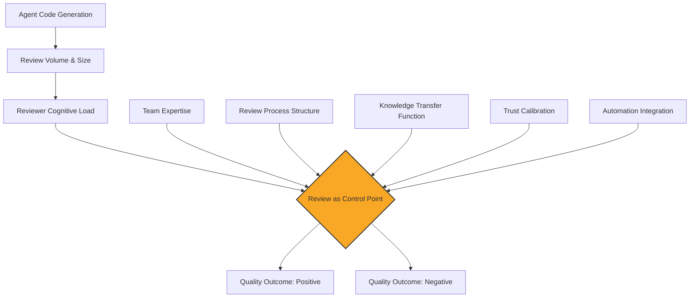
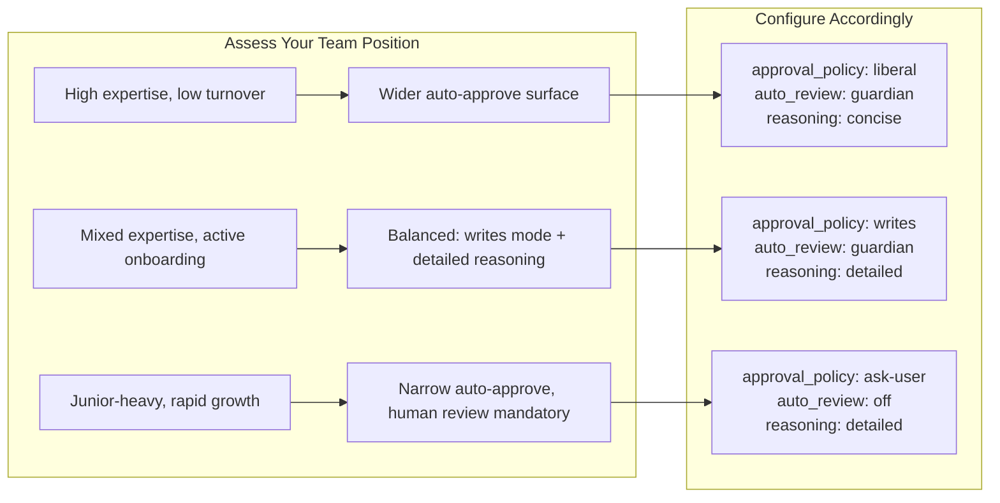

# 3,100 Opinions on Code Review in an AI World: What the Causal Theory Means for Your Codex CLI Review Stack


---

Coding agents now author entire pull requests. Practitioners sharply disagree about what this does to code review: whether it becomes the bottleneck, whether human review is still necessary, and whether it quietly erodes the understanding it once built. A new paper by Agarwal, Miller, Kastner, and Vasilescu distils 3,100 coded practitioner opinions into a formal causal model — 26 constructs, 67 relationships, three contested — and arrives at an organising claim that should reshape how every Codex CLI team configures its review stack: *review is the control point through which a coding agent's effect on software is decided, and AI does not fix the sign of that effect — the team sets it*[^1].

This article unpacks the theory, maps its constructs to Codex CLI configuration, and provides a concrete implementation checklist.

## The Observational Puzzle

The paper begins with a motivating GitHub analysis: agent-authored pull requests are reviewed less often, merged several times faster, and discussed less than human-authored ones[^1]. But the direction of these trends flips under different but equally defensible analysis choices — a Simpson's-paradox-like sensitivity that means the traces establish *what* is changing without explaining *why*[^1].

This instability in observational data is corroborated by industry telemetry. LinearB's 2026 Software Engineering Benchmarks Report, spanning 8.1 million PRs across 4,800 organisations, found that agentic AI PRs sit idle 5.3x longer before first review pickup, yet are reviewed 2x faster once somebody starts — and carry an acceptance rate of just 32.7% versus 84.5% for human PRs[^2]. Meanwhile, He et al.'s longitudinal study of an enterprise "2x mandate" tracked 196,212 PRs and found that while per-capita throughput eventually doubled (2.09x by April 2026), review time and merge-to-deploy latency absorbed most of the pressure[^3].

The surface metrics contradict each other. That is exactly why a causal theory matters.

## The Causal Model: 26 Constructs, 67 Relationships

Rather than mining more repository traces, the authors synthesised practitioner discourse at scale: 38,709 grey-literature documents (engineering blogs and Reddit threads), filtered to those substantively about code review, with a stratified random sample of 3,100 coded through an LLM-assisted pipeline[^1].

The resulting causal model comprises 26 constructs and 67 relationships — 64 directed, 3 contested[^1]. Its structure can be grouped into five zones:



The organising claim is captured by the diamond node: review functions as the *control point* where technical, social, and organisational factors converge[^1]. AI does not determine the outcome — the team does, through the expertise its humans bring and how it structures the review process.

### The Three Contested Relationships

Three causal links in the model carry practitioner disagreement rather than consensus[^1]:

1. **AI tool adoption to review thoroughness** — enthusiasts argue automation frees reviewers to focus on architecture; sceptics counter that it degrades attention to detail through overtrust.
2. **Volume effects on reviewer attention** — one camp holds that batching AI PRs improves efficiency; the other observes that volume fatigue erodes meaningful feedback.
3. **Trust calibration** — teams disagree on how to weight automated suggestions versus human judgement, with no consensus on the right ratio.

These contested edges are precisely where Codex CLI configuration can tip the balance.

## The Knowledge-Erosion Mechanism

The theory formalises a concern that practitioners voice repeatedly: if agents write and agents review, the human reviewer's comprehension of the codebase decays[^1]. Code review has historically served a dual function — quality gate *and* knowledge transfer mechanism. When agent-authored PRs merge faster with less discussion, the knowledge-transfer channel narrows.

Anthropic's controlled trial found a 17% drop in developer comprehension when coding-agent output was accepted without active engagement[^4]. The "3,100 Opinions" model explains why: review depth, reviewer expertise matching, and mentorship opportunity are all constructs that feed into the knowledge-transfer pathway, and all three degrade when review is rushed or delegated wholesale to automation.

## Mapping the Theory to Codex CLI Configuration

The paper's constructs map directly to Codex CLI's review architecture. Here is the translation layer.

### 1. Review as Control Point: AGENTS.md Review Guidelines

The causal model places review at the centre. In Codex CLI, the AGENTS.md file is where review policy is encoded[^5]:

```toml
# AGENTS.md — Review Guidelines section
## Review Guidelines

- Every PR touching auth middleware requires senior reviewer sign-off
- Flag any use of `eval()` or `exec()` as P0
- Reject direct SQL string concatenation; require parameterised queries
- Treat typos in public-facing documentation as P1
- Do not log PII or user-identifiable data at any log level
```

These declarative rules are consumed by Codex's auto-review Guardian subagent when it evaluates changes[^5]. They make the *review process structure* construct from the causal model explicit and machine-readable.

### 2. Contested Relationship 1 — Thoroughness: Guardian Four-Tier Risk Classification

The Guardian subagent classifies each action into four risk tiers: low, medium, high, and critical[^6]. Critical-risk actions are always denied. High-risk actions escalate to the human reviewer. This directly addresses the contested thoroughness relationship by ensuring that automation handles the routine tier while humans retain authority over the consequential tier:

```toml
# config.toml — Guardian configuration
[auto_review]
approvals_reviewer = "guardian_subagent"

# requirements.toml — Fleet-wide override
[auto_review]
guardian_policy_config = "strict"
```

### 3. Contested Relationship 2 — Volume: Writes Approval Mode and Diff-Scope Constraints

The v0.144.0 `writes` approval mode addresses volume fatigue by auto-approving read-only MCP operations while pausing on writes[^7]. This reduces approval noise without reducing oversight on state-changing operations:

```toml
# config.toml — Approval policy
[approval_policy]
mcp_tools = "writes"   # auto-approve reads, prompt on writes
```

Combined with diff-scope constraints in AGENTS.md, this keeps the reviewer focused on meaningful changes rather than drowning in agent-generated noise.

### 4. Contested Relationship 3 — Trust Calibration: Granular Approval Policy

Codex CLI's granular approval policy lets teams express their trust calibration as configuration rather than leaving it implicit[^6]:

```toml
# config.toml — Trust calibration by action type
[approval_policy]
shell_commands = "ask-user"
file_writes = "auto-approve"
mcp_tools = "writes"
network_requests = "ask-user"
```

Teams that lean towards the sceptic position set more actions to `ask-user`. Teams that lean towards the enthusiast position widen the auto-approve surface. The key insight from the causal model is that this is a *team-level design decision*, not a binary choice.

### 5. Knowledge-Erosion Defence: Review as Learning

To preserve the knowledge-transfer function of review, Codex CLI offers several mechanisms:

```toml
# config.toml — Reasoning visibility
[model]
model_reasoning_summary = "detailed"
```

Setting `model_reasoning_summary` to `detailed` forces Codex to surface its reasoning chain, giving human reviewers insight into *why* changes were made — not just *what* changed[^8]. This directly supports the review-as-knowledge-transfer pathway in the causal model.

Named profiles can enforce different review depth for different contexts:

```toml
# learning.config.toml — Profile for onboarding/learning sessions
[model]
model_reasoning_summary = "detailed"
model_reasoning_effort = "high"

[approval_policy]
shell_commands = "ask-user"
file_writes = "ask-user"
```

```toml
# production.config.toml — Profile for trusted automated workflows
[model]
model_reasoning_summary = "concise"

[approval_policy]
shell_commands = "auto-approve"
file_writes = "auto-approve"
```

## The Review Configuration Decision Framework

The causal model's five zones translate into a decision framework for Codex CLI teams:



This framework operationalises the paper's central finding: the team sets the sign of AI's effect on code quality, and the review process is the mechanism through which it does so.

## Implementation Checklist

For teams adopting this framework today with Codex CLI v0.144.x:

1. **Audit your AGENTS.md review guidelines** — Encode your team's P0/P1 review rules. The causal model shows that review process structure is a direct moderator of quality outcomes[^1].

2. **Choose your trust calibration** — Set `approval_policy` values per action type in `config.toml`. Do not leave it at defaults; the default is itself a trust position.

3. **Enable writes approval mode for MCP tools** — The v0.144.0 `writes` mode reduces volume fatigue without reducing oversight[^7].

4. **Set reasoning visibility by context** — Use named profiles to enforce `detailed` reasoning during learning/review sessions and `concise` during trusted automation[^8].

5. **Deploy Guardian with fleet policy** — In `requirements.toml`, set `guardian_policy_config` to enforce consistent review standards across the organisation[^6].

6. **Monitor the knowledge-transfer channel** — Track whether PR discussions are declining in substance. The causal model identifies this as the leading indicator of knowledge erosion[^1].

7. **Re-evaluate quarterly** — The three contested relationships mean your optimal configuration will shift as team composition and expertise change.

## Limitations and Open Questions

The causal model is built from practitioner discourse, not controlled experiments[^1]. The 67 relationships are theoretical claims awaiting empirical validation. The three contested relationships may resolve differently for different team compositions.

The LinearB data showing 32.7% AI PR acceptance rates[^2] suggests that most teams have not yet found their equilibrium. The Codex CLI configuration surface is rich enough to encode the theory's constructs — but the right settings remain team-specific.

The paper offers no prescription; it offers a map. Codex CLI provides the dials. The team turns them.

## Citations

[^1]: Agarwal, S., Miller, C., Kastner, C., & Vasilescu, B. (2026). "3100 Opinions on Code Review in an AI World: Building Causal Theory from Practitioner Discourse." arXiv:2607.07980. [https://arxiv.org/abs/2607.07980](https://arxiv.org/abs/2607.07980)

[^2]: LinearB. (2026). "2026 Software Engineering Benchmarks Report." [https://linearb.io/resources/engineering-benchmarks](https://linearb.io/resources/engineering-benchmarks)

[^3]: He, H., Agarwal, S., Denisov-Blanch, Y., Azaletskiy, P., Koyejo, S., & Vasilescu, B. (2026). "AI Writes Faster Than Humans Can Review: A Longitudinal Study of an Enterprise 2x Mandate." arXiv:2607.01904. [https://arxiv.org/abs/2607.01904](https://arxiv.org/abs/2607.01904)

[^4]: Anthropic. (2025). "Measuring the impact of AI on developer learning." Internal research report referenced in Mehra et al. arXiv:2607.06101.

[^5]: OpenAI. (2026). "Codex CLI Configuration Reference — AGENTS.md." [https://developers.openai.com/codex/config-reference](https://developers.openai.com/codex/config-reference)

[^6]: OpenAI. (2026). "Codex CLI Auto-Review." [https://developers.openai.com/codex/concepts/sandboxing/auto-review](https://developers.openai.com/codex/concepts/sandboxing/auto-review)

[^7]: OpenAI. (2026). "Codex CLI v0.144.0 Release Notes." [https://github.com/openai/codex/releases](https://github.com/openai/codex/releases)

[^8]: OpenAI. (2026). "Codex CLI Advanced Configuration." [https://developers.openai.com/codex/config-advanced](https://developers.openai.com/codex/config-advanced)
