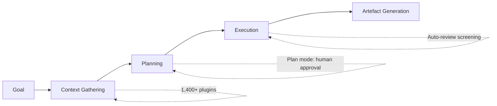
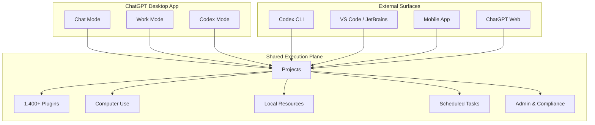

# ChatGPT Work and the Codex Unification: What the July 9 Merger Means for CLI Developers


---

On 9 July 2026, OpenAI shipped the most significant product consolidation in its history: ChatGPT, Codex, and the new ChatGPT Work agent merged into a single desktop application[^1]. The standalone Codex app is gone. In its place sits a three-mode environment — Chat, Work, and Codex — running on GPT-5.6 and backed by a unified task runtime[^2]. The same day brought Codex CLI v0.144.0 with `writes` approval mode, MCP interactive authentication, and app-server host authentication[^3].

For CLI-first developers, the desktop merger is mostly irrelevant to daily terminal workflows. But ChatGPT Work introduces a general-purpose agentic surface that shares the same execution plane Codex CLI uses — and that overlap has practical implications for how you structure automation, delegate non-coding work, and manage costs across surfaces.

## What Actually Shipped

### The Desktop Unification

The Codex desktop app becomes the ChatGPT desktop app on macOS and Windows[^4]. Existing projects, settings, and repository configurations migrate automatically. Three tabs replace the single-purpose Codex view:

- **Chat** — conversational GPT-5.6, replacing the old ChatGPT desktop app (now "ChatGPT Classic")
- **Work** — autonomous agent that takes a goal, breaks it into steps, and produces finished artefacts across connected applications
- **Codex** — the repository-aware coding agent, now with inline diff editing and side-panel PR review

Developers can set Codex as the default tab and keep the Codex icon as the app icon[^5]. The old ChatGPT desktop app is sunsetted.

### ChatGPT Work

Work is not a chatbot with extra tools. It is an autonomous agent powered by GPT-5.6 that "stays with complex projects for hours by breaking them into smaller steps and completing them independently"[^1]. It produces structured outputs — spreadsheets, slide decks, documents, interactive web applications, dashboards — not conversational replies.

Four operational patterns define the Work agent's execution model:



Plan mode is particularly relevant: Work generates a step-by-step approach and waits for approval before executing, mirroring `suggest` mode in Codex CLI[^6]. Auto-review screens tool interactions with a secondary model before execution — OpenAI claims it "blocked 100% of attempts to extract protected data" during adversarial testing[^1].

### Scheduled Tasks

Work supports four trigger types: one-off, scheduled (recurring), event-driven, and continuous monitoring[^7]. This is the same scheduled-task infrastructure that shipped for Codex in April 2026, now extended to non-coding workflows.

For CLI developers, the critical distinction is surface: scheduled tasks are created and managed through the ChatGPT web or desktop application, not through the CLI[^8]. The CLI equivalent remains `codex exec` invoked from system cron, CI pipelines, or shell scripts.

## The Unified Runtime Architecture

The architectural insight behind the merger is that OpenAI turned the Codex task runtime into a general work runtime[^2]. Chat, Work, and Codex are neighbouring modes over a shared execution plane that encompasses:

- **Projects** — shared across all three modes
- **Plugins** — 1,400+ connectors available to both Work and Codex
- **Browser capabilities** — Computer Use, now faster with GPT-5.6
- **Local resources** — filesystem, Git repositories, terminal
- **Scheduled tasks** — time-based and event-triggered automation
- **Governance** — centralised admin controls, Compliance API, auto-review



The CLI connects to this same execution plane through your ChatGPT account[^9]. A task started in Codex desktop can be continued from mobile. A Work automation can trigger a Codex coding task. Session state flows across surfaces.

## What Changes for CLI Developers

### Nothing Breaks

The merger is a desktop app event. Codex CLI v0.144.0 ships independently and continues to work exactly as before[^3]. Your `config.toml`, AGENTS.md hierarchies, hooks, MCP servers, named profiles, and `codex exec` pipelines are unaffected.

### New Features in v0.144.0

The CLI release that landed alongside the merger includes features worth adopting:

**`writes` approval mode** — a middle ground between `suggest` (human approves every action) and `auto-approve` (all actions run without prompting). In `writes` mode, read-only actions execute automatically while write operations prompt for approval[^3]. This is useful for exploratory sessions where you want the agent to read freely but gate filesystem mutations:

```toml
# config.toml
[profile.explore]
approval_mode = "writes"
model = "gpt-5.6-terra"
```

**MCP interactive authentication** — MCP tools can now trigger browser-based OAuth flows without the experimental flag[^3]. ChatGPT-hosted MCP servers can use session authentication directly. This removes a significant friction point for enterprise MCP deployments.

**App-server host authentication** — hosts can provide Codex authentication at runtime[^3], enabling tighter integration with corporate identity providers.

### Cost Management Across Surfaces

With Work and Codex sharing the same metered usage allocation, cost visibility becomes critical. Work tasks can run for hours, consuming tokens that count against the same plan as your CLI usage[^1].

Enterprise and Edu administrators get spend controls via the Admin Console — workspace defaults, group limits, and credit-request workflows[^1]. For individual developers, the practical approach is to treat the first week of Work usage as a calibration period, monitoring actual consumption before scheduling recurring tasks.

The CLI's `rollout_token_budget` configuration remains the most granular cost control available:

```toml
# config.toml
[profile.budget-conscious]
model = "gpt-5.6-luna"
rollout_token_budget = 50000
```

### Automation: Work Scheduled Tasks vs `codex exec`

The decision matrix is straightforward:

| Criterion | ChatGPT Work | `codex exec` |
|-----------|-------------|--------------|
| **Setup** | GUI, natural language | Shell script, CI YAML |
| **Trigger types** | Time, event, continuous | System cron, CI triggers |
| **Output** | Documents, spreadsheets, sites | stdout, structured JSON (`--output-schema`) |
| **Approval** | Plan mode in app | `suggest` / `writes` / `auto-approve` |
| **Audit** | Compliance API | Session JSONL, shell logs |
| **Best for** | Business workflows, reporting | CI/CD, repo automation, pipelines |

For coding tasks that need to run unattended, `codex exec` remains the correct primitive:

```bash
# CI pipeline: run a task with structured output
codex exec --profile ci --output-schema '{"type":"object","properties":{"status":{"type":"string"},"files_changed":{"type":"integer"}}}' \
  "Run the linter, fix any issues, and report status"
```

For non-coding recurring work — weekly reports, competitor monitoring, documentation refreshes — Work's scheduled tasks are the appropriate surface.

### Multi-Surface Session Continuity

The unified runtime enables cross-surface workflows that were previously impossible:

1. Start a coding task in Codex CLI on your development machine
2. Review the PR from the Codex desktop side panel
3. Monitor the CI pipeline from ChatGPT mobile
4. Schedule a Work task to summarise the week's merged PRs every Friday

Each surface reads from the same project state. The CLI's session JSONL traces remain available for local audit, while the Compliance API provides organisation-wide visibility[^10].

## Configuration Checklist

For CLI developers adopting the unified environment:

1. **Update the desktop app** — existing Codex app updates automatically become the new ChatGPT desktop app[^5]
2. **Set Codex as default view** — keep the developer-first interface as your landing tab
3. **Test `writes` approval mode** — add a named profile for exploratory sessions
4. **Review MCP authentication** — remove experimental flags if you were using interactive auth
5. **Audit plugin overlap** — plugins installed in the desktop app are visible to Work; ensure nothing sensitive is exposed to the general-purpose agent
6. **Set `rollout_token_budget`** — protect CLI pipelines from budget exhaustion by Work tasks consuming shared allocation
7. **Enterprise: configure Admin Console** — set workspace defaults and group limits before Work rolls out to your organisation

## What This Means Strategically

The merger confirms OpenAI's direction: the coding agent runtime is becoming a general agent runtime. Codex CLI is not being deprecated — if anything, it becomes more important as the programmatic interface to a runtime that now handles both coding and business workflows.

The CLI's advantages — reproducibility via `codex exec`, auditability via session JSONL, composability via hooks and MCP servers, isolation via the sandbox — are precisely the properties that enterprise teams need as they extend agentic automation beyond code. The desktop unification creates the friendly surface; the CLI remains the reliable one.

---

## Citations

[^1]: OpenAI, "ChatGPT Work: OpenAI's Agent That Ships Finished Work," Digital Applied, 9 July 2026. [https://www.digitalapplied.com/blog/chatgpt-work-openai-agent-launch-2026](https://www.digitalapplied.com/blog/chatgpt-work-openai-agent-launch-2026)

[^2]: OpenAI, "Codex + ChatGPT + GPT-5.6: OpenAI's July 9 Release Deep Dive," kie.ai, 9 July 2026. [https://kie.ai/blog/codex-chatgpt-work-gpt-5-6-analysis](https://kie.ai/blog/codex-chatgpt-work-gpt-5-6-analysis)

[^3]: OpenAI, "Codex CLI v0.144.0 Changelog," OpenAI Developers, 9 July 2026. [https://learn.chatgpt.com/docs/changelog](https://learn.chatgpt.com/docs/changelog)

[^4]: Coursiv, "Codex Merged With ChatGPT App: What Changed & How to Access," 9 July 2026. [https://coursiv.io/blog/codex-merged-with-chatgpt-app](https://coursiv.io/blog/codex-merged-with-chatgpt-app)

[^5]: OpenAI, "Using Codex with your ChatGPT plan," OpenAI Help Centre. [https://help.openai.com/en/articles/11369540-using-codex-with-your-chatgpt-plan](https://help.openai.com/en/articles/11369540-using-codex-with-your-chatgpt-plan)

[^6]: OpenAI, "Codex CLI Developer Commands," OpenAI Developers. [https://learn.chatgpt.com/docs/developer-commands](https://learn.chatgpt.com/docs/developer-commands)

[^7]: OpenAI, "Scheduled Tasks," OpenAI Developers. [https://developers.openai.com/codex/app/automations](https://developers.openai.com/codex/app/automations)

[^8]: OpenAI, "Codex CLI Automations and Scheduled Tasks," Codex Knowledge Base, 27 March 2026. [https://codex.danielvaughan.com/2026/03/27/codex-cli-automations-scheduled-tasks/](https://codex.danielvaughan.com/2026/03/27/codex-cli-automations-scheduled-tasks/)

[^9]: OpenAI, "Codex in ChatGPT," OpenAI. [https://openai.com/codex/](https://openai.com/codex/)

[^10]: NxCode, "ChatGPT Work and Codex Merge: A Production Guide to GPT-5.6 Agent Workflows," 2026. [https://www.nxcode.io/resources/news/chatgpt-work-codex-gpt-5-6-agent-runtime-guide-2026](https://www.nxcode.io/resources/news/chatgpt-work-codex-gpt-5-6-agent-runtime-guide-2026)
