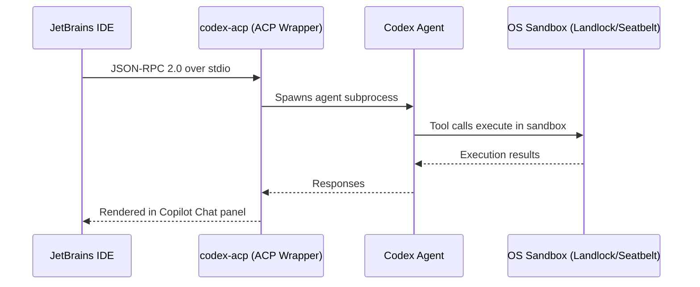
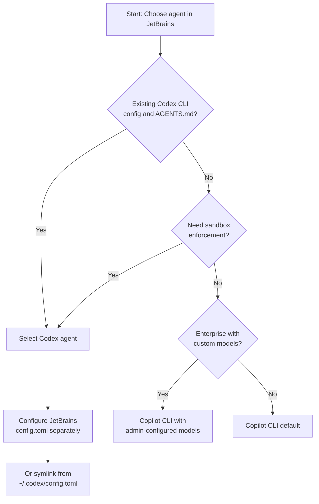

# Codex as Agent Provider in JetBrains IDEs: The ACP Wrapper Architecture, Permission Modes, and What CLI Developers Need to Know


---

On 7 July 2026, GitHub announced Codex as a selectable agent provider in JetBrains IDEs — IntelliJ IDEA, PyCharm, and WebStorm — available in public preview through the Copilot Chat panel [^1]. This is not the same integration covered in earlier articles about the Codex IDE extension or the JetBrains MCP server. The architecture is inverted: instead of Codex CLI calling into JetBrains tools, the IDE now spawns and manages a Codex agent as an embedded subprocess, giving developers a second agent option alongside GitHub's own Copilot CLI harness.

This article covers the technical architecture, the configuration divergence from your terminal workflow, the permission model, and the practical implications for teams already running Codex CLI.

## The ACP Wrapper Architecture

When you select Codex from the Copilot Chat agent picker, JetBrains does not shell out to your terminal's `codex` binary. Instead, the IDE downloads two executables into its system directory: the Codex agent itself (from `github.com/openai/codex/releases/`) and `codex-acp`, a wrapper binary that bridges the Agent Client Protocol to Codex's internal interfaces [^2].

The communication chain looks like this:



ACP uses JSON-RPC 2.0 over stdio for local agents — the same protocol that Zed, Neovim, and now Microsoft Terminal have adopted [^3]. The Codex agent running inside this wrapper is identical to the one the CLI uses. All sandbox enforcement (Landlock on Linux, Seatbelt on macOS), model routing, and approval policies work the same way. The difference is in *who controls the lifecycle* and *where configuration lives*.

## Configuration Divergence: CLI vs JetBrains

Here is the critical detail that catches most developers: JetBrains IDEs store Codex configuration in a separate path from the CLI [^2].

| Surface | Config path | Auth path | Session logs |
|---------|-------------|-----------|-------------|
| CLI / VS Code | `~/.codex/config.toml` | `~/.codex/auth.json` | `~/.codex/sessions/` |
| JetBrains | `<IDE system dir>/aia/codex/config.toml` | `<IDE system dir>/aia/codex/auth.json` | `<IDE system dir>/aia/codex/sessions/` |

This means your CLI login, model preferences, and approval policies do not carry over. You must configure each surface independently — or symlink the configuration files if you want consistency.

For teams enforcing policy via `requirements.toml` in a repository, the good news is that project-level configuration (`.codex/` in the repo root) is still discovered by the embedded agent [^4]. Fleet-wide constraints travel with the repository regardless of which surface launches the agent.

## Permission Modes

The JetBrains integration exposes three permission levels that map to the CLI's sandbox modes [^5]:

| JetBrains mode | CLI equivalent | What the agent can do |
|---------------|----------------|----------------------|
| **Read-only** | `sandbox_mode = "read-only"` | Browse and explain code. Every file write, command, and network call requires explicit approval. |
| **Agent** | `sandbox_mode = "workspace-write"` | Read and write files within the project workspace. Changes outside the workspace require approval. |
| **Agent (full access)** | `sandbox_mode = "danger-full-access"` | System-level edits, arbitrary command execution, and network access. Sensitive actions may still prompt. |

The Autopilot mode, available as a preview, auto-approves all tool calls and auto-responds to clarifying questions — equivalent to running the CLI with `approval_policy = "never"` [^1]. This is worth understanding: Autopilot disables the human-in-the-loop entirely. For teams with `requirements.toml` policies that forbid `approval_policy = "never"`, Autopilot will be blocked at the fleet level.

The approval workflow in read-only and agent modes presents a dialogue with four options: **Allow Once**, **Allow for Session**, **Allow Commands Starting With** (batch approval by command prefix), and **Reject** [^5]. This is more granular than the CLI's current approval prompt and suggests a direction for the CLI's own approval UX.

## Hooks and Agent Customisations

The July 7 announcement introduced hooks management directly within the JetBrains Copilot Chat panel under "Agent Customisations" [^1]. Hooks are defined in `.github/hooks/` as JSON files and support four event types:

- `userPromptSubmitted` — fires before the model receives the prompt
- `preToolUse` — fires before a tool call executes
- `postToolUse` — fires after a tool call completes
- `errorOccurred` — fires on agent errors

```json
{
  "hooks": {
    "preToolUse": [
      {
        "event": "preToolUse",
        "tool_name": "shell",
        "command": "echo 'Reviewing command before execution'",
        "timeout_ms": 5000
      }
    ],
    "postToolUse": [
      {
        "event": "postToolUse",
        "tool_name": "write_file",
        "command": "npx eslint --fix ${file_path}",
        "timeout_ms": 10000
      }
    ]
  }
}
```

For Codex CLI developers, the mapping is direct. The Codex CLI's `PreToolUse` and `PostToolUse` hooks in `config.toml` serve the same purpose as the `.github/hooks/` JSON format [^6]. The difference is ergonomic: the IDE provides a visual editor for hooks, whilst the CLI requires manual TOML or JSON editing. Teams maintaining both surfaces should settle on `.github/hooks/` as the canonical location, since it is checked into the repository and discovered by both surfaces.

## MCP Server Management

MCP servers can now be browsed, added, started, stopped, and restarted from within the Agent Customisations panel — no terminal required [^1]. Both `command` (stdio) and `http` transport types are supported. Workspace-level servers are defined in `.github/mcp.json`, which the embedded Codex agent discovers the same way the CLI discovers MCP configuration in `config.toml` [^7].

```json
{
  "mcpServers": {
    "jetbrains-ide": {
      "command": "npx",
      "args": ["-y", "@anthropic-ai/mcp-server-jetbrains"],
      "transport": "stdio"
    },
    "database": {
      "url": "http://localhost:3100/mcp",
      "transport": "http"
    }
  }
}
```

An interesting implication: you can now run the JetBrains MCP server *and* have the IDE spawn a Codex agent that consumes it. This creates a bidirectional integration — the IDE exposes its inspections and refactoring tools via MCP, and the Codex agent (running inside the same IDE) uses them. Earlier articles covered calling JetBrains MCP tools from the terminal [^8]; this embedded mode eliminates the network hop entirely.

## Codex vs Copilot CLI: Two Agents, One IDE

The JetBrains Copilot Chat panel now offers at least two agent providers: GitHub's own Copilot CLI (the default harness) and Codex [^9]. GitHub has been migrating JetBrains from a locally-maintained agent harness to Copilot CLI as the default, citing feature parity across surfaces and higher task completion quality [^9].

Codex occupies a different niche. It brings its own sandbox enforcement, its own model routing (including third-party providers via Bedrock, as of v0.143.0 [^10]), and its own approval policy stack. For teams that have invested in `AGENTS.md`, `requirements.toml`, and custom hooks, Codex as agent provider means their existing configuration travels into the IDE without modification.

The practical decision framework:



## Known Limitations

Several gaps are worth noting in the current public preview:

1. **`.aiignore` is not supported** — files listed in `.aiignore` may still be processed by the embedded agent [^5]. If you rely on `.aiignore` for sensitive file exclusion in CLI workflows, this is a regression.

2. **IDE context is limited** — the agent receives only the currently open file and any selected text by default. Additional files must be attached manually using `@` syntax [^5]. The CLI's automatic repository scanning is broader.

3. **Session isolation** — CLI and JetBrains sessions are stored separately and cannot be resumed across surfaces [^2]. A session started in the terminal cannot be continued in IntelliJ and vice versa.

4. **IDE tool access gap** — user reports indicate that Copilot CLI mode loses access to IDE-specific gutter actions and inspection-based fixes that the old local harness could invoke [^9]. This trade-off applies equally when using Codex as the agent provider.

## Configuration Checklist for CLI Developers

If you already run Codex CLI and want to add the JetBrains surface:

1. **Install the Copilot plugin** — ensure GitHub Copilot for JetBrains is installed and updated.
2. **Enable Codex** — navigate to `Settings > Tools > GitHub Copilot > Chat` and enable Codex. Set the CLI path if prompted.
3. **Authenticate** — the embedded agent uses its own `auth.json`. Sign in through the IDE's Codex authentication flow.
4. **Sync configuration** — either symlink `~/.codex/config.toml` to `<IDE system dir>/aia/codex/config.toml`, or maintain separate configs per surface.
5. **Check `requirements.toml`** — verify your repository's `.codex/requirements.toml` enforces the policies you expect. This is the only configuration layer guaranteed to apply across all surfaces.
6. **Standardise hooks** — move hooks to `.github/hooks/` so both CLI and IDE discover them from the repository.
7. **Test MCP servers** — if you use MCP servers configured in `config.toml`, add them to `.github/mcp.json` for IDE discovery.

## What This Means

The addition of Codex as a JetBrains agent provider completes a circuit. Codex CLI developers can now operate in three surfaces — terminal, VS Code, and JetBrains — with the same underlying agent, the same sandbox, and (if configured correctly) the same policies. The ACP protocol ensures the IDE integration is not a bolted-on wrapper but a first-class participant in the agent ecosystem.

The configuration divergence is the main operational hazard. Teams should centralise policy in repository-level files (`requirements.toml`, `.github/hooks/`, `.github/mcp.json`, `AGENTS.md`) and treat surface-specific `config.toml` files as overrides for local preferences like model selection and approval thresholds.

For Copilot Business and Enterprise subscribers, the ability to configure custom models at the organisation level and have them appear automatically in the JetBrains agent picker [^1] makes this a meaningful step toward managed fleet deployment — particularly when combined with `requirements.toml` constraints that prevent developers from overriding security-critical settings.

---

## Citations

[^1]: GitHub Blog, "Codex as agent provider and agentic enhancements in JetBrains IDEs", 7 July 2026. [https://github.blog/changelog/2026-07-07-codex-as-agent-provider-and-agentic-enhancements-in-jetbrains-ides/](https://github.blog/changelog/2026-07-07-codex-as-agent-provider-and-agentic-enhancements-in-jetbrains-ides/)

[^2]: JetBrains YouTrack Knowledge Base, "How does Codex CLI integration (Codex Agent) work in JetBrains IDEs?", 2026. [https://youtrack.jetbrains.com/articles/SUPPORT-A-3134/How-does-Codex-CLI-integration-Codex-Agent-work-in-JetBrains-IDEs](https://youtrack.jetbrains.com/articles/SUPPORT-A-3134/How-does-Codex-CLI-integration-Codex-Agent-work-in-JetBrains-IDEs)

[^3]: Danilchenko, "Agent Client Protocol (ACP): Connect Any AI Agent to Any Editor", 2026. [https://www.danilchenko.dev/posts/agent-client-protocol/](https://www.danilchenko.dev/posts/agent-client-protocol/)

[^4]: OpenAI Developers, "Agent approvals & security — Codex", 2026. [https://developers.openai.com/codex/agent-approvals-security](https://developers.openai.com/codex/agent-approvals-security)

[^5]: JetBrains, "Codex | AI Assistant Documentation", 2026. [https://www.jetbrains.com/help/ai-assistant/codex-agent.html](https://www.jetbrains.com/help/ai-assistant/codex-agent.html)

[^6]: OpenAI, "Codex CLI Changelog", 2026. [https://developers.openai.com/codex/changelog](https://developers.openai.com/codex/changelog)

[^7]: OpenAI, "Codex CLI v0.142.2 — MCP tool search default", June 2026. [https://github.com/openai/codex/releases](https://github.com/openai/codex/releases)

[^8]: Vaughan, D., "Codex CLI + JetBrains MCP Server: Giving Your Terminal Agent IDE-Grade Intelligence", May 2026. [https://codex.danielvaughan.com/2026/05/08/codex-cli-jetbrains-mcp-server-ide-intelligence-terminal-agent/](https://codex.danielvaughan.com/2026/05/08/codex-cli-jetbrains-mcp-server-ide-intelligence-terminal-agent/)

[^9]: Microsoft DevBlogs, "GitHub Copilot for JetBrains is moving to Copilot CLI as the default agent harness", 2026. [https://devblogs.microsoft.com/java/github-copilot-for-jetbrains-is-moving-to-copilot-cli-as-the-default-agent-harness/](https://devblogs.microsoft.com/java/github-copilot-for-jetbrains-is-moving-to-copilot-cli-as-the-default-agent-harness/)

[^10]: OpenAI, "Release 0.143.0", 8 July 2026. [https://github.com/openai/codex/releases/tag/rust-v0.143.0](https://github.com/openai/codex/releases/tag/rust-v0.143.0)
