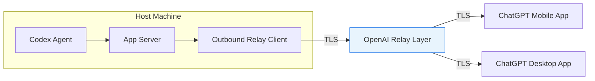
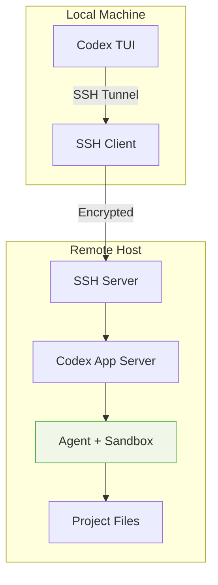

# Codex Remote GA: QR Relay Architecture, Mobile Approvals, and the CLI Developer's Setup Guide


---

On 25 June 2026 OpenAI brought Codex Remote to general availability across every paid ChatGPT tier — Plus, Pro, Business, Enterprise, and Education[^1]. The feature lets developers start, monitor, and approve Codex agent sessions on a Mac or Windows host from the ChatGPT mobile app on iOS or Android, without exposing the host machine to the public internet[^2]. For CLI developers who have been running headless agents and worktree-based workflows, this changes the approval surface from "sit at your terminal" to "tap your phone on the train."

This article breaks down the relay architecture that makes it work, walks through the CLI-specific commands you need, and covers the SSH host path that extends remote control to Linux servers and cloud VMs.

## Why Codex Remote Matters for CLI Developers

Codex CLI's strength has always been long-running, autonomous agent sessions — goal mode tasks that churn through multi-file refactors, test suites, and deployment pipelines. The bottleneck was never the agent; it was the human waiting at the terminal for an approval prompt. Codex Remote removes that bottleneck. A task started via `codex --remote` or from the desktop app can surface approval requests, diffs, test results, and screenshots to your phone[^2]. You approve or reject, and the agent continues.

The practical implication: you can queue up agent work on your workstation before leaving the office, then handle approvals during your commute. For teams using `suggest` or `auto-edit` permission modes, where the agent pauses for human confirmation on writes or shell commands, this is a meaningful productivity shift.

## The QR Relay Architecture

### How It Differs from the Beta

The beta remote-control implementation (shipped in v0.130.0 on 8 May 2026[^3]) exposed a WebSocket app-server endpoint that clients connected to directly. The GA release replaces this with a purpose-built relay layer maintained by OpenAI[^2].



The key architectural properties:

1. **No inbound connections** — the host machine initiates an outbound TLS connection to the relay. No ports are opened, no DNS records are published, and the host's IP address is never advertised[^2].
2. **One-to-one QR pairing** — each mobile device is cryptographically paired with each host via a QR code scanned during initial setup. Connections established since 8 June 2026 persist; older inactive pairings require re-authentication with updated app versions[^1].
3. **Data stays on host** — files, credentials, permissions, and local settings remain on the host machine. The mobile app receives only a secure, real-time stream of screenshots, terminal output, diffs, test results, and approval requests[^2].

### What Flows Over the Relay

The relay transmits a narrow set of session artefacts:

| Artefact | Direction | Notes |
|---|---|---|
| Task instructions | Mobile → Host | New tasks or follow-up prompts |
| Approval requests | Host → Mobile | Shell commands, file writes awaiting confirmation |
| Diffs and test output | Host → Mobile | Read-only rendering |
| Screenshots | Host → Mobile | Computer Use visual context |
| Completion notifications | Host → Mobile | Task finished or errored |

Sensitive data — source code, environment variables, API keys — never leaves the host[^2].

## Setting Up Codex Remote: Desktop Path

The simplest path uses the ChatGPT desktop app (macOS or Windows):

1. **Open the desktop app** and select "Set up Remote" in the sidebar[^2].
2. **Scan the QR code** displayed on screen using the ChatGPT mobile app on iOS or Android.
3. **Confirm account and workspace** — if your organisation uses SSO or MFA, complete those steps on the phone.
4. **The host appears** in the Remote section of the mobile app.

Once paired, the desktop app Settings → Connections panel lets you manage connected devices and toggle "Keep this Mac/PC awake" to prevent the host sleeping during long agent runs[^2].

## Setting Up Codex Remote: CLI Path

For headless servers, CI runners, or developers who prefer not to use the desktop app, Codex CLI provides the `remote-control` subcommand family (experimental, available since v0.130.0, with manual pairing added in v0.143.0)[^3][^4].

### Starting the Daemon

```bash
# Start the remote-control daemon
codex remote-control start
```

This launches the local app-server with remote-control enabled. The daemon runs in the background and maintains the outbound relay connection[^4].

### Generating a Manual Pairing Code

When you cannot scan a QR code (SSH session, headless VM, CI environment), generate a short-lived manual pairing code:

```bash
# Print a human-readable pairing code
codex remote-control pair

# Machine-readable output for automation
codex remote-control pair --json
```

The `--json` variant returns a structured response[^4]:

```json
{
  "pairingCode": "ABCD-1234",
  "manualPairingCode": "982451",
  "environmentId": "env_abc123",
  "expiresAt": "2026-07-10T15:30:00Z"
}
```

Enter the `manualPairingCode` in the ChatGPT mobile app under Remote → "Enter code manually" to complete pairing.

### Stopping the Daemon

```bash
codex remote-control stop
```

### Connecting the CLI to a Remote Host

From a local terminal, you can connect the Codex TUI to a remote app-server:

```bash
# WebSocket connection
codex --remote ws://host:port

# Secure WebSocket
codex --remote wss://host:port

# Unix socket
codex --remote unix:///path/to/socket

# With bearer token authentication
codex --remote wss://host:port --remote-auth-token-env CODEX_REMOTE_TOKEN
```

The `--remote-auth-token-env` flag reads a bearer token from the specified environment variable, which the server validates before accepting the connection[^4].

> **Note:** The `remote-control` subcommands are not a replacement for `codex app-server --listen` when building custom protocol clients. They are specifically designed for the OpenAI relay pairing flow[^4].

## SSH Host Connections

Codex Remote also supports connecting to remote Linux, macOS, or Windows hosts over SSH — turning any machine where `codex` is installed into a remote agent execution environment[^5].

### Prerequisites

The remote host must have:
- `codex` on the login shell's `PATH`
- SSH key-based authentication (no password prompts)
- Outbound HTTPS access to OpenAI's API

### Configuration

Add concrete host aliases to `~/.ssh/config` on the machine running the Codex desktop app or the machine from which you initiate the connection[^5]:

```
Host devbox
    HostName devbox.example.com
    User developer
    IdentityFile ~/.ssh/id_ed25519
```

Codex reads concrete `Host` aliases from `~/.ssh/config`, resolves them via OpenSSH, and ignores wildcard-only or pattern hosts[^5]. Once configured, the host appears in the desktop app's connection list.

### Headless Linux Authentication

On headless machines without a browser, standard `codex login` (which spawns a local HTTP server on port 1455) will not work. Instead, use the Device Code flow[^6]:

```bash
codex login --device-code
```

This generates a one-time code valid for 15 minutes. Complete sign-in from any browser — the CLI and browser communicate through OpenAI's servers, requiring no direct network path between them[^6].

### Architecture: Split Agent Model

When connected via SSH, Codex splits into two halves[^5]:



The app-server executes tool calls (file reads, shell commands, MCP tool invocations) on the remote host, whilst the TUI renders the conversation locally. File access, sandboxing, and permissions all operate in the remote host's context[^5].

## DigitalOcean Plugin: Disposable Cloud Hosts

The GA release shipped alongside a new DigitalOcean plugin that provisions a Droplet, configures SSH access, and connects it to the Codex App as a remote workspace — converting manual host setup into disposable cloud-host lanes[^1].

This is particularly useful for:
- **Isolated builds** — spin up a clean environment for each major task, then destroy it
- **Resource-intensive workloads** — offload compilation or test suites to a beefier machine
- **Security boundaries** — keep production credentials on a dedicated cloud host, separated from your personal workstation

Teams should separate remote cloud workspaces from personal workstations in their routing and permission policies, as the network and credential risk profiles differ significantly[^7].

## Governance Considerations

For teams adopting Codex Remote at scale, TheRouter.ai recommends a four-plane governance framework[^7]:

| Plane | What to Configure |
|---|---|
| **Identity** | Correlate mobile user, paired host, organisation, project, and cloud workspace before authorising model spend |
| **Execution** | Apply different sandbox, network, and secret policies per host OS (macOS, Windows, Linux) |
| **Approval** | Log mobile approvals as first-class governance events, separately from local confirmations |
| **Cost** | Reconcile model tokens, plugin actions, VM time, and failed sessions to user/project ledgers |

Mobile approvals should be treated as a distinct approval surface in audit logs. When a developer approves a shell command from their phone, the governance record should capture the device, location context, and the specific action approved[^7].

## Practical Checklist for CLI Developers

If you are already using Codex CLI and want to add remote mobile control:

- [ ] **Update Codex CLI** to v0.143.0 or later (v0.144.1 is current as of July 2026)[^4]
- [ ] **Update ChatGPT mobile app** to the latest version on iOS or Android
- [ ] **Run `codex remote-control start`** on your development machine
- [ ] **Generate a pairing code** with `codex remote-control pair` if headless, or scan the QR code from the desktop app
- [ ] **Verify the connection** by starting a task from mobile and confirming it executes on the host
- [ ] **Configure SSH hosts** in `~/.ssh/config` if you need to reach remote servers
- [ ] **Use `codex login --device-code`** on headless Linux machines
- [ ] **Review permission modes** — `suggest` mode surfaces every write and shell command for mobile approval; `auto-edit` only pauses on shell commands; `full-auto` runs without approvals (and therefore without mobile interaction)
- [ ] **Enable "Keep awake"** in desktop app settings if running long agent sessions

## What This Means for Agent Workflows

Codex Remote does not change what the agent can do — it changes where and when a human can intervene. The agent still operates within its sandbox, still respects `AGENTS.md` instructions, still follows hook policies. But the approval loop is now asynchronous and location-independent.

For teams running multiple concurrent agents (the "agentmaxxing" pattern), this means a single developer can supervise several long-running agents from their phone, approving actions across different worktrees and projects without context-switching between terminal windows. The relay architecture's one-to-one pairing ensures each approval is cryptographically bound to the correct host and session.

The shift from synchronous terminal approval to asynchronous mobile approval is, in practice, the difference between an agent that blocks for twenty minutes waiting for you to return to your desk and one that gets its answer in thirty seconds whilst you are walking to get coffee.

## Citations

[^1]: [OpenAI Codex Remote Goes Live for All Plans: Phone Control Now Secured by QR Relay](https://www.techtimes.com/articles/319201/20260627/openai-codex-remote-goes-live-all-plans-phone-control-now-secured-qr-relay.htm) — TechTimes, 27 June 2026
[^2]: [Remote connections — ChatGPT Learn (OpenAI official documentation)](https://learn.chatgpt.com/docs/remote-connections) — OpenAI, accessed July 2026
[^3]: [Codex CLI v0.130: Building Headless Agent Services with remote-control and the Thread Pagination API](https://codex.danielvaughan.com/2026/05/09/codex-cli-v0130-remote-control-headless-agent-services-thread-pagination/) — Codex Knowledge Base, 9 May 2026
[^4]: [Developer commands — ChatGPT Learn (CLI reference)](https://learn.chatgpt.com/docs/developer-commands?surface=cli) — OpenAI, accessed July 2026
[^5]: [Codex CLI Remote Connections: Running Agents on Remote Hosts with SSH, WebSocket, and Secure Tunnels](https://codex.danielvaughan.com/2026/04/21/codex-cli-remote-connections-ssh-websocket-secure-tunnels/) — Codex Knowledge Base, 21 April 2026
[^6]: [How to log into Codex CLI on a remote server](https://medium.com/@djangoist/how-to-log-into-codex-cli-on-a-remote-server-0798162da0b2) — Medium, 2026
[^7]: [Codex Remote GA turns mobile approvals into a routing control plane decision](https://therouter.ai/news/codex-remote-ga-mobile-approval-routing/) — TheRouter.ai, June 2026
