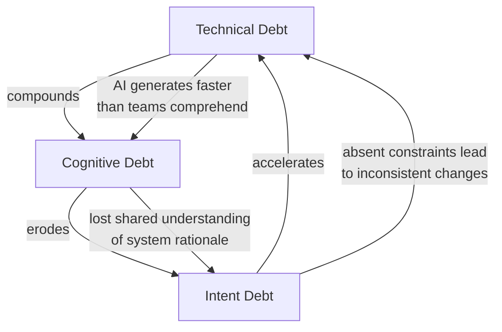
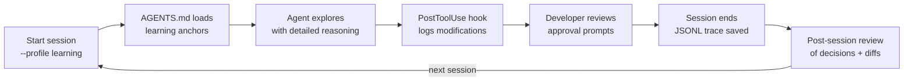

# Knowledge Debt and the Agents That Teach: Designing Incidental Learning into Your Codex CLI Workflow


---

## The Problem Nobody Wants to Talk About

Every senior developer who has shipped production code through a coding agent has felt the quiet dissonance: the PR merges, the tests pass, but you cannot quite explain _why_ the agent chose that particular approach. Multiply that across a team, across months, and you arrive at a concept that Mehra et al. formalise in their July 2026 ASE paper as **Knowledge Debt** — the developer-level parallel to technical debt where code changes accumulate faster than developers can comprehend them [^1].

This is not a theoretical concern. Anthropic's randomised controlled trial of 52 professional developers found that those using AI coding assistants scored 17 percentage points lower on comprehension tests than a manual-coding control group, with the steepest drops on debugging questions [^2]. GitClear's analysis of 211 million changed lines showed code duplication increasing eightfold between 2022 and 2024, whilst refactoring activity collapsed from 25% to under 10% of changed lines [^3]. Storey's Triple Debt Model — presented at TechDebt 2026 — extends the concept into three interconnected categories: traditional technical debt in the code, cognitive debt in the team's shared understanding, and intent debt in the missing rationale that both humans and agents need [^4].

The question is no longer whether coding agents erode developer understanding — the evidence is clear. The question is what to do about it without giving up the productivity gains.

## What "Agents That Teach" Proposes

Mehra et al.'s contribution, accepted to the ASE 2026 New Ideas track, reframes the problem as a design challenge rather than an inevitability [^1]. Their core argument: incidental learning — the informal knowledge developers absorb through hands-on problem solving — has become an unintended casualty of automation. Rather than slowing agents down, the paper proposes making learning an intentional feature of the agent-developer interaction.

The paper introduces six design principles for learning-aware agent interactions:

1. **Contextual Relevance** — surface learning opportunities tied to the current task, not generic tutorials
2. **Minimal Disruption** — embed knowledge into the existing workflow rather than forcing context switches
3. **Adaptive Depth** — tailor explanation depth to the developer's demonstrated familiarity
4. **Rationale Transparency** — expose _why_ decisions were made, not just _what_ was changed
5. **Spaced Reinforcement** — revisit concepts across sessions rather than dumping everything at once
6. **Ownership Preservation** — ensure the developer retains agency over architectural choices

These principles are embodied in **SHIELD**, a multi-agent system architecture where a teaching agent observes the primary coding agent's actions and injects contextual learning opportunities — explanations of design trade-offs, links to relevant documentation, or prompts asking the developer to predict what the agent will do next — without blocking the main workflow [^1].

## The Triple Debt Model

Storey's Triple Debt framework provides the analytical scaffolding [^4]:



**Technical debt** lives in the code — duplicated blocks, missing abstractions, skipped refactoring. AI agents generate it at 140–200 lines per minute whilst humans comprehend at 20–40 lines per minute, creating a 5–7× speed gap [^5].

**Cognitive debt** lives in the team — the erosion of shared understanding that makes nobody confident about explaining how a system works or predicting the impact of a change [^4]. The Anthropic study demonstrates this directly: AI-assisted developers lose comprehension precisely where it matters most, in debugging and fault diagnosis [^2].

**Intent debt** lives in the documentation — or rather, in its absence. When an agent makes a design choice and the developer accepts it without understanding the rationale, the _why_ is lost. Future developers (including the original one, three months later) inherit code with no discoverable intent [^4].

## Mapping SHIELD Principles to Codex CLI

Codex CLI does not ship a SHIELD module, but its configuration surface — AGENTS.md layered discovery, hooks, named profiles, verbosity controls, and reasoning summaries — provides the primitives to build a learning-aware workflow. Here is how each principle maps to concrete configuration.

### Principle 1: Rationale Transparency via Reasoning Summaries

Codex CLI's `model_reasoning_summary` parameter controls whether the model's step-by-step reasoning is surfaced [^6]. For learning-aware sessions:

```toml
# ~/.codex/learning.config.toml
model_reasoning_summary = "detailed"
model_verbosity = "high"
```

Activate with `--profile learning` when you want the agent to show its working. Switch to a `fast` profile for routine tasks where learning is not the goal.

### Principle 2: Contextual Learning Anchors in AGENTS.md

AGENTS.md instructions are loaded once per session and appear in the model's context throughout [^7]. Use this to embed learning prompts directly:

```markdown
<!-- AGENTS.md — learning anchors -->
## Explanations

When you modify code in a file the developer has not previously edited
in this session, briefly explain the architectural context:
- What module does this file belong to?
- What are the key abstractions the developer should understand?
- What trade-offs did you consider?

When you choose one library or pattern over an alternative, state
the alternative you rejected and why.
```

This addresses both **Contextual Relevance** and **Rationale Transparency** without requiring any external tooling. The AGENTS.md discovery chain — global `~/.codex/AGENTS.md` overlaid with per-directory project files — means you can set learning anchors globally and override them per-project [^7].

### Principle 3: PostToolUse Hooks for Comprehension Checkpoints

Hooks run deterministically after tool execution — the agent cannot skip or reinterpret them [^8]. A PostToolUse hook can log every file modification and prompt a comprehension summary:

```bash
#!/usr/bin/env bash
# .codex/hooks/post-tool-use-learning.sh
# Log modified files for end-of-session review

if [ "$CODEX_TOOL_NAME" = "apply_patch" ]; then
  echo "$CODEX_TOOL_INPUT" | jq -r '.path' >> /tmp/codex-modified-files.log
  echo "NOTE: File modified. Consider reviewing the diff to understand the change rationale."
fi
```

For a more structured approach, a PostToolUse hook can append to a session-local learning journal:

```bash
#!/usr/bin/env bash
# .codex/hooks/learning-journal.sh

if [ "$CODEX_TOOL_NAME" = "apply_patch" ]; then
  TIMESTAMP=$(date -u +"%Y-%m-%dT%H:%M:%SZ")
  FILE=$(echo "$CODEX_TOOL_INPUT" | jq -r '.path')
  echo "| $TIMESTAMP | $FILE | PENDING_REVIEW |" >> .codex/learning-journal.md
fi
```

### Principle 4: Named Profiles for Adaptive Depth

The **Adaptive Depth** principle — adjusting explanation level to the developer's familiarity — maps cleanly to Codex CLI's named profile system [^9]. Create profiles that match your learning intent:

```toml
# ~/.codex/learning.config.toml — deep learning mode
model_reasoning_summary = "detailed"
model_verbosity = "high"
reasoning_effort = "high"

# ~/.codex/review.config.toml — review-only mode
model_reasoning_summary = "concise"
model_verbosity = "medium"

# ~/.codex/production.config.toml — maximum throughput
model_reasoning_summary = "none"
model_verbosity = "low"
reasoning_effort = "low"
```

Set your default profile based on whether you are exploring unfamiliar code or operating in a well-understood domain:

```toml
# ~/.codex/config.toml
profile = "review"  # sensible default — switch to "learning" for new codebases
```

### Principle 5: Session JSONL as a Learning Audit Trail

Every Codex CLI session produces a JSONL trace capturing each tool call, model response, and reasoning step [^10]. This trace is the raw material for post-session learning reviews — the **Spaced Reinforcement** principle. A simple review script:

```bash
#!/usr/bin/env bash
# Review what the agent did in the last session
LATEST=$(ls -t ~/.codex/sessions/*.jsonl | head -1)
echo "=== Files Modified ==="
jq -r 'select(.tool_name == "apply_patch") | .tool_input.path' "$LATEST" | sort -u
echo ""
echo "=== Decisions Made ==="
jq -r 'select(.role == "assistant") | .content' "$LATEST" | grep -i "chose\|decided\|trade-off\|alternative" | head -20
```

### Principle 6: Ownership Preservation via Approval Policy

The **Ownership Preservation** principle — ensuring the developer retains agency — is directly supported by Codex CLI's approval policy configuration [^11]. The `writes` mode introduced in v0.144.0 auto-approves reads but prompts on writes, creating a natural decision point:

```toml
# ~/.codex/learning.config.toml
approval_policy = "on-request"  # maximum developer control
```

For a balanced approach, `writes` mode lets the agent explore freely but requires explicit approval before modifying code — forcing the developer to understand what is about to change [^11].

## A Learning-Aware Session Flow

Putting it together, here is the recommended flow for a developer joining an unfamiliar codebase:



Over time, as the developer's mental model solidifies, they graduate from the `learning` profile to `review` and eventually to `production` — the **Adaptive Depth** principle made concrete through configuration rather than code.

## Measuring Knowledge Debt

You cannot manage what you do not measure. Two practical proxies for knowledge debt in a Codex CLI workflow:

1. **Approval-to-understanding ratio** — track how often a developer approves a change they could independently explain. The `writes` approval mode creates the checkpoint; team retrospectives surface the gap.

2. **Session review rate** — what percentage of session JSONL traces are reviewed post-session? If the answer is zero, knowledge debt is accumulating unchecked.

Neither metric requires tooling beyond what Codex CLI already provides. Both require cultural commitment — which is, ultimately, what separates teams that learn from teams that delegate.

## The Broader Shift

The "Agents That Teach" paper sits at the intersection of two converging trends in mid-2026: the maturation of coding agent configuration surfaces (Codex CLI's hooks, profiles, and AGENTS.md layering; Claude Code's CLAUDE.md; Cursor's rules) and growing empirical evidence that unchecked agent delegation degrades the skills needed to supervise agents effectively — the paradox of supervision [^5].

The resolution is not less automation but more intentional automation. Codex CLI's configuration stack is rich enough to embed learning into every session. The missing ingredient is not tooling — it is the decision to use it.

## Citations

[^1]: Mehra, R., Suri, S., Tagadinamani, P.K., Singi, K., Kaulgud, V., & Burden, A.P. (2026). "Agents That Teach: Towards Designing Incidental Learning Back into AI-Assisted Software Development." ASE 2026, New Ideas and Emerging Results Track. arXiv:2607.06101. [https://arxiv.org/abs/2607.06101](https://arxiv.org/abs/2607.06101)

[^2]: Anthropic Research. (2026). "How AI Assistance Impacts the Formation of Coding Skills." Randomised controlled trial, 52 professional developers. [https://www.anthropic.com/research/AI-assistance-coding-skills](https://www.anthropic.com/research/AI-assistance-coding-skills)

[^3]: GitClear. (2025). "AI Copilot Code Quality: 2025 Data Suggests 4x Growth in Code Clones." Analysis of 211 million changed lines, 2020–2024. [https://www.gitclear.com/ai_assistant_code_quality_2025_research](https://www.gitclear.com/ai_assistant_code_quality_2025_research)

[^4]: Storey, M.-A. (2026). "From Technical Debt to Cognitive and Intent Debt: Rethinking Software Health in the Age of AI." arXiv:2603.22106. [https://arxiv.org/abs/2603.22106](https://arxiv.org/abs/2603.22106)

[^5]: Faye, L. (2026). "Agentic Coding is a Trap: Remaining Vigilant about Cognitive Debt and Atrophy." [https://larsfaye.com/articles/agentic-coding-is-a-trap](https://larsfaye.com/articles/agentic-coding-is-a-trap)

[^6]: OpenAI. (2026). "Configuration Reference — Codex CLI." `model_reasoning_summary` and `model_verbosity` keys. [https://developers.openai.com/codex/config-reference](https://developers.openai.com/codex/config-reference)

[^7]: OpenAI. (2026). "AGENTS.md — Codex CLI." Layered discovery chain, 32 KiB default cap. [https://developers.openai.com/codex/config-advanced](https://developers.openai.com/codex/config-advanced)

[^8]: OpenAI. (2026). "Hooks — Codex CLI." PreToolUse, PostToolUse, and Stop hooks. [https://developers.openai.com/codex/hooks](https://developers.openai.com/codex/hooks)

[^9]: OpenAI. (2026). "Config Basics — Codex CLI." Named profiles via `--profile` flag. [https://developers.openai.com/codex/config-basic](https://developers.openai.com/codex/config-basic)

[^10]: OpenAI. (2026). "Codex CLI Features." Session JSONL traces. [https://developers.openai.com/codex/cli/features](https://developers.openai.com/codex/cli/features)

[^11]: OpenAI. (2026). "Codex Changelog — v0.144.0." `writes` approval mode for MCP/connector tools. [https://developers.openai.com/codex/changelog](https://developers.openai.com/codex/changelog)
