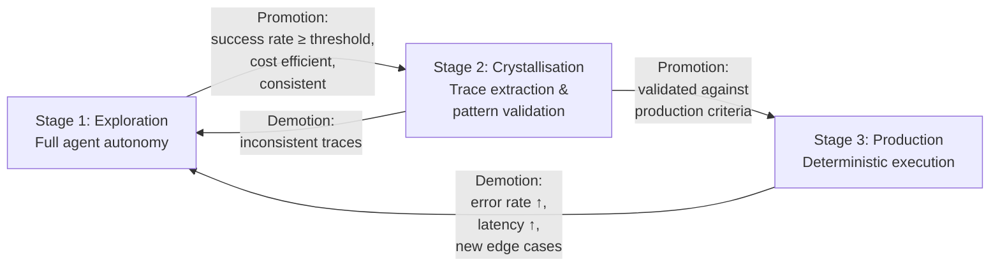
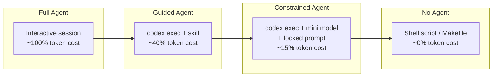

# Progressive Crystallisation: How to Turn Codex CLI Exploration into Deterministic, Lower-Cost Workflows


---

Every interactive Codex CLI session burns reasoning tokens. That is the trade-off for autonomy: the agent explores, backtracks, retries, and eventually solves the problem — but the next time the same problem appears, the same exploration bill arrives. Malik's *Progressive Crystallisation* framework (arXiv:2607.07052, July 2026) formalises what production teams have been doing informally: extracting the successful execution paths from exploratory agent runs, hardening them into deterministic workflows, and reserving the full agent only for genuinely novel scenarios [^1]. This article maps the framework's three-stage taxonomy onto the Codex CLI toolchain — interactive sessions, skills, `codex exec`, hooks, and CI pipelines — and provides concrete configuration for each stage.

## The Cost Problem with Permanent Exploration

Malik's core observation is stark: AI agents deployed as permanent execution engines are permanent cost centres [^1]. In a production cloud-networking AIOps system, the framework achieved a shift from 0 per cent to 45 per cent deterministic execution over eight months, reducing per-incident agent costs by more than 70 per cent whilst handling doubled incident volume [^1]. The implication for coding agents is direct: every Codex CLI session that solves a recurring problem — running a migration, fixing a lint category, scaffolding a service — is a candidate for crystallisation.

The economic model quantifies three cost components: model inference (proportional to reasoning complexity), tool invocations (per-call charges for MCP tools, shell commands, and file operations), and latency (wall-clock time in CI pipelines where minutes cost money) [^1]. Production-stage deterministic paths typically achieve 60–80 per cent cost reduction and 40–70 per cent latency improvement compared with continuous agent exploration [^1].

## The Three-Stage Execution Taxonomy

Progressive crystallisation defines three execution stages with bidirectional promotion and demotion between them [^1]:



### Stage 1 — Exploration

The agent operates with full autonomy: reasoning, tool-calling, backtracking. In Codex CLI terms, this is an interactive `codex` session or a `codex exec` run in `suggest` or `auto-edit` approval mode. The agent discovers solutions to novel problems, and every session generates a JSONL rollout transcript under `~/.codex/sessions/` [^2].

### Stage 2 — Crystallisation

High-value execution paths are identified from exploration traces. Successful patterns are extracted, normalised, and deduplicated. In Codex CLI terms, this is the process of analysing session transcripts and converting them into reusable artefacts: SKILL.md files, shell scripts, hook configurations, or `codex exec` invocations with constrained prompts.

### Stage 3 — Production

Deterministic workflows execute selected paths without agent reasoning overhead. In Codex CLI terms, this is a `codex exec` call with a focused prompt, a locked skill, a constrained sandbox, and an `--output-schema` for structured results — or, at the extreme end, a plain shell script that no longer needs the agent at all.

## Mapping Progressive Crystallisation to the Codex CLI Toolchain

### Exploration: Interactive Sessions with Full Autonomy

The exploration stage uses Codex CLI's interactive mode with broad permissions:

```toml
# ~/.codex/explore.config.toml — exploration profile
model = "o3"
approval_policy = "suggest"
sandbox_mode = "workspace-write"
model_reasoning_effort = "high"
```

Activate it with `codex --profile explore`. The key discipline at this stage is not cost control but *trace capture*. Every session is already recorded as JSONL under `~/.codex/sessions/` [^2]. The session ID appears in `/status` output and can be listed with `codex history` [^3].

### Crystallisation: Extracting Patterns from Session Traces

Codex CLI provides several mechanisms for extracting reusable patterns from exploratory sessions:

**1. Record & Replay (macOS).** Since Codex app 26.616 (June 2026), Record & Replay watches you perform a workflow on macOS, then drafts a SKILL.md capturing when to trigger, what inputs are needed, what steps to follow, and how to verify the result [^4]. This is the most direct crystallisation path for GUI-involving workflows.

**2. Manual skill extraction from session JSONL.** For CLI-only workflows, review the session transcript:

```bash
# List recent sessions
codex history

# Export a session's tool calls for analysis
codex exec "Read the session JSONL at ~/.codex/sessions/<session-id>.jsonl. \
Extract every Bash command and file write into a numbered step list. \
Identify which steps were retries or dead ends. \
Output only the successful path as a SKILL.md skeleton." \
  --output-schema skill-skeleton.json
```

**3. Skill creator workflow.** Use the built-in skill creator to formalise the extracted pattern:

```
codex "Create a skill for <task description>. \
The skill should trigger when <condition>. \
Here are the steps that worked: <paste successful path>."
```

The resulting SKILL.md follows the open Agent Skills standard understood by Codex CLI, Claude Code, Gemini CLI, and Cursor [^5].

### Production: Deterministic Execution via `codex exec`

Once a skill is validated, production execution uses `codex exec` with constraints that eliminate unnecessary exploration:

```toml
# ~/.codex/production.config.toml — production profile
model = "gpt-5.4-mini"
approval_policy = "full-auto"
sandbox_mode = "workspace-write"
model_reasoning_effort = "low"
```

```bash
# Deterministic CI invocation with structured output
codex exec --profile production \
  --output-schema migration-report.json \
  "Run the database migration skill on the staging environment"
```

The key production-stage constraints are:

| Lever | Exploration | Production |
|-------|------------|------------|
| Model | `o3` / `gpt-5.5` | `gpt-5.4-mini` / `gpt-5.4-nano` |
| `model_reasoning_effort` | `high` | `low` |
| `approval_policy` | `suggest` | `full-auto` |
| Prompt | Open-ended | Constrained, skill-directed |
| `--output-schema` | Optional | Required for CI parsing |

This mirrors the progressive crystallisation economic model: cheaper models with lower reasoning effort execute known-good paths at a fraction of the exploration cost [^1].

### The Demotion Circuit-Breaker

Malik's framework includes automatic demotion: production workflows that show performance regression revert to exploration for revalidation [^1]. In Codex CLI terms, implement this with PostToolUse hooks:

```toml
# .codex/config.toml — demotion detection hook
[[hooks]]
event = "PostToolUse"
match_tool = "bash"
command = ".codex/hooks/check-exit-code.sh"
timeout_ms = 5000
```

```bash
#!/usr/bin/env bash
# .codex/hooks/check-exit-code.sh
# If a production-profile task fails, log for demotion review
if [[ "$CODEX_PROFILE" == "production" && "$EXIT_CODE" != "0" ]]; then
  echo '{"systemMessage": "Production workflow failed. Consider reverting to exploration profile for this task category."}'
fi
```

When failure rates cross a threshold in CI, the pipeline can switch from `--profile production` to `--profile explore`, re-engaging full agent reasoning [^6].

## The Crystallisation Spectrum

Not every workflow crystallises to the same degree. The framework recognises a spectrum:



The spectrum from left to right represents increasing determinism and decreasing cost. Most teams find the middle ground — a constrained `codex exec` invocation with a skill and a lightweight model — delivers the best balance of adaptability and cost [^1].

### When to Stay in Exploration

Some tasks resist crystallisation:

- **Novel bug categories** where the failure mode is unknown a priori
- **Cross-repository refactors** spanning unfamiliar codebases
- **Architecture decisions** requiring contextual reasoning about trade-offs
- **First-time integrations** with new APIs or services

The framework's monitoring layer detects these by tracking the ratio of production-path matches to exploration fallbacks [^1]. A healthy system handles 75–85 per cent of requests through production pathways, with the remainder routed to exploration [^1].

## Practical Implementation: A Four-Week Crystallisation Sprint

### Week 1 — Instrument

Enable session logging (on by default) and tag sessions by task category in AGENTS.md:

```markdown
<!-- AGENTS.md -->
## Task Categories for Crystallisation Tracking

When completing a task, note its category in a comment:
- MIGRATION: Database schema changes
- SCAFFOLD: New service/component creation
- LINT-FIX: Automated code quality fixes
- DEPLOY: Release and deployment tasks
```

### Week 2 — Mine

Review the past fortnight's sessions. Identify recurring patterns:

```bash
codex exec "Analyse all session files in ~/.codex/sessions/ from the last 14 days. \
Group by task similarity. For each group with 3+ occurrences, \
extract the common successful execution path. \
Output a JSON array of candidate skills with trigger conditions and step lists." \
  --output-schema crystallisation-candidates.json
```

### Week 3 — Crystallise

Convert the top three candidates into skills, test them with `codex exec`, and measure token consumption against the original exploration sessions.

### Week 4 — Deploy

Integrate the validated skills into CI. Set up the demotion circuit-breaker. Monitor the exploration-to-production ratio.

## Economic Impact

Applying the progressive crystallisation metrics to typical Codex CLI usage:

| Metric | Before | After (8 months) |
|--------|--------|-------------------|
| Deterministic execution share | 0% | 45% [^1] |
| Per-task agent cost | Baseline | −70% [^1] |
| Task throughput | Baseline | 2× [^1] |
| Outcome consistency | Variable | >95% [^1] |

For a team running 100 Codex CLI tasks per day at an average of \$0.50 per task, crystallising 45 per cent of workflows at 70 per cent cost reduction saves approximately \$15.75 per day — or roughly \$5,750 annually. At enterprise scale with thousands of daily agent invocations, the savings are substantial.

## Relationship to Existing Patterns

Progressive crystallisation complements several patterns already documented in the Codex CLI ecosystem:

- **Execution Lineage** (arXiv:2605.06365): Converts agent loops into deterministic execution graphs, providing the trace-to-graph transformation that crystallisation requires [^7]
- **SkillReducer** (documented in the Codex knowledge base): Token-efficient skill authoring through progressive disclosure aligns with the crystallisation goal of reducing per-invocation cost [^8]
- **Named Profiles**: The profile system (`~/.codex/<name>.config.toml`) maps directly to the three execution stages — `explore`, `crystallise`, `production` [^9]
- **Record & Replay**: The most automated crystallisation path, producing skills from demonstrated workflows without manual trace analysis [^4]

## Conclusion

The progressive crystallisation framework reframes a question that every Codex CLI team eventually asks: "Why are we paying for the agent to solve the same problem it solved last week?" The answer is a lifecycle, not a binary choice between agent and script. Exploration discovers solutions. Crystallisation hardens them. Production executes them cheaply. Demotion ensures they stay correct. The Codex CLI toolchain — sessions, skills, `codex exec`, hooks, named profiles — already provides every building block. The framework simply names the lifecycle and provides the promotion criteria to connect them.

---

## Citations

[^1]: Malik, A. (2026). "Progressive Crystallization: Turning Agent Exploration into Deterministic, Lower-Cost Workflows in Production." arXiv:2607.07052. [https://arxiv.org/abs/2607.07052](https://arxiv.org/abs/2607.07052)

[^2]: OpenAI. (2026). "Codex CLI Session History and Rollout Files." OpenAI Developers Documentation. [https://developers.openai.com/codex/cli/features](https://developers.openai.com/codex/cli/features)

[^3]: OpenAI. (2026). "Non-interactive mode — Codex CLI." OpenAI Developers Documentation. [https://developers.openai.com/codex/noninteractive](https://developers.openai.com/codex/noninteractive)

[^4]: OpenAI. (2026). "Record & Replay — Codex." OpenAI Developers Documentation. [https://developers.openai.com/codex/record-and-replay](https://developers.openai.com/codex/record-and-replay)

[^5]: OpenAI. (2026). "Build skills — Codex." OpenAI Developers Documentation. [https://developers.openai.com/codex/skills](https://developers.openai.com/codex/skills)

[^6]: OpenAI. (2026). "Hooks — Codex CLI." OpenAI Developers Documentation. [https://developers.openai.com/codex/hooks](https://developers.openai.com/codex/hooks)

[^7]: ⚠️ Execution lineage reference (arXiv:2605.06365) cited from search results; full paper details not independently verified at time of writing.

[^8]: OpenAI. (2026). "Advanced Configuration — Codex CLI." OpenAI Developers Documentation. [https://developers.openai.com/codex/config-advanced](https://developers.openai.com/codex/config-advanced)

[^9]: OpenAI. (2026). "Configuration Reference — Codex CLI." OpenAI Developers Documentation. [https://developers.openai.com/codex/config-reference](https://developers.openai.com/codex/config-reference)
