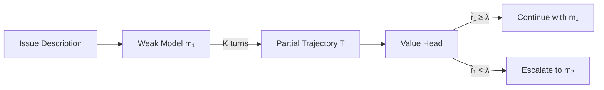
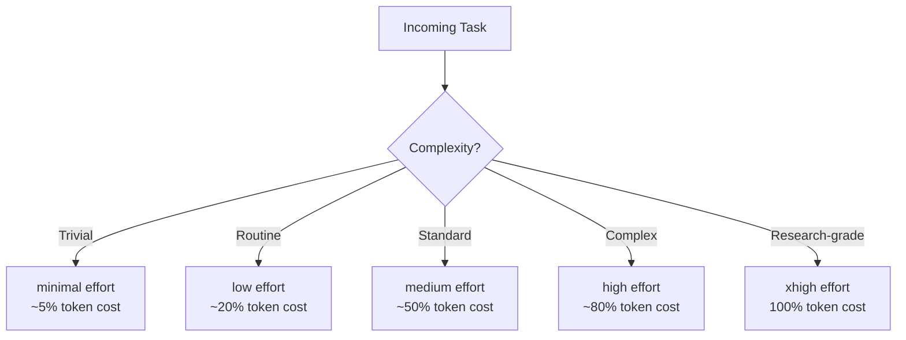

# SWE-Router and Trajectory-Based Model Routing: What Partial-Exploration Escalation Means for Codex CLI Cost Strategy


---

Prompt-only model routers have a fundamental information problem: they cannot tell the difference between a one-line typo fix and a multi-module refactor until the agent starts working. A paper presented at the 5th Deep Learning for Code Workshop at ICML 2026 formalises why, and introduces a routing strategy that lets a cheap model explore for a few turns before deciding whether to escalate. The result — a 15-point improvement in routing accuracy over description-only baselines — maps directly onto Codex CLI's profile, hook, and budget primitives[^1].

## The Prompt-Only Routing Ceiling

Previous work on model routing for coding tasks treats the issue description as the sole input signal. ACRouter, introduced in the CodeRouterBench paper in June 2026, demonstrated that an agentic router that learns during deployment outperforms frozen classifiers[^2]. But even agentic description-only routers share a structural limitation: natural-language issue descriptions are noisy, incomplete, and frequently ambiguous about the actual complexity of the fix.

SWE-Router, by Son et al. (arXiv:2607.00053), addresses this with a formal proof. **Theorem 4.1** establishes that conditioning routing decisions on a partial trajectory — the first *K* turns of a cheap model's exploration — never harms routing accuracy and is strictly better whenever those exploratory turns are informative[^1]. The intuition is straightforward: watching a cheap model struggle with a task for three turns tells you far more about the task's difficulty than reading the issue title.

## How SWE-Router Works

The architecture is a two-stage pipeline:



1. **Exploration phase.** The cheap model (m₁) runs for *K* exploratory turns against the repository, producing a partial trajectory *T* — a sequence of tool calls, file reads, and initial edits[^1].

2. **Routing decision.** A value head — a Qwen2.5-Coder-7B-Instruct model with a LoRA-trained two-class classification head — reads the partial trajectory and predicts the probability that m₁ will resolve the issue if allowed to continue[^1].

3. **Threshold rule.** If the predicted success probability r̂₁(T) exceeds a tuned threshold λ″, the cheap model continues. Otherwise, the strong model (m₂) takes over from scratch[^1].

### Models and Data

The paper evaluates two weak–strong pairings on SWE-bench Verified:

| Weak Model (m₁) | Strong Model (m₂) | Route-AUC (K=0) | Route-AUC (K=3) | Improvement |
|---|---|---|---|---|
| deepseek-v3.2 | gemini-3-pro-preview | 0.627 | 0.750 | +15.3 pp |
| gpt-5-mini | gemini-3-pro-preview | 0.549 | 0.694 | +12.0 pp |

Training data came from SWE-Smith (~1,700 trajectories per model), with repository-disjoint train/validation/test splits. Total collection cost ranged from \$105 to \$608 depending on the model[^1].

### The Synergy Effect

The most striking result: at certain routing thresholds, the routed system resolves tasks that the strong model alone could not solve. The authors attribute this to the cheap model's exploratory turns producing useful file-system context that the strong model benefits from even in separate runs[^1]. This is not merely cost optimisation — it is a capability gain from the routing itself.

## Why This Matters Beyond the Paper

Three embedding-based baselines — logistic regression, k-NN, and XGBoost trained on text-embedding-3-large embeddings of the issue description — all significantly underperformed SWE-Router's trajectory-conditioned routing[^1]. This confirms what practitioners have suspected: the information gap between "reading about the bug" and "watching an agent try to fix it" is large enough to change routing decisions on roughly one in seven tasks.

The paper also demonstrates diminishing returns beyond K=3 exploration turns, suggesting a practical sweet spot: three cheap turns are enough to separate the easy from the hard, without burning the budget gains you are routing to preserve[^1].

## Mapping SWE-Router to Codex CLI

Codex CLI does not ship a built-in trajectory router, but its configuration primitives — named profiles, rollout budgets, hooks, and mid-session model switching — provide the building blocks for an equivalent workflow.

### Strategy 1: Cheap-First Profile with Manual Escalation

The simplest approximation. Create a `triage` profile that starts every task on a cheap model with a tight budget:

```toml
# ~/.codex/triage.config.toml
model = "gpt-5.4-mini"
model_reasoning_effort = "low"
service_tier = "flex"

[features.rollout_budget]
enabled = true
limit_tokens = 50000
```

Launch with `codex --profile triage`. If the agent stalls or the task proves harder than expected, switch models mid-session with `/model` and select a frontier model[^3]. This is manual SWE-Router: you watch three turns, decide whether the cheap model is converging, and escalate if not.

### Strategy 2: Budget-Triggered Escalation via Hooks

A more automated approach uses a `PostToolUse` hook to monitor progress and signal escalation:

```toml
# ~/.codex/config.toml
[[hooks.PostToolUse]]
matcher = ".*"
[[hooks.PostToolUse.hooks]]
type = "command"
command = '/usr/bin/python3 .codex/hooks/trajectory_monitor.py'
timeout = 10
```

The hook script tracks turn count, tool call patterns, and whether the agent has made meaningful edits versus circular file reads. After *K* turns without convergence signals (test passes, successful builds, narrowing file scope), it writes a signal file that your workflow wrapper reads to restart the session with a stronger profile[^4].

```python
#!/usr/bin/env python3
"""trajectory_monitor.py — lightweight convergence detector."""
import json, sys, os
from pathlib import Path

SIGNAL_DIR = Path(os.environ.get("CODEX_HOME", "~/.codex")).expanduser()
TURN_FILE = SIGNAL_DIR / ".trajectory_turns"
K = 3  # exploration budget

data = json.loads(sys.stdin.read())
tool_name = data.get("tool_name", "")

# Increment turn counter
turns = int(TURN_FILE.read_text()) + 1 if TURN_FILE.exists() else 1
TURN_FILE.write_text(str(turns))

# After K turns, check for convergence signals
if turns >= K:
    output = data.get("output", "")
    converging = any(signal in output for signal in [
        "PASS", "Build succeeded", "0 errors",
        "All checks passed"
    ])
    if not converging:
        escalation_file = SIGNAL_DIR / ".escalate"
        escalation_file.write_text("trajectory-stall")
```

A wrapper script then handles the escalation:

```bash
#!/usr/bin/env bash
# run_with_routing.sh — cheap-first with trajectory escalation
PROMPT="$1"

# Phase 1: triage
codex --profile triage -q "$PROMPT"

# Check for escalation signal
if [ -f "$HOME/.codex/.escalate" ]; then
    rm "$HOME/.codex/.escalate" "$HOME/.codex/.trajectory_turns"
    echo "Escalating to frontier model..."
    codex --profile deep-review -q "$PROMPT"
else
    rm -f "$HOME/.codex/.trajectory_turns"
fi
```

### Strategy 3: Batch Routing with codex exec

For CI pipelines processing multiple issues, `codex exec` enables systematic two-phase routing:

```bash
#!/usr/bin/env bash
# batch_route.sh — triage then escalate failures
ISSUES=$(gh issue list --json number,title -q '.[].number')

for issue in $ISSUES; do
    body=$(gh issue view "$issue" --json body -q '.body')

    # Phase 1: cheap exploration
    result=$(codex exec --profile triage \
        --output-schema '{"resolved": "boolean"}' \
        -q "Fix issue #$issue: $body" 2>/dev/null)

    resolved=$(echo "$result" | jq -r '.resolved')

    if [ "$resolved" != "true" ]; then
        # Phase 2: frontier escalation
        codex exec --profile deep-review \
            -q "Fix issue #$issue: $body"
    fi
done
```

This mirrors SWE-Router's experimental design directly: run the cheap model, check the outcome, escalate only when needed[^5].

### Strategy 4: Reasoning Effort as a Continuous Routing Dial

SWE-Router's binary weak/strong routing is a special case of a more general pattern. Codex CLI's five-level `model_reasoning_effort` setting — `minimal`, `low`, `medium`, `high`, `xhigh` — provides a finer-grained escalation ladder within a single model[^3]:



A practical routing policy combines both axes — model selection *and* reasoning effort — giving you a cost matrix rather than a binary switch:

```toml
# ~/.codex/ci-triage.config.toml — cheapest viable
model = "gpt-5.4-mini"
model_reasoning_effort = "low"
service_tier = "flex"

# ~/.codex/deep-review.config.toml — full power
model = "gpt-5.5"
model_reasoning_effort = "high"
service_tier = "fast"
```

The SWE-Router finding that K=3 turns suffice for routing decisions translates directly: if three turns at `low` effort on `gpt-5.4-mini` show the agent reading the right files and making targeted edits, keep going. If it is looping on `grep` calls or reading the same file repeatedly, escalate[^1].

## The Rollout Budget as a Safety Net

Regardless of routing strategy, Codex CLI's rollout budget feature prevents runaway costs during the exploration phase[^3]:

```toml
[features.rollout_budget]
enabled = true
limit_tokens = 50000
sampling_token_weight = 1.0
prefill_token_weight = 0.5
```

Setting `limit_tokens` to roughly three turns' worth of cheap-model output (~50,000 tokens for `gpt-5.4-mini`) ensures the triage phase terminates cleanly even if the hook-based escalation fails. The `prefill_token_weight` at 0.5 accounts for prompt caching — cached input tokens cost approximately half of standard input tokens[^6].

## Practical Recommendations

1. **Start every task cheap.** The SWE-Router data shows the majority of SWE-bench tasks are resolvable by the weak model. Only escalate the hard tail[^1].

2. **Watch for convergence signals, not completion.** The value head in SWE-Router predicts eventual success from partial trajectories. Your hooks should look for *convergence direction* — narrowing file scope, passing partial tests — not just success or failure.

3. **Three turns is enough for routing.** Beyond K=3, the routing accuracy gains are marginal and the cost savings erode. Design your triage profiles to terminate or escalate at turn three[^1].

4. **Use `codex exec` for batch routing.** Interactive sessions make manual escalation natural. For CI/CD, `codex exec` with `--output-schema` gives you structured pass/fail signals to drive automated routing[^5].

5. **Layer reasoning effort on top of model routing.** SWE-Router's binary switch leaves performance on the table. Codex CLI's five reasoning effort levels let you build a graduated escalation ladder: `mini/low` → `mini/high` → `5.5/medium` → `5.5/xhigh`[^3].

6. **Budget the exploration phase.** A 50k-token rollout budget on the triage profile catches runaway exploration before it erodes your routing savings[^3].

## What SWE-Router Cannot Tell You

The paper has two notable limitations for practitioners. First, the strong model always starts from scratch after escalation — there is no trajectory handoff. In Codex CLI, `/model` switching within a session preserves context, which may yield better results than the cold-restart approach the paper evaluates[^3]. Second, the value head requires training data from both models on the same task set, which is impractical for most teams. The hook-based heuristic approach — watching for convergence signals rather than training a classifier — trades some routing precision for zero training cost.

## Citations

[^1]: Son, S., Yoon, S., Tang, J., Wang, S., Wolf, L. & Bogunovic, I. (2026). "SWE-Router: Routing in Multi-turn Agentic Software Engineering Tasks." *5th Deep Learning for Code Workshop, ICML 2026*. arXiv:2607.00053. [https://arxiv.org/abs/2607.00053](https://arxiv.org/abs/2607.00053)

[^2]: Zhou, X. et al. (2026). "Agent-as-a-Router: Agentic Model Routing for Coding Tasks." arXiv:2606.22902. [https://arxiv.org/abs/2606.22902](https://arxiv.org/abs/2606.22902)

[^3]: OpenAI. (2026). "Codex CLI Configuration Reference." OpenAI Developer Documentation. [https://learn.chatgpt.com/docs/config-file/config-reference](https://learn.chatgpt.com/docs/config-file/config-reference)

[^4]: OpenAI. (2026). "Codex CLI Advanced Configuration — Hooks." OpenAI Developer Documentation. [https://learn.chatgpt.com/docs/config-file/config-advanced](https://learn.chatgpt.com/docs/config-file/config-advanced)

[^5]: OpenAI. (2026). "Non-interactive mode — codex exec." OpenAI Developer Documentation. [https://developers.openai.com/codex/noninteractive](https://developers.openai.com/codex/noninteractive)

[^6]: OpenAI. (2026). "Codex CLI Performance Optimisation: Token Overhead, Hidden Costs and Tuning Tactics." Codex Knowledge Base. [https://codex.danielvaughan.com/2026/04/08/codex-cli-performance-optimization/](https://codex.danielvaughan.com/2026/04/08/codex-cli-performance-optimization/)
