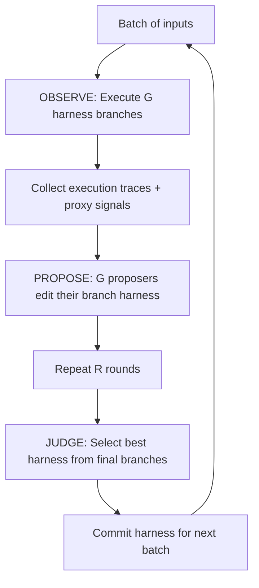
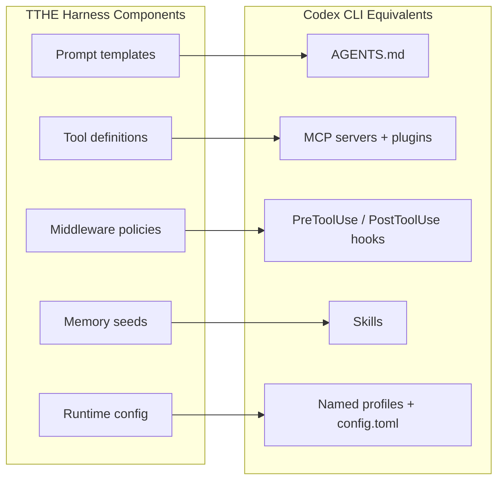
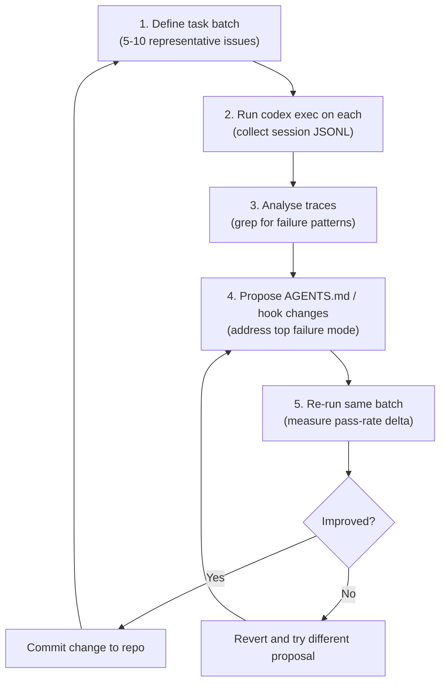

# Test-Time Harness Evolution: What TTHE Reveals About Self-Improving Coding Agents — and How to Apply the Same Principles to Your Codex CLI Configuration Stack


---

## The Core Insight: Evolve the Harness, Not the Model

On 9 July 2026, Nie et al. published *TTHE: Test-Time Harness Evolution* (arXiv:2607.08124), a paper that reframes how we think about improving coding agent performance [^1]. The central claim is deceptively simple: instead of fine-tuning the model or swapping to a more expensive one, you can systematically evolve the *harness* — the executable control program surrounding a frozen LLM — using only unlabelled execution traces the agent produces during evaluation.

The results are striking. On a hard 50-question BIRD text-to-SQL slice, a baseline ReAct harness around DeepSeek V4 Flash scored 12.0 per cent; after TTHE's automated evolution loop, the same frozen model reached 50.0 per cent — a 38-point lift with zero weight updates [^1]. Across five domains (text-to-SQL, competitive coding, software engineering, data science, and agentic tool use), TTHE consistently improved fixed baseline harnesses by 6 to 38 percentage points [^1].

For Codex CLI practitioners, this matters because every element of the Codex customisation stack — AGENTS.md, skills, hooks, named profiles, and approval policies — constitutes exactly the kind of harness surface that TTHE demonstrates can be optimised through systematic feedback loops.

## How TTHE Works

TTHE operates a population-based generate-and-judge loop with three label-free operators [^1]:



### The Three Operators

**Observe** executes each candidate harness on the current batch of inputs and collects execution traces alongside three proxy signals — none of which require ground-truth labels [^1]:

- **Execution health**: a binary 0/1 indicator for well-formed results
- **Round-trip consistency**: a score in [0,1] obtained by inverting the output back to the input
- **Public-test pass rate**: the fraction of visible tests passed, also in [0,1]

**Propose** runs G parallel proposers, each of which reads other branches' traces and edits its own harness accordingly. This is where the actual evolution happens: the proposer identifies failure patterns in the traces and modifies the control program to address them.

**Judge** selects one harness from the final set of candidates using only execution-derived evidence — no gold labels, no human evaluation.

### Default Configuration

The optimal configuration uses G=3 branches, R=3 evolution rounds, and B=10 batch size [^1]. Cross-batch accumulation (carrying harness improvements forward) outperforms resetting each batch by 6 points on BIRD [^1].

## Quantitative Results Across Five Domains

| Domain | Baseline | TTHE | Improvement |
|---|---|---|---|
| BIRD text-to-SQL (50 hard) | 12.0% | 50.0% | +38.0 pp |
| SWE-bench Verified (40 instances) | 20.0% | 35.0% | +15.0 pp |
| LiveCodeBench (60 hard) | 30.0% | 38.3% | +8.3 pp |
| DS-1000 (50 hard) | 38.0% | 44.0% | +6.0 pp |
| claw-eval tool use (30 tasks) | 48.9% | 69.8% | +20.9 pp |

*Source: Nie et al. Table 1 [^1]*

The SWE-bench Verified result is particularly relevant: a 15-point lift on software engineering tasks through harness evolution alone, with the model weights entirely frozen.

### Cross-Model Validation

TTHE is not model-specific. On the BIRD hard slice [^1]:

- DeepSeek V4 Flash: 12.0% → 50.0% (+38.0 pp)
- MiMo V2.5: 32.0% → 52.0% (+20.0 pp)
- Kimi K2.5: 28.0% → 48.0% (+20.0 pp)

This validates the hypothesis that harness quality is orthogonal to model capability — a weaker model with a better harness can match or exceed a stronger model with a naive harness.

## What the Evolved Harnesses Discovered

The most practically useful finding is what TTHE's evolution loop *independently rediscovered* as effective harness policies. These are not hand-crafted; they emerged from automated trace analysis [^1]:

**For software engineering (SWE-bench):**
- Reproduce-first debugging workflow — reproduce the bug before attempting a fix
- Root-cause localisation — narrow the search space before editing
- Anti-paralysis failsafe — detect empty-patch loops and force a fresh approach

**For tool use (claw-eval):**
- Single-line tool payloads for reliability
- Identifier citation with completeness checks
- Exact-identifier service chaining

**For text-to-SQL (BIRD):**
- Database value grounding for exact casing
- Output-shape verification before submission
- Execute-and-debug loops with targeted error messages

These are precisely the kinds of policies that experienced Codex CLI users encode in AGENTS.md and hooks. The difference is that TTHE discovers them automatically.

## Mapping TTHE to the Codex CLI Configuration Stack

TTHE's harness components map directly to Codex CLI's customisation surfaces. Here is how each TTHE concept translates:



### 1. AGENTS.md as Evolvable Prompt Template

TTHE demonstrates that prompt-layer modifications — adding constraints, restructuring instructions, inserting debugging protocols — account for a large fraction of the performance gains [^1]. In Codex CLI, AGENTS.md is the primary prompt template surface [^2].

The TTHE-informed approach to AGENTS.md authoring:

1. Run a batch of representative tasks
2. Review session JSONL logs for failure patterns (the **Observe** step)
3. Add constraints to AGENTS.md that address the most common failure mode (the **Propose** step)
4. Re-run the same batch and measure improvement (the **Judge** step)
5. Accumulate successful changes; revert unsuccessful ones

```toml
# ~/.codex/config.toml — enable session logging for trace collection
[history]
persistence = "full"
save_session_logs = true
```

### 2. Hooks as Middleware Policies

TTHE's middleware layer — policies that intercept and modify agent behaviour between turns — maps directly to Codex CLI's `PreToolUse` and `PostToolUse` hooks [^3]. The reproduce-first debugging workflow that TTHE discovered for SWE-bench is implementable as a PreToolUse hook:

```bash
#!/usr/bin/env bash
# hooks/reproduce-first.sh
# Block file edits until a reproduction script has been run

TOOL_NAME="$CODEX_TOOL_NAME"
COMMAND="$CODEX_TOOL_INPUT"

if [[ "$TOOL_NAME" == "write" || "$TOOL_NAME" == "edit" ]]; then
  if ! grep -q "reproduce\|repro\|test.*fail" /tmp/codex-session-actions.log 2>/dev/null; then
    echo '{"decision":"block","reason":"Run a reproduction script before editing files. Reproduce the bug first, then fix it."}' >&2
    exit 2
  fi
fi
```

Register in `config.toml`:

```toml
[[hooks]]
event = "PreToolUse"
command = ["bash", "hooks/reproduce-first.sh"]
```

### 3. Skills as Memory Seeds

TTHE's *memory seeds* — pre-loaded context that biases the agent's initial approach — correspond to Codex CLI skills [^4]. A skill packages a workflow that the agent inherits automatically when the task matches. TTHE's finding that cross-batch accumulation outperforms reset by 6 points [^1] validates the practice of committing successful patterns as durable skills rather than relying on per-session rediscovery.

### 4. Named Profiles as Runtime Configuration

TTHE discovered that optimal configuration (batch size, branch count, evolution rounds) is domain-dependent [^1]. Codex CLI named profiles serve the same function — packaging model selection, sandbox mode, approval policy, and hook sets into switchable units [^5]:

```toml
# ~/.codex/debug.config.toml
model = "o3"
model_reasoning_effort = "high"
sandbox_mode = "workspace-write"

[approval_policy]
mode = "granular"
auto_approve = ["read", "search", "test"]
prompt_on = ["write", "execute"]
```

Activate with `codex --profile debug`, switching the entire harness configuration in one flag.

## The Oracle Gap: Where Automated Evolution Falls Short

TTHE's ablation studies reveal an important limitation. The pool oracle (best candidate in the judge's selection set) reaches 64.0 per cent on BIRD, but the all-candidates oracle (best candidate ever generated) reaches 70.0 per cent [^1]. The 6-point gap represents selection regret — the judge commits suboptimal candidates because proxy signals are imperfect.

For Codex CLI practitioners, this translates to a practical caution: automated harness evolution through trace analysis is powerful, but human review of evolved configurations remains valuable. The `--print-instructions` flag (available since approximately April 2026 [^2]) lets you inspect the merged AGENTS.md that Codex loaded, providing a review surface equivalent to TTHE's judge inspection.

## Implementing a Manual TTHE Loop

While Codex CLI does not yet offer automated harness evolution, you can implement the TTHE loop manually using existing primitives:



A concrete workflow using `codex exec`:

```bash
#!/usr/bin/env bash
# harness-evolution.sh — one iteration of manual TTHE

TASKS=("fix-auth-bug" "add-pagination" "refactor-logger" "update-deps" "add-tests")
PASS=0
TOTAL=${#TASKS[@]}

for task in "${TASKS[@]}"; do
  codex exec --profile eval \
    --output-schema '{"type":"object","properties":{"success":{"type":"boolean"}}}' \
    "Complete this task: $task" > "/tmp/result-$task.json" 2>/tmp/trace-$task.log

  if jq -e '.success' "/tmp/result-$task.json" >/dev/null 2>&1; then
    ((PASS++))
  fi
done

echo "Pass rate: $PASS / $TOTAL"
```

Run this before and after each AGENTS.md or hook modification to measure the delta — the manual equivalent of TTHE's Observe–Propose–Judge cycle.

## Broader Context: The Harness Engineering Convergence

TTHE sits within a rapidly maturing field. Agentic Harness Engineering (AHE, arXiv:2604.25850) demonstrated observability-driven automatic harness evolution, lifting GPT-5.4 from 69.7% to 77.0% over 10 iterations on Terminal-Bench 2 [^6]. Galster et al.'s MSR 2026 study of 2,853 repositories found that context files dominate the configuration surface of coding-agent repositories, with adoption across 2,586 of 2,853 analysed repositories [^7]. ⚠️ The convergence suggests that harness engineering — not model selection — is becoming the primary lever for practitioner-controlled performance improvement.

## Key Takeaways

1. **Harness quality is orthogonal to model capability.** TTHE proves that the control program around the LLM matters as much as the LLM itself — a 38-point lift with zero weight updates.

2. **Execution traces are the feedback signal.** Session JSONL logs in Codex CLI are the equivalent of TTHE's execution traces. Enable `history.persistence = "full"` and review them systematically.

3. **Accumulate, don't reset.** TTHE's 6-point advantage from cross-batch accumulation validates committing successful AGENTS.md and hook changes to version control rather than treating each session as a fresh start.

4. **Domain-specific harnesses outperform generic ones.** Named profiles in Codex CLI let you maintain separate evolved configurations for debugging, greenfield development, code review, and CI/CD — matching TTHE's finding that optimal configuration is domain-dependent.

5. **The judge is the bottleneck.** TTHE's oracle gap warns that automated selection of harness improvements is imperfect. Human review of configuration changes — inspecting what `--print-instructions` shows — remains essential.

---

## Citations

[^1]: Nie, J., Zhang, Y., Song, J., Cai, Q., Yu, D., Guo, Y., Tian, X. & Han, B. (2026). "TTHE: Test-Time Harness Evolution." *arXiv:2607.08124*. [https://arxiv.org/abs/2607.08124](https://arxiv.org/abs/2607.08124)

[^2]: OpenAI. (2026). "Custom instructions with AGENTS.md — Codex." *OpenAI Developers*. [https://developers.openai.com/codex/guides/agents-md](https://developers.openai.com/codex/guides/agents-md)

[^3]: OpenAI. (2026). "Hooks — Codex." *OpenAI Developers*. [https://developers.openai.com/codex/hooks](https://developers.openai.com/codex/hooks)

[^4]: OpenAI. (2026). "Build skills — Codex." *OpenAI Developers*. [https://developers.openai.com/codex/skills](https://developers.openai.com/codex/skills)

[^5]: OpenAI. (2026). "Advanced Configuration — Codex." *OpenAI Developers*. [https://developers.openai.com/codex/config-advanced](https://developers.openai.com/codex/config-advanced)

[^6]: Agentic Harness Engineering. (2026). "Observability-Driven Automatic Evolution of Coding-Agent Harnesses." *arXiv:2604.25850*. [https://arxiv.org/abs/2604.25850](https://arxiv.org/abs/2604.25850)

[^7]: Galster, M. et al. (2026). "Harness Engineering for Agentic AI Coding Tools: An Exploratory Study." *arXiv:2602.14690*, to appear at MSR 2026. [https://arxiv.org/abs/2602.14690](https://arxiv.org/abs/2602.14690)
