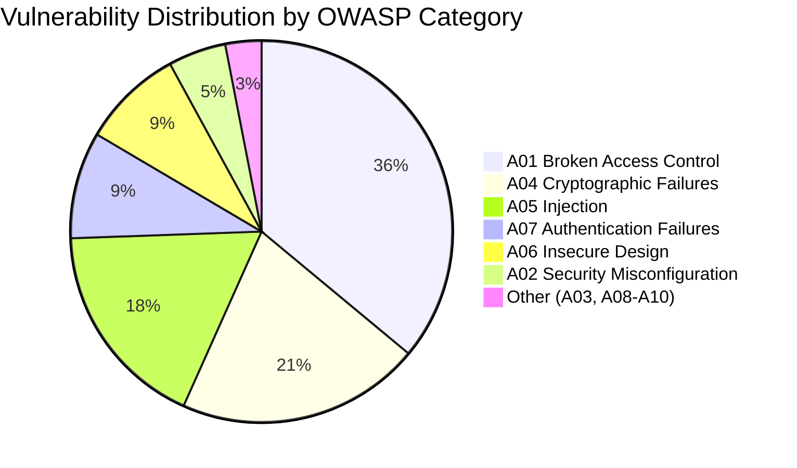
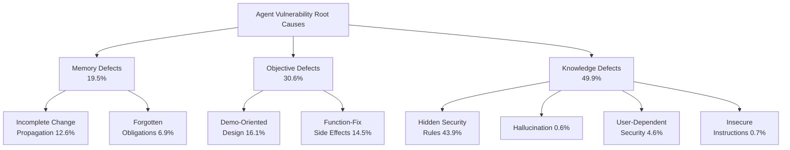
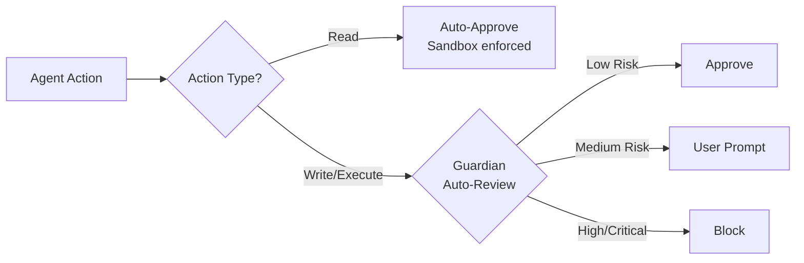

# The Insecurity of Vibe-Coded Applications: What 10,517 Real-World Apps Reveal About Agent Vulnerabilities — and How to Harden Your Codex CLI Workflow


---

Vibe coding — the practice of building entire applications through natural-language conversations with AI agents — has moved from novelty to mainstream. But a landmark empirical study published in June 2026 by Deng, Fan, and Meng systematically quantifies what many practitioners have suspected: the code these agents produce is riddled with security vulnerabilities at rates that dwarf traditionally-developed software [^1].

This article dissects their findings, maps the root-cause taxonomy onto the Codex CLI agent loop, and prescribes concrete configuration patterns that mitigate each failure mode.

## The Scale of the Problem

The researchers collected 10,517 vibe-coded applications from GitHub, filtered to repositories where both AI-authored commit proportion and AI-authored code lines exceeded 85 per cent [^1]. From this corpus they randomly sampled 200 deployed web applications and subjected them to a multi-agent auditing pipeline using Claude Code (Sonnet 4.6) and GitHub Copilot (GPT-5.3-Codex) with two independent security skill sets [^1].

The results are sobering:

- **90 per cent of audited repositories** contain at least one vulnerability [^1]
- **1,471 validated vulnerabilities** across 200 apps (median 7 per repo, mean 8.1) [^1]
- **76.7 per cent rated Critical or High severity** [^1]
- **Broken Access Control** appears in 75.5 per cent of repos — 20× higher than the OWASP 2025 baseline [^1]



The concentration in backend code (62.7 per cent of all vulnerabilities) confirms that agents generate functional but insecure server-side logic — the exact kind of code that Codex CLI produces when working on full-stack tasks [^1].

## Three Defect Classes: Why Agents Write Insecure Code

The study's most valuable contribution is its taxonomy of *why* these vulnerabilities arise. Rather than treating each bug as an isolated mistake, the authors identify three systemic defect classes with eight failure modes [^1].

### Memory Defects (19.5 per cent of vulnerabilities)

Security obligations are forgotten or inconsistently propagated across the development lifecycle.

- **Incomplete change propagation** (12.6 per cent): Authorisation middleware applied to a new router but omitted from 11 pre-existing handlers. In Codex CLI terms, this is what happens when the agent modifies one file but lacks the context window to propagate the change across the codebase [^1].
- **Forgotten obligations** (6.9 per cent): `TODO` and `FIXME` annotations for incomplete security logic shipped unresolved. Password verification marked incomplete during development, deployed as-is [^1].

### Objective Defects (30.6 per cent of vulnerabilities)

The agent prioritises immediate functional goals over long-term security correctness.

- **Demo-oriented design** (16.1 per cent): OAuth tokens stored in `localStorage` with base64 encoding "for demonstration purposes" that never gets replaced [^1].
- **Function-fix side effects** (14.5 per cent): A `bypass-login` route with hardcoded credentials introduced to circumvent authentication errors during debugging [^1].

### Knowledge Defects (49.9 per cent of vulnerabilities)

Neither agent nor user recognises the security requirement. This is the largest class.

- **Hidden security rules** (43.9 per cent): External responses serialised into the page via `document.write` without escaping, causing reflected XSS. The agent never knew to sanitise because the user never asked [^1].
- **Hallucination** (0.6 per cent): Code calling non-existent `crypto.createCipherGCM`, causing encryption to fail silently [^1].
- **User-dependent security** (4.6 per cent): Database backups in JSON files assumed to be git-ignored but committed publicly [^1].



## The Awareness–Action Gap

Perhaps the most troubling finding: **32 per cent of vulnerability-reintroducing runs showed agents that documented security concerns in code comments yet produced insecure code anyway** [^1]. The agent *knew* the pattern was dangerous, noted the risk, and shipped it regardless. This is not a knowledge problem — it is an objective alignment problem that no amount of model scaling alone will fix.

## Mitigation Effectiveness: What Actually Works

The researchers tested eight configurations across 360 runs, varying model capability, prompt strategy, and agent harness [^1]:

| Mitigation | Trigger Rate Reduction |
|---|---|
| "Production-ready" prompt | 40% → 13% (−27pp) |
| "Self-check" prompt | 40% → 18% (−22pp) |
| Hardened agent harness | 40% → 22% (−18pp) |
| Larger model (Opus 4.7) | 40% → 33% (−7pp) |
| "Professional" prompt | 40% → 56% (+16pp, **worse**) |

Two findings stand out. First, prompt engineering ("write production-ready code" and "review your changes for security issues") outperforms model scaling [^1]. Second, asking for "professional" code *increased* vulnerability rates — the agent interpreted "professional" as "well-documented and feature-complete" rather than "secure" [^1].

## Mapping Defences onto Codex CLI

Codex CLI's layered security architecture — sandbox, approval policy, AGENTS.md, hooks, and Guardian auto-review — provides precisely the defence-in-depth the study recommends [^2][^3]. Here is a concrete hardening configuration addressing each defect class.

### Layer 1: Sandbox and Approval Policy

The sandbox is your hardware backstop. Even if the agent writes insecure code, the sandbox constrains what it can *execute* during development [^2].

```toml
# ~/.codex/security-hardened.config.toml
sandbox_mode = "workspace-write"
approval_policy = "on-request"

[sandbox_workspace_write]
network_access = false  # deny outbound by default

[features.network_proxy]
enabled = true
domains = { "api.openai.com" = "allow", "registry.npmjs.org" = "allow", "*" = "deny" }
```

This addresses **objective defects**: the agent cannot create a `bypass-login` route that phones home, because outbound network access is denied except to explicitly allowlisted domains [^2].

### Layer 2: AGENTS.md Security Anchors

The study's "production-ready" prompt reduced vulnerabilities by 27 percentage points [^1]. Encode this permanently in your project's `AGENTS.md`:

```markdown
## Security Requirements

You are writing production-ready code. Every change must satisfy:

1. **Input validation**: All user input is validated and sanitised server-side before use.
2. **Authentication**: Every route serving user data requires authentication middleware.
3. **Secrets**: Never hardcode API keys, tokens, or credentials. Use environment variables.
4. **Cryptography**: Use established libraries (bcrypt, argon2, libsodium). Never roll custom crypto.
5. **Access control**: Apply authorisation checks to EVERY endpoint, not just new ones.
6. **No TODOs in security code**: If a security feature is incomplete, fail closed — do not ship a placeholder.

Before completing any task, review your changes against the OWASP Top 10 (2025).
Do NOT create demonstration, bypass, or convenience routes.
```

This directly counters **knowledge defects** (the 43.9 per cent "hidden security rules" category) by making implicit security requirements explicit [^1][^4].

### Layer 3: PreToolUse Hooks for Memory-Defect Detection

Memory defects arise when the agent modifies some files but forgets to propagate security changes across the codebase. A `PreToolUse` hook can enforce propagation checks [^3]:

```toml
# ~/.codex/hooks.toml
[[hooks]]
event = "PreToolUse"
tool = "write_file"
command = "bash -c 'if echo \"$CODEX_TOOL_INPUT\" | grep -q \"middleware\\|auth\\|permission\"; then echo \"SECURITY: Verify this auth change is propagated to ALL route files. Run: grep -rn router articles/ src/\" >&2; fi'"
```

This injects a reminder into the agent's context whenever it writes authentication-related code — precisely targeting the **incomplete change propagation** failure mode that accounts for 12.6 per cent of all vulnerabilities [^1].

### Layer 4: Guardian Auto-Review as Self-Check

The study's "self-check" prompt reduced vulnerabilities by 22 percentage points [^1]. Codex CLI's Guardian auto-review implements this structurally — a separate reviewer agent evaluates every action before execution [^5]:

```toml
approvals_reviewer = "auto_review"
```

Guardian specifically screens for data exfiltration, credential probing, persistent security weakening, and destructive actions [^5]. This catches **objective defects** where the primary agent relaxes security boundaries to fix a functional bug.

### Layer 5: The "writes" Approval Mode

Codex CLI v0.144.0 introduced the `writes` approval mode, which auto-approves read-only operations but requires authorisation for any modification [^6]. For security-sensitive codebases, this mode provides the strongest default:

```toml
approval_policy = { granular = {
  sandbox_approval = true,
  rules = true,
  mcp_elicitations = true,
  request_permissions = false
}}
```



## A Practical Hardening Checklist

Based on the study's defect taxonomy and Codex CLI's security primitives:

| Defect Class | Failure Mode | Codex CLI Defence |
|---|---|---|
| Memory | Incomplete propagation | AGENTS.md: "Apply auth to ALL routes" + PreToolUse grep hook |
| Memory | Forgotten obligations | AGENTS.md: "No TODOs in security code — fail closed" |
| Objective | Demo-oriented design | Sandbox: network deny-by-default; AGENTS.md: "No bypass routes" |
| Objective | Function-fix side effects | Guardian auto-review screens for security weakening |
| Knowledge | Hidden security rules | AGENTS.md: explicit OWASP checklist + "production-ready" anchor |
| Knowledge | Hallucination | PostToolUse hook: lint/typecheck after every code write |
| Knowledge | User-dependent security | `.gitignore` pre-populated; sandbox protects `.env` paths |

## The Systemic Lesson

The study's central insight is that vibe-coding insecurity is not a model problem — it is a *system* problem arising from the interaction of stateless context, short-term optimisation, incomplete knowledge, and responsibility misalignment between agent and user [^1]. No single mitigation eliminates all vulnerability classes.

Codex CLI's architecture already provides every defensive layer the researchers recommend: sandboxing constrains execution, AGENTS.md anchors security intent, hooks enforce propagation, Guardian provides independent review, and the `writes` approval mode defaults to least privilege. The gap is configuration, not capability.

The 27-percentage-point reduction from a single "production-ready" prompt line should make every Codex CLI user audit their AGENTS.md today.

## Citations

[^1]: Deng, J., Fan, Z., and Meng, R. (2026). "Understanding the (In)Security of Vibe-Coded Applications." arXiv:2606.23130v2. [https://arxiv.org/abs/2606.23130](https://arxiv.org/abs/2606.23130)

[^2]: OpenAI. "Agent Approvals & Security — Codex CLI." OpenAI Developers Documentation, 2026. [https://developers.openai.com/codex/agent-approvals-security](https://developers.openai.com/codex/agent-approvals-security)

[^3]: OpenAI. "Codex Security." OpenAI Developers Documentation, 2026. [https://developers.openai.com/codex/security](https://developers.openai.com/codex/security)

[^4]: OWASP Foundation. "OWASP Top 10:2025." [https://owasp.org/Top10/](https://owasp.org/Top10/)

[^5]: OpenAI. "Auto-review — Codex CLI." OpenAI Developers Documentation, 2026. [https://developers.openai.com/codex/concepts/sandboxing/auto-review](https://developers.openai.com/codex/concepts/sandboxing/auto-review)

[^6]: OpenAI. "Codex CLI v0.144.0 Release Notes." GitHub, July 2026. [https://github.com/openai/codex/releases/tag/rust-v0.144.0](https://github.com/openai/codex/releases/tag/rust-v0.144.0)
