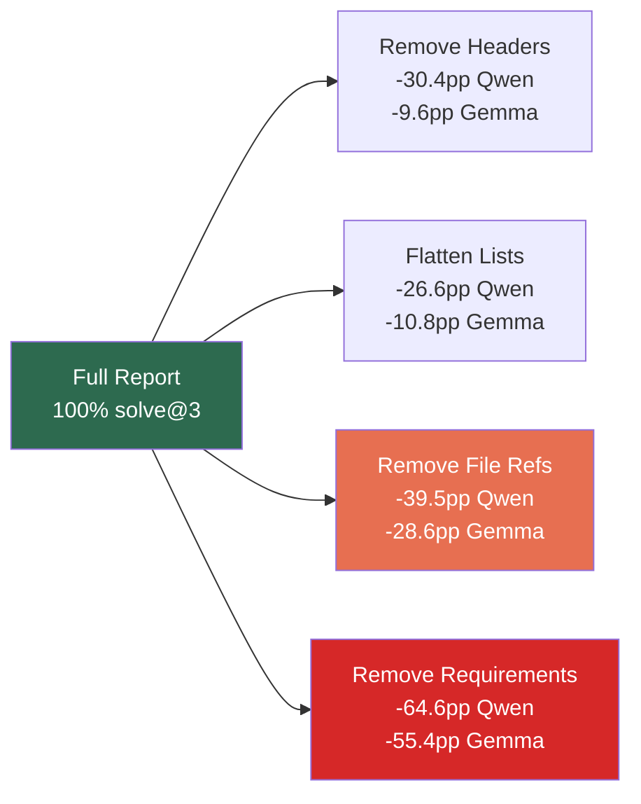
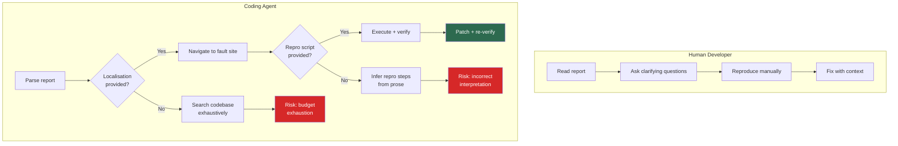

# What Makes a Good Bug Report for an AI Agent? Evidence from 37,671 Outcomes — and How to Wire Agent-Optimised Issue Templates into Your Codex CLI Workflow


---

Bug reports have always mattered. What has changed is who reads them first. As coding agents increasingly triage, reproduce, and patch issues autonomously, the question shifts from "Can a human understand this?" to "Can an agent act on it?" Khatib et al. answered that question empirically on 8 July 2026, and the results should change how every team writes issue templates [^1].

## The Study at a Glance

The paper runs two complementary studies. Study 1 fits a mixed-effects logistic regression across 433 SWE-bench Verified instances resolved by 87 different repair agents — 37,671 total agent–instance outcomes with an overall solve rate of 47.7 per cent [^1]. Study 2 isolates causation through controlled ablation experiments on 283 bug-fix-labelled instances from SWE-bench Pro, testing Qwen3.6-35B-A3B and Gemma-4-31B-IT across 17 mutation conditions with three runs each [^1].

The headline finding inverts conventional wisdom: **natural-language prose clarity contributes little, and longer reports actively harm resolution**. A one-standard-deviation increase in report length correlated with 51 per cent lower odds of resolution [^1].

## What Helps: The Six Features That Move the Needle

The regression model identifies six statistically significant predictors of agent success:

| Feature | Odds Ratio | 95% CI | Practical Implication |
|---------|-----------|--------|----------------------|
| Fix suggestion | 3.61 | [2.01, 6.47] | Even a candidate approach or workaround hint helps |
| Repository source code | 2.82 | [1.23, 6.44] | Inline code excerpts outperform isolated snippets |
| Reproduction script | 2.52 | [1.41, 4.51] | Executable repro, not prose steps |
| File localisation | 2.33 | [1.18, 4.60] | Name the files that need changing |
| SMOG readability (z) | 1.55 | [1.18, 2.04] | Higher complexity prose slightly helps |
| Report length (z) | 0.49 | [0.35, 0.68] | Shorter is better — 51% odds reduction per SD |

The variance decomposition reveals that instance-level difficulty (variance 5.98) dwarfs agent-level variance (1.99) [^1]. In plain terms: the quality of the bug report matters roughly three times more than the choice of agent.

## What Hurts: The Ablation Evidence

Study 2's controlled ablations quantify the damage when specific elements are removed. Removing requirements caused the steepest drops — 64.6 percentage points for Qwen, 55.4 for Gemma [^1]. But purely structural mutations — removing section headers or flattening lists without deleting any content — also caused significant degradation:



The most striking result: **formatting alone changes outcomes**. Removing section headers cost Qwen 30.4 percentage points even though zero content was deleted [^1]. Agents parse structure, not just semantics.

## Model-Dependent Strategies Exposed

The ablation experiments revealed two contrasting failure modes when information is missing:

**Qwen (the searcher):** expands search scope, writes independent reproduction scripts, executes additional verification tests. Risk: exhausts the 50-turn budget without committing a patch [^1].

**Gemma (the committer):** locks onto a plausible interpretation early, implements patches from ambiguous specifications without extensive verification. Risk: patches reflect an incorrect understanding [^1].

These strategies map directly to how you should tune your Codex CLI configuration depending on which failure mode you want to mitigate.

## Mapping the Evidence to Codex CLI

### 1. Agent-Optimised Issue Templates

The paper's findings translate into a concrete GitHub issue template. Place this in `.github/ISSUE_TEMPLATE/bug-report-agent.yml`:

```yaml
name: "Bug Report (Agent-Optimised)"
description: "Structured for automated repair agents"
labels: ["bug", "agent-triageable"]
body:
  - type: input
    id: fault-location
    attributes:
      label: "Fault location (file path + function)"
      description: "e.g. src/auth/session.rs::validate_token"
    validations:
      required: true
  - type: textarea
    id: repro-script
    attributes:
      label: "Reproduction script"
      description: "Paste an executable script that triggers the bug"
      render: bash
    validations:
      required: true
  - type: textarea
    id: expected-behaviour
    attributes:
      label: "Expected behaviour"
      description: "What should happen when the script runs correctly"
    validations:
      required: true
  - type: textarea
    id: observed-behaviour
    attributes:
      label: "Observed behaviour"
      description: "What actually happens (include error output)"
    validations:
      required: true
  - type: textarea
    id: fix-suggestion
    attributes:
      label: "Fix suggestion or workaround"
      description: "Even a rough approach helps (OR 3.61)"
    validations:
      required: false
  - type: textarea
    id: relevant-code
    attributes:
      label: "Relevant source code"
      description: "Inline the code around the fault site"
      render: rust
    validations:
      required: false
```

This template encodes the paper's top four predictors as required or prompted fields, whilst keeping the report compact — directly addressing the length penalty [^2].

### 2. AGENTS.md Issue-Handling Instructions

Wire fault-localisation discipline into your project's `AGENTS.md` so that Codex CLI reads it before every session [^3]:

```markdown
## Bug-Fix Workflow

When resolving a GitHub issue:
1. Read the fault-location field FIRST — start navigation there
2. Run the reproduction script before reading surrounding code
3. If no reproduction script exists, write one before attempting a fix
4. Limit search scope to files named in the issue ± their direct imports
5. After patching, re-run the reproduction script to verify the fix
6. Do NOT expand search beyond the localised scope unless the repro still fails after two attempts
```

This addresses both failure modes the paper identified: it constrains Gemma-style premature commitment by requiring repro verification, and it bounds Qwen-style unbounded search by anchoring to the fault location [^1].

### 3. Named Profiles for Bug-Fix Sessions

Create a dedicated `bugfix` profile in `~/.codex/bugfix.config.toml` that optimises for the constrained, verification-heavy workflow the paper's evidence supports [^4]:

```toml
model = "o4-mini"
model_reasoning_effort = "high"
approval_policy = "unless-allow-listed"

[options]
rollout_budget = 200000
tool_output_token_limit = 8192
```

The lower `rollout_budget` prevents the unbounded search pattern. The `tool_output_token_limit` caps ingestion of large files — the paper shows that more context does not help unless it is the *right* context [^1]. Activate it with:

```bash
codex --profile bugfix "Fix issue #247"
```

### 4. Goal Mode for Multi-File Bug Fixes

For bugs that span multiple modules, use `/goal` with an explicit fault-localisation anchor [^5]:

```bash
codex --profile bugfix
> /goal Fix the session validation race condition described in issue #247. \
>   Fault location: src/auth/session.rs::validate_token and \
>   src/auth/middleware.rs::extract_session. \
>   Reproduction: run tests/auth/test_race.sh
```

The `/goal` command's persistent agentic loop handles the multi-turn verification cycle the paper shows is necessary — run repro, patch, re-run repro — without the agent losing context between turns [^5].

### 5. PreToolUse Hooks for Search Bounding

The paper's evidence on unbounded search degradation maps to Codex CLI's hook system. A `PreToolUse` hook can enforce the localisation constraint from your AGENTS.md:

```markdown
## PreToolUse Constraints

When the active task is a bug fix with a specified fault location:
- APPROVE file reads within the same directory as the fault location
- APPROVE file reads for direct imports of the fault-location file
- REQUIRE JUSTIFICATION for file reads more than two directories away
- DENY web searches unless the reproduction script requires external data
```

This mirrors the paper's finding that removing file references caused 28.6–39.5 percentage-point solve-rate drops — the inverse is also true: *constraining* the agent to the right files improves outcomes [^1] [^6].

## The Core Insight: Reports Serve Agents Differently

The paper's central contribution deserves quoting directly: "A report serves an agent well when it reduces what the agent must work out on its own" [^1]. Unlike human developers who clarify ambiguities interactively, autonomous agents commit to inferences without verification. Every piece of missing information becomes a fork in a search tree — and most forks lead nowhere.



The practical upshot: if your team runs Codex CLI against GitHub issues — whether through `/goal`, automated triage, or CI-triggered repair — the issue template is now part of your agent infrastructure. Treat it with the same rigour you apply to `AGENTS.md` and `config.toml`.

## Limitations and Open Questions

The study has acknowledged constraints worth noting. Study 1 is observational and cannot establish causation — the regression identifies associations, not mechanisms [^1]. SWE-bench Verified instances may contain solution leakage from training data. Study 2 tested only two open-weight models; proprietary models like Claude Sonnet 4.6 showed similar patterns on a 10-instance pilot but lack statistical power [^1].

The 27 features examined use binary coding (present/absent), which ignores quality gradations — a mediocre reproduction script and an excellent one score identically [^1]. And the results come exclusively from open-source GitHub issues; industrial bug-tracking systems with richer metadata fields (Jira custom fields, internal wikis, linked telemetry) remain untested.

⚠️ The paper does not test Codex CLI directly as a repair agent. The mapping to Codex CLI configuration is the author's practical interpretation of the evidence, not a claim validated by the study.

## What to Do on Monday

1. **Add the agent-optimised issue template** to your repository's `.github/ISSUE_TEMPLATE/` directory
2. **Update your AGENTS.md** with the fault-localisation-first workflow
3. **Create a `bugfix` named profile** with constrained rollout budget
4. **Brief your team**: reproduction scripts and file paths are no longer optional niceties — they are the two fields with the highest causal impact on automated resolution
5. **Audit your existing open issues**: add fault-location annotations to the top 10 bugs you want Codex to tackle first

The evidence is clear: what makes a good bug report for an AI agent is not better prose — it is better structure, better localisation, and less of everything else.

---

## Citations

[^1]: Khatib, L., Mathews, N.S., Nagappan, M., Nie, P. & Zimmermann, T. (2026). "What Makes a Good Bug Report for an AI Agent?" *arXiv:2607.07593*. [https://arxiv.org/abs/2607.07593](https://arxiv.org/abs/2607.07593)

[^2]: GitHub. (2026). "Configuring issue templates for your repository." [https://docs.github.com/en/communities/using-templates-to-encourage-useful-issues-and-pull-requests](https://docs.github.com/en/communities/using-templates-to-encourage-useful-issues-and-pull-requests)

[^3]: OpenAI. (2026). "Custom instructions with AGENTS.md — Codex CLI." [https://developers.openai.com/codex/guides/agents-md](https://developers.openai.com/codex/guides/agents-md)

[^4]: OpenAI. (2026). "Advanced Configuration — Codex CLI." [https://developers.openai.com/codex/config-advanced](https://developers.openai.com/codex/config-advanced)

[^5]: OpenAI. (2026). "Codex CLI v0.128: Goal Workflows." Codex Changelog. [https://developers.openai.com/codex/changelog](https://developers.openai.com/codex/changelog)

[^6]: OpenAI. (2026). "Configuration Reference — Codex CLI." [https://developers.openai.com/codex/config-reference](https://developers.openai.com/codex/config-reference)
