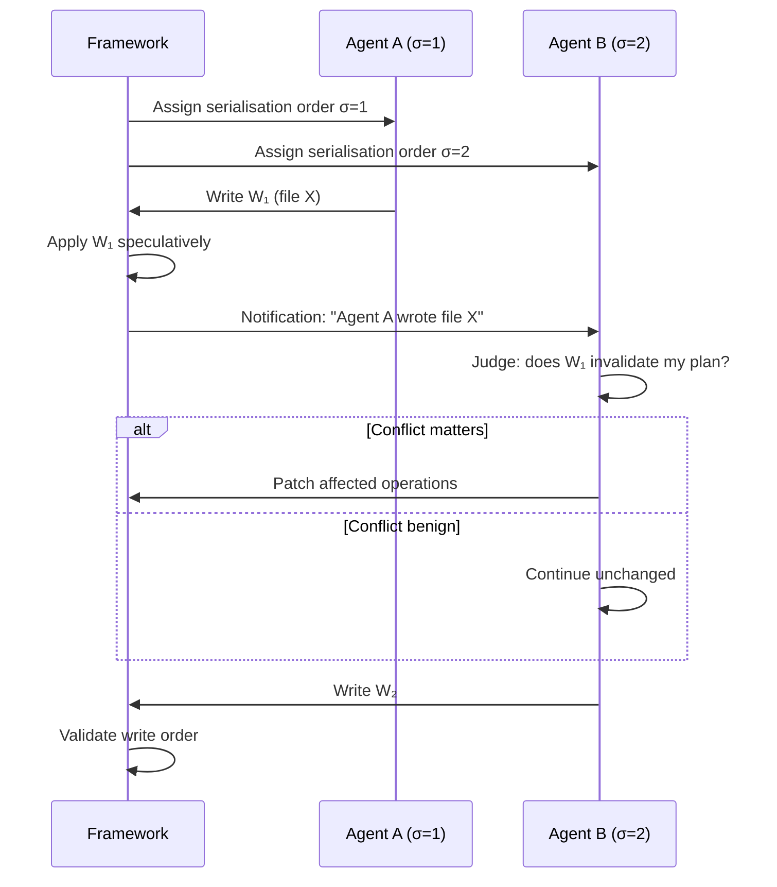
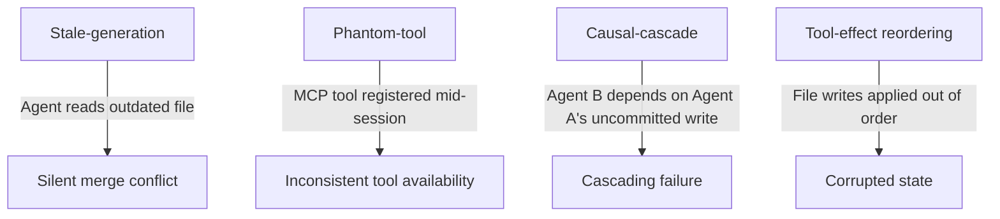

# CoAgent and the Concurrency Problem Your Parallel Agents Are Ignoring: Why MTPO Beats Locks and Rollbacks for Multi-Session Codex CLI Workflows


---

Codex CLI v0.144.0 now warns when selecting Ultra reasoning mode with high multi-agent concurrency[^1]. The warning is polite, but the problem it hints at is not: when two or more agents mutate the same git tree, Kubernetes cluster, or shared state concurrently, classical concurrency control — locks, optimistic rollbacks — fails catastrophically for LLM workloads. Lyu et al.'s CoAgent paper (arXiv:2606.15376, June 2026) quantifies exactly how badly, and proposes a protocol called MTPO that exploits the one thing agents have that database transactions do not: the ability to judge whether a conflict actually matters[^2].

This article unpacks CoAgent's findings, maps them to Codex CLI's parallel session architecture, and shows how to wire advisory concurrency into your multi-agent workflows today.

## The Problem: Agents Are Not Transactions

The standard framing treats each agent session as a serialisable transaction. Two agents read the codebase, plan changes, write files, and commit. If their write sets overlap, somebody loses. Database engineers solved this decades ago with two-phase locking (2PL) and optimistic concurrency control (OCC). Neither transfers well to LLM agents.

CoAgent tested both on ten contended workloads across office automation (WorkBench) and Kubernetes operations (AIOpsLab)[^2]. The results are stark:

| Approach | Speedup vs Serial | Deadlocks/Aborts per Trial | Token Cost vs Serial |
|----------|-------------------|---------------------------|---------------------|
| 2PL      | 1.04×             | 0.81 deadlocks            | ~1.0×               |
| OCC      | 0.93× (slower)    | 0.95 aborts               | 1.83× (peak 2.33×)  |
| MTPO     | 1.40×             | 0 (advisory)              | 1.15×               |

Two-phase locking produces near-serial throughput because agent inference times are long and read sets are broad — every lock is held for minutes rather than milliseconds[^2]. OCC is worse still: aborting an agent discards minutes of LLM reasoning, then replays the entire trajectory at full token cost. At 0.93× serial throughput and nearly double the token spend, OCC is actively harmful[^2].

## MTPO: The Advisory Protocol

CoAgent's Monotonic Trajectory Pre-Order (MTPO) protocol rests on a single insight: the agent closest to the task can judge whether a peer's write invalidates its own premises, and can surgically repair only the affected operations rather than restarting from scratch[^2].

The protocol works in three steps:



1. **Order assignment** — agents receive a fixed serialisation index σ at launch. All reads are filtered through this order, so Agent B always sees Agent A's committed writes[^2].

2. **Speculative writes** — writes apply in-place immediately rather than buffering. The framework tracks read/write footprints for each tool call and identifies conflicts when one agent's write set intersects another's footprint[^2].

3. **Advisory notification** — when a conflict is detected, the framework appends a notification to the affected agent's context. The LLM judges whether the change matters for its plan and issues corrective operations if needed. No abort, no restart[^2].

### Saga-Style Inverses

Every tool registers three phases: **prepare** (capture state for reversal), **exec** (run the operation), and **reverse** (self-contained script to restore pre-execution state)[^2]. For Kubernetes operations, a `kubectl apply` is reversed by re-applying the manifest it displaced. For git operations, a file write is reversed by restoring the previous content.

Unrecoverable operations — external API calls, email sends — are held until every lower-σ agent has committed, sacrificing concurrency only where genuinely necessary[^2].

## Correctness and Performance

Across one hundred trials on ten contended workloads, MTPO achieved correctness within 5 per cent of serial execution[^2]. The five violations were attributed to agent judgement errors — the LLM misjudged a conflict's relevance — rather than protocol failures. This is a fundamentally different failure mode from 2PL deadlocks or OCC cascading aborts: it degrades gracefully rather than catastrophically.

On cold-start scenarios in AIOpsLab, CoAgent grew a 25-tool library online and completed 63 of 71 Kubernetes remediation tasks versus 45 for the bash baseline, at 0.80× the time and 0.86× the cost of serial execution[^2].

## Where Codex CLI Sits Today

Codex CLI's current multi-agent story relies on three isolation mechanisms, none of which implement concurrency control:

### Git Worktrees

The recommended pattern for parallel sessions is separate worktrees[^3]. Each `codex` instance operates on an isolated branch, and conflicts surface at merge time. This is effectively manual OCC with human-mediated conflict resolution — workable for independent features, but inadequate when agents need to coordinate on shared infrastructure or overlapping files.

### Session Fork

The `/fork` command creates a new session branched from an existing one[^4]. The original transcript is preserved, but the forked session shares no state synchronisation with its parent. Two forked sessions editing the same module will silently diverge.

### Ultra Mode Subagents

GPT-5.6 Sol's Ultra mode spawns multiple specialised subagents working in parallel on sub-problems[^5]. The v0.144.0 warning about high concurrency accelerating usage reflects a real coordination gap: these subagents share context but lack formal conflict detection[^1]. The orchestrator synthesises results, but there is no mechanism equivalent to MTPO's advisory notifications between subagents.

## Mapping CoAgent Patterns to Codex CLI

CoAgent's protocol is framework-level, not model-level. Implementing it within Codex CLI's current architecture requires bridging four gaps:

### 1. Footprint Declaration via AGENTS.md

AGENTS.md already supports file-level ownership declarations. Extending this to declare read/write footprints per task type would give a coordination layer enough information to detect conflicts:

```markdown
## Concurrency Footprints

- **api-refactor**: reads `src/api/**`, writes `src/api/handlers/**`
- **database-migration**: reads `migrations/**`, `src/models/**`, writes `migrations/**`
- **ci-config**: reads `.github/**`, writes `.github/workflows/**`
```

When two agents' declared footprints overlap, a coordinator can assign serialisation order and route notifications.

### 2. PostToolUse Hooks as Notification Channel

Codex CLI's PostToolUse hooks fire after every tool execution[^6]. A concurrency-aware hook could compare each write against peer agents' active read sets and inject advisory context:

```toml
# config.toml — concurrency notification hook
[hooks.post_tool_use]
command = "concurrency-check --session-id $SESSION_ID --write-path $CHANGED_FILES"
```

The hook output would append to the agent's context, mimicking MTPO's notification mechanism. The agent then judges relevance during its next inference step — exactly CoAgent's advisory pattern.

### 3. Named Profiles for Concurrency Policy

Different workloads demand different concurrency strategies. Named profiles can encode this:

```toml
# parallel-safe.config.toml — for independent feature work
[concurrency]
strategy = "worktree-isolation"
merge_policy = "manual"

# coordinated.config.toml — for shared-state tasks
[concurrency]
strategy = "advisory-mtpo"
serialisation_order = "launch-time"
notification_channel = "posttooluse-hook"
```

### 4. Session JSONL as Audit Trail

Every Codex CLI session writes a JSONL transcript to `~/.codex/sessions/`[^4]. For coordinated multi-agent runs, these transcripts provide the forensic trail CoAgent's framework uses for post-hoc correctness verification. A lightweight analyser could replay two concurrent session logs and flag undetected conflicts.

## The Verified Detection Complement

Khan's concurrent work on verified concurrency anomaly detection (arXiv:2606.17182) formalises four failure modes specific to multi-agent LLM systems: stale-generation, phantom-tool, causal-cascade, and tool-effect reordering[^7]. The research provides 274 mechanically verified Verus proof obligations and three Rust runtime implementations, including reproduction of a real silent lost-update bug in ByteDance's deer-flow system[^7].

These anomalies map directly to Codex CLI scenarios:



The combination of CoAgent's advisory protocol with Khan's verified detection creates a defence-in-depth approach: MTPO prevents conflicts through advisory notifications, whilst verified anomaly detection catches the edge cases where agent judgement fails[^2][^7].

## Practical Recommendations

**For teams running parallel Codex CLI sessions today:**

1. **Use worktrees for feature isolation** — this remains the safest default. Each `codex --profile feature-work` session gets its own worktree, its own branch, and merges are human-mediated.

2. **Declare file ownership in AGENTS.md** — even without automated enforcement, explicit footprint declarations prevent two developers from launching agents against overlapping scopes.

3. **Monitor Ultra mode concurrency** — heed the v0.144.0 warning. Ultra subagents sharing a context window can and do write to the same files. Use `model_reasoning_effort = "high"` as a single-agent quality dial before reaching for Ultra's multi-agent orchestration[^5].

4. **Audit concurrent sessions post-hoc** — compare session JSONL logs from parallel runs. If two sessions touched the same files, review the merge manually rather than auto-committing.

**For the Codex CLI roadmap:**

CoAgent demonstrates that advisory concurrency control is both feasible and superior to classical approaches for LLM workloads. The 1.4× speedup at 1.15× token cost is compelling enough that framework-level MTPO support — serialisation ordering, footprint tracking, advisory notifications via hooks — would meaningfully improve Codex CLI's multi-agent story without requiring changes to the underlying models.

## Conclusion

The v0.144.0 Ultra concurrency warning is a symptom of a deeper architectural gap. Codex CLI's parallel session model relies on isolation (worktrees) or hope (merge-time conflict resolution), neither of which scales to coordinated multi-agent workflows operating on shared state. CoAgent's MTPO protocol offers a concrete alternative: let agents judge conflicts themselves, repair surgically rather than restart, and sacrifice concurrency only for truly irreversible operations. The research shows this achieves 1.4× speedup with near-serial correctness — a significantly better trade-off than either locks or rollbacks can deliver for LLM workloads[^2].

The building blocks — PostToolUse hooks, AGENTS.md ownership declarations, named profiles, session JSONL — are already in the CLI. What is missing is the coordination layer that ties them together.

## Citations

[^1]: OpenAI, "Release 0.144.0," *GitHub — openai/codex*, 9 July 2026. [https://github.com/openai/codex/releases/tag/rust-v0.144.0](https://github.com/openai/codex/releases/tag/rust-v0.144.0)

[^2]: Hongtao Lyu, Dingyan Zhang, Mingyu Wu, Xingda Wei, and Haibo Chen, "CoAgent: Concurrency Control for Multi-Agent Systems," *arXiv:2606.15376*, June 2026. [https://arxiv.org/abs/2606.15376](https://arxiv.org/abs/2606.15376)

[^3]: OpenAI, "Codex CLI Features," *ChatGPT Learn*, 2026. [https://developers.openai.com/codex/cli/features](https://developers.openai.com/codex/cli/features)

[^4]: OpenAI, "Session Resumption and Forking," *Codex CLI Documentation*, 2026. [https://deepwiki.com/openai/codex/4.4-session-resumption-and-forking](https://deepwiki.com/openai/codex/4.4-session-resumption-and-forking)

[^5]: "GPT-5.6 Sol Ultra in Codex: What Developers Need to Know," *NexGismo*, July 2026. [https://www.nexgismo.com/blog/gpt-5-6-sol-ultra-codex-developer-guide](https://www.nexgismo.com/blog/gpt-5-6-sol-ultra-codex-developer-guide)

[^6]: OpenAI, "Advanced Configuration — Codex CLI," *OpenAI Developers*, 2026. [https://developers.openai.com/codex/config-advanced](https://developers.openai.com/codex/config-advanced)

[^7]: Sajjad Khan, "Verified Detection and Prevention of Concurrency Anomalies in Multi-Agent Large Language Model Systems," *arXiv:2606.17182*, June 2026. [https://arxiv.org/abs/2606.17182](https://arxiv.org/abs/2606.17182)
