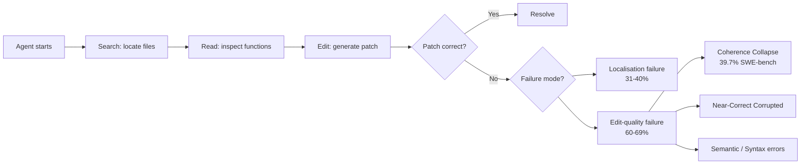

# Coherence Collapse: Why Your Coding Agent Finds the Fix Then Destroys It — and How Codex CLI's Checkpoint Stack Fights Back


---

Your coding agent located the correct function, generated a patch bit-identical to the gold reference — and then overwrote it with something wrong. That is not a hypothetical: Kim et al. documented exactly five such cases in a single benchmark run [^1]. The phenomenon they named *coherence collapse* is the dominant failure mode for capable agents once localisation is no longer the bottleneck, and it reshapes how you should think about checkpointing, session hygiene, and undo mechanics in Codex CLI.

## The Trajectory Diagnosis: TRAJEVAL

Most post-mortem analysis of coding agents treats failure as a black box: the patch was wrong, move on. TRAJEVAL, introduced in arXiv:2603.24631 (March 2026, revised May 2026), decomposes 16,758 agent trajectories across three frameworks — SWE-Agent, OpenHands, and LIVE — and seven language models into reference-patch-aligned **search**, **read**, and **edit** stages [^1]. The decomposition is training-free: it aligns each trajectory step against the known gold patch to determine whether the agent found the right files, read the right functions, and produced the right edits.

The headline finding: **60–69 per cent of failures on SWE-Agent and OpenHands occur after the agent has already reached and edited the correct functions** [^1]. The problem is not finding the code. The problem is what happens next.



## What Coherence Collapse Actually Looks Like

Coherence collapse is not a single bug. It is a behavioural pattern where the agent generates a correct or near-correct patch mid-trajectory, then continues editing — overwriting, thrashing, or "improving" the working solution into a broken one. Within the edit-quality residual, coherence collapse is the largest single theme: **39.7 per cent on SWE-bench Verified and 32.3 per cent on PolyBench Verified** [^1].

The mechanism typically follows one of three sub-patterns:

1. **Overwrite**: the agent produces the correct patch, decides it needs "one more change," and replaces the fix with an incorrect variant.
2. **Thrash**: the agent enters an edit-undo loop, cycling through variants until it settles on an incorrect final state.
3. **Near-correct corruption**: the patch is almost right — a single token, import, or boundary condition differs — and further edits widen rather than close the gap.

The near-correct corrupted sub-type is particularly insidious because it is **length-independent**: it occurs at similar rates regardless of trajectory length, meaning longer thinking does not help [^1].

## Strained Coherence: The Pre-Failure Signal

A complementary paper by Pandya, Zhang, and Lyu (arXiv:2606.07889, June 2026) identifies a detectable precursor they call *strained coherence*: the agent **states information that should change its behaviour, then acts against it** [^2]. This overlaps with verbalised reward hacking — the agent acknowledges tensions between a task's stated goal and the metric it is actually optimising, then continues optimising the wrong one anyway.

Their Claude Sonnet 4.6-based trajectory judge achieves strong predictive power:

| Metric | Value |
|---|---|
| Flagged trajectory failure rate | **94%** |
| Unflagged trajectory failure rate | **46%** |
| Performance gap | **47 percentage points** (p = 0.003) |
| Precision at matched selectivity | **94%** vs 88% baseline |
| Median flag position | **83–84%** through trajectory |

The practical implication: if you can detect strained coherence at 83 per cent of the way through a trajectory, you have a window to intervene before the agent destroys its own work [^2].

## Why This Matters for Codex CLI Users

Codex CLI agents exhibit the same fundamental architecture as the SWE-Agent and OpenHands frameworks studied. When running `codex` in full-auto or suggest mode on a complex refactoring task, the same dynamics apply: the agent may nail the fix on turn 7, then corrupt it by turn 12.

Three Codex CLI mechanisms are directly relevant.

### 1. Checkpoint and /rewind

Codex CLI creates a checkpoint before each agent edit and each user prompt [^3]. The `/rewind` command (also triggered via `Esc + Esc`) opens a checkpoint timeline, letting you restore both conversation context and workspace file state to any previous point [^4].

This is the manual equivalent of the edit-commit checkpoint that Kim et al. demonstrated recovers all five bit-identical-to-gold intermediate patches in their existence proof [^1]. The key difference: Codex CLI's checkpoints are passive — they exist, but nobody inspects them unless something visibly goes wrong. Coherence collapse is dangerous precisely because the final output *looks plausible*; you do not know you need to rewind.

```bash
# After a complex refactoring session, rewind to inspect earlier states
# Esc + Esc opens the checkpoint timeline
# Or use the slash command:
/rewind
```

### 2. The /undo Command

The `/undo` command performs an operation-level rollback of the most recent file changes [^5]. Unlike `/rewind`, which restores full conversation context, `/undo` targets only the file-system delta. The undo history is **in-memory and does not survive a session restart** [^5], so the recommended pattern is:

```bash
# Commit before ambitious work
git add -A && git commit -m "checkpoint: pre-refactor"

# Let the agent work
# If something looks wrong:
/undo

# For quick iteration within a single session only
```

This maps directly to the checkpoint-recovery intervention proposed in the coherence collapse paper. The limitation — in-memory only — means that for long-running or headless sessions (e.g., `codex exec` in CI), git-based checkpointing remains the more robust strategy.

### 3. Git Worktree Isolation

For tasks where coherence collapse risk is high — multi-file refactors, dependency upgrades, cross-module rewrites — running the agent in an isolated git worktree provides a hard boundary:

```bash
# Create an isolated worktree for the agent
git worktree add ../refactor-branch refactor-branch

# Run Codex CLI in the worktree
cd ../refactor-branch
codex "Refactor the authentication module"

# Review diffs before merging back
git diff main...refactor-branch
```

If the agent collapses, the worktree is disposable. Your main branch is untouched. This is the structural equivalent of the parallel-sample consensus approach that yielded a directional **+3.0 pp Pass@1 improvement on GPT-5** (p = 0.08) without reference patch access [^1].

## Building an Anti-Collapse Defence Stack

Combining the research findings with Codex CLI's existing tooling, a practical defence stack looks like this:

```mermaid
flowchart TD
    A[Start task] --> B[git commit checkpoint]
    B --> C[Run agent in worktree]
    C --> D[Agent generates edits]
    D --> E[PostToolUse hook:<br/>run tests after each edit]
    E --> F{Tests pass?}
    F -- Yes --> G[Continue]
    F -- No --> H[Flag: potential collapse]
    H --> I[/rewind to last passing state]
    G --> J[Agent signals completion]
    J --> K[Full test suite + diff review]
    K --> L{Clean?}
    L -- Yes --> M[Merge worktree]
    L -- No --> N[Inspect checkpoint timeline<br/>find last-good state]
```

### PostToolUse Hooks as Collapse Detectors

AGENTS.md can declare a PostToolUse hook that runs the test suite after every file write. This is the cheapest approximation of the TRAJEVAL edit-quality check: if the tests were passing and now they are not, the agent may be in a collapse trajectory.

```toml
# In config.toml or AGENTS.md hook configuration
[[hooks]]
event = "PostToolUse"
command = "npm test --silent 2>&1 | tail -5"
on_failure = "warn"
```

The `on_failure = "warn"` setting avoids hard-blocking the agent (which can trigger thrash loops) whilst surfacing the regression signal. A stricter variant uses `on_failure = "reject"` to prevent the collapsing edit from landing.

### Writes Approval Mode (v0.144.0)

The `writes` approval mode, shipped in Codex CLI v0.144.0 (9 July 2026), requires explicit approval for file writes but permits reads and command execution freely [^6]. This converts the agent's edit phase from autonomous to supervised — effectively inserting a human checkpoint at the exact point where coherence collapse occurs.

For high-stakes tasks, this is the most direct mitigation:

```bash
codex --approval-mode writes "Refactor the payment processing pipeline"
```

Every proposed edit surfaces for review. If the agent has already produced a working patch and attempts to overwrite it, you see the diff and can reject it.

## The Consensus Alternative

Kim et al. tested a reference-free consensus-driven variant: run the agent multiple times, compare outputs, and select the patch with the highest agreement. On GPT-5, this yielded a directional +3.0 pp Pass@1 improvement (p = 0.08) [^1]. This is not yet built into Codex CLI as a first-class feature, but it can be approximated with `codex exec` and shell scripting:

```bash
# Run the same task 3 times in separate worktrees
for i in 1 2 3; do
  git worktree add "/tmp/attempt-$i" -b "attempt-$i" HEAD
  cd "/tmp/attempt-$i"
  codex exec "Fix issue #1234" --output-dir .
  cd -
done

# Compare patches
diff /tmp/attempt-1/changes.patch /tmp/attempt-2/changes.patch
diff /tmp/attempt-2/changes.patch /tmp/attempt-3/changes.patch
```

When two or three attempts converge on the same patch, confidence rises sharply. When they diverge, the task likely needs human decomposition.

## Key Takeaways

1. **Localisation is solved for capable models.** The bottleneck has shifted to edit quality — 60–69 per cent of failures happen after the agent finds the right code [^1].

2. **Coherence collapse is the dominant edit-quality failure.** At 39.7 per cent of SWE-bench failures, it is the single largest category [^1].

3. **Strained coherence is detectable.** A trajectory judge can flag impending collapse with 94 per cent precision at 83 per cent through the trajectory [^2].

4. **Checkpointing recovers collapsed patches.** All five bit-identical-to-gold intermediate patches were recoverable via edit-commit checkpoints [^1].

5. **Codex CLI has the primitives.** `/rewind`, `/undo`, git worktrees, PostToolUse hooks, and `writes` approval mode collectively provide a layered defence. The gap is automation: these mechanisms require the developer to notice the collapse, which the Strained Coherence research suggests a future trajectory-monitoring hook could close.

---

## Citations

[^1]: Kim, M., Wang, D., Cui, S., Farmahinifarahani, F., Zhuo, T.Y., Garg, S., Ray, B., Mukherjee, R., Kumar, V. "Coherence Collapse: Diagnosing Why Code Agents Fail After Reaching the Right Code." arXiv:2603.24631. March 2026, revised May 2026. [https://arxiv.org/abs/2603.24631](https://arxiv.org/abs/2603.24631)

[^2]: Pandya, M., Zhang, K., Lyu, B. "Strained Coherence: A Pre-Failure Signal in Coding Agent Execution Trajectories." arXiv:2606.07889. June 2026. [https://arxiv.org/abs/2606.07889](https://arxiv.org/abs/2606.07889)

[^3]: Codex CLI Documentation — Checkpoints and Rewind. OpenAI Developers. [https://developers.openai.com/codex/cli/features](https://developers.openai.com/codex/cli/features)

[^4]: GitHub Issue #11626 — "/rewind checkpoint restore that reverts both chat context and Codex-applied code edits." openai/codex. [https://github.com/openai/codex/issues/11626](https://github.com/openai/codex/issues/11626)

[^5]: GitHub Issue #16784 — "Feature request: bring back Undo / Redo for Codex-applied file changes." openai/codex. [https://github.com/openai/codex/issues/16784](https://github.com/openai/codex/issues/16784)

[^6]: Codex CLI Changelog — v0.144.0, 9 July 2026. OpenAI Developers. [https://developers.openai.com/codex/changelog](https://developers.openai.com/codex/changelog)
