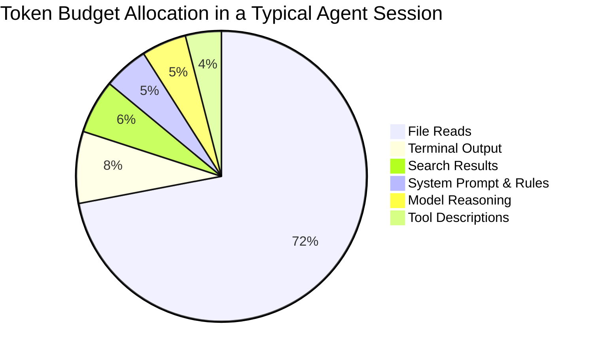
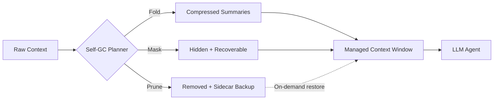
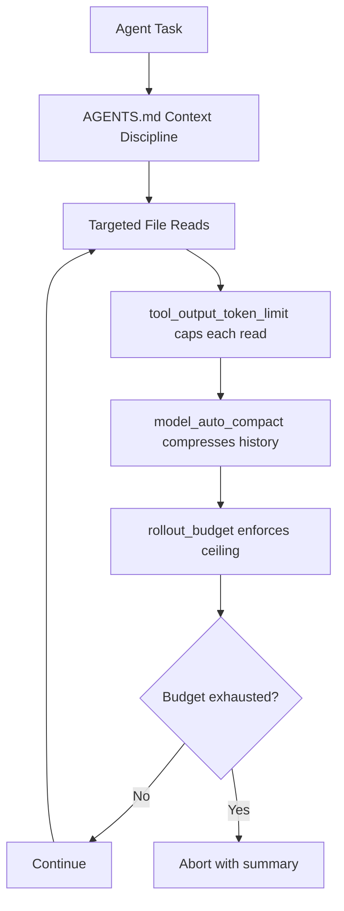

# The 76 Per Cent Problem: Why Your Coding Agent Wastes Three-Quarters of Its Token Budget Reading Files — and How Context Pruning and Rollout Budgets Cut the Bill


---

Every coding agent has the same expensive habit: it reads far more code than it needs. Four independent research teams have now quantified the waste, and the numbers are damning. Agents spend **67–76 per cent** of their total token budget on file reads, broad searches, and terminal output where useful evidence is buried in noise [^1][^2]. On a frontier model charging $5 per million input tokens, that means roughly $3.80 of every $5 buys nothing but attention dilution.

This article examines the four main context-pruning strategies published between January and July 2026, then maps each one onto the token-management primitives that Codex CLI already ships — `rollout_budget`, `model_auto_compact_token_limit`, and `tool_output_token_limit` — so you can start cutting spend today without waiting for external memory layers.

## The Token Budget as a Constrained Resource

A coding agent's context window is a zero-sum arena. System prompt, AGENTS.md rules, tool descriptions, retrieved files, terminal output, and the model's own reasoning chain all compete for the same finite allocation [^3]. Codex CLI's effective budget sits at roughly **258,000 usable tokens** against a 400,000-token model allocation [^4]. Fill past ~60 per cent and performance degrades measurably — the "context rot" phenomenon documented by Chroma across 18 frontier models [^4].

The research consensus is clear: the answer is not larger windows but smarter filling.



## Four Pruning Strategies, Ranked by Approach

### 1. SWE-Pruner: Task-Aware Neural Skimming

Published in January 2026, SWE-Pruner trains a lightweight **0.6B-parameter neural skimmer** that mimics how human developers selectively skim source code [^5]. Given the current task, the agent formulates an explicit goal hint, and the skimmer dynamically selects relevant lines from surrounding context.

**Results on SWE-Bench Verified:** 23–54 per cent token reduction whilst maintaining or *improving* success rates. On single-turn tasks (LongCodeQA), compression reaches **14.84×** with minimal performance impact [^5].

The key insight: pruning is not just cost reduction — removing irrelevant lines can actually *improve* resolution by reducing attention dilution.

### 2. LaMR: Multi-Rubric Latent Reasoning

Published May 2026, LaMR decomposes code relevance into two interpretable dimensions — **semantic evidence** (does this span contain repair-relevant information?) and **dependency support** (does the code define symbols the fix needs?) [^1]. Each dimension gets its own conditional random field (CRF) with dimension-specific transition dynamics, fused by a mixture-of-experts gating network.

**Head-to-head results:** LaMR wins 12 of 16 multi-turn comparisons, saving up to **31 per cent more tokens** on agent tasks and improving Exact Match by up to +3.5 on single-turn tasks versus prior pruning baselines [^1].

The practical contribution is the decomposition itself. A single pruning signal cannot distinguish between a function body that happens to mention the bug keyword (semantic match, no dependency value) and an import statement the fix requires (dependency value, no semantic match). Separating the signals via AST-based program analysis eliminates this confusion.

### 3. ContextSniper: Precision Evidence Selection

Published 2 July 2026 as part of AntTrail's broader agent memory engine, ContextSniper implements a **retrieve broadly, expose narrowly** strategy across a three-level memory hierarchy [^2]:

| Level | Contents | Visibility |
|-------|----------|------------|
| L0 | Compact abstracts | In-prompt (model sees this) |
| L1 | Structured metadata — paths, symbols, graph relations | Retrieval index |
| L2 | Full recoverable content | On-demand expansion |

Retrieval fuses **semantic embeddings, BM25 lexical scoring, ctags-style symbol metadata, and call-graph relations** via weighted reciprocal rank fusion, with ripgrep-based fallback when indexed retrieval underperforms [^2].

**Results on 50 SWE-bench Lite tasks:**

| Agent | Token Reduction | Cost Reduction | Resolution Rate Change |
|-------|----------------|----------------|----------------------|
| OpenClaw | 51.5% (1.36M → 0.66M) | 36.4% | 26.0% → 24.0% |
| Claude Code | 38.9% (1.45M → 0.79M) | 27.3% | 32.0% → 30.0% |

The resolution rate trade-off is modest: 2 percentage points for a 36–27 per cent cost reduction [^2]. In a memory systems pilot against seven baselines (mem0, Letta/MemGPT, OpenViking, TencentDB Memory, Serena, LlamaIndex RAG), ContextSniper demonstrated superior token efficiency on Django repository tasks [^2].

### 4. Self-GC: Garbage Collection for Agent Context

Published 1 July 2026, Self-GC treats the context window as a managed heap [^6]. User turns, tool spans, and skill state become **indexed objects** with lifecycles managed by a side-channel planner that proposes three operations:

- **Fold** — compress verbose spans into summaries
- **Mask** — hide content from the model whilst keeping it recoverable
- **Prune** — remove content entirely, with sidecar backups

**Production results (332 sessions):** 91.27–94.58 per cent of continuations are unaffected by pruning, versus 77.71–87.46 per cent for heuristic baselines. Real-world deployment reduces daytime average input tokens by **10–15 per cent**, with peak reductions of ~20 per cent [^6].



## What Codex CLI Ships Today

You do not need to wait for ContextSniper or Self-GC to integrate with Codex CLI. Three configuration primitives already give you graduated control over token spend [^7].

### Rollout Token Budgets

Introduced in v0.142.0 and refined through v0.143.0, the `rollout_budget` feature tracks token consumption across **all agent threads in a rollout** and aborts turns when the budget is exhausted [^8][^9].

```toml
[features.rollout_budget]
enabled = true
limit_tokens = 500000
reminder_interval_tokens = 50000
sampling_token_weight = 1.0
prefill_token_weight = 0.1
```

Key configuration choices:

- **`limit_tokens`** — The hard ceiling. Set this based on your per-task dollar budget. At $5/M input tokens, 500K tokens ≈ $2.50 worst case.
- **`prefill_token_weight`** — Setting this to `0.1` means prefill (cached/prompt) tokens count at one-tenth their face value, reflecting their lower actual cost on most providers [^7].
- **`reminder_interval_tokens`** — Defaults to 10 per cent of `limit_tokens`. The agent receives a budget reminder at each interval, enabling it to self-regulate before hitting the hard stop [^9].

⚠️ The rollout budget feature is marked as under development in the current configuration reference. Behaviour may change in subsequent releases.

### Auto-Compact Threshold

The `model_auto_compact_token_limit` triggers automatic history compaction when the context grows past a threshold [^7]:

```toml
model_auto_compact_token_limit = 150000
model_auto_compact_token_limit_scope = "body_after_prefix"
```

Setting `scope` to `body_after_prefix` means only growth *after* the system prompt and AGENTS.md prefix counts towards the threshold. This preserves your instruction context whilst compacting the exploration history — a crude but effective form of the fold operation that Self-GC formalises [^6].

### Tool Output Token Limit

The single most impactful setting for reducing file-read waste:

```toml
tool_output_token_limit = 8000
```

This caps individual tool outputs before they enter the context window [^7]. When an agent reads a 3,000-line file but only needs 40 lines near the error site, the remaining 2,960 lines are pure waste. Capping output forces the agent to make targeted reads — essentially implementing the "expose narrowly" half of ContextSniper's strategy at the harness level [^2].

## Combining Research and Configuration

The following configuration profile combines all three primitives with AGENTS.md guidance to approximate research-grade pruning without external dependencies:

```toml
# config.toml — cost-conscious profile
[features.rollout_budget]
enabled = true
limit_tokens = 300000
reminder_interval_tokens = 30000
sampling_token_weight = 1.0
prefill_token_weight = 0.1

model_auto_compact_token_limit = 120000
model_auto_compact_token_limit_scope = "body_after_prefix"
tool_output_token_limit = 6000
```

Pair this with AGENTS.md instructions that encode the pruning discipline:

```markdown
## Context Discipline

- Read files with line ranges, never whole files. Prefer `read_file(path, start=100, end=140)` over `read_file(path)`.
- After each search, summarise findings before the next search. Do not accumulate raw search results.
- When terminal output exceeds 50 lines, extract the relevant error or result before proceeding.
- If you have read more than 5 files without making a code change, pause and reassess your approach.
```

This AGENTS.md pattern mirrors SWE-Pruner's explicit goal formulation [^5] and ContextSniper's intention-aware context gate [^2], pushing the pruning decision to the agent's planning layer rather than relying on post-hoc compression.



## The Resolution Rate Trade-Off

Every pruning strategy trades some resolution rate for cost savings. ContextSniper loses 2 percentage points on SWE-bench Lite [^2]. Self-GC maintains 91–95 per cent unaffected continuations but not 100 per cent [^6]. SWE-Pruner is the exception — it occasionally *improves* resolution by removing distractors [^5].

The practical question is whether the cost savings justify the resolution trade-off at your scale. If you run 100 agent tasks per day at $2.50 each, a 36 per cent cost reduction (ContextSniper's OpenClaw result) saves **$90 per day** against a 2-point resolution drop. For most teams, that arithmetic favours pruning.

The Codex CLI approach of `tool_output_token_limit` plus AGENTS.md discipline avoids the trade-off entirely for a different reason: it does not prune after retrieval — it prevents over-retrieval in the first place. The resolution rate impact depends on how well your AGENTS.md instructions match the task, which is why the specification grounding research [^10] matters here too.

## What Comes Next

The trajectory is clear. ContextSniper's L0/L1/L2 memory hierarchy [^2] and Self-GC's fold/mask/prune lifecycle [^6] are converging towards a standard **agent context management layer** that sits between the harness and the model. When Codex CLI integrates such a layer — whether through MCP memory servers, native memory APIs, or plugin-based pruners — the `rollout_budget` and `tool_output_token_limit` primitives will remain as the enforcement backstop, whilst the pruning intelligence moves from AGENTS.md heuristics to learned models.

Until then, the configuration primitives and AGENTS.md discipline described above give you a 20–40 per cent token reduction with zero external dependencies. The 76 per cent problem is not solved, but it is now well-characterised and practically addressable.

## Citations

[^1]: Xin, J. et al. "Context Pruning for Coding Agents via Multi-Rubric Latent Reasoning (LaMR)." arXiv:2605.15315, May 2026. [https://arxiv.org/abs/2605.15315](https://arxiv.org/abs/2605.15315)

[^2]: Luk, C. et al. "ContextSniper: AntTrail's Token-Efficient Code Memory for Repository-Level Program Repair." arXiv:2607.01916, July 2026. [https://arxiv.org/abs/2607.01916](https://arxiv.org/abs/2607.01916)

[^3]: Hu, T. et al. "Token Economics for LLM Agents: A Dual-View Study from Computing and Economics." arXiv:2605.09104, May 2026. [https://arxiv.org/abs/2605.09104](https://arxiv.org/abs/2605.09104)

[^4]: "Codex Context Window: How It Works (2026)." Unblocked. [https://getunblocked.com/blog/codex-context-window/](https://getunblocked.com/blog/codex-context-window/)

[^5]: Wang, Y. et al. "SWE-Pruner: Self-Adaptive Context Pruning for Coding Agents." arXiv:2601.16746, January 2026. [https://arxiv.org/abs/2601.16746](https://arxiv.org/abs/2601.16746)

[^6]: Hao, X. et al. "Self-GC: Self-Governing Context for Long-Horizon LLM Agents." arXiv:2607.00692, July 2026. [https://arxiv.org/abs/2607.00692](https://arxiv.org/abs/2607.00692)

[^7]: "Configuration Reference." OpenAI Codex CLI Documentation. [https://learn.chatgpt.com/docs/config-file/config-reference](https://learn.chatgpt.com/docs/config-file/config-reference)

[^8]: "[codex] add rollout token budget configuration (1/N)." GitHub Pull Request #28746, openai/codex. [https://github.com/openai/codex/pull/28746](https://github.com/openai/codex/pull/28746)

[^9]: "[codex] configure rollout budget reminder thresholds." GitHub Pull Request #29423, openai/codex. [https://github.com/openai/codex/pull/29423](https://github.com/openai/codex/pull/29423)

[^10]: Haeri, S. and Ghelichi, A. "Specification Grounding Improves LLM Code Correctness." arXiv:2607.06636, July 2026. [https://arxiv.org/abs/2607.06636](https://arxiv.org/abs/2607.06636)
