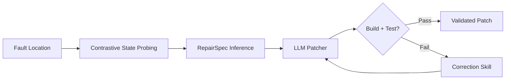
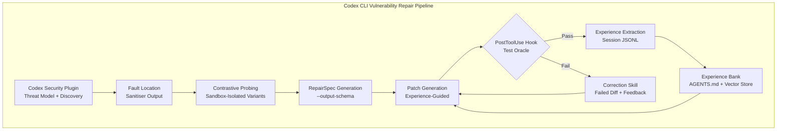

# Experience-Driven Vulnerability Repair: What EvoRepair and ContraFix Reveal About Self-Improving Security Agents — and How to Wire the Patterns into Codex CLI


---

## The Repair Gap

Automated vulnerability repair has a dirty secret: most LLM-based approaches treat every vulnerability as if the agent has never seen one before. Each CVE triggers a cold start — the model reads the advisory, examines the code, and hallucinates a patch with no memory of the three hundred similar buffer overflows it fixed last week. Two recent papers expose this gap and propose radically different solutions. EvoRepair accumulates a scored experience bank across repair cycles[^1]. ContraFix constructs contrastive runtime evidence by executing failing and passing variants side by side, then feeds the differential state into a dual-track skill base[^2]. Both achieve resolution rates above 90 per cent on standard benchmarks — and both encode patterns that Codex CLI developers can adopt today.

## EvoRepair: The Experience Bank

Hu et al. frame vulnerability repair as a cyclic process rather than a one-shot generation task[^1]. The agent alternates between two stages:

1. **Repair stage** — retrieve relevant experiences from the bank, use them to guide patch generation.
2. **Learning stage** — extract a structured experience record from the completed trajectory and score it for quality before insertion.

Each experience follows a five-dimensional schema: vulnerability analysis, repair rationale, trajectory analysis, experience summary, and reflection[^1]. The bank stores entries in both Markdown (for human inspection) and a vector database (for similarity retrieval).

### Retrieval and Scoring

Experience retrieval uses a two-pass pipeline. The first pass identifies the top-M candidates by embedding similarity. The second reranks by a consolidated score combining similarity and quality, selecting top-K results[^1]. Quality scoring follows an LLM-as-a-Judge strategy across two dimensions — actionability and generalisability — with weighting coefficient λ=0.5[^1].

### Results That Matter

On PATCHEVAL (JavaScript, Python, Go — 230 instances with Docker), EvoRepair with GPT-5-mini achieves a 93.47 per cent success rate[^1]. On SEC-bench (C — 200 instances), it hits 87.00 per cent[^1]. The combined performance of 90.46 per cent outperforms LoopRepair by 39.56 per cent on PATCHEVAL and 33.50 per cent on SEC-bench[^1]. Cross-language transfer to VUL4J (Java — 79 instances) confirms the experience bank generalises beyond its training distribution[^1].

The growth curve is instructive. Over 15 repair turns, fixes on PATCHEVAL rose from 194 to 215 — a compound improvement driven by accumulating repair knowledge[^1]. The agent reaches near-peak performance within the first several turns whilst the vanilla baseline converges far more slowly[^1].

### Ablation Highlights

| Component removed | Impact (GPT-5-mini) |
|---|---|
| Experience retrieval score | −10 fixes |
| Example-driven strategy | −6 to −13 fixes |
| Warm-up pre-repair stage | −27 fixes |

The warm-up strategy — seeding the bank with a small pre-repair corpus — delivers the single largest contribution[^1].

## ContraFix: Contrastive Runtime Evidence

Liu et al. take a fundamentally different approach[^2]. Rather than learning from historical trajectories, ContraFix generates runtime evidence for the specific vulnerability at hand.

### Three-Phase Pipeline



**Phase 1 — Fault Location** identifies the crash site and candidate expressions: indices, lengths, capacities, allocation sizes, pointer/nullness states, and controlling predicates[^2].

**Phase 2 — Contrastive State Probing** generates nearby failing and non-failing variants via format-aware mutation, instruments them with point probes (before/after statement snapshots) and span probes (entry/exit around regions), then compares runtime values at shared probe sites[^2]. The key constraint: failing variants, passing variants, and the original execution must share at least one common probe site[^2].

**Phase 3 — RepairSpec Inference** converts observed boundary evidence into a structured specification containing location, boundary evidence (concrete probed values), candidate repair condition, and patch scope[^2]. Crucially, the RepairSpec is an empirically grounded repair hypothesis rather than a formal invariant[^2].

### The Dual-Track Skill Base

ContraFix maintains two distinct experience stores:

- **Mutation skills** — format-preserving transformation patterns that help construct ideal contrastive pairs. Records include input family, effective transformation, and per-variant outcomes[^2].
- **Correction skills** — activated only after failed patches, storing the failed diff alongside compiler/oracle feedback and the final validated diff[^2]. These provide wrong-to-correct demonstrations for the patcher.

### Results by Vulnerability Type

| CWE class | Resolution rate |
|---|---|
| Heap-buffer-overflow | 97.4% (75/77) |
| Null-pointer-deref | 92.5% (49/53) |
| Stack-buffer-overflow | 92.9% (13/14) |
| Use-after-free | 80.0% (16/20) |

Overall SEC-bench resolution: 92.0 per cent (184/200) with GPT-5-mini[^2]. On PatchEval across Go, Python, and JavaScript: 73.8 per cent (166/225)[^2].

The semantic correctness gap is the headline number: 58.2 per cent of ContraFix's validated patches are semantically correct versus 31.3 per cent for the strongest baseline[^2]. Passing tests is necessary but not sufficient — ContraFix's runtime evidence pushes the agent toward patches that fix the root cause rather than merely silencing the symptom.

### Ablation: Where the Gains Come From

The progressive ablation tells a clear story:

1. Patcher-only baseline: 48.0 per cent
2. \+ Contrastive analysis: 74.8 per cent (+26.8pp)
3. \+ Mutation experience: +2.5–5.5pp
4. \+ Correction experience: +12.0–13.0pp
5. Full ContraFix: 91.8 per cent[^2]

Contrastive runtime analysis is the single largest contributor. Correction skills — learning from failed patches — deliver the second-largest gain[^2].

## Mapping to Codex CLI

Both papers validate patterns that Codex CLI already supports or can accommodate with targeted configuration.

### 1. Codex Security Plugin as Repair Pipeline

The first-party Codex Security plugin (GA since June 2026) runs the full threat-modelling and vulnerability discovery pipeline locally inside the CLI[^3]. It identifies entry points, traces source-to-sink paths, validates findings in the sandbox, and generates reports[^3]. Wiring EvoRepair-style experience retrieval into this pipeline means persisting repair trajectories as structured Markdown alongside the project.

### 2. PostToolUse Hooks for Evidence Collection

PostToolUse hooks receive tool event JSON on stdin after tool execution completes[^4]. For ContraFix-style contrastive analysis, a PostToolUse hook can:

- Capture sanitiser output from test runs (the equivalent of fault location).
- Log runtime probe values when the agent executes instrumented variants.
- Trigger correction skill extraction when a patch attempt fails the test oracle.

```toml
# codex.toml — PostToolUse hook for vulnerability repair evidence
[hooks.post_tool_use]
command = "python3 .codex/hooks/vuln-evidence-collector.py"
description = "Collects runtime evidence from vulnerability repair attempts"
```

### 3. Experience Bank via AGENTS.md and Session JSONL

EvoRepair's five-dimensional experience schema maps naturally to two Codex CLI primitives:

- **AGENTS.md** — encode repair heuristics as specification rules. The rule taxonomy research shows that negative constraints (77.78 per cent of effective rules) drive the highest compliance gains[^5]. For vulnerability repair, this means rules like: *"When fixing a heap-buffer-overflow, always verify allocation size against the maximum index in the access pattern, never only check the immediate failing index."*

- **Session JSONL** — every Codex CLI session emits a structured JSONL log[^6]. These logs are the raw material for experience extraction. A scheduled `codex exec` job can process recent session logs, extract repair trajectories, score them, and append them to a project-local experience bank.

### 4. Sandbox Isolation for Safe Variant Execution

ContraFix requires executing potentially dangerous code variants — failing and passing — in isolation. Codex CLI's Landlock/Seatbelt sandbox with `workspace-write` default and disabled networking provides exactly this guarantee[^7]. The sandbox ensures that probe execution cannot escape the repair context.

```toml
# Named profile for vulnerability repair sessions
[profiles.vuln-repair]
sandbox = "workspace-write"
network = "off"
approval_policy = "unless-allow-listed"
model = "o4-mini"
```

### 5. Structured Output for Repair Specifications

ContraFix's RepairSpec — location, boundary evidence, candidate condition, patch scope — is a natural fit for `codex exec --output-schema`[^8]. Defining a JSON Schema for repair specifications ensures the agent's output is machine-parseable for downstream validation.

```bash
codex exec "Analyse the heap-buffer-overflow in src/parser.c \
  and produce a RepairSpec" \
  --output-schema ./repair-spec-schema.json \
  -o ./repair-spec.json
```

### Architecture: Experience-Driven Repair in Codex CLI



## The Compound Effect

The combined message from EvoRepair and ContraFix is that vulnerability repair agents improve dramatically when they stop treating each vulnerability as novel. EvoRepair's 21-fix improvement over 15 turns demonstrates compound returns from experience accumulation[^1]. ContraFix's 26.8pp gain from contrastive runtime analysis shows that empirical evidence beats static reasoning for security patches[^2].

For Codex CLI developers, the practical takeaway is threefold:

1. **Persist repair trajectories** — session JSONL is already there; structure it into an experience bank.
2. **Instrument with PostToolUse hooks** — collect the runtime evidence that turns cold-start repairs into informed ones.
3. **Use the sandbox for safe probing** — ContraFix's contrastive execution pattern requires isolation that Codex CLI's Landlock/Seatbelt sandbox provides by default.

The 90 per cent+ resolution rates are not hypothetical. They are achievable today with GPT-5-mini on standard benchmarks[^1][^2]. The question is whether your repair pipeline captures and reuses what it learns — or throws it away after every session.

---

## Citations

[^1]: Hu, H., Xie, G., Zhang, Q., Liu, J., Yu, S., Fang, C., Chen, Z., & Xiao, L. (2026). *EvoRepair: Enhancing Vulnerability Repair Agents Through Experience-Based Self-Evolution*. arXiv:2605.30105. [https://arxiv.org/abs/2605.30105](https://arxiv.org/abs/2605.30105)

[^2]: Liu, S., Liu, F., Wang, P., Li, T., Zhu, Y., Lian, X., & Zhang, L. (2026). *ContraFix: Skill-Enhanced Contrastive Runtime Analysis for Vulnerability Repair*. arXiv:2605.17450v2. [https://arxiv.org/abs/2605.17450](https://arxiv.org/abs/2605.17450)

[^3]: OpenAI. (2026). *Codex Security Plugin: Local Vulnerability Scanning, Diff Review, and Automated Remediation from the CLI*. Codex Knowledge Base. [https://codex.danielvaughan.com/2026/06/03/codex-security-plugin-local-vulnerability-scanning-diff-review-remediation-cli/](https://codex.danielvaughan.com/2026/06/03/codex-security-plugin-local-vulnerability-scanning-diff-review-remediation-cli/)

[^4]: OpenAI. (2026). *Codex CLI Hooks: Complete Guide to Events, Policy Engines and Production Patterns*. Codex Knowledge Base. [https://codex.danielvaughan.com/2026/04/15/codex-cli-hooks-complete-guide-events-policy-patterns/](https://codex.danielvaughan.com/2026/04/15/codex-cli-hooks-complete-guide-events-policy-patterns/)

[^5]: Cai, L. et al. (2026). *Rule Taxonomy and Evolution in AI IDEs: A Mining and Survey Study*. arXiv:2606.12231. [https://arxiv.org/abs/2606.12231](https://arxiv.org/abs/2606.12231)

[^6]: OpenAI. (2026). *Codex CLI Developer Commands Reference*. [https://developers.openai.com/codex/cli/reference](https://developers.openai.com/codex/cli/reference)

[^7]: OpenAI. (2026). *Codex Security*. [https://developers.openai.com/codex/security](https://developers.openai.com/codex/security)

[^8]: OpenAI. (2026). *Non-interactive mode — codex exec*. [https://developers.openai.com/codex/noninteractive](https://developers.openai.com/codex/noninteractive)
