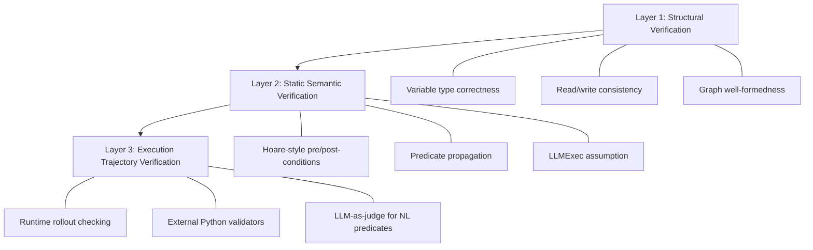
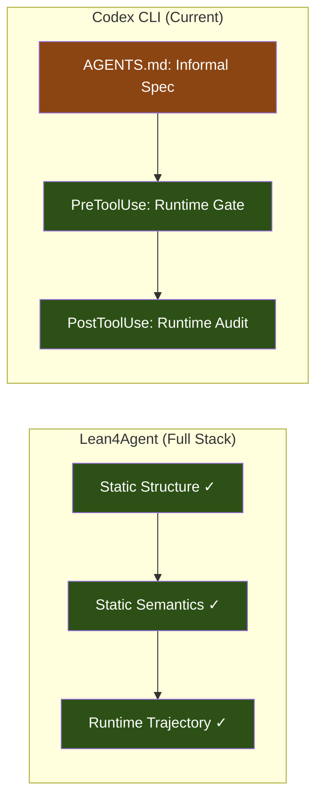

# Lean4Agent and Formally Verified Agent Workflows: What Dependent-Type Verification Means for Codex CLI's Hook and Specification Stack


---

## The Problem: Natural-Language Specifications Are Not Enough

Every Codex CLI workflow ultimately rests on natural-language instructions in `AGENTS.md`. Those instructions shape agent behaviour—what to test, what to avoid, how to declare completion—but they carry no formal guarantees. A misspelled variable name, an unreachable workflow step, or a violated pre-condition surfaces only at runtime, after tokens have been spent and side effects committed.

Lean4Agent [^1], published in June 2026 by Wang et al., tackles this gap head-on. It is the first framework to apply Lean 4's dependent-type system to the formal modelling and verification of agent workflows and execution trajectories. The results are striking: verification-passing workflows outperform failing ones by 14.80 per cent on a hard subset of SWE-Bench-Verified [^1], and the accompanying LeanEvolve refinement loop adds a further 7.47 per cent improvement [^1].

This article examines Lean4Agent's architecture, maps its three verification layers onto Codex CLI's existing specification and hook primitives, and sketches how teams can adopt lightweight formal checks today without waiting for native Lean integration.

---

## Lean4Agent's Three-Layer Architecture

FormalAgentLib, the core library, comprises 151 types and 611 functions organised into three verification layers [^1]:



### Layer 1: Structural Verification

The compiler-like first pass validates that every workflow node reads only variables that are either initial parameters or produced by a reachable predecessor [^1]. Types are modelled with an inductive `BaseType` covering `TString`, `TInt`, `TJson`, `TList`, `TDict`, and more [^1]. A `WorkflowGraph` structure encodes nodes, edges (sequential, branch, loop, fork, join, switch), and entry/exit points [^1].

The practical consequence: a structurally invalid workflow—one where a step references an output that no upstream node produces—is caught at verification time, before any LLM call is made.

### Layer 2: Static Semantic Verification

Layer 2 introduces a predicate system with Hoare-style pre- and post-condition pairs [^1]. Each `SemanticWorkflowNode` is annotated with preconditions (what must hold before the step executes) and postconditions (what the step guarantees on success) [^1]. Verification proceeds under the `llmExecAxiom`: if preconditions are satisfied and the LLM executes the step, postconditions will hold [^1].

Predicate types include `nameExists`, `isNonEmptyString`, `isValidURL`, `matchesJsonSchema`, and extensible `custom` or `ext` predicates [^1]. This is where Lean4Agent connects to real-world contracts—a step that produces a JSON patch can declare its postcondition as `matchesJsonSchema(outputVar, patchSchema)`.

### Layer 3: Execution Trajectory Verification

At runtime, Layer 3 checks actual execution rollouts against step-level postconditions [^1]. Decidable predicates (string non-emptiness, JSON schema conformance) are evaluated directly in Lean. Non-decidable predicates delegate to external Python validators or LLM-as-judge modules [^1].

This layer is what enables LeanEvolve's iterative refinement: when a trajectory violates a postcondition, the violation is localised to a specific step, and an LLM rewrites that step's instructions with the formal constraint as guidance [^1].

---

## Experimental Evidence

The benchmark results across five LLMs on SWE-Bench-Verified's hard 50-problem subset [^1]:

| Model | Verified Pass Rate | Failed Pass Rate | Delta |
|-------|-------------------|-----------------|-------|
| GPT-5.2 | 62.67% | 50.00% | +12.67% |
| GLM-5 | 58.00% | 50.67% | +7.33% |
| Kimi-K2.5 | 61.33% | 46.00% | +15.33% |
| Gemma-4-31B | 60.00% | 32.67% | +27.33% |
| Qwen-3.5-27B | 49.33% | 38.00% | +11.33% |

The 95 per cent confidence interval for the average improvement is [10.00, 19.60 per cent] [^1]. Formal-guided evolution via LeanEvolve outperformed pure-LLM evolution by 7.00 per cent [^1], demonstrating that localised formal feedback is superior to unconstrained self-repair.

---

## Complementary Work: Type-Checked Compliance

The Lean-Agent Protocol [^2], published in April 2026, applies similar principles to financial agent systems. Every proposed action is treated as a mathematical conjecture—execution proceeds only if the Lean 4 kernel proves the action satisfies pre-compiled regulatory axioms [^2]. The system achieves microsecond-latency verification whilst satisfying SEC Rule 15c3-5 and FINRA Rule 3110 [^2].

Whilst the domain differs, the architectural pattern is identical: intercept agent actions at a control point, verify against typed specifications, and gate execution on proof success.

---

## Mapping to Codex CLI's Specification Stack

Codex CLI already provides the primitives for a lightweight version of this pattern:

### AGENTS.md as Workflow Specification

`AGENTS.md` files are concatenated hierarchically from repo root to working directory [^3]. They declare behavioural constraints—what amounts to informal pre- and post-conditions:

```markdown
## Completion Criteria

Before declaring a change done:
- `pnpm typecheck` must pass (postcondition: type-safety)
- `pnpm test --run` must pass (postcondition: test suite green)
- New utility code requires a co-located `*.test.ts` (precondition for PR)
```

These are semantically equivalent to Layer 2's predicate annotations, but expressed in natural language without formal verification.

### PreToolUse Hooks as Pre-Condition Enforcement

Codex CLI's `PreToolUse` hook [^4] fires before every tool call. A hook script can inspect the proposed action and return a denial:

```toml
# ~/.codex/hooks.toml (illustrative)
[hooks.PreToolUse]
matcher = "Bash"
command = "python3 ~/.codex/hooks/verify_preconditions.py"
timeout = 30
```

```python
#!/usr/bin/env python3
"""PreToolUse hook: enforce structural pre-conditions."""
import json, sys

event = json.loads(sys.stdin.read())
command = event.get("command", "")

# Layer-1-style check: block writes to paths not declared in workflow
allowed_paths = ["/src/", "/tests/", "/docs/"]
if ">" in command or "tee" in command:
    target = command.split(">")[-1].strip().split()[0] if ">" in command else ""
    if not any(target.startswith(p) for p in allowed_paths):
        print(json.dumps({"deny": f"Write to {target} not in declared workflow scope"}))
        sys.exit(0)

print(json.dumps({"allow": True}))
```

### PostToolUse Hooks as Post-Condition Verification

`PostToolUse` hooks [^4] fire after tool execution completes. They cannot undo side effects, but they can flag violations and inject corrective guidance:

```python
#!/usr/bin/env python3
"""PostToolUse hook: verify postconditions after file writes."""
import json, sys, subprocess

event = json.loads(sys.stdin.read())

# Layer-3-style check: verify JSON schema conformance of generated output
if event.get("tool") == "write_file" and event["path"].endswith(".json"):
    result = subprocess.run(
        ["jsonschema", "-i", event["path"], "schemas/expected.json"],
        capture_output=True, text=True
    )
    if result.returncode != 0:
        print(json.dumps({
            "systemMessage": f"Postcondition violated: {event['path']} "
                           f"does not conform to expected schema. "
                           f"Error: {result.stderr.strip()}"
        }))
        sys.exit(0)

print(json.dumps({}))
```

### The Verification Gap

The critical difference: Codex CLI's hooks are **runtime-only**. They catch violations as they happen (Layer 3 equivalent) but cannot perform **static verification** (Layers 1 and 2) before any execution begins. There is no mechanism to prove, before the session starts, that the declared workflow is structurally sound or semantically consistent.



---

## Bridging the Gap: A Practical Approach

Teams can approximate Lean4Agent's static verification today using a `SessionStart` hook that validates the workflow specification before the agent begins:

```bash
#!/bin/bash
# .codex/hooks/session-start-verify.sh
# Run structural checks on AGENTS.md workflow declarations

set -euo pipefail

# Parse AGENTS.md for declared variables and dependencies
python3 << 'EOF'
import re, sys, json
from pathlib import Path

agents_md = Path("AGENTS.md").read_text()

# Extract declared outputs (## Outputs: lines)
outputs = set(re.findall(r'outputs?:\s*`(\w+)`', agents_md, re.IGNORECASE))

# Extract referenced inputs (reads: lines)
inputs = set(re.findall(r'reads?:\s*`(\w+)`', agents_md, re.IGNORECASE))

# Layer-1 check: every input must be a declared output or parameter
undeclared = inputs - outputs
if undeclared:
    print(json.dumps({
        "systemMessage": f"Workflow structural error: variables "
                        f"{undeclared} are read but never produced. "
                        f"Fix AGENTS.md before proceeding."
    }))
    sys.exit(0)

print(json.dumps({}))
EOF
```

For teams willing to invest further, FormalAgentLib is open-source on GitHub [^5]. A CI integration that runs `lean4` verification against a machine-readable workflow spec (derived from `AGENTS.md` annotations) before the Codex session starts would close the static-verification gap entirely.

---

## When Formal Verification Pays Off

Not every Codex CLI workflow warrants theorem proving. The cost-benefit inflection points:

| Scenario | Formal Verification Value |
|----------|--------------------------|
| One-shot bug fix | Low — runtime hooks suffice |
| Multi-step refactoring with 10+ workflow nodes | Medium — structural checks prevent wasted tokens |
| Regulated environments (fintech, healthcare) | High — Type-Checked Compliance [^2] patterns apply |
| Fleet-wide `requirements.toml` enforcement | High — prove policy consistency before deployment |
| LeanEvolve-style iterative workflow improvement | High — localised failure attribution accelerates convergence |

---

## Looking Ahead

Lean4Agent establishes formal verification of agent workflows as a viable field. The 14.80 per cent average improvement is not marginal — it represents the difference between a coding agent that stumbles through structural inconsistencies and one that operates on a verified foundation.

For Codex CLI, the path forward is incremental:

1. **Today**: Use `PreToolUse`/`PostToolUse` hooks for runtime pre- and post-condition enforcement
2. **Near-term**: Add `SessionStart` hooks that perform structural validation of `AGENTS.md` workflow declarations
3. **Medium-term**: Adopt machine-readable workflow annotations (YAML/TOML blocks within `AGENTS.md`) that can be verified by external tools
4. **Longer-term**: Integrate FormalAgentLib or equivalent into CI, treating workflow verification as a build step alongside type-checking and linting

The research is clear: agents that operate on formally verified workflows outperform those that do not. The question is not whether to adopt these patterns, but how aggressively.

---

## Citations

[^1]: Wang, R., Huang, J., Wang, P., Liu, X., Kong, L., & Zhang, T. (2026). "Lean4Agent: Formal Modeling and Verification for Agent Workflow and Trajectory." arXiv:2606.06523. https://arxiv.org/abs/2606.06523

[^2]: "Type-Checked Compliance: Deterministic Guardrails for Agentic Financial Systems Using Lean 4 Theorem Proving." (2026). arXiv:2604.01483. https://arxiv.org/abs/2604.01483

[^3]: OpenAI. "Custom instructions with AGENTS.md." Codex CLI Documentation, 2026. https://developers.openai.com/codex/guides/agents-md

[^4]: OpenAI. "Hooks." Codex CLI Documentation, 2026. https://developers.openai.com/codex/hooks

[^5]: RickySkywalker. "Lean4Agent." GitHub, 2026. https://github.com/RickySkywalker/Lean4Agent
