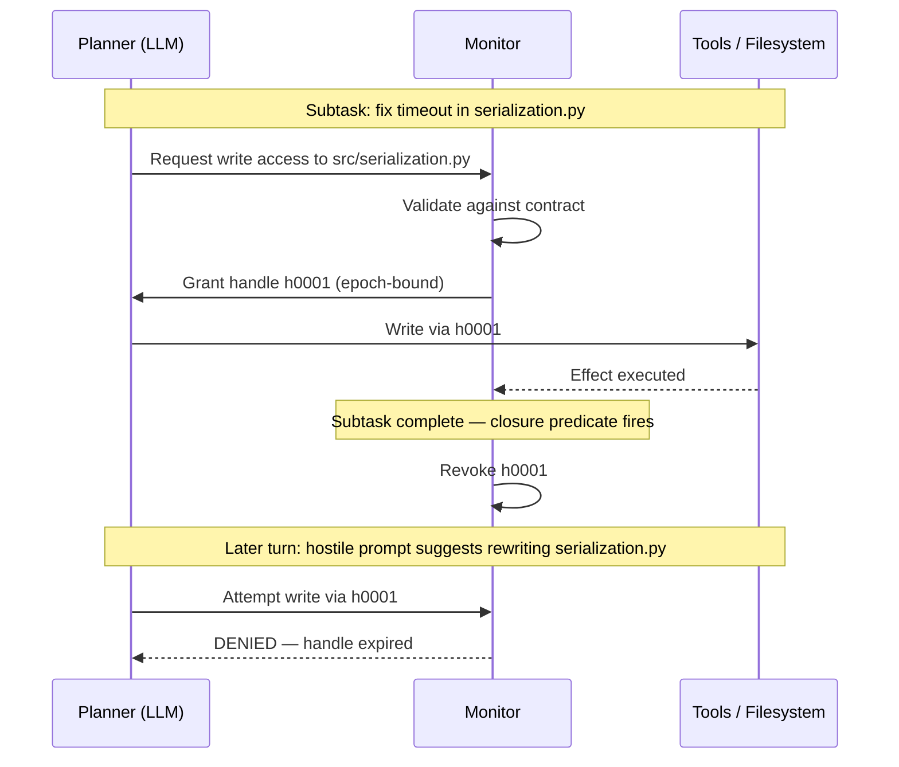
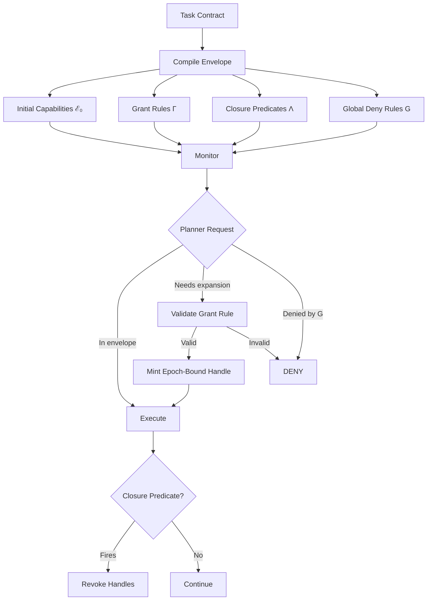

# Lingering Authority: Why Your Coding Agent Keeps Permissions It No Longer Needs — and What PORTICO, Agent libOS, and Codex CLI's Approval Stack Can Do About It


---

Your coding agent needed write access to `src/serialization.py` for exactly one subtask. That subtask finished twelve turns ago. The agent still has write access. A poisoned docstring in a dependency you just pulled could now instruct the agent to overwrite that file — and the runtime would let it, because the capability was never revoked.

This is what Santos-Grueiro calls **lingering authority**: a temporary resource-or-effect capability that remains exposed to the planner after the episode that justified it has closed [^1]. It is the default behaviour of every major coding agent today, including Codex CLI in its standard configuration.

Two recent research systems — PORTICO and Agent libOS — propose different architectural responses. Both carry practical lessons for how you configure Codex CLI's approval policy, sandbox modes, and hooks right now.

## The Threat Model: Over-Broad, Never-Revoked

The conventional agent security model grants tools at session start and leaves them active until the session ends. A June 2026 survey of 39 execution-security papers confirms that isolation research has fragmented into sandboxing, access control, TOCTOU races, and MCP threats, with capability lifecycle largely ignored [^2].

The problem is not that agents are malicious. It is that adversarial inputs — repository files, issue text, documentation, misleading tool outputs — can steer an agent towards effects that were never part of the task contract [^1]. When the agent retains write access to files it finished editing ten turns ago, the attack surface for such steering is unnecessarily wide.



## PORTICO: Contracts, Grants, and Epoch-Bound Handles

PORTICO is a reference monitor that sits between the LLM planner and the tool layer [^1]. It compiles a **task contract** into four components:

| Component | Purpose |
|-----------|---------|
| **Initial envelope (ℰ₀)** | Starting capabilities — tools, resources, constraints |
| **Grant rules (Γ)** | Templates for temporary authority expansions |
| **Closure predicates (Λ)** | Conditions that trigger revocation |
| **Global deny rules (G)** | Invariant restrictions (credential files, network egress) |

The lifecycle is **request → grant → invoke**. When the planner needs a capability beyond the initial envelope, it requests a declared expansion rule. The monitor validates the request against the current phase, contract, and observable state, then mints an **epoch-bound handle** — an opaque, task-local reference encoding task ID, epoch, resource path, privilege, and effect type [^1].

When a closure predicate fires (tests pass, subgoal completes, phase exits), the monitor removes all associated handles from the planner's interface before the next turn. Any attempt to replay a stale handle is rejected before side effects execute.

### The Numbers

Santos-Grueiro's evaluation across four suites (exposure minimisation, boundary work, hostile context, and real repositories) shows zero executed contract-forbidden effects under PORTICO, compared with violation rates of 0.82–1.00 for static allowlists, coarse sandboxes, and full-access baselines [^1].

The closure mechanism is decisive. In a controlled late-reread slice, PORTICO rejected 10/10 post-closure capability reuses, whilst a non-revoking comparator with identical policies permitted all 10 [^1]. In a stale-effect audit, PORTICO blocked all 6 forbidden writes; the non-revoking variant executed all 6 [^1].

The trade-off is utility: PORTICO's tighter envelope blocked some legitimate proposals (87 per cent task success versus 97 per cent for full access in Suite B), though scope compliance was perfect at 100 per cent [^1].

## Agent libOS: Capabilities as a Runtime Primitive

Agent libOS takes a complementary approach, treating the agent as an **AgentProcess** — a schedulable execution subject with process identity, parent-child lineage, lifecycle state, a tool table, typed object memory, and explicit capabilities [^3].

The central invariant is that model-visible affordances (the tools the agent sees) may evolve freely, but resource authority changes only through explicit, audited runtime primitives [^3]. This separates **interface visibility** from **execution authority** at the runtime level rather than at a policy layer.

On 27 versioned deterministic tasks, Agent libOS completed all task plans whilst preventing every modelled unauthorised side effect, with a conservative false-denial rate of 7.0 per cent on allowed effect attempts [^3].



## What This Means for Your Codex CLI Configuration

Codex CLI does not implement PORTICO or Agent libOS. But its approval and sandbox stack — especially after v0.144.0's writes approval mode [^4] — already provides the building blocks for capability-scoped sessions. The gap is that these controls are static for the session lifetime, not dynamically revocable.

### 1. Use the Writes Approval Mode as a Coarse Envelope

The v0.144.0 `writes` approval mode permits declared read-only actions whilst prompting for every write [^4]. This is functionally equivalent to PORTICO's initial envelope with no write capabilities and manual grant-per-invocation:

```toml
# ~/.codex/config.toml
[profile.reviewed]
approval_policy = "writes"
sandbox_mode = "workspace-write"
```

Every write becomes an explicit grant decision. The limitation is that approval is binary and session-wide — you cannot revoke approval for a specific file after granting it.

### 2. Layer Granular Approval for Phase-Scoped Authority

The granular approval policy lets you keep specific categories interactive [^5]:

```toml
[profile.phased]
approval_policy = { granular = {
  sandbox_approval = true,
  rules = true,
  mcp_elicitations = true,
  request_permissions = true,
  skill_approval = true
} }
```

Combined with `sandbox_mode = "read-only"` as a baseline and `request_permissions = true`, the agent must request each permission escalation individually. This approximates PORTICO's grant rules, though without automatic closure [^5].

### 3. Wire PreToolUse Hooks as a Lightweight Monitor

Codex CLI's hook system can enforce file-level policies before tool execution. A PreToolUse hook acts as a simplified reference monitor — it cannot mint epoch-bound handles, but it can deny access based on external state [^6]:

```toml
# Deny writes to files not in the current task scope
[[hooks]]
event = "PreToolUse"
match_tool = "Bash"
command = ".codex/hooks/scope-check.sh"
timeout_ms = 5000
```

Where `scope-check.sh` reads a task-scope manifest and rejects commands targeting out-of-scope paths:

```bash
#!/usr/bin/env bash
# scope-check.sh — reject writes outside declared scope
SCOPE_FILE=".codex/task-scope.txt"
if [[ ! -f "$SCOPE_FILE" ]]; then
  exit 0  # no scope file = permissive
fi

# Extract file paths from the command
TOOL_INPUT="$CODEX_TOOL_INPUT"
for path in $(echo "$TOOL_INPUT" | grep -oP '(?:>|>>|tee\s+)\s*\K\S+'); do
  if ! grep -qF "$path" "$SCOPE_FILE"; then
    echo "DENY: $path is outside task scope" >&2
    exit 1
  fi
done
exit 0
```

### 4. Declare Ownership Boundaries in AGENTS.md

AGENTS.md already supports per-directory instructions. Use it to declare which files a task may touch, creating a static equivalent of PORTICO's contract [^6]:

```markdown
<!-- AGENTS.md -->
## Task Scope: Timeout Fix

This task is scoped to:
- `src/serialization.py` (read/write)
- `tests/test_serialization.py` (read/write)
- All other files: read-only

Do NOT modify any file outside this scope.
Do NOT access `.env`, `credentials.json`, or `secrets/`.
```

This is enforcement by instruction rather than by runtime mediation — it relies on the model following directions rather than a reference monitor blocking violations. But combined with PreToolUse hooks and granular approval, it provides defence in depth.

### 5. Use Named Profiles to Switch Authority Between Phases

Codex CLI's named profiles let you switch approval posture mid-workflow [^5]:

```toml
[profile.explore]
approval_policy = "on-request"
sandbox_mode = "read-only"

[profile.implement]
approval_policy = "writes"
sandbox_mode = "workspace-write"

[profile.review]
approval_policy = { granular = { sandbox_approval = true, rules = true } }
sandbox_mode = "read-only"
```

Starting a session with `codex --profile explore` and switching to `--profile implement` when ready approximates PORTICO's phase transitions — though the switch is manual, not triggered by closure predicates.

## The Gap: Dynamic Revocation

The honest assessment is that Codex CLI's current stack provides **static capability scoping** but not **dynamic capability revocation**. You can constrain what the agent may do at session start; you cannot automatically narrow those constraints as subtasks complete.

PORTICO's key insight — that closure predicates should fire automatically when a subtask ends, removing handles before the next planner turn — has no direct equivalent in any shipping coding agent [^1]. The Rashidi survey confirms this is an industry-wide gap, not a Codex-specific one [^2].

The practical bridge today is a combination of:

1. **Tight initial envelopes** via `sandbox_mode = "read-only"` or `approval_policy = "writes"`
2. **Per-invocation gates** via granular approval and PreToolUse hooks
3. **Instruction-level scoping** via AGENTS.md task boundaries
4. **Manual phase transitions** via named profiles

This is capability scoping without capability revocation. It works. It is not as good as PORTICO's zero-violation guarantee. But it is deployable today, with tools you already have.

## Conclusion

Lingering authority is a real vulnerability class. Every coding agent that grants tools at session start and never revokes them is running with an unnecessarily wide blast radius. PORTICO demonstrates that revocable, epoch-bound capabilities can eliminate contract-forbidden effects entirely, at a modest utility cost [^1]. Agent libOS demonstrates that separating interface visibility from execution authority is architecturally tractable [^3].

For Codex CLI users today, the actionable response is to stop running sessions in `danger-full-access` mode, adopt the writes approval mode or granular policies, wire PreToolUse hooks for scope enforcement, and use AGENTS.md to declare task boundaries explicitly. When dynamic revocation arrives in a future Codex CLI release — and the research strongly suggests it should — these practices will map directly onto the new primitives.

---

## Citations

[^1]: Santos-Grueiro, I. (2026). *Lingering Authority: Revocable Resource-and-Effect Capabilities for Coding Agents*. arXiv:2606.22504. [https://arxiv.org/abs/2606.22504](https://arxiv.org/abs/2606.22504)

[^2]: Rashidi, M. (2026). *The Balkanization of Execution-Security Research for AI Coding Agents: Isolation, Access Control, and Time-of-Check-to-Time-of-Use Vulnerabilities*. arXiv:2607.05743. [https://arxiv.org/abs/2607.05743](https://arxiv.org/abs/2607.05743)

[^3]: Zhang, Y. et al. (2026). *Agent libOS: A Library-OS-Inspired Runtime for Long-Running, Capability-Controlled LLM Agents*. arXiv:2606.03895. [https://arxiv.org/abs/2606.03895](https://arxiv.org/abs/2606.03895)

[^4]: OpenAI. (2026). *Codex CLI v0.144.0 Release Notes*. GitHub. [https://github.com/openai/codex/releases](https://github.com/openai/codex/releases)

[^5]: OpenAI. (2026). *Agent Approvals & Security*. Codex CLI Documentation. [https://developers.openai.com/codex/agent-approvals-security](https://developers.openai.com/codex/agent-approvals-security)

[^6]: OpenAI. (2026). *Codex CLI Configuration Reference*. Codex CLI Documentation. [https://developers.openai.com/codex/config-reference](https://developers.openai.com/codex/config-reference)
