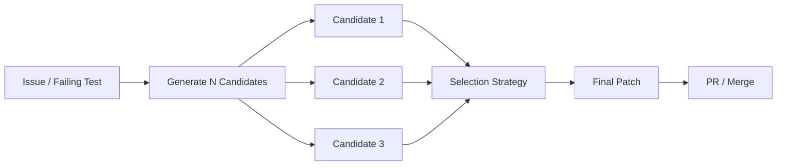
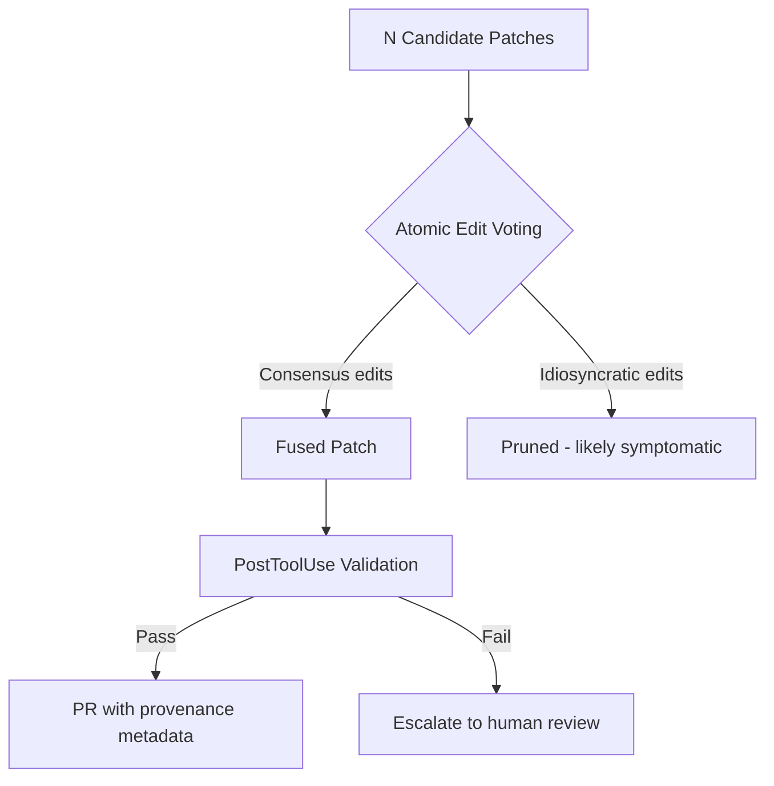

# PatchFusion and the Pass@k-to-Pass@1 Problem: Why Your Codex CLI Needs a Patch Selection Strategy


---

Your coding agent can solve the bug. The question is whether it will solve the bug *this* time. The reliability gap — the distance between what an agent *can* do (pass@k) and what it *does* do on a single shot (pass@1) — is the defining operational problem for anyone running Codex CLI in production pipelines. Three recent research threads converge on a single practical insight: generating multiple candidate patches is cheap; selecting the right one is the hard part.

## The Pass@k-to-Pass@1 Gap

Every SWE-bench leaderboard entry reports pass@1: one attempt, one patch, pass or fail. But the same agents evaluated at pass@5 or pass@10 show dramatically higher ceiling performance[^1]. Jha et al. (2026) formalise this as the *reliability gap* — the distance between capability ("can succeed once in k tries") and consistency ("usually succeeds on the first try")[^2].

The gap is not academic. If your CI pipeline dispatches a Codex CLI cloud task to fix a failing test, and the agent generates a semantically incorrect patch 20 per cent of the time — even when a correct patch exists within its sampling distribution — you have a production problem that no amount of prompt tuning will eliminate[^3].



## PatchFusion: Deterministic Selection Without Tests

Yang et al. (July 2026) introduce PatchFusion, a deterministic approach to patch selection that operates without executing test suites at decision time[^4]. The core mechanism:

1. **Repair neighbourhood construction** — whole-diff agreement across candidates identifies a cluster of patches that modify the same code regions in similar ways.
2. **Representative selection** — an auditable representative is chosen from the neighbourhood.
3. **Evidence-constrained fusion (ECF)** — shared atomic edits (individual hunks, line changes) are retained; unsupported modifications are pruned.

The key insight is that when multiple independent generation attempts agree on a specific edit atom, that convergence constitutes evidence of correctness — without needing to run the patch against a test suite.

### Results on PatchFuseBench

| Benchmark | PatchFusion | Best Single Selector | Candidate Ceiling |
|-----------|-------------|---------------------|-------------------|
| SWE-bench Verified | 426/500 | — | 96.2% of ceiling[^4] |
| SWE-bench Multilingual | 236/300 | — | 89.7% of ceiling[^4] |
| Defects4J | 87/371 | — | Outperforms all[^4] |

PatchFusion recovered 41 bugs on SWE-bench Verified and 27 on Multilingual that *no single source* solved individually[^4]. The ablation shows ECF alone adds +5/+6/+9 solved bugs across the three benchmarks. Execution time: 3.28 ms per bug — two to three orders of magnitude below model-based selectors[^4].

## Ensemble Patching in Practice: The Team Atlanta Evidence

Team Atlanta's 2026 vulnerability patching evaluation provides complementary evidence from a production-adjacent setting[^3]. They ran 10 agent configurations (combining Claude Code, Codex CLI, Gemini CLI, and Copilot with five frontier models) against 63 real crashes from the DARPA AIxCC competition:

- **Best single configuration**: ~71% correct patches, ~80% semantic correctness
- **Ensemble of N=3**: consistently outperformed individual agents
- **Model choice > framework choice**: upgrading from Opus 4.5 to 4.6 had more impact than switching agent framework

Their taxonomy of 145 faulty patches identified five failure modes: altered functionality (55), symptomatic patching (38), weak guards (28), wrong API usage (15), and inappropriate mitigations (15)[^3]. These are precisely the failure modes that ensemble selection can filter — because different agents fail in different ways.

## SWE-Replay: Efficient Test-Time Scaling

Where PatchFusion operates on a pool of completed candidates, SWE-Replay (January 2026) optimises the *generation* phase itself[^5]. Rather than sampling N independent trajectories from scratch, it maintains an archive of prior attempts and stochastically branches at critical intermediate steps:

- Reduces cost by up to 17.4 per cent whilst maintaining or improving performance by up to 3.8 per cent on SWE-bench Verified[^5]
- Bypasses reliance on potentially miscalibrated value models
- Generalises across agent scaffolds — including those that synthesise custom bash scripts as tools

The practical implication: you can get more diverse candidates for the same token budget by recycling partial trajectories rather than starting fresh each time.

## Mapping to Codex CLI: The Multi-Attempt Stack

Codex CLI already provides the building blocks for multi-candidate workflows. The challenge is assembling them into a coherent selection pipeline.

### The `--attempts` Flag (Cloud Tasks)

```bash
# Generate 3 independent solutions for the same task
codex cloud exec --env prod-env --attempts 3 "Fix the race condition in worker.go"

# Review each attempt's diff independently
codex cloud diff TASK_ID --attempt 1
codex cloud diff TASK_ID --attempt 2
codex cloud diff TASK_ID --attempt 3
```

The `--attempts` flag (1–4) triggers best-of-N execution: Codex spawns multiple independent agents on the same task and surfaces all results for review[^6]. This is the simplest entry point, but selection remains manual.

### Multi-Model Routing for Diversity

PatchFusion's effectiveness depends on candidate diversity — patches generated by the same model with the same temperature tend to cluster. Named profiles enable cross-model generation:

```toml
# ~/.codex/repair-ensemble.config.toml
[profiles.attempt-opus]
model = "claude-opus-4.8"
model_provider = "anthropic"

[profiles.attempt-gpt]
model = "gpt-5.6-sol"
model_provider = "openai"

[profiles.attempt-gemini]
model = "gemini-3.1-pro"
model_provider = "google"
```

```bash
# Generate diverse candidates via different models
for profile in attempt-opus attempt-gpt attempt-gemini; do
  codex exec -p "$profile" \
    --output-schema ./patch-schema.json \
    "Fix issue #1234. Output only the unified diff." \
    > "candidate-${profile}.patch" &
done
wait
```

### PostToolUse Hooks for Automated Validation

Before selection, each candidate needs basic validation. A PostToolUse hook can gate patches automatically:

```toml
# .codex/config.toml
[[hooks]]
event = "PostToolUse"
tool = "apply_patch"
command = "scripts/validate-patch.sh"
```

```bash
#!/bin/bash
# scripts/validate-patch.sh
# Run fast checks: syntax, type checking, affected test subset
set -e
cargo check 2>/dev/null || npm run typecheck 2>/dev/null || true
git diff --stat HEAD | grep -q "." || exit 1  # Ensure non-empty diff
```

### Implementing PatchFusion-Style Selection

The deterministic fusion approach translates directly to a post-processing script:

```bash
#!/bin/bash
# scripts/patch-select.sh — Lightweight atomic-edit voting
# Collects hunks from N candidates, selects by consensus

candidates=(candidate-*.patch)
declare -A hunk_votes

# Extract individual hunks and vote
for patch in "${candidates[@]}"; do
  while IFS= read -r hunk; do
    key=$(echo "$hunk" | sha256sum | cut -d' ' -f1)
    hunk_votes["$key"]=$(( ${hunk_votes["$key"]:-0} + 1 ))
  done < <(grep -A999 "^@@" "$patch" | csplit -z -f /tmp/hunk - '/^@@/' '{*}' 2>/dev/null)
done

# Retain hunks with majority agreement (≥ ceil(N/2) votes)
threshold=$(( (${#candidates[@]} + 1) / 2 ))
# ... assemble final patch from majority hunks
```

⚠️ A production implementation would need proper unified-diff parsing rather than this sketch. The PatchFusion paper's actual algorithm handles hunk boundaries, context lines, and overlapping edits formally.

### AGENTS.md Specification for Ensemble Workflows

```markdown
## Patch Generation Protocol

When fixing bugs or implementing features:
1. Generate the fix independently — do not reference prior attempts
2. Output a clean unified diff via `git diff`
3. Include a one-line rationale for each hunk
4. If uncertain between two approaches, prefer the minimal change

## Selection Criteria (for ensemble review)
- Prefer patches with fewer modified files
- Prefer patches that modify only the module containing the bug
- Reject patches that suppress errors without addressing root cause
```

## The Cost Arithmetic

The economics of multi-attempt generation versus single-shot repair are counterintuitive:

| Strategy | Token Cost | Success Rate | Cost per Successful Fix |
|----------|-----------|--------------|------------------------|
| Single attempt (pass@1) | 1× | ~52–71%[^3] | 1.4–1.9× base |
| 3 attempts + manual select | 3× | ~85–90%[^3] | 3.3–3.5× base |
| 3 attempts + PatchFusion | 3× + 3.28ms | ~90–96%[^4] | 3.1–3.3× base |
| SWE-Replay (3 budget) | ~2.5×[^5] | ~87–92% | 2.7–2.9× base |

The break-even calculation: if a failed patch costs you a review cycle (20 minutes of senior developer time), three attempts with automated selection pays for itself whenever your single-shot failure rate exceeds ~10 per cent.

## The Semantic Incorrectness Problem

Raw pass rates undercount failures. Team Atlanta found that ~20 per cent of patches passing automated validation contained semantic defects — fixes that mask the symptom without addressing the root cause[^3]. PatchFusion's atomic-edit voting partially addresses this: symptomatic patches tend to be idiosyncratic (each agent suppresses the error differently), whilst correct patches converge on the same structural change.



This maps to Codex CLI's Guardian auto-review subagent: configure it to flag patches where the fused result differs significantly from any individual candidate, as divergence signals uncertainty.

## Practical Recommendations

1. **Start with `--attempts 3`** for any CI-triggered repair task. The cost is 3× tokens; the reliability improvement is disproportionate.
2. **Diversify models, not temperatures.** Cross-model candidates (GPT-5.6 + Claude Opus 4.8 + Gemini 3.1 Pro) produce more structurally diverse patches than the same model at different temperatures[^3].
3. **Implement atomic-edit voting** as a PostToolUse hook or CI step. Even a naive majority-hunk filter catches the most common failure mode (symptomatic patching).
4. **Track your reliability gap.** Log pass@1 and pass@3 for your actual task distribution. If the gap exceeds 15 percentage points, ensemble selection will pay for itself.
5. **Use `codex exec --output-schema`** to enforce structured diff output, making automated parsing reliable across attempts.

## Citations

[^1]: Jha, S. et al. "The Reliability Gap: Agent Benchmarks for Enterprise." *simmering.dev*, 2026. [https://simmering.dev/blog/agent-benchmarks/](https://simmering.dev/blog/agent-benchmarks/)

[^2]: Runloop. "I have Opinions on Pass@K - You should too." *runloop.ai*, 2026. [https://runloop.ai/blog/i-have-opinions-on-pass-k-you-should-too](https://runloop.ai/blog/i-have-opinions-on-pass-k-you-should-too)

[^3]: Team Atlanta. "Patching Vulnerabilities with Coding Agents in 2026." *team-atlanta.github.io*, 2026. [https://team-atlanta.github.io/blog/post-patch-2026-ensemble/](https://team-atlanta.github.io/blog/post-patch-2026-ensemble/)

[^4]: Yang, B., Hu, X., Ren, L., Chen, Y., Le, B., Bissyandé, T.F., Tian, H. "A Single Patch Is Not Enough: Deterministic Fusion of Repair Candidates." *arXiv:2607.01597*, July 2026. [https://arxiv.org/abs/2607.01597](https://arxiv.org/abs/2607.01597)

[^5]: SWE-Replay authors. "SWE-Replay: Efficient Test-Time Scaling for Software Engineering Agents." *arXiv:2601.22129*, January 2026. [https://arxiv.org/abs/2601.22129](https://arxiv.org/abs/2601.22129)

[^6]: OpenAI. "Codex Cloud." *developers.openai.com*, 2026. [https://developers.openai.com/codex/cloud](https://developers.openai.com/codex/cloud)
