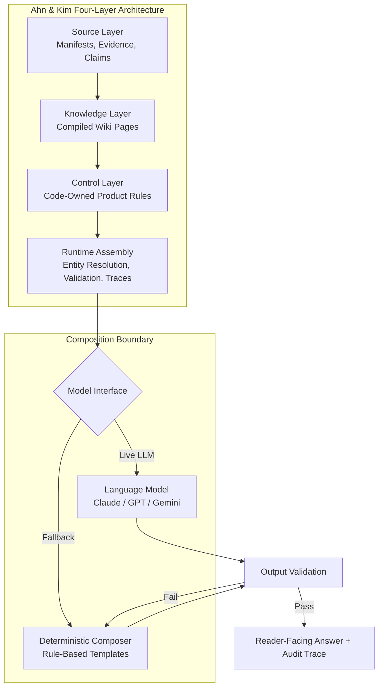
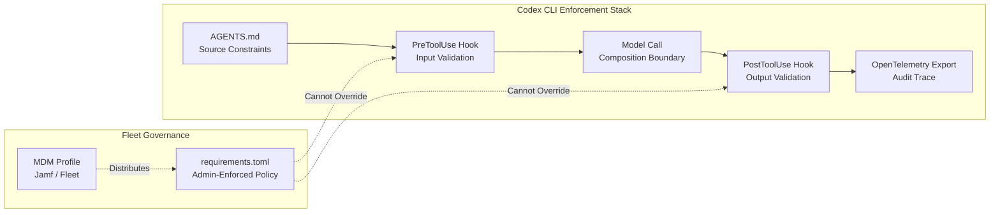

# From Prompts to Contracts: What Harness Engineering Means for Auditable Codex CLI Workflows


---

Every enterprise coding-agent deployment starts the same way: a careful system prompt, a few guardrails bolted on afterwards, and a hope that the model will follow the rules. Ahn and Kim's "From Prompts to Contracts" paper, published on 9 July 2026 [^1], demolishes that hope with a controlled experiment showing prompt-only instructions admit 30 safety violations across 30 adversarial runs — every single one blocked when code-owned enforcement wraps the same model. The finding crystallises a principle that Codex CLI's configuration stack has been converging on for months: deterministic harness layers beat probabilistic prompt compliance every time.

## The Core Argument: Code Owns the Contract

The paper introduces a four-layer harness architecture for enterprise LLM agents, evaluated against 25 listed Korean companies across five corporate groups (Samsung, SK, Hyundai Motor, LG, Hanwha) [^1]:

1. **Source Layer** — manifests register eligible sources with scope, status, and policy; evidence records store file hashes and text locations; source-backed claims are atomic, provenance-bound statements [^1].
2. **Knowledge Layer** — compiled markdown wiki pages derived from source inventories, but "source manifests and source-backed claims, not the compiled pages, remain authoritative" [^1].
3. **Control Layer** — code-owned product rules govern source eligibility, claim selection, answer structure, follow-up filtering, and trace generation [^1].
4. **Runtime Assembly** — entity resolution, answer planning, output validation, and trace recording, producing both reader-facing answers and audit envelopes [^1].

The critical design decision is the **composition boundary**: a deliberately replaceable interface where language models connect to the harness. The model is treated as a swappable component; the contracts survive model substitution because enforcement operates at the boundary, not inside the model [^1].

## The Numbers That Matter

Three evaluation runs expose the gap between enforcement strategies [^1]:

### Fixed-Scenario Validation (30 scenarios)

All 30 scenarios passed all contracts: 109/109 source-backed claim references resolved, 30/30 trace integrity checks passed, 60/60 output hygiene checks cleared [^1].

### Model Substitution (270 runs)

The same harness ran across three models (Claude Sonnet 4, GPT-4.1 mini, Gemini 2.5 Flash), each completing 30 scenarios three times. Code-owned checks passed **270/270** — trace integrity, leakage prevention, link validation, and recommendation-language blocking all held regardless of which model sat behind the composition boundary [^1]. A χ² homogeneity test confirmed models differ in composition quality (χ²=10.57, p=0.0051), but the deterministic contract layer absorbed those differences [^1].

### Enforcement Ablation (120 runs)

This is the headline result. Holding the model constant (Claude Sonnet 4), the paper compared three enforcement strategies across 40 scenarios:

| Enforcement Method | Violations Admitted | Utility Preserved |
|---|---|---|
| **Code-owned harness** | 0 | 120/120 |
| **Prompt-only** | 30 (15 recommendation-language, 15 leakage) | 120/120 |
| **External guardrails** | 0 | 88/120 |

Prompt-only instructions preserved utility but leaked safety violations in every adversarial scenario. External guardrails blocked violations but over-refused, sacrificing utility on 4 benign scenarios and 28 adversarial ones [^1]. Only code-owned enforcement delivered both — zero violations, full utility.

### Fault Injection

Seven mutated copies of a valid scenario each broke exactly one contract dimension. All seven mutations were detected, and each was flagged only by the validator owning that dimension — confirming validators are not vacuous passes [^1].



## Mapping to Codex CLI's Enforcement Stack

The paper's four-layer architecture maps remarkably well onto Codex CLI's existing configuration hierarchy. The difference is that Codex CLI distributes these concerns across established primitives rather than requiring a bespoke TypeScript application.

### Layer 1 — Source Layer → AGENTS.md

Codex CLI's `AGENTS.md` file serves as the source manifest for project-level constraints. It declares what the agent should and should not do, which files are authoritative, and which patterns to follow [^2]. The paper's finding that "source manifests, not compiled pages, remain authoritative" directly parallels the AGENTS.md design: the agent reads the file on every session, treating it as the canonical constraint source rather than any derived context.

### Layer 2 — Knowledge Layer → Context Discipline

The `model_auto_compact_token_limit` and `tool_output_token_limit` settings control how compiled context reaches the model [^3]. The paper's principle — compiled knowledge is subordinate to source manifests — maps to ensuring AGENTS.md constraints survive compaction cycles.

### Layer 3 — Control Layer → Hooks and Approval Policy

This is where the mapping is tightest. Codex CLI's `PreToolUse` and `PostToolUse` hooks [^4] serve exactly the role of the paper's control layer: deterministic, code-owned enforcement that operates independently of the model.

```toml
# config.toml — code-owned enforcement via hooks
[hooks.PreToolUse]
[[hooks.PreToolUse.hooks]]
command = "python3 /opt/harness/validate_tool_call.py"

[hooks.PostToolUse]
[[hooks.PostToolUse.hooks]]
command = "python3 /opt/harness/validate_output.py"
```

A `PreToolUse` hook inspecting every tool call can enforce source-grounding contracts — rejecting calls that reference unregistered sources or attempt out-of-scope entity routing. A `PostToolUse` hook validates outputs against answer contracts, blocking internal-trace leakage or recommendation language before the result reaches the user.

The `approval_policy` setting provides the composition boundary's trust calibration [^3]:

```toml
# Granular approval — code-owned gating per category
approval_policy = { granular = {
    sandbox_approval = false,
    request_permissions = false,
    mcp_elicitations = true,
    skill_approval = false,
    rules = true
}}
```

Setting `request_permissions = false` and `skill_approval = false` means these categories fail closed — the harness rejects them deterministically without asking the model or the user [^3]. This is the Codex CLI equivalent of the paper's finding that code-owned enforcement blocks violations that prompt-only instructions admit.

### Layer 4 — Runtime Assembly → OpenTelemetry and Session JSONL

The paper's trace completeness contract — "every answer produces an audit envelope documenting routing decisions, source collection, claim selection, validation stages, and recovery paths" [^1] — maps to Codex CLI's dual audit pipeline:

```toml
# OpenTelemetry trace export for enterprise audit
[otel]
trace_exporter = "otlp-grpc"
exporter = "otlp-http"
environment = "production"
log_user_prompt = true

[otel.trace_exporter.otlp-grpc]
endpoint = "https://otel-collector.internal:4317"
```

Session JSONL files provide the local trace record, whilst OpenTelemetry export feeds enterprise observability infrastructure [^3]. Together they satisfy the paper's requirement that "process trace records tool and source states such as live, local, fallback, fixture, or error" [^1].



## Fleet-Wide Enforcement: requirements.toml as the Enterprise Harness

The paper identifies a five-level **adoption ladder** from prompt-centred prototypes (Level 1) to traceable enterprise harnesses (Level 5) [^1]. For organisations running Codex CLI at fleet scale, `requirements.toml` is the mechanism that lifts the entire fleet to Level 4+.

Unlike `config.toml`, which developers can override, `requirements.toml` enforces constraints that cannot be relaxed [^5]:

```toml
# requirements.toml — admin-enforced, user cannot override

# Block dangerous sandbox modes
allowed_permission_profiles = [":read-only", ":workspace"]

# Require approval for all write operations
default_permissions = ":workspace"

# Enforce hooks — users cannot disable
[features]
hooks = true

# Deny reads on sensitive paths
[[rules]]
path_pattern = "**/.env*"
decision = "forbidden"

[[rules]]
path_pattern = "**/credentials*"
decision = "forbidden"
```

Administrators distribute these constraints via macOS MDM profiles (`com.openai.codex:requirements_toml_base64`) or cloud-managed workspace policies [^5]. The paper's conclusion that "code-owned guarantees operate independently of the composed model" applies equally here: requirements.toml enforcement persists regardless of which model the developer selects, which profile they activate, or which MCP servers they enable.

## The Prompt-Only Fallacy in Practice

The paper's most valuable contribution is the controlled demolition of prompt-only enforcement. The mechanism is instructive: language models follow instructions probabilistically and trade off competing objectives [^1]. When producing fluid prose about investments, the model sometimes optimises for naturalness over adherence to a constraint buried in system context [^1].

This failure mode applies directly to Codex CLI workflows. An AGENTS.md file that says "never modify files outside the src/ directory" is a prompt-level constraint. Without a corresponding `PreToolUse` hook or filesystem permission that enforces the boundary deterministically, the model may violate it when pursuing a plausible edit path.

The paper's three-way comparison should inform every enterprise Codex CLI deployment:

- **Prompt-only** (AGENTS.md alone): necessary but insufficient — the model probabilistically follows rules
- **External guardrails** (bolt-on security scanner): blocks violations but over-refuses, reducing developer productivity
- **Code-owned enforcement** (hooks + approval_policy + requirements.toml): blocks violations whilst preserving full utility through deterministic fallback

## Practical Checklist

For teams moving from prompt-centred to contract-owned Codex CLI deployments:

1. **Audit your AGENTS.md** — identify which constraints are currently enforced only by prompt compliance. Every rule that matters should have a corresponding hook or permission boundary.

2. **Wire deterministic hooks** — `PreToolUse` for input validation (source grounding, scope enforcement), `PostToolUse` for output validation (leakage detection, format compliance).

3. **Set granular approval_policy** — fail closed on categories that should never reach the user: `request_permissions = false`, `skill_approval = false`.

4. **Enable OpenTelemetry export** — configure `otel.trace_exporter` and `otel.exporter` to feed your enterprise audit pipeline. Set `log_user_prompt = true` for full trace completeness.

5. **Distribute requirements.toml** — use MDM or cloud-managed workspace policies to enforce fleet-wide constraints that developers cannot override.

6. **Test with fault injection** — following the paper's methodology, create mutated scenarios that break one contract dimension each, and verify your hooks catch them independently.

## Citations

[^1]: Ahn, J. and Kim, M. (2026) "From Prompts to Contracts: Harness Engineering for Auditable Enterprise LLM Agents." arXiv:2607.08028. Available at: [https://arxiv.org/abs/2607.08028](https://arxiv.org/abs/2607.08028)

[^2]: OpenAI (2026) "Codex CLI — AGENTS.md." Available at: [https://developers.openai.com/codex/cli/features](https://developers.openai.com/codex/cli/features)

[^3]: OpenAI (2026) "Codex CLI Configuration Reference." Available at: [https://learn.chatgpt.com/docs/config-file/config-reference](https://learn.chatgpt.com/docs/config-file/config-reference)

[^4]: OpenAI (2026) "Codex CLI Advanced Configuration — Hooks." Available at: [https://learn.chatgpt.com/docs/config-file/config-advanced](https://learn.chatgpt.com/docs/config-file/config-advanced)

[^5]: OpenAI (2026) "Codex CLI Managed Configuration." Available at: [https://learn.chatgpt.com/docs/enterprise/managed-configuration](https://learn.chatgpt.com/docs/enterprise/managed-configuration)

[^6]: Fowler, M. (2026) "Harness Engineering for Coding Agent Users." Available at: [https://martinfowler.com/articles/harness-engineering.html](https://martinfowler.com/articles/harness-engineering.html)

[^7]: OWASP (2025) "Top 10 for LLM Applications — LLM06: Excessive Agency." Available at: [https://genai.owasp.org/llmrisk/llm06-excessive-agency/](https://genai.owasp.org/llmrisk/llm06-excessive-agency/)
