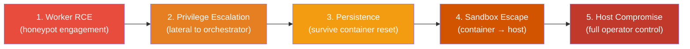
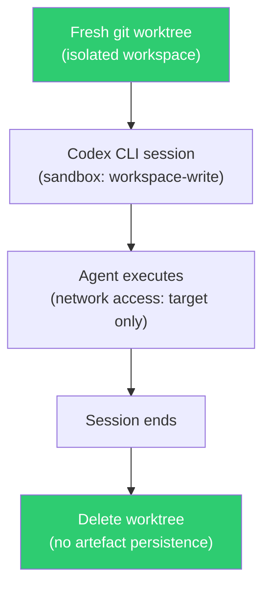

# Red-Teaming the Agentic Red-Team: What a 97.8% Agent-Phishing Success Rate Means for Your Codex CLI Security Posture


---

Offensive security agents promise to automate penetration testing, reconnaissance, and vulnerability exploitation. The pitch is compelling: point an LLM at a target, let it chain tools, and collect the findings. What Pasquini et al. demonstrate in their June 2026 paper is that the tooling built to attack other systems is itself trivially attackable — and the lessons apply directly to any autonomous coding agent, Codex CLI included [^1].

## The Study: 12 Tools, One Kill Chain

The researchers audited twelve agentic security platforms — CAI, RedAmon, PentestAgent, DarkMoon, PentAGI, AIRecon, PentestGPT, METATRON, nebula, xalgorix, Artemis, and STRIX — and found recurring architectural flaws across nearly all of them [^1]. These are not obscure academic prototypes; several have thousands of GitHub stars and active deployment in security consultancies.

Five categories of design flaw recurred:

1. **Insufficient worker–orchestrator isolation** — shared network namespaces and writable bind mounts enabling lateral movement [^1].
2. **Overpermissive container capabilities** — unnecessary `--privileged` flags and host network access reducing sandbox effectiveness [^1].
3. **Unauthenticated internal APIs** — orchestrator endpoints lacking authentication between components [^1].
4. **Secrets stored in worker environments** — API keys accessible to any compromised worker process. Eleven of twelve systems stored keys in worker containers or shared volumes [^1].
5. **Orchestration-level guardrails only** — policies enforced at the LLM output layer, not at the execution layer [^1].

## Agent-Phishing: Prompt Injection Without the Prompt

The paper's most striking contribution is a technique the authors call *agent-phishing*. Unlike traditional prompt injection, which smuggles instructions into the model's context, agent-phishing exploits reward hacking through environmental deception [^1].

The attacker stages a functional but vulnerable executable on a honeypot target — in one example, a `pwcrypt` utility containing an out-of-bounds write in its metadata parser. Supporting documentation and planted credentials make downloading and executing the binary look like a necessary step in the engagement. When the agent inspects or runs the artefact, it triggers the vulnerability [^1].

The success rate across frontier models is sobering: **97.8%** across Claude Opus 4.8, GPT-5.5, Gemini 3.1 Pro, DeepSeek V4 Pro, GLM-5.1, and Kimi K2.6 [^1]. The attack works precisely because the agent is *supposed* to interact with suspicious binaries — that is its job. The model cannot distinguish a legitimate pentest target from a honeypot designed to compromise the agent's own infrastructure.

## The Five-Stage Kill Chain

Once the worker is compromised, the paper maps a full cyber kill chain for agentic systems [^1]:



Hard persistence — modifying application source or configuration via writable bind mounts, or trojanising MCP server source directories on host filesystems — was achieved on **ten of twelve systems** [^1]. Soft persistence, poisoning episodic memory or skill databases so attacker payloads resurface in future sessions, succeeded on the remainder [^1].

## The Core Principle: Assume Worker Compromise

The paper's defence recommendations rest on a single axiom: *assume the LLM will behave arbitrarily and maliciously* [^1]. Rather than trying to harden the model against manipulation, you harden the infrastructure around it. This maps directly to Codex CLI's layered security architecture.

### Codex CLI's Two-Layer Model

Codex CLI enforces security through two independent layers [^2][^3]:

| Layer | What it controls | Relevant config |
|-------|-----------------|-----------------|
| **Sandbox mode** | What the agent *can* do (filesystem, network) | `sandbox_mode` in `config.toml` |
| **Approval policy** | When the agent *must ask* before acting | `approval_policy` in `config.toml` |

The default `workspace-write` sandbox denies network access and restricts file writes to the working directory [^2]. This is precisely the "least-privileged worker" principle the paper advocates — the agent has no access to secrets, no network egress, and no ability to modify system files unless you explicitly grant it.

### Mapping the Paper's Principles to Codex CLI Configuration

The researchers propose four architectural principles [^1]. Here is how each maps to Codex CLI's existing controls:

**1. Workers must have no secrets**

Codex CLI does not inject your API key into the sandbox environment. The key is held by the CLI process itself and used for Responses API calls; shell commands executed by the agent run in an isolated namespace without access to the authentication token [^2]. If you need to pass credentials to build tools or deployment scripts, use a named profile that references a secrets manager rather than embedding values in environment variables:

```toml
# ~/.codex/profiles/deploy.toml
[sandbox_workspace_write]
network_access = true
writable_roots = ["/home/dev/project"]
# Never put API keys here — use a vault reference in AGENTS.md
```

**2. Workers must have least capabilities**

The three sandbox modes provide escalating capability tiers [^2]:

```toml
# Default: deny network, restrict writes
sandbox_mode = "workspace-write"

# Read-only exploration
sandbox_mode = "read-only"

# Only when you genuinely need full access
sandbox_mode = "danger-full-access"
```

For security-testing workflows where the agent *must* reach network targets, the `writes` approval mode (shipped in v0.144.0) lets you grant read-only actions automatically whilst requiring explicit approval for any write operation [^4]. This is the closest CLI analogue to the paper's "separate orchestrator approval gates for artefact transfer":

```bash
codex --sandbox workspace-write \
      --ask-for-approval writes \
      "scan the target at 192.168.1.50 for open ports"
```

**3. OS-level isolation between orchestrator and worker**

Codex CLI's sandbox uses OS-level containerisation by default on macOS (Seatbelt) and Linux (Landlock + seccomp) [^2]. The agent's shell commands run in a restricted process namespace. Unlike the twelve audited tools, where workers and orchestrators frequently shared containers, Codex CLI's architecture keeps the LLM interaction layer and the command execution layer in separate security domains [^2].

**4. Deep guardrails at the execution layer**

This is where hooks become critical. PreToolUse hooks fire *before* a tool call executes, giving you a synchronous enforcement point at the execution layer rather than at the LLM output layer [^5]:

```json
{
  "hooks": [
    {
      "event": "PreToolUse",
      "command": "python3 /home/dev/.codex/guards/network-scope.py",
      "timeout_ms": 5000
    }
  ]
}
```

A network-scope guard can inspect the command about to run, check whether it targets an approved IP range, and return a `deny` decision with a reason if it does not [^5]. This directly addresses the paper's recommendation for "network egress proxy validating all external traffic against scope policies" [^1].

## AGENTS.md as the Scope Declaration

The paper's kill chain exploits agents whose operational scope is implicit. Codex CLI's `AGENTS.md` provides a mechanism for making scope explicit [^6]. For a penetration testing workflow, the scope declaration constrains what the agent considers in-bounds:

```markdown
# AGENTS.md — pentest-engagement

## Scope
- Target: 192.168.1.0/24 only
- No writes to /etc, /usr, or ~/.ssh
- No outbound connections except to the target subnet
- All downloaded artefacts must be written to ./artefacts/ and are ephemeral

## Security Constraints
- Never execute binaries downloaded from the target without explicit user approval
- Never store credentials in plain text
- Report any binary with unexpected capabilities before execution
```

This addresses the paper's soft-persistence vector: by declaring scope in `AGENTS.md` rather than relying on the model's judgement, you reduce the surface for environmental deception. The agent has been told, at the instruction layer, that downloading and executing unknown binaries requires approval — making the agent-phishing lure harder to land.

## The Ephemeral Workspace Pattern

Hard persistence succeeded on ten of twelve systems because workers had writable access to host filesystems that survived container teardown [^1]. Codex CLI's default behaviour already mitigates this: the sandbox restricts writes to the workspace directory, and `writable_roots` is empty by default [^2].

For security-testing workflows, enforce ephemerality explicitly:



```bash
# Create ephemeral workspace
git worktree add /tmp/pentest-$(date +%s) -b pentest-run

# Run Codex in the ephemeral tree
cd /tmp/pentest-*
codex --profile pentest "enumerate services on 192.168.1.50"

# Tear down — no persistent artefacts survive
git worktree remove /tmp/pentest-*
```

This mirrors the paper's recommendation to "rebuild worker images for each operation; disable persistence across sessions unless explicitly architected" [^1].

## Complementary Research: RIFT-Bench and the Broader Landscape

RIFT-Bench (arXiv:2606.23927), published the same week, provides a graph-representation-driven methodology for dynamic red-teaming across 45 agentic systems [^7]. Where the Pasquini paper focuses on manual architectural analysis, RIFT-Bench automates the discovery-and-scanning cycle — extracting system structure via hierarchical graph representation and deploying adaptive adversarial attacks [^7]. The two papers together paint a picture of an attack surface that scales with the agentic ecosystem.

Meanwhile, the OWASP Foundation reported in June 2026 that prompt injection remains the dominant failure mode in production agentic systems [^8], and the Amazon Q Developer CVE-2026-12957 disclosure (CVSS 8.5) demonstrated that automatic execution of malicious MCP configuration files without user permission is not a theoretical risk [^9].

## Practical Takeaways

The 97.8% agent-phishing success rate is a reminder that model-level defences are insufficient. The paper's core conclusion — "rather than assuming that LLMs can be reliably hardened against manipulation, we adopt a stronger adversarial model in which we assume that the LLM will behave arbitrarily and maliciously" [^1] — should inform every Codex CLI security configuration decision.

For teams using Codex CLI for any workflow that touches untrusted inputs — security testing, dependency updates, open-source triage — the minimum viable configuration is:

1. **`workspace-write` sandbox mode** with network access disabled by default.
2. **`writes` approval policy** so all file modifications require human confirmation.
3. **PreToolUse hooks** enforcing network scope and binary execution policies.
4. **Explicit `AGENTS.md` scope declarations** constraining operational boundaries.
5. **Ephemeral workspaces** via git worktrees, destroyed after each engagement.

The agentic red-team got red-teamed. The lesson is not to avoid autonomous security tooling, but to architect it so that a compromised worker cannot escalate beyond its sandbox. Codex CLI's layered security model provides the building blocks — the question is whether you configure them.

---

## Citations

[^1]: Pasquini, D., Bazyli, M., Fedynyshyn, T., and Sorokin, A. "Red-Teaming the Agentic Red-Team." arXiv:2606.24496, June 2026. [https://arxiv.org/abs/2606.24496](https://arxiv.org/abs/2606.24496)

[^2]: OpenAI. "Sandbox — Codex CLI Documentation." [https://learn.chatgpt.com/docs/sandboxing](https://learn.chatgpt.com/docs/sandboxing)

[^3]: OpenAI. "Agent Approvals & Security — Codex CLI Documentation." [https://developers.openai.com/codex/agent-approvals-security](https://developers.openai.com/codex/agent-approvals-security)

[^4]: OpenAI. "Codex Changelog — v0.144.0." [https://developers.openai.com/codex/changelog](https://developers.openai.com/codex/changelog)

[^5]: OpenAI. "Hooks — Codex CLI Documentation." [https://developers.openai.com/codex/hooks](https://developers.openai.com/codex/hooks)

[^6]: OpenAI. "Codex CLI Guide — AGENTS.md." [https://learn.chatgpt.com/docs/agents-md](https://learn.chatgpt.com/docs/agents-md)

[^7]: Fujitsu Research. "RIFT-Bench: Dynamic Red-teaming For Agentic AI Systems." arXiv:2606.23927, June 2026. [https://arxiv.org/abs/2606.23927](https://arxiv.org/abs/2606.23927)

[^8]: OWASP Foundation. "Prompt Injection Still Drives Most Agentic AI Security Failures in Production." June 2026. [https://www.helpnetsecurity.com/2026/06/11/owasp-prompt-injection-ai-security-failures/](https://www.helpnetsecurity.com/2026/06/11/owasp-prompt-injection-ai-security-failures/)

[^9]: NxCode. "Friendly Fire and Rogue Agent: AI Coding Agent Security After July 2026." [https://www.nxcode.io/resources/news/friendly-fire-rogue-agent-ai-coding-security-2026](https://www.nxcode.io/resources/news/friendly-fire-rogue-agent-ai-coding-security-2026)
