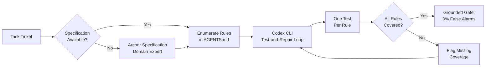

# Specification Grounding and the +38-Point Test Gap: Why Your Codex CLI Test Gates Need Enumerated Rules, Not More Tests


---

Every team using Codex CLI for automated test-and-repair loops faces the same quiet problem: the agent writes tests that look thorough but miss non-obvious edges. Haeri and Ghelichi's controlled experiment, published on 7 July 2026, puts hard numbers on the cause — and the fix is cheaper than you think [^1].

## The Core Finding: Content Beats Quantity

The researchers modified a single prompt line. One arm received an enumerated specification checklist; the other received the same task ticket with an explicit instruction to test edge cases. Everything else — the code model, the test author (Claude Sonnet 4.6), the repair loop, the test budget — stayed constant [^1].

The results across 48 core instances:

| Arm | Final Correctness | Bugs Detected (of 30) |
|-----|-------------------|-----------------------|
| One-shot (no tests) | 38% | — |
| free (K tests, no edge prompt) | 38% | 0/30 |
| free2k (2K tests) | 42% | 3/30 |
| free+ (K tests, edge-prompted) | 60% | 18/30 |
| **spec** (one test per rule) | **100%** | **30/30** |

The gap between spec-grounded and the fair baseline: **+40 percentage points** [^1]. Doubling the test budget without grounding barely moved the needle. Running eight independent ungrounded test suites plateaued far below grounding [^1].

## Why Quantity Fails

The mechanism is straightforward. On a `clamp(value, lo, hi)` function requiring validation when `lo > hi`, every test arm caught the obvious edge (`value < lo`). The edge-prompted baseline caught `paginate`'s `page < 1` on all six buggy drafts (6/6) but barely caught `clamp`'s `lo > hi` (2/6) [^1].

Generic "test the edges" instructions do not reach non-obvious edges consistently because the tester has to *know* what the code should do at each edge. Without a specification, the agent guesses — and guesses wrong often enough to be unreliable.

## Cross-Model Validation

The effect held across three Claude tiers (Haiku 4.5, Sonnet 4.6, Opus 4.8), all showing an identical +38 pp gap. The smallest model with grounding beat the largest model run one-shot [^1].

Cross-vendor replication confirmed the pattern:

- **GPT-5.3-codex**: +28 pp (100 per cent vs 72 per cent final correctness) [^1]
- **Gemini 3.5 Flash**: +19 pp (92 per cent vs 72 per cent) [^1]
- **Statistical significance**: p = 0.002 across 18 tasks [^1]

## The False-Alarm Problem You Didn't Know You Had

Detection is only half the story. On trickier behavioural tasks (Excel column names, title-casing, range collapsing), the ungrounded baseline **wrongly rejected correct code 33 per cent of the time** [^1]. All three ungrounded test suites independently assumed `excel_column(0)` should raise an error; the specification states "positive integer" and the reference returns an empty string.

Against production Python standard library code, false alarms rose to 68 per cent for the ungrounded baseline whilst specification-grounded tests held at 0 per cent [^1].

A test gate that rejects good code a third of the time trains developers to ignore it. This is precisely the dynamic that erodes trust in automated CI gates — and it is entirely preventable.

## Content vs Structure: The Ablation

The researchers separated specification into three components:

| Condition | Spec Content | Enumeration | Detection |
|-----------|-------------|-------------|-----------|
| free | No | No | 0/30 |
| decomp (chain-of-thought, no spec) | No | Yes | 2/30 |
| prose (spec as paragraph) | Yes | No | 27/30 |
| spec (enumerated rules) | Yes | Yes | 30/30 |

Content drives the result; enumeration adds a small margin by forcing one test per rule [^1]. Even a plain-paragraph specification recovered 27 of 30 bugs versus 2 for decomposition without content.

## Mapping to Codex CLI: The AGENTS.md Specification Layer

The practical implication for Codex CLI users is clear: your AGENTS.md file should contain enumerated specification rules for every module with non-trivial edge behaviour. This is not aspirational documentation — it is the mechanism that makes your test-and-repair loop reliable.

### A Specification-Grounded AGENTS.md Pattern

```markdown
## Testing Policy

When writing or repairing tests for any module, ground every test case
in the specification rules listed below. Write one test per rule.
Do not invent additional edge-case expectations beyond what the
specification states.

### Module: payment/split.py

Rules:
1. Total must equal sum of shares after splitting
2. Remainder pennies distributed round-robin starting from first payee
3. Zero-amount payees receive zero share, no error
4. Negative total raises ValueError with message containing "negative"
5. Empty payee list raises ValueError with message containing "empty"
6. Single payee receives full amount unchanged

### Module: api/pagination.py

Rules:
1. page < 1 raises ValueError
2. page_size < 1 raises ValueError
3. page_size > 100 clamps to 100 silently
4. Empty result set returns {"items": [], "total": 0, "page": 1}
5. Last page may contain fewer items than page_size
6. total reflects full dataset count, not page count
```

This pattern directly mirrors the experimental setup that achieved 100 per cent correctness. Each enumerated rule becomes one test case, removing the guesswork that causes both missed bugs and false alarms.

### Hook-Based Enforcement

Codex CLI's hook system can enforce specification grounding at the point of test creation. A `PreToolUse` hook can verify that test files reference specification rules before the agent writes them:

```toml
# .codex/hooks.toml

[[hooks]]
event = "PreToolUse"
tool = "write_file"
match = "**/test_*.py"
command = """
python3 -c "
import sys
content = open(sys.argv[1]).read()
if 'Rule' not in content and 'spec' not in content.lower():
    print('WARN: Test file does not reference specification rules.')
    print('Ground tests in AGENTS.md specification before writing.')
    sys.exit(1)
" "$CODEX_FILE_PATH"
"""
```

A `PostToolUse` hook can run the grounded test suite and compare results against the specification checklist:

```toml
[[hooks]]
event = "PostToolUse"
tool = "run_command"
match = "pytest*"
command = """
python3 -c "
import json, sys
# Parse pytest JSON output for coverage of specification rules
# Flag any specification rule without a corresponding test
print('Specification coverage check complete.')
"
"""
```

## The Cost Equation

Specification grounding adds almost no compute over the ungrounded baseline. Both `spec` and `free+` arms make three model calls of similar size — roughly \$6–7 per 1,000 tasks [^1]. Closing the same gap through model scaling alone costs approximately 2.2× the tokens [^1].

The real cost sits in specification authoring. But this is a cost most teams should already be paying. The binding constraint is not writing rules but *knowing the correct edge semantics* [^1] — domain knowledge that should exist somewhere in your team regardless of whether an AI agent is involved.



## When Grounding Does Not Help

The researchers tested eight algorithmic logic tasks (sorting, searching, graph traversal) with well-specified behaviour. Natural bug rate: 0 per cent across 45 valid submissions. Grounding showed no benefit [^1].

The effect is bounded to **specification-completeness defects** — missing input validation, unhandled boundary conditions, ambiguous edge semantics. These are precisely the defects that matter most in production systems and that coding agents handle worst without guidance.

## Stronger Baselines Still Fall Short

Property-based testing (random inputs + invariants) achieved 28/30 detection but **wrongly rejected the trusted reference implementation** on two tasks, inventing out-of-spec requirements [^1]. An AlphaCodium-style agentic loop (reflect → generate tests → write solution → iteratively fix) running on GPT-5.3-codex achieved 72 per cent correctness — matching the ungrounded baseline but falling well short of grounding's 100 per cent [^1].

The lesson: sophisticated testing strategies without specification content cannot close the gap.

## Imperfect Specifications Are Still Valuable

Dropping validation rules from the specification degraded detection proportionally (30/30 → 6/30), but the remaining tests stayed 100 per cent accurate [^1]. A noisy specification containing a rule endorsing a bug held detection at 30/30 but dropped tester accuracy to 82.8 per cent [^1].

Partial specifications degrade gracefully. Noisy specifications show their cost as reduced precision rather than silent failure. Both properties make the approach practical for real-world use where specifications are rarely complete or perfectly accurate.

## Practical Implementation Checklist

For teams integrating specification grounding into their Codex CLI workflow:

1. **Audit existing AGENTS.md** for modules with edge behaviour. Add enumerated specification rules for each.

2. **Structure rules as discrete items**, one per line. The enumeration format forces one test per rule and prevents the agent from treating edges as optional.

3. **Include negative specifications** — what the code should *not* do. The false-alarm reduction depends on the agent knowing intended behaviour at boundaries, not just happy-path expectations.

4. **Wire a PreToolUse hook** to verify test files reference specification rules before writing. This catches ungrounded test generation before it enters your CI pipeline.

5. **Use `codex exec` with `--output-schema`** for batch specification-grounded testing across modules. Structured output lets you parse coverage reports programmatically.

6. **Maintain specifications alongside code**. When edge behaviour changes, update the AGENTS.md rules. Stale specifications are better than no specifications, but fresh ones are better still.

7. **Reserve grounding for specification-completeness tasks**. Pure algorithmic work with zero natural bug rate does not benefit. Focus specification effort where it matters: input validation, boundary handling, error semantics.

## The Broader Implication

The specification grounding result challenges a common assumption in agentic coding: that more capable models or more sophisticated test-generation strategies will eventually close the quality gap. The data shows otherwise. A single prompt line containing enumerated rules outperforms model scaling, test-quantity scaling, property-based testing, and full agentic loops — all at negligible additional cost [^1].

For Codex CLI users, this translates to a concrete architectural decision: invest in specification content in your AGENTS.md, not in more elaborate test-generation prompts. The +38-point gap is not a model limitation waiting to be solved by GPT-6. It is an information gap that only domain knowledge can fill.

---

## Citations

[^1]: Haeri, A. and Ghelichi, M. (2026) 'Specification Grounding Drives Test Effectiveness for LLM Code', *arXiv preprint*, arXiv:2607.06636. Available at: [https://arxiv.org/abs/2607.06636](https://arxiv.org/abs/2607.06636).

[^2]: OpenAI (2026) 'Custom instructions with AGENTS.md', *Codex CLI Documentation*. Available at: [https://developers.openai.com/codex/guides/agents-md](https://developers.openai.com/codex/guides/agents-md).

[^3]: OpenAI (2026) 'Codex CLI Changelog — v0.144.0', *OpenAI Developers*. Available at: [https://developers.openai.com/codex/changelog](https://developers.openai.com/codex/changelog).

[^4]: Vaughan, D. (2026) 'Test-Driven Development with Codex CLI: The Red-Green-Refactor Loop, AGENTS.md Test Gates, and Hook-Based Verification', *Codex Knowledge Base*. Available at: [https://codex.danielvaughan.com/2026/04/10/codex-cli-test-driven-development-workflow/](https://codex.danielvaughan.com/2026/04/10/codex-cli-test-driven-development-workflow/).

[^5]: OpenAI (2026) 'Codex CLI Features', *Codex CLI Documentation*. Available at: [https://developers.openai.com/codex/cli](https://developers.openai.com/codex/cli).
