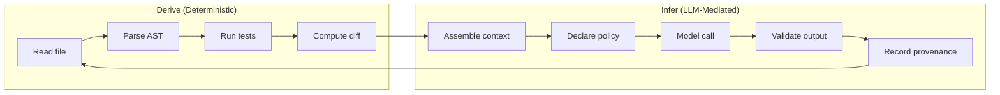
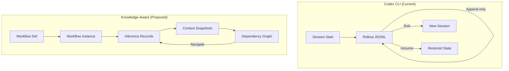

# Workflows as Knowledge Objects: Why Semantic Persistence and the Derive/Infer Boundary Matter for Your Codex CLI Sessions


---

Most developers treat Codex CLI sessions as ephemeral. You prompt, the agent works, you get code. The session JSONL file accumulates on disk and you never look at it again. But a growing body of research argues that this disposable-session mindset is architecturally wrong — that workflow executions are *knowledge objects* that should be inspectable, resumable, and auditable long after the agent stops typing.

Three recent works converge on this claim: Quinto, Rozzi, and Zanitti's *Workflow as Knowledge* framework[^1], Brady's Springdrift auditable persistent runtime[^2], and the *Agent Traces to Trust* provenance survey[^3]. This article unpacks their core ideas and maps them directly onto Codex CLI's existing architecture — showing what already works, what requires configuration, and where gaps remain.

## The Derive/Infer Distinction

The most practically useful concept from *Workflow as Knowledge* is the semantic split between **derive** and **infer**[^1]:

- **Derive** — deterministic computation over already-available workflow state. Testable, replayable, produces the same output given the same input. Running `npm test`, parsing a JSON schema, computing a diff.
- **Infer** — LLM-mediated judgment requiring declared context, capability policy, and validation. Non-deterministic by nature. Generating a patch, classifying a code smell, deciding which file to edit next.

The paper's central argument: these two operation types demand fundamentally different persistence and audit guarantees. Derive operations need replay fidelity. Infer operations need provenance — what context was assembled, which policy governed the call, what the model returned, and whether a human approved the outcome.



### Why This Matters for Codex CLI

Every Codex CLI session already interleaves derive and infer operations. When you ask Codex to "fix the failing test in `auth.ts`", it:

1. **Derives**: reads the file, runs the test suite, parses error output
2. **Infers**: decides what the fix should be, generates a patch
3. **Derives**: applies the patch, reruns tests, checks the exit code
4. **Infers**: decides whether the fix is complete or needs iteration

The session JSONL captures both, but treats them identically — as sequential events in a flat stream[^4]. The research suggests this conflation makes post-hoc audit harder than it needs to be.

## Semantic Persistence: Sessions as Knowledge Substrate

*Workflow as Knowledge* proposes five persistent object types that together form a "knowledge substrate"[^1]:

| Object Type | Purpose | Codex CLI Equivalent |
|---|---|---|
| Workflow definition | Declares steps, policies, exit conditions | AGENTS.md + skills |
| Workflow instance | A specific execution of a definition | Session rollout JSONL |
| Inference record | Model call with context, output, approval | Tool-call events in JSONL |
| Context snapshot | Bounded state assembled for an infer call | ⚠️ Not explicitly captured |
| Dependency relation | Links between records | ⚠️ Implicit via ordering only |

The gap is clear: Codex CLI persists everything as a linear event stream[^4], but does not explicitly model the *dependency graph* between decisions or the *bounded context* that was available when each inference was made. The `model_reasoning_summary` field added in v0.138 partially addresses this for reasoning models[^5], but it captures the model's internal chain-of-thought rather than the external context window.

### Live-Image Thinking

The paper borrows from Symbolics Genera's "live-image" paradigm[^1] — the idea that programs, data, and execution state inhabit one integrated, inspectable environment. Applied to coding agents, this means you should be able to:

- Navigate from a code change back to the inference that produced it
- Inspect the exact context window assembled for that inference
- See which AGENTS.md rules were active
- Fork from any historical decision point with full state

Codex CLI already supports the last of these via `/fork`[^6], but the first three require tooling that parses the JSONL and reconstructs the causal chain. Community tools like codex-trace[^7] are moving in this direction, rendering tool calls and responses as navigable timelines.

## Durable Execution and the Control Layer

Springdrift implements what *Workflow as Knowledge* describes theoretically: an append-only execution substrate where every model call, tool invocation, and governance decision is immutably recorded[^2]. Over a 23-day continuous deployment, the system maintained full audit trails across email and web channels without explicit instruction.

The broader industry has converged on similar patterns. Temporal's durable execution model — deterministic workflow code coordinating non-deterministic activities — maps directly onto the derive/infer split[^8]. AWS Lambda Durable Functions and Microsoft's Durable Task framework both offer checkpointing infrastructure for agent runtimes[^8].

Codex CLI's architecture sits between these extremes:



### What Codex CLI Already Provides

The existing session infrastructure is more capable than most developers realise:

**Append-only persistence.** Every event is written to `~/.codex/sessions/YYYY/MM/DD/rollout-*.jsonl` and never mutated[^4]. This gives you the immutability that Springdrift treats as a prerequisite for trust.

**SQLite indexing.** A local database indexes sessions for efficient retrieval and state restoration[^6], enabling the `/resume` and `/fork` commands to reconstruct state without re-reading entire JSONL files.

**OpenTelemetry export.** Since v0.128, Codex CLI can emit spans to an OTLP collector[^9], projecting the session timeline into standard observability infrastructure where you can query, alert, and correlate with other services.

**Hooks as control layer.** PreToolUse and PostToolUse hooks[^10] implement what the paper calls the "control layer" — deterministic code that mediates between the semantic layer (AGENTS.md) and the runtime layer (model calls). Crucially, hooks execute *derive* operations: they compute a decision deterministically given current state and policy.

## Configuring for Auditability

To move closer to the knowledge-substrate model without waiting for new Codex CLI features, you can configure existing primitives:

### 1. Declare the Derive/Infer Boundary in AGENTS.md

```markdown
## Workflow Semantics

### Deterministic Steps (Derive)
- File reads, test execution, linting, type-checking
- These MUST produce identical results given identical input
- Report failures as structured data, never retry silently

### Model-Mediated Steps (Infer)
- Code generation, refactoring decisions, architecture choices
- Always explain reasoning before acting
- Record which files were read as context for this decision
```

This gives the agent explicit instruction to treat the two categories differently, and more importantly, gives *you* a documented contract for auditing sessions after the fact.

### 2. Enable Detailed Reasoning Summary

```toml
# ~/.codex/config.toml
[model]
model_reasoning_summary = "detailed"
```

The `detailed` setting preserves a structured summary of the model's reasoning chain in the session JSONL[^5], making inference records richer without exposing full chain-of-thought tokens.

### 3. Export to OpenTelemetry for Dependency Tracing

```toml
[telemetry]
otlp_endpoint = "http://localhost:4317"
otlp_protocol = "grpc"
```

OTLP spans include parent-child relationships[^9], which approximate the dependency graph that *Workflow as Knowledge* describes. Each tool call becomes a child span of the inference that triggered it; each inference becomes a child of the session.

### 4. Use PostToolUse Hooks for Provenance Annotation

```bash
#!/bin/bash
# .codex/hooks/post-tool-use-annotate.sh
# Appends a provenance record to a local audit log

TOOL="$CODEX_TOOL_NAME"
RESULT_HASH=$(echo "$CODEX_TOOL_RESULT" | sha256sum | cut -d' ' -f1)
TIMESTAMP=$(date -u +%Y-%m-%dT%H:%M:%SZ)

echo "{\"timestamp\":\"$TIMESTAMP\",\"tool\":\"$TOOL\",\"result_hash\":\"$RESULT_HASH\",\"session\":\"$CODEX_SESSION_ID\"}" \
  >> .codex/audit/provenance.jsonl
```

This creates an independent provenance trail alongside the session JSONL — a lightweight version of Springdrift's append-only memory[^2].

## The Provenance Survey's Five Dimensions

*From Agent Traces to Trust* identifies five dimensions of execution provenance that should be traceable[^3]:

1. **Retrieval grounding** — which documents supported each claim
2. **Claim support** — whether the evidence actually justifies the output
3. **Tool-use justification** — whether each tool call was warranted
4. **Memory lineage** — how past sessions influenced current decisions
5. **Failure origin** — where in the chain a mistake was introduced

Codex CLI's session JSONL fully supports dimensions 3 and 5 (tool calls and their results are recorded with timestamps). Dimension 4 is partially supported when using skills that reference prior sessions. Dimensions 1 and 2 — retrieval grounding and claim support — remain largely untracked; when Codex reads a file to inform a decision, the causal link between "read this file" and "generated this patch" is implied by ordering but not explicitly declared.

## What's Missing and What's Coming

The gap between Codex CLI's current architecture and the full knowledge-substrate model is narrower than it appears:

| Capability | Status | Path Forward |
|---|---|---|
| Append-only event persistence | ✅ Shipped | — |
| Session fork/resume | ✅ Shipped | — |
| Deterministic hook layer | ✅ Shipped | — |
| OTLP dependency tracing | ✅ Shipped | Configure endpoint |
| Explicit context snapshots | ❌ Missing | Community tooling can extract from JSONL |
| Dependency graph | ❌ Missing | OTLP spans approximate this |
| Workflow definition versioning | ⚠️ Partial | AGENTS.md in git provides history |
| Inference-record classification | ❌ Missing | Hooks can annotate post-hoc |

The v0.144 `writes` approval mode[^11] is an implicit acknowledgement of the derive/infer split: read operations (derive) proceed automatically whilst write operations (infer-driven mutations) require human confirmation. This is precisely the "executor retains authority over control flow" principle that *Workflow as Knowledge* prescribes.

## Practical Takeaways

1. **Stop treating sessions as disposable.** They are the closest thing you have to an audit trail. Configure retention policies rather than letting disk pressure delete them.

2. **Annotate the boundary.** Use AGENTS.md to explicitly declare which operations are deterministic and which require judgment. This helps both the agent and future auditors.

3. **Export spans.** OpenTelemetry is the cheapest path to dependency-aware provenance without waiting for native support.

4. **Use hooks as the control layer.** PreToolUse and PostToolUse hooks are deterministic by design — they are your derive-layer enforcement points.

5. **Fork liberally.** Every `/fork` creates a named decision point in the knowledge graph. When you're about to make a judgment call, fork first — it costs nothing and creates an explicit branch in the audit trail.

## Citations

[^1]: Quinto, E., Rozzi, C. A., & Zanitti, F. (2026). "Workflow as Knowledge: Semantic Persistence for LLM-Mediated Workflows." arXiv:2607.08740. Submitted 9 July 2026. https://arxiv.org/abs/2607.08740

[^2]: Brady, S. (2026). "Springdrift: An Auditable Persistent Runtime for LLM Agents with Case-Based Memory, Normative Safety, and Ambient Self-Perception." arXiv:2604.04660. https://arxiv.org/abs/2604.04660

[^3]: Wang, Y. et al. (2026). "From Agent Traces to Trust: A Survey of Evidence Tracing and Execution Provenance in LLM Agents." arXiv:2606.04990. https://arxiv.org/abs/2606.04990

[^4]: PixelPaw Labs. (2026). codex-trace: OpenAI Codex CLI session log viewer for JSONL files. GitHub. https://github.com/PixelPaw-Labs/codex-trace

[^5]: OpenAI. (2026). "Codex CLI Changelog — v0.138.0." https://developers.openai.com/codex/changelog

[^6]: DeepWiki. (2026). "Session Resumption and Forking — openai/codex." https://deepwiki.com/openai/codex/4.4-session-resumption-and-forking

[^7]: PixelPaw Labs. (2026). codex-trace — tool call inspection, session timelines, collaboration chains. GitHub. https://github.com/PixelPaw-Labs/codex-trace

[^8]: Temporal Technologies. (2026). "Temporal Replay 2026: Serverless Workers and Workflow Streams for AI Agent Workflows." https://temporal.io/

[^9]: OpenAI. (2026). "Codex CLI OpenTelemetry: Observability and Metrics in Production." Developer documentation. https://developers.openai.com/codex/guides/agents-md

[^10]: OpenAI. (2026). "Custom instructions with AGENTS.md — Hooks." https://developers.openai.com/codex/guides/agents-md

[^11]: OpenAI. (2026). "Codex CLI v0.144.0 Release." GitHub Releases. https://github.com/openai/codex/releases/tag/rust-v0.144.0
