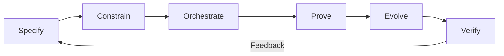
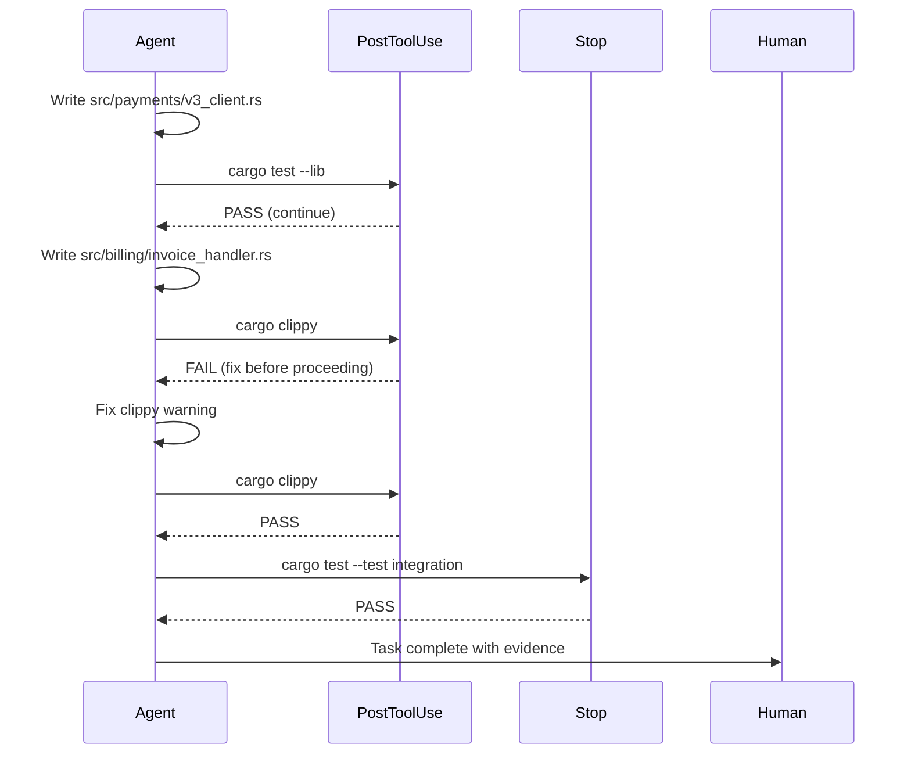
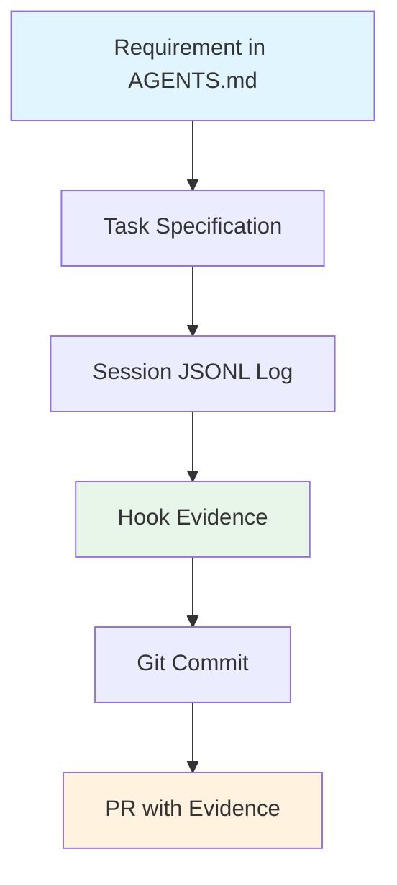

# Agentic Agile-V and the SCOPE-V Loop: Moving from Vibe Coding to Verified Engineering with Codex CLI


---

## The Process Control Problem

The dominant failure mode in agentic software engineering is no longer prompt engineering — it is engineering process control[^1]. Conversations discover intent well enough, but without structured artefacts and deterministic verification, agent output drifts into what the research literature now calls "vibe coding": sessions where the agent authors over 99 per cent of the code and only 44 per cent of that code survives into commits[^2].

Koch's *Agentic Agile-V* framework (arXiv:2605.20456, May 2026) proposes a two-layer architecture that converts conversational intent into structured engineering artefacts and acceptance evidence[^1]. The macro layer is Agile-V — an iterative lifecycle combining Agile iteration with V-model verification and audit artefact generation. The micro layer is SCOPE-V, a six-phase task loop that constrains individual agent turns[^1].

This article maps each SCOPE-V phase onto concrete Codex CLI configuration, demonstrating how the framework's principles translate into a working verification stack on v0.144.

---

## The SCOPE-V Task Loop



Each phase has a distinct purpose[^1]:

| Phase | Purpose | Key Output |
|-------|---------|------------|
| **Specify** | Convert intent into a task brief | Objective, scope, non-goals, acceptance criteria |
| **Constrain** | Define boundaries | No unrelated files, no unapproved API changes, no broad refactor |
| **Orchestrate** | Define working method | Inspect first, propose plan, implement small slices |
| **Prove** | Require evidence | Tests, static analysis, type checks, security scans |
| **Evolve** | Feed learning back | Update templates, instructions, baselines |
| **Verify** | Recurring verification | Before implementation, during patching, before merge |

---

## Specify: AGENTS.md as the Task Brief

The Specify phase demands a structured brief with objective, scope, non-goals, affected modules, dependencies, and acceptance criteria[^1]. In Codex CLI, this is `AGENTS.md`:

```markdown
# Task: Migrate payment service to v3 API

## Objective
Replace all PaymentGateway v2 calls with v3 equivalents.

## Scope
- `src/payments/`
- `src/billing/invoice_handler.rs`

## Non-Goals
- Do NOT refactor error handling patterns
- Do NOT update unrelated dependencies

## Acceptance Criteria
- All existing tests pass
- No v2 API imports remain
- Integration test `test_payment_flow_v3` passes
- `cargo clippy` reports zero warnings in affected modules
```

Codex CLI's layered discovery (`AGENTS.md` at repo root, per-directory overrides, `AGENTS.override.md` for temporal rules) maps directly to the Agile-V requirement that each increment remains traceable to its specification[^3][^4].

---

## Constrain: Writes Approval Mode and Sandbox Boundaries

The Constrain phase sets boundaries: no public API changes unless approved, no unrelated files, no new dependencies without justification[^1]. Codex CLI v0.144 introduced the `writes` approval mode, which allows declared read-only actions whilst prompting for any write operation[^5]:

```toml
# config.toml — Constrain phase encoding
[profile.verified]
approval_policy = "writes"
sandbox_mode = "workspace-write"

[profile.verified.sandbox]
network = "disabled"
allowed_write_paths = [
    "src/payments/",
    "src/billing/invoice_handler.rs",
    "tests/"
]
```

The `writes` mode enforces a critical SCOPE-V principle: reads are safe exploration, writes require explicit justification. Combined with sandbox filesystem restrictions, this prevents the "broad refactor during a bug fix" anti-pattern that Koch identifies as a primary process control failure[^1].

For stricter constraints, `PreToolUse` hooks can reject tool calls that target out-of-scope paths:

```bash
#!/usr/bin/env bash
# .codex/hooks/pre-tool-use-scope-guard.sh
# Rejects writes outside declared scope

ALLOWED_PATHS="src/payments/ src/billing/invoice_handler.rs tests/"
TARGET_PATH="$CODEX_TOOL_ARG_PATH"

for allowed in $ALLOWED_PATHS; do
    if [[ "$TARGET_PATH" == "$allowed"* ]]; then
        exit 0
    fi
done

echo "SCOPE VIOLATION: $TARGET_PATH is outside declared scope" >&2
exit 1
```

---

## Orchestrate: Named Profiles and Workflow Encoding

The Orchestrate phase defines *how* the agent should work: inspect first, summarise current design, propose a plan, implement small slices, run local checks[^1]. This maps to Codex CLI's named profiles and `AGENTS.md` workflow instructions:

```toml
# config.toml — Orchestrate phase
[profile.scope-v]
model = "o4-mini"
approval_policy = "writes"

[profile.scope-v.features]
rollout_budget.enabled = true
rollout_budget.limit_tokens = 300000
rollout_budget.reminder_interval_tokens = 30000
```

The `rollout_budget` configuration (merged in v0.143[^6]) enforces the "small slices" principle by providing remaining-budget reminders and aborting turns when exhausted — preventing the runaway token consumption that characterises unverified vibe coding sessions (3× token cost per committed line compared to collaborative sessions[^2]).

The orchestration workflow itself lives in `AGENTS.md`:

```markdown
## Working Method (SCOPE-V Orchestrate)

1. Read affected files BEFORE proposing changes
2. Summarise current design in a comment block
3. Propose plan as a numbered list — wait for approval
4. Implement ONE logical change per commit
5. Run `cargo test` after each change
6. Produce diff summary with residual risks
```

---

## Prove: PostToolUse Hooks as Evidence Gates

The Prove phase is where SCOPE-V demands concrete evidence: unit tests, integration tests, static analysis, type checks, security scans[^1]. Codex CLI's `PostToolUse` hook is the natural enforcement point[^7]:

```toml
# .codex/hooks.toml
[[hooks]]
event = "PostToolUse"
command = "cargo test --lib 2>&1 | tail -20"
description = "Run unit tests after every file write"

[[hooks]]
event = "PostToolUse"
command = "cargo clippy --all-targets -- -D warnings 2>&1 | tail -10"
description = "Clippy lint gate"

[[hooks]]
event = "Stop"
command = "cargo test --test integration 2>&1"
description = "Full integration suite before session ends"
```

The `Stop` hook is particularly important: it enforces the SCOPE-V principle that evidence is required for acceptance, not merely for implementation. The agent cannot declare completion without passing the acceptance criteria defined in the Specify phase[^7].



---

## Evolve: Feeding Learning Back

The Evolve phase requires that validated learning feeds back into repository instructions, templates, and baselines[^1]. In practice, this means updating `AGENTS.md` after each successful increment:

```markdown
## Lessons Learned (auto-appended)

- 2026-07-12: v3 API requires explicit timeout on `PaymentIntent::confirm()`.
  Add `timeout_ms: 30000` to all v3 calls. (Source: integration test failure)
- 2026-07-12: `invoice_handler` depends on `billing_context` — add to scope
  for future payment migrations.
```

Codex CLI's `AGENTS.override.md` supports temporal rules that can be added during a session and removed after the increment ships[^4]. This separates ephemeral task context from permanent repository knowledge — a distinction Koch emphasises as critical for audit trail integrity[^1].

---

## Verify: Recurring, Not Final

The final SCOPE-V phase treats verification as recurring rather than a one-time gate: before implementation, during patching, before merge, after deployment, and after field feedback[^1]. Codex CLI supports this through multiple hook events:

```toml
# Verification at session start — confirm baseline passes
[[hooks]]
event = "SessionStart"
command = "cargo test --lib --quiet"
description = "Verify baseline before any changes"

# Verification during work — PostToolUse (shown above)

# Verification before completion — Stop hook (shown above)
```

For post-merge verification, `codex exec` in CI pipelines provides the same verification stack in non-interactive mode[^8]:

```bash
# CI pipeline — post-merge verification
codex exec \
    --profile verified \
    --approval-mode full-auto \
    "Run the full test suite and report any regressions introduced by this merge"
```

---

## The Agile-V Macro Layer: Traceability Across Increments

While SCOPE-V governs individual tasks, the Agile-V macro layer ensures each increment remains traceable[^1]. Codex CLI's session JSONL provides the audit trail:



Each session produces a complete trace from requirement to evidence to commit. Combined with OpenTelemetry export (available since v0.140[^9]), this satisfies the Agile-V requirement for compliance-ready audit artefact generation without additional tooling.

---

## Practical Configuration: A Complete SCOPE-V Profile

Bringing all phases together into a single deployable profile:

```toml
# ~/.config/codex/config.toml

[profile.scope-v]
model = "o4-mini"
approval_policy = "writes"
sandbox_mode = "workspace-write"

[profile.scope-v.sandbox]
network = "disabled"

[profile.scope-v.features]
rollout_budget.enabled = true
rollout_budget.limit_tokens = 300000
rollout_budget.reminder_interval_tokens = 30000

[profile.scope-v.features.auto_review]
enabled = true
risk_threshold = "medium"
```

Invoke with:

```bash
codex --profile scope-v "Migrate payment service to v3 API per AGENTS.md specification"
```

The profile combines: `writes` approval for Constrain, `rollout_budget` for Orchestrate, `auto_review` for Prove, and the sandbox for boundary enforcement. The human remains in the loop for write approval but is freed from reviewing every read operation — matching Koch's principle that "conversation discovers intent; structured artefacts implement; evidence accepts"[^1].

---

## When SCOPE-V Is Overkill

Not every task warrants full SCOPE-V rigour. Koch acknowledges that controlled studies show "moderate but heterogeneous meta-analytic effects" for structured processes on simple tasks[^1]. For exploratory prototyping or throwaway spikes, Codex CLI's `suggest` or `auto-edit` modes with minimal hooks remain appropriate. The value of SCOPE-V emerges on tasks where:

- Multiple files are affected
- Existing tests must continue to pass
- The change ships to production without a manual QA gate
- Audit evidence is required (regulated industries, compliance)

---

## Conclusion

The shift from vibe coding to verified engineering is not about abandoning agent autonomy — it is about encoding process control into the agent's execution environment. Koch's SCOPE-V loop provides the conceptual framework; Codex CLI's `AGENTS.md`, approval modes, hook pipeline, rollout budgets, and session logging provide the implementation substrate.

The six phases map cleanly:

| SCOPE-V Phase | Codex CLI Mechanism |
|---------------|-------------------|
| Specify | `AGENTS.md` task brief |
| Constrain | `writes` approval + sandbox + PreToolUse scope guard |
| Orchestrate | Named profiles + rollout_budget + workflow instructions |
| Prove | PostToolUse + Stop hooks + auto_review |
| Evolve | `AGENTS.override.md` + instruction updates |
| Verify | SessionStart + PostToolUse + Stop + codex exec in CI |

The tooling exists today. The gap is adoption.

---

## Citations

[^1]: Koch, C. (2026). "Agentic Agile-V: From Vibe Coding to Verified Engineering in Software and Hardware Development." arXiv:2605.20456. [https://arxiv.org/abs/2605.20456](https://arxiv.org/abs/2605.20456)

[^2]: Baumann, A. et al. (2026). "SWE-Chat: A Large-Scale Dataset of Real Coding Agent Sessions." arXiv:2604.20779. SALT-NLP, Stanford University. [https://arxiv.org/abs/2604.20779](https://arxiv.org/abs/2604.20779)

[^3]: OpenAI. (2026). "Codex CLI Documentation: AGENTS.md." [https://developers.openai.com/codex/agents-md](https://developers.openai.com/codex/agents-md)

[^4]: Vaughan, D. (2026). "AGENTS.md Beyond /init: Writing Project Instructions That Actually Reduce Token Spend." Codex Knowledge Base. [https://codex.danielvaughan.com/2026/06/15/agents-md-beyond-init-writing-project-instructions-that-reduce-token-spend-hooks-mcp-skills/](https://codex.danielvaughan.com/2026/06/15/agents-md-beyond-init-writing-project-instructions-that-reduce-token-spend-hooks-mcp-skills/)

[^5]: OpenAI. (2026). "Codex CLI v0.144.0 Changelog: Writes approval mode." [https://github.com/openai/codex/releases](https://github.com/openai/codex/releases)

[^6]: OpenAI. (2026). "Codex CLI: Rollout token budget configuration." Pull Request #28746. [https://github.com/openai/codex/pull/28746](https://github.com/openai/codex/pull/28746)

[^7]: Vaughan, D. (2026). "Test-Driven Development with Codex CLI: The Red-Green-Refactor Loop, AGENTS.md Test Gates, and Hook-Based Verification." Codex Knowledge Base. [https://codex.danielvaughan.com/2026/04/10/codex-cli-test-driven-development-workflow/](https://codex.danielvaughan.com/2026/04/10/codex-cli-test-driven-development-workflow/)

[^8]: OpenAI. (2026). "Codex CLI: codex exec command reference." [https://developers.openai.com/codex/cli-reference](https://developers.openai.com/codex/cli-reference)

[^9]: Crosley, B. (2026). "Codex Hooks Make the Harness Real." [https://blakecrosley.com/blog/codex-hooks-make-the-harness-real](https://blakecrosley.com/blog/codex-hooks-make-the-harness-real)
