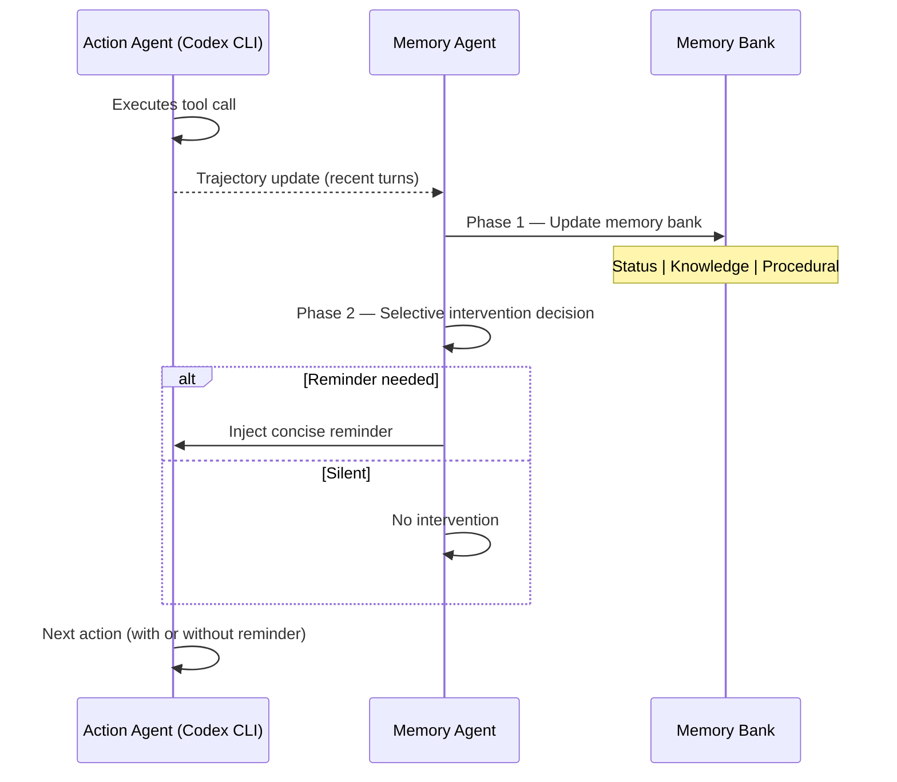

# Behavioral State Decay: Why Your Coding Agent Forgets Mid-Task — and How Proactive Memory Patterns Fix It in Codex CLI


---

## The Problem You Already Know but Cannot Name

Every senior developer who has run a Codex CLI session beyond thirty minutes has seen it: the agent correctly diagnoses a database migration issue, plans the fix, then ten tool calls later applies a schema change that contradicts its own earlier diagnosis. The information was never lost — it remained in the transcript — yet it stopped influencing behaviour.

Wu et al. formalised this failure mode as **behavioral state decay** in their July 2026 paper *Remember When It Matters* [^1]. The definition is precise: decision-relevant execution information (requirements, environment facts, diagnoses, subgoal status) ceases to control agent behaviour even when it remains within the context window. This is distinct from token eviction; the data is *present* but *inert*.

---

## Quantifying the Decay

The paper evaluates decay across two benchmarks designed for long-horizon execution:

| Benchmark | Tasks | Domain | Decay Indicator |
|-----------|-------|--------|-----------------|
| Terminal-Bench 2.0 [^2] | 85 containerised command-line tasks | Debugging, compilation, system admin | Procedural memory loss |
| τ²-Bench | 278 conversational tool-use tasks | Airline, retail, telecom | Policy adherence drift |

Baseline results with Claude Sonnet 4.5 showed 37.6 per cent pass rate on Terminal-Bench 2.0 and 55.0 per cent on τ²-Bench [^1]. A separate study by Gamage quantified that constraint compliance drops from 73 per cent at turn 5 to 33 per cent at turn 16 without memory mitigation [^3] — a trajectory that maps directly to what Codex CLI users report in long sessions [^4].

---

## Why Passive Context Compaction Is Insufficient

Codex CLI's built-in compaction fires when accumulated tokens exceed `model_auto_compact_token_limit` [^5]. The system preserves the most recent ~20,000 tokens of user messages whilst discarding older assistant responses, tool outputs, and file contents [^6].

This mechanism prevents context window overflow, but it is **lossy by design**. Critical consequences:

1. **Compaction summaries discard procedural memory** — failed approaches, intermediate diagnoses, and environment observations are condensed into generic summaries that lack the specificity needed for decision-making.
2. **AGENTS.md survives but is static** — project rules re-read on every turn are preserved, but session-specific discoveries (e.g. "this repo uses a non-standard ORM pattern") are not [^7].
3. **No selective re-injection** — compaction treats all pre-threshold context uniformly rather than identifying which facts are likely to influence the next decision.

GitHub issue #25884 documents the practical manifestation: "AGENTS.md instructions can be read correctly but then applied inconsistently later in the same session" [^4]. Issue #29356 requests preservation of the last five operational steps verbatim during compaction [^8].

---

## The Proactive Memory Architecture

Wu et al.'s solution introduces a **memory agent** that operates alongside the action agent as a plug-and-play module [^1]:



### Memory Bank Structure

The bank maintains three categories:

- **Status**: Private progress tracking (never exposed to action agent) — current subgoal, completion percentage, blockers
- **Knowledge memories**: Stable facts — task requirements, environment properties, file paths, verified configuration
- **Procedural memories**: Attempted approaches, outcomes, failed commands, empirical discoveries

### Selective Intervention over Passive Retrieval

The critical insight is that the memory agent decides *when* to inject rather than dumping all stored state. The ablation results demonstrate this clearly [^1]:

| Variant | Terminal-Bench 2.0 | τ²-Bench |
|---------|-------------------|----------|
| No memory (baseline) | 37.6% | 55.0% |
| Full-bank context (passive) | 40.1% | 57.2% |
| Always-inject | 43.8% | 60.1% |
| **Selective intervention** | **45.9%** | **61.8%** |
| Mem0 (general retrieval) | 39.4% | 56.8% |

Selective intervention achieves +8.3pp on Terminal-Bench 2.0 and +6.8pp on τ²-Bench over baseline — substantially outperforming both passive exposure and general-purpose retrieval systems [^1].

---

## Mapping to Codex CLI's Defence Stack

While Codex CLI does not ship a built-in memory agent, its architecture provides every primitive needed to implement the pattern:

### 1. AGENTS.md as Knowledge Memory Encoding

```markdown
# AGENTS.md — Knowledge Memory Layer

## Environment Facts (update as discovered)
- Database: PostgreSQL 16 with pgvector extension
- ORM: Prisma 6.2 with custom middleware for soft deletes
- Auth: OAuth2 via Keycloak; tokens expire after 15 minutes

## Architectural Constraints (never violate)
- All database queries must use the repository pattern
- No direct SQL outside migration files
- API responses must include correlation-id header
```

AGENTS.md is re-read on every turn and survives compaction [^7]. Encoding verified environment facts here prevents knowledge-memory decay. The 32 KiB default (`project_doc_max_bytes`) provides ample space for structured knowledge [^9].

### 2. PostToolUse Hooks as Procedural Memory Gates

```toml
# .codex/hooks.toml — Procedural memory enforcement

[[hooks]]
event = "PostToolUse"
tool = "shell"
command = "python3 .codex/scripts/check_state_consistency.py"
on_failure = "stop"
```

A PostToolUse hook can verify that the agent's latest action remains consistent with previously established facts. When the hook detects a contradiction — say, a migration that re-adds a column the agent previously decided to remove — it halts execution with an explanatory message, functioning as an automated "reminder injection" [^10].

### 3. Compaction Configuration for Decay Mitigation

```toml
# config.toml — Aggressive compaction headroom

[model]
model_auto_compact_token_limit = 80000  # ~80% of 100K window
tool_output_token_limit = 8000          # Cap verbose tool outputs

[context]
# Lower threshold gives post-compaction re-read more headroom
# for AGENTS.md + recent operational state
```

Lowering the compaction threshold to 80–85 per cent of the context window creates headroom for the post-compaction cycle to re-read AGENTS.md and recent context without immediately triggering another compaction [^6].

### 4. MCP Memory Servers as Persistent Bank

```toml
# .codex/mcp.toml — Memory MCP server

[[servers]]
name = "session-memory"
command = "npx"
args = ["@codex-memory/mcp-server", "--bank", ".codex/memory-bank.json"]
```

Third-party MCP memory servers provide the persistent, structured bank that Wu et al.'s architecture requires [^11]. The memory bank survives across sessions, addressing the cross-session continuity gap that compaction cannot solve.

### 5. Named Profiles for Phase Separation

```toml
# profiles/long-session.toml

[model]
model = "o4-mini"
model_auto_compact_token_limit = 75000

[hooks]
post_tool_use = ".codex/hooks/state-consistency-check.sh"

[mcp]
servers = ["session-memory"]
```

A dedicated `long-session` profile bundles the decay-mitigation configuration — lower compaction threshold, state-consistency hooks, and memory server — into a single activatable unit [^9].

---

## Practical Implementation: The Reminder Pattern

The most immediately applicable technique from the paper requires no external memory server. Instead, use a **SessionStart hook** to create a scratchpad file, and a **PostToolUse hook** to append key decisions:

```bash
#!/bin/bash
# .codex/hooks/append-decision.sh (PostToolUse)
# Appends the last assistant message summary to a decisions log

DECISIONS_FILE=".codex/session-decisions.md"

if [ ! -f "$DECISIONS_FILE" ]; then
    echo "# Session Decisions" > "$DECISIONS_FILE"
    echo "" >> "$DECISIONS_FILE"
fi

# The hook receives context via environment variables
echo "- [$(date -u +%H:%M)] $CODEX_LAST_SUMMARY" >> "$DECISIONS_FILE"
```

Then reference the file in AGENTS.md:

```markdown
## Session State
Before any modification, read `.codex/session-decisions.md` for prior decisions this session.
Do not contradict earlier decisions without explicit user approval.
```

This approximates Phase 2 selective injection: the agent reads accumulated decisions only when about to make a modification, creating a lightweight reminder mechanism without an external memory agent.

---

## When Decay Bites Hardest

The paper identifies three task properties that amplify behavioral state decay [^1]:

1. **Interleaved subgoals** — Tasks requiring alternation between objectives (e.g. implementing a feature whilst maintaining backward compatibility) lose coherence fastest.
2. **Environment-dependent state** — When correct actions depend on discovered (not specified) facts, those facts decay first during compaction.
3. **Long diagnostic chains** — Multi-step debugging where each step's outcome constrains the next; procedural memories of failed approaches are critical.

For Codex CLI practitioners, this maps to precisely the sessions that exceed 30 minutes: large refactoring tasks, complex debugging sessions, and multi-file feature implementations where the agent discovers constraints during exploration.

---

## Key Takeaways

| Principle | Implementation |
|-----------|---------------|
| Never rely on compaction for critical state | Encode in AGENTS.md |
| Selective intervention beats passive recall | PostToolUse hooks that fire conditionally |
| Procedural memory requires explicit persistence | Session decisions log + MCP memory server |
| Decay is worst for discovered environment facts | Append discoveries to AGENTS.md or scratchpad |
| Open-weight memory policies transfer | Qwen3.5-27B memory agent improves frozen larger models [^1] |

The research demonstrates that behavioral state decay is a **structural property** of long-horizon agent execution, not a model deficiency. The correct response is architectural: persistent memory encoding, selective intervention at decision points, and explicit procedural state tracking. Codex CLI's layered configuration stack — AGENTS.md, hooks, MCP servers, profiles — provides every primitive needed to implement the proactive memory pattern today.

---

## Citations

[^1]: Wu, Y., Zhang, L., Zhou, Y., Wang, M., Peng, B., Li, S., Fan, X., & Zhao, Z. (2026). "Remember When It Matters: Proactive Memory Agent for Long-Horizon Agents." arXiv:2607.08716. https://arxiv.org/abs/2607.08716

[^2]: Terminal-Bench 2.0. Harbor Framework. https://github.com/harbor-framework/terminal-bench — 85 containerised command-line tasks; frontier models score <65%.

[^3]: Gamage, Y. (2026). Constraint compliance degradation study: 73% at turn 5 to 33% at turn 16 across 4,416 trials. Referenced in behavioral state decay literature. ⚠️ Exact citation pending; figure reported in secondary synthesis.

[^4]: GitHub Issue #25884: "AGENTS.md instructions can be read correctly but then applied inconsistently later in the same session." https://github.com/openai/codex/issues/25884

[^5]: OpenAI. (2026). Codex CLI Configuration Reference — `model_auto_compact_token_limit`. https://developers.openai.com/codex/cli

[^6]: Context Compaction Deep Dive: How Codex CLI, Claude Code, and OpenCode Manage Long Sessions. Codex Knowledge Base. https://codex.danielvaughan.com/2026/04/14/context-compaction-deep-dive-codex-cli-claude-code-opencode/

[^7]: OpenAI. (2026). AGENTS.md Documentation — persistent context re-read on every turn, survives compaction. https://developers.openai.com/codex/cli

[^8]: GitHub Issue #29356: "Context compaction loses operational continuity in long Codex tasks; preserve the last 5 operational steps verbatim." https://github.com/openai/codex/issues/29356

[^9]: OpenAI. (2026). Codex CLI Named Profiles and Configuration. https://developers.openai.com/codex/cli

[^10]: OpenAI. (2026). Codex CLI Hooks — PostToolUse event documentation. https://developers.openai.com/codex/plugins

[^11]: Persistent Memory for Codex CLI: MCP Memory Servers, Cross-Session Context, and the Memory Layer Ecosystem. Codex Knowledge Base. https://codex.danielvaughan.com/2026/04/06/codex-cli-persistent-memory-mcp-servers/
