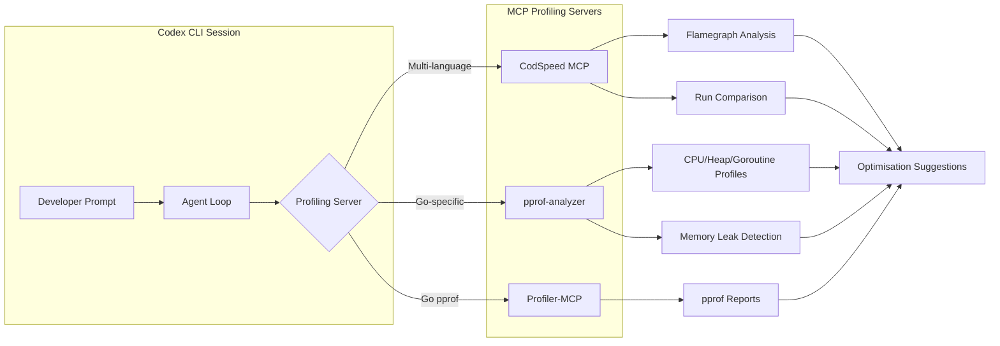
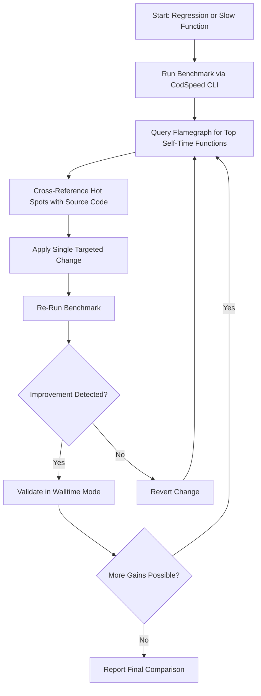
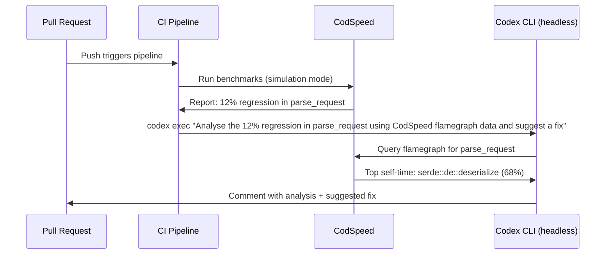

# Performance Engineering with Codex CLI: Profiling MCP Servers, Flamegraph Analysis, and the Automated Optimise-Measure Loop


---

Codex CLI articles overwhelmingly focus on *writing* code. But senior engineers spend a disproportionate chunk of their time on what happens *after* the code compiles: profiling, identifying bottlenecks, measuring regressions, and validating that fixes actually move the needle. Three MCP profiling servers — CodSpeed, pprof-analyzer, and Profiler-MCP — now let Codex CLI act as an autonomous performance engineer, closing the loop between measurement and optimisation without leaving the terminal.

This article maps the current MCP profiling ecosystem onto Codex CLI's sandbox, hook, and configuration primitives, then walks through concrete workflows for Go, Python, Rust, and Node.js codebases.

## The Profiling MCP Landscape in Mid-2026

Three servers dominate, each targeting a different slice of the profiling problem.

### CodSpeed MCP Server

CodSpeed shipped its MCP server and agent skills in March 2026[^1]. The server exposes five tools: flamegraph querying (surfacing functions by self-time and walking the call tree), run comparison (benchmark-level diffs showing regressions, improvements, and missing benchmarks), run detail inspection, run browsing (by commit, branch, or PR), and repository management[^1]. Two companion skills — `codspeed-optimize` and `codspeed-setup-harness` — convert Codex CLI into an autonomous optimisation agent[^2].

CodSpeed's CLI, released in January 2026, benchmarks any executable without code changes across three measurement instruments: simulation mode (CPU-based, <1% variance, hardware-independent), walltime mode (real-world timing including I/O), and memory mode (heap allocation tracking)[^3].

### pprof-analyzer

ZephyrDeng's pprof-analyzer targets Go applications specifically[^4]. It provides profile analysis across CPU, heap, allocs, goroutine, mutex, and block profile types, with output in text, markdown, JSON, or SVG flamegraph formats. Its memory leak detection tool compares heap snapshots chronologically, calculating growth rates in bytes, percentage, and MB per minute[^4]. The server has accumulated over 5,100 downloads since its April 2025 release[^5].

### Profiler-MCP

Sarthak160's Profiler-MCP wraps `go tool pprof` for AI-agent consumption[^6]. It is narrower in scope than pprof-analyzer but provides a simpler stdio interface suitable for quick diagnostic sessions. Requires Go 1.20+ and optionally Graphviz for visual flamegraphs[^6].



## Configuring MCP Profiling Servers in Codex CLI

MCP servers are declared in `~/.codex/config.toml` under the `mcp_servers` section[^7]. Note the underscore — `mcp-servers` or `mcpservers` are silently ignored[^7].

### CodSpeed via Plugin

The simplest path uses the Codex plugin system:

```bash
codex /plugin marketplace add CodSpeedHQ/codspeed
```

This installs both the MCP server and the two agent skills in a single step[^1]. Alternatively, for manual configuration:

```bash
codex mcp add --name CodSpeed -- npx add-mcp https://mcp.codspeed.io/mcp
```

### pprof-analyzer via stdio

```toml
[mcp_servers.pprof-analyzer]
command = "pprof-analyzer-mcp"
args = []
startup_timeout_sec = 10
tool_timeout_sec = 120
```

The extended `tool_timeout_sec` matters: flamegraph generation on large profiles can exceed the default 60-second timeout[^7].

### Profiler-MCP via npx

```toml
[mcp_servers.profiler-mcp]
command = "npx"
args = ["-y", "sarthak160-profiler-mcp"]
startup_timeout_sec = 15
```

Verify connectivity after configuration:

```bash
codex
> /mcp
```

The `/mcp` command lists all connected servers and their registered tools[^7].

## The Autonomous Optimise-Measure Loop

CodSpeed's `codspeed-optimize` skill implements the pattern that performance engineers have always wanted to automate: measure, identify bottleneck, apply targeted fix, re-measure, compare, iterate[^2].



The skill enforces strict methodology: always measure through CodSpeed (never trust manual timing), never change multiple things at once, and validate improvements in walltime mode before declaring victory[^2]. If no benchmark harness exists, the skill halts and directs the developer to set one up first — it will not optimise blindly[^2].

### Practical Example: Go HTTP Handler

```bash
codex "Profile the /api/orders handler — it's taking 400ms on average. \
Use pprof to capture a 30-second CPU profile, identify the hot path, \
and suggest targeted fixes."
```

Codex CLI with pprof-analyzer will:

1. Trigger a CPU profile capture via the `analyze_pprof` tool
2. Generate a flamegraph SVG highlighting functions by self-time
3. Identify that, say, `json.Marshal` on a deeply nested struct dominates
4. Suggest switching to `encoding/json/v2` or a pre-allocated encoder
5. If CodSpeed is also configured, re-measure and compare

### Memory Leak Detection in Go

pprof-analyzer's leak detection requires at least three heap profiles in chronological order[^4]:

```bash
codex "I suspect a memory leak in the worker pool. Capture three heap \
profiles at 30-second intervals, then use pprof-analyzer to compare \
them and identify trending allocations."
```

The tool calculates growth rates per object type with directional indicators, giving the agent concrete data to trace back to the allocating code path[^4].

## Sandbox and Security Considerations

Performance profiling inherently requires execution — which means sandbox configuration matters.

Codex CLI's default `workspace-write` sandbox mode disables network access[^8]. This works for analysing pre-captured profile files but blocks live profiling of running services. For live profiling workflows:

```toml
[sandbox]
mode = "workspace-write"

[network]
allow_domains = ["localhost:6060", "localhost:8081"]
```

Port 6060 is Go's conventional pprof endpoint; port 8081 is pprof-analyzer's default web UI port[^4]. CodSpeed's cloud-based flamegraph queries require `codspeed.io` in the allowlist.

⚠️ **Security note:** Allowing `localhost` ports expands the sandbox surface. Use `writes` approval mode for sessions that modify both application code and profiling configuration simultaneously[^8].

## AGENTS.md for Performance Engineering Sessions

Encode profiling discipline into `AGENTS.md` to prevent the agent from taking shortcuts:

```markdown
## Performance Engineering Rules

1. Never optimise without a benchmark baseline measurement
2. Change one thing per iteration — measure after each change
3. Use CodSpeed simulation mode for regression detection in CI
4. Use walltime mode for final validation of real-world improvements
5. For Go services: capture CPU, heap, and goroutine profiles before proposing fixes
6. Record all measurements in a `perf-log.md` file at the project root
7. Do not increase algorithmic complexity to reduce constant factors
```

These constraints map directly to Koch's SCOPE-V framework: **Specify** the performance target, **Constrain** the methodology, **Orchestrate** the measurement tools, **Prove** the improvement with data, **Evolve** the approach if the first fix fails, and **Verify** in production-representative conditions[^9].

## Multi-Language Coverage

CodSpeed's `codspeed-setup-harness` skill automates benchmark scaffolding across six language ecosystems[^1]:

| Language | Framework | Measurement Modes |
|----------|-----------|-------------------|
| Rust | `criterion`, `iai-callgrind` | Simulation, Walltime, Memory |
| Python | `pytest-benchmark`, `pytest-codspeed` | Simulation, Walltime, Memory |
| Node.js | `vitest`, `tinybench` | Simulation, Walltime |
| Go | `testing.B` | Simulation, Walltime, Memory |
| C/C++ | `Google Benchmark` | Simulation, Walltime |

For Go-specific deep analysis, combining CodSpeed (macro benchmarks) with pprof-analyzer (micro profiling) gives both regression detection and root-cause diagnosis in a single Codex CLI session.

## PostToolUse Hooks for Regression Gates

Wire profiling into your development loop with PostToolUse hooks that catch regressions before they reach `main`:

```toml
[hooks.PostToolUse]
match_tool = "write_file"
match_path = "**/*.go"
command = "go test -bench=. -benchmem -count=3 ./... | tee /tmp/bench-latest.txt"
```

This captures benchmark results after every Go file modification. Pair it with `benchstat` for statistical comparison:

```toml
[hooks.PostToolUse]
match_tool = "write_file"
match_path = "**/*.go"
command = "benchstat /tmp/bench-baseline.txt /tmp/bench-latest.txt"
```

The agent sees the `benchstat` output in its context and can decide whether to proceed or revert[^10].

## Token Economics of Profiling Sessions

Profiling sessions consume more tokens than typical code-generation tasks. Flamegraph data, profile dumps, and benchmark comparison tables are verbose. Practical mitigations:

- Set `tool_output_token_limit` in `config.toml` to cap profile output[^11]
- Use `rollout_budget` (available since v0.142.0) to prevent runaway optimisation loops from exhausting your token allocation[^12]
- Prefer CodSpeed's structured API responses over raw `go tool pprof` text output — the former is pre-summarised for agent consumption

```toml
[model]
rollout_budget = 500000

[tools]
tool_output_token_limit = 8000
```

## CI Integration Pattern

The ultimate goal is continuous performance engineering: Codex CLI running in CI with CodSpeed, catching regressions and proposing fixes before merge.



This workflow uses `codex exec` in headless mode with `--output-schema` for structured output that CI tooling can parse[^12].

## What's Missing

The profiling MCP ecosystem has gaps worth noting:

- **No JVM profiler MCP server yet** — Java and Kotlin developers must export JFR/async-profiler output as files and analyse them with general-purpose tools
- **No browser performance MCP** — Chrome DevTools Protocol integration exists but no dedicated performance-trace MCP server
- **CodSpeed's simulation mode is x86-only** — ARM-based CI runners (increasingly common with Graviton and M-series) need walltime mode, which has higher variance[^3]

⚠️ These gaps are based on the author's survey of available MCP servers as of July 2026 and may have been addressed by the time you read this.

## Conclusion

Performance engineering has historically resisted automation because the measure-analyse-fix cycle requires domain judgment at every step. The combination of CodSpeed's structured benchmarking, pprof's deep Go profiling, and Codex CLI's agent loop finally makes autonomous optimise-measure loops practical — provided you encode the methodology constraints in AGENTS.md and wire measurement into your hook stack. The agent does not replace the performance engineer's judgment; it executes the tedious parts of a discipline the engineer has already defined.

---

## Citations

[^1]: CodSpeed, "CodSpeed for Agents: MCP Server and Skills", CodSpeed Changelog, 16 March 2026. [https://codspeed.io/changelog/2026-03-16-mcp-server](https://codspeed.io/changelog/2026-03-16-mcp-server)

[^2]: CodSpeedHQ, "codspeed-optimize skill", Claude Plugin Hub, 2026. [https://www.claudepluginhub.com/skills/codspeedhq-codspeed/codspeed-optimize](https://www.claudepluginhub.com/skills/codspeedhq-codspeed/codspeed-optimize)

[^3]: CodSpeed, "Introducing CodSpeed CLI: Benchmark Anything", CodSpeed Changelog, 23 January 2026. [https://codspeed.io/changelog/2026-01-23-introducing-codspeed-cli](https://codspeed.io/changelog/2026-01-23-introducing-codspeed-cli)

[^4]: ZephyrDeng, "pprof-analyzer-mcp", GitHub, 2025–2026. [https://github.com/ZephyrDeng/pprof-analyzer-mcp](https://github.com/ZephyrDeng/pprof-analyzer-mcp)

[^5]: MCP Market, "Pprof Analyzer: Go Performance Profiling Tool", 2026. [https://mcpmarket.com/server/pprof-analyzer](https://mcpmarket.com/server/pprof-analyzer)

[^6]: LobeHub, "Profiler-MCP (Performance Inspector)", 2026. [https://lobehub.com/mcp/sarthak160-profiler-mcp](https://lobehub.com/mcp/sarthak160-profiler-mcp)

[^7]: OpenAI, "Configuration Reference", Codex CLI Documentation, 2026. [https://developers.openai.com/codex/config-reference](https://developers.openai.com/codex/config-reference)

[^8]: OpenAI, "Codex CLI", ChatGPT Learn, 2026. [https://developers.openai.com/codex/cli](https://developers.openai.com/codex/cli)

[^9]: Koch, "Agentic Agile-V", arXiv:2605.20456, May 2026.

[^10]: OpenAI, "Codex CLI Features", ChatGPT Learn, 2026. [https://developers.openai.com/codex/cli/features](https://developers.openai.com/codex/cli/features)

[^11]: OpenAI, "Model Context Protocol", Codex CLI Documentation, 2026. [https://developers.openai.com/codex/mcp](https://developers.openai.com/codex/mcp)

[^12]: OpenAI, "Codex Changelog", 2026. [https://developers.openai.com/codex/changelog](https://developers.openai.com/codex/changelog)
