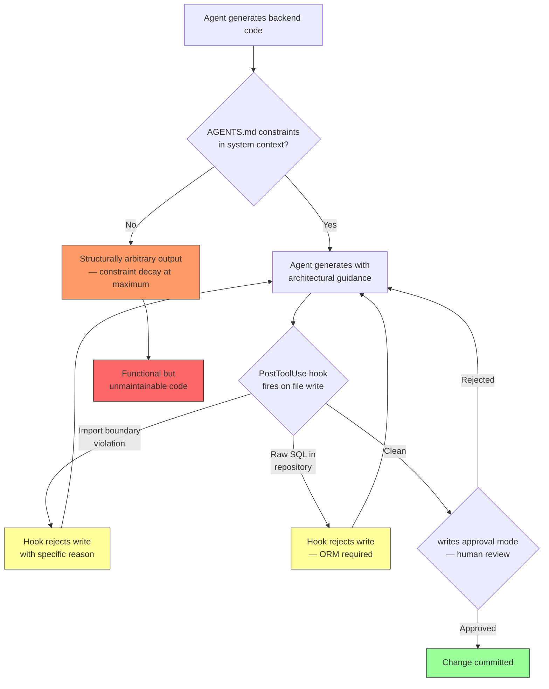

# Constraint Decay: Why Your Coding Agent Generates Structurally Arbitrary Backends — and How Codex CLI's Enforcement Stack Fights Back


---

## The Illusion of Functional Correctness

Your coding agent can generate a working CRUD API in seconds. The endpoints respond, the tests pass, and the demo impresses. But ask it to do the same thing inside a four-layer clean architecture with PostgreSQL and SQLAlchemy — the kind of structural specification that any production backend demands — and performance collapses. Not because the agent cannot write code, but because it silently discards the constraints you specified.

Dente, Satriani, and Papotti term this phenomenon **constraint decay**: as structural requirements accumulate, agent performance exhibits a substantial and systematic decline [^1]. Their study, published in May 2026, is the first rigorous quantification of what many senior developers already suspected — that LLM agents optimise for functional correctness whilst treating architectural constraints as optional suggestions.

---

## The Numbers: 30 Points Lost Per Constraint Layer

The researchers evaluated seven models across two agentic harnesses (OpenHands and Mini-SWE) on the RealWorld Conduit API benchmark — 80 greenfield generation tasks and 20 feature-implementation tasks spanning eight web frameworks [^1].

Structural constraints were layered incrementally across four levels:

| Level | Constraints Specified |
|-------|----------------------|
| **L0** | Web framework only (baseline) |
| **L1** | Framework + one of: clean architecture, database backend, or ORM |
| **L2** | Framework + two additional constraints |
| **L3** | Framework + all three (clean architecture + database + ORM) |

The headline result: **best-performing configurations lose approximately 30 percentage points in assertion pass rate from L0 to L3** [^1]. Some configurations fare far worse:

- **OpenHands + Qwen3-Coder-Next (80B):** 73.0% → 27.6% (−45.5pp) [^1]
- **Mini-SWE + Qwen3-Coder-Next (80B):** 86.4% → 46.1% (−40.2pp) [^1]
- **OpenHands + MiniMax-M2.5:** 95.6% → 78.6% (−17.0pp) [^1]

Even the strongest L3 configuration achieved 78.6% assertion pass rate but only **8.3% pass@1** — meaning that even state-of-the-art agents struggle to produce a fully compliant backend in a single attempt when realistic structural constraints are imposed [^1].

---

## Framework Sensitivity: Convention Kills Performance

Not all frameworks decay equally. Lightweight, explicit frameworks hold up reasonably well; convention-heavy frameworks with implicit configuration and deep ORM integration collapse:

| Framework | Average A% (across all models and levels) |
|-----------|-------------------------------------------|
| Express | 51.4% |
| Koa | 50.7% |
| Flask | 49.3% |
| Fastify | 38.4% |
| aiohttp | 35.5% |
| Django | 25.4% |
| FastAPI | 24.2% |
| Hono | 18.5% |

The pattern is clear: agents succeed where framework behaviour is explicit and fail where conventions, middleware stacks, and ORM ceremony demand implicit knowledge [^1]. Django's model-migration-view pipeline and FastAPI's dependency-injection system both require the agent to maintain a mental model of framework internals that decays under constraint accumulation.

---

## Root Causes: It Is the Data Layer

Error analysis reveals that **logic errors dominate at approximately 71 per cent of failures** [^1]. Within that category, data-layer defects are the primary culprits:

- **Incorrect query composition:** 25.5 per cent of failures (Qwen3-Coder-Next) [^1]
- **ORM runtime violations:** 21.2 per cent [^1]
- **Authentication misconfiguration:** 22.6 per cent [^1]

This maps to a concrete failure mode: the agent generates route handlers that call the database directly rather than through the specified ORM, or constructs SQLAlchemy queries that compile but produce incorrect results because the agent conflated raw SQL idioms with ORM method chains. The constraint was stated; the agent acknowledged it; the generated code ignores it.

---

## Why This Matters Beyond Benchmarks

Constraint decay is not an academic curiosity. Every production backend has structural constraints — architectural layering, database abstraction, authentication middleware, logging standards, error handling conventions. The Constraint Decay findings align with a broader pattern identified by multiple research groups:

- **Governance Decay** (Chen, arXiv:2606.22528): context compaction raises constraint violation from 0 per cent to 30–59 per cent across seven models because compaction treats standing policies as low-salience content [^2].
- **Omission Constraint Decay** (arXiv:2604.20911): "don't do X" constraints decay faster than "do X" constraints in long-context sessions [^3].
- **Rule Taxonomy Gap** (Cai et al., arXiv:2606.12231): mining 7,310 rules across 83 projects shows developers rate architectural constraints highest but rule files are dominated by formatting guidance [^4].

The common thread: **agents lose structural constraints first**. Formatting rules and naming conventions survive because they are locally verifiable. Architectural constraints — layering, separation of concerns, data-access patterns — require cross-file coherence that degrades under token pressure.

---

## Codex CLI's Structural Enforcement Stack

Codex CLI cannot eliminate constraint decay — it is a model-level phenomenon. But the harness can detect, remind, and reject violations before they reach your codebase. Here is a layered defence pattern mapped to the four constraint dimensions from the Constraint Decay study.

### Layer 1: AGENTS.md as Structural Specification

Encode architectural constraints in your repository's `AGENTS.md` so they are injected into every session's system context [^5]:

```markdown
# Architecture Constraints

## Layering
This project uses four-layer clean architecture:
- `routes/` — HTTP handlers only, no business logic
- `services/` — business logic, no direct DB access
- `repositories/` — data access via SQLAlchemy ORM only
- `models/` — SQLAlchemy model definitions

## Database
- PostgreSQL via SQLAlchemy 2.0 async
- NO raw SQL — all queries through ORM methods
- Alembic for migrations — never modify tables directly

## Import Rules
- routes may import services, never repositories or models
- services may import repositories, never models directly
- repositories import models only
```

AGENTS.md is guidance, not enforcement [^5]. But it reduces violations by making constraints prominent on every turn, and Codex CLI's layered discovery (global → repository → subdirectory) means constraints tighten as the agent navigates deeper into the codebase [^6].

### Layer 2: PostToolUse Hooks for Deterministic Verification

Where AGENTS.md provides soft guidance, hooks provide hard enforcement. A `PostToolUse` hook fires after every file write and can reject the change [^7]:

```toml
# config.toml
[hooks.PostToolUse]
command = ".codex/hooks/verify-architecture.sh"
```

```bash
#!/usr/bin/env bash
# .codex/hooks/verify-architecture.sh
# Verify clean architecture import boundaries after every file write

FILE="$CODEX_TOOL_ARG_FILE_PATH"

# Only check Python source files
[[ "$FILE" != *.py ]] && echo '{"decision":"approve"}' && exit 0

# Routes must not import repositories or models directly
if [[ "$FILE" == */routes/* ]]; then
  if grep -qE "from\s+(repositories|models)\s+import" "$FILE"; then
    echo '{"decision":"reject","reason":"Architecture violation: routes/ must not import repositories/ or models/ directly. Use services/ layer."}'
    exit 0
  fi
fi

# Services must not import models directly
if [[ "$FILE" == */services/* ]]; then
  if grep -qE "from\s+models\s+import" "$FILE"; then
    echo '{"decision":"reject","reason":"Architecture violation: services/ must not import models directly. Use repositories/ layer."}'
    exit 0
  fi
fi

# Repositories must not contain raw SQL
if [[ "$FILE" == */repositories/* ]]; then
  if grep -qE "(execute\(|text\(|raw_connection)" "$FILE"; then
    echo '{"decision":"reject","reason":"ORM violation: repositories/ must use SQLAlchemy ORM methods, not raw SQL."}'
    exit 0
  fi
fi

echo '{"decision":"approve"}'
```

This pattern directly addresses the data-layer defects that cause 46.7 per cent of failures in the Constraint Decay study [^1]. The agent writes a repository file with a raw SQL call; the hook rejects it; the agent rewrites using ORM methods.

### Layer 3: The `writes` Approval Mode

Codex CLI v0.144.0 introduced the `writes` approval mode — a middle ground between `suggest` (approve everything) and `on-request` (approve every tool call) [^8]. In `writes` mode, declared read-only actions proceed automatically whilst file writes pause for approval:

```toml
# config.toml
approval_mode = "writes"
```

This is particularly effective against constraint decay because the failure mode is always in the write path. The agent reads files correctly; it is the generated output that violates constraints. With `writes` mode, every file creation or modification surfaces for review — combined with PostToolUse hooks, violations are caught at both the automated and human layers.

### Layer 4: Sandbox Isolation for Database Constraints

For database-layer constraints, combine `workspace-write` sandbox mode with a network allowlist to ensure the agent can only reach the intended database [^9]:

```toml
sandbox_mode = "workspace-write"

[sandbox_workspace_write]
network_access = ["localhost:5432"]
```

This prevents the agent from accidentally connecting to alternative database backends or external services — addressing the database-backend constraint dimension directly.

---

## The Constraint Decay Defence Flow



---

## Practical Recommendations

1. **Specify constraints early and explicitly.** The Constraint Decay study shows L0→L1 is the steepest drop. State your architecture, database, and ORM requirements in the first prompt — do not assume the agent will infer them from existing code.

2. **Use AGENTS.md for structural contracts, not just style rules.** The Rule Taxonomy study found developers underinvest in architectural constraints relative to their importance [^4]. Your AGENTS.md should specify import boundaries, layer responsibilities, and data-access patterns.

3. **Prefer explicit frameworks.** If you are starting a new project with agent-assisted development, the data strongly favours Flask and Express over Django and FastAPI for agent-generated code. Convention-heavy frameworks require implicit knowledge that agents cannot reliably maintain.

4. **Wire PostToolUse hooks for your specific architecture.** Generic linting catches syntax issues; architecture-specific hooks catch the data-layer defects that dominate real failures.

5. **Treat `writes` approval mode as your daily driver.** It eliminates approval fatigue for reads whilst ensuring every generated file passes human review — the last line of defence against constraint decay.

6. **Test at L3, not L0.** If your CI validates agent output against a fully constrained specification (architectural layering + database + ORM + authentication), you will catch the 30-point gap that functional-only testing misses.

---

## Citations

[^1]: Dente, F., Satriani, D., & Papotti, P. (2026). "Constraint Decay: The Fragility of LLM Agents in Backend Code Generation." arXiv:2605.06445. [https://arxiv.org/abs/2605.06445](https://arxiv.org/abs/2605.06445)

[^2]: Chen, S. (2026). "Governance Decay: How Context Compaction Silently Erases Safety Constraints in Long-Horizon LLM Agents." arXiv:2606.22528. [https://arxiv.org/abs/2606.22528](https://arxiv.org/abs/2606.22528)

[^3]: Li, Z. et al. (2026). "Omission Constraints Decay While Commission Constraints Persist in Long-Context LLM Agents." arXiv:2604.20911. [https://arxiv.org/abs/2604.20911](https://arxiv.org/abs/2604.20911)

[^4]: Cai, Y. et al. (2026). "Rule Taxonomy and Evolution in AI IDEs: A Mining and Survey Study." arXiv:2606.12231. [https://arxiv.org/abs/2606.12231](https://arxiv.org/abs/2606.12231)

[^5]: OpenAI. (2026). "Codex CLI — AGENTS.md Documentation." [https://developers.openai.com/codex/cli](https://developers.openai.com/codex/cli)

[^6]: OpenAI. (2026). "Codex CLI — Configuration Reference." [https://developers.openai.com/codex/config-reference](https://developers.openai.com/codex/config-reference)

[^7]: OpenAI. (2026). "Codex CLI — Hooks." [https://learn.chatgpt.com/docs/hooks](https://learn.chatgpt.com/docs/hooks)

[^8]: OpenAI. (2026). "Codex CLI Changelog — v0.144.0 (9 July 2026)." [https://github.com/openai/codex/releases/tag/rust-v0.144.0](https://github.com/openai/codex/releases/tag/rust-v0.144.0)

[^9]: OpenAI. (2026). "Codex CLI — Sandbox Configuration." [https://learn.chatgpt.com/docs/config-file/config-reference](https://learn.chatgpt.com/docs/config-file/config-reference)
