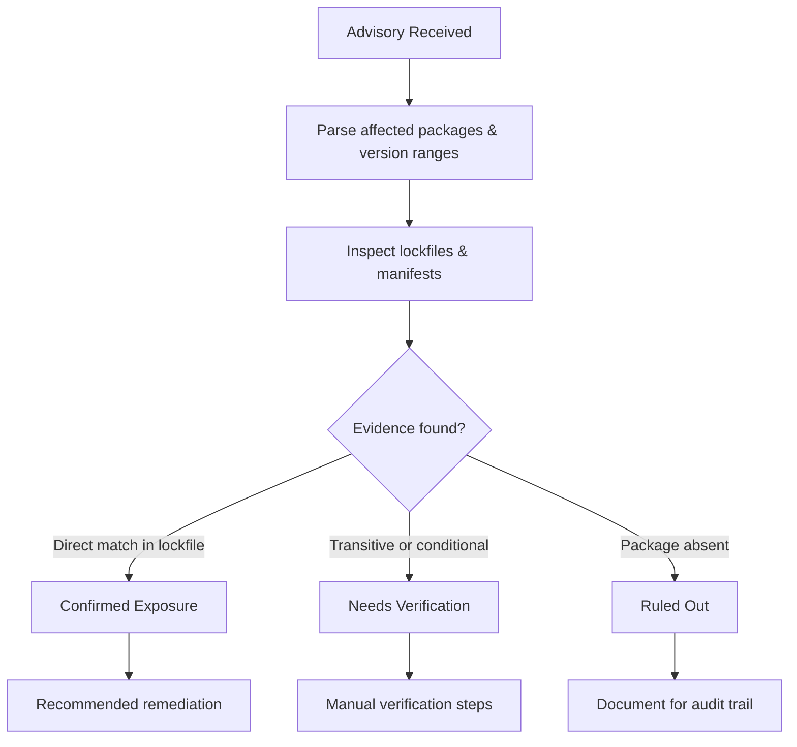
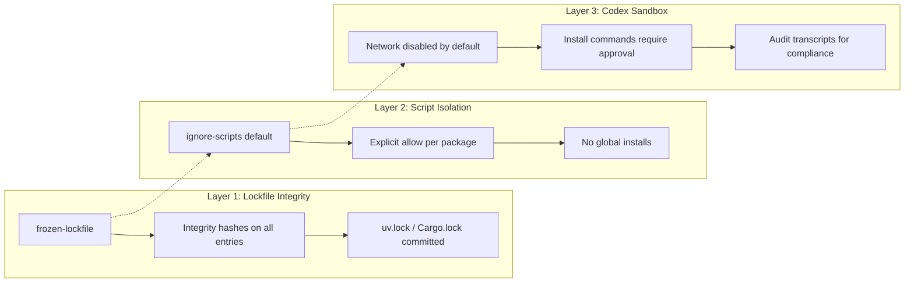

# Dependency Incident Audits with Codex CLI: From PackageGate to Hardened Lockfile Defence


---

## The Problem: Supply Chain Advisories Demand Speed Without Execution

When a supply chain advisory drops — whether it's a compromised package, a lifecycle-script bypass, or a lockfile integrity failure — security teams face a paradox. They need to inspect manifests, lockfiles, CI workflows, and build scripts *quickly*, but running `npm install` or `pip install` against a potentially compromised tree is precisely the action the advisory warns against.

Codex CLI's sandboxed execution model, combined with its official dependency incident audit workflow [^1], turns this paradox into a structured process: read everything, execute nothing, report findings with evidence strength.

## PackageGate: Why This Matters Now

In January 2026, researchers at Koi disclosed six zero-day vulnerabilities across npm, pnpm, vlt, and Bun — collectively dubbed **PackageGate** [^2]. The attack surface directly challenged the two defences the ecosystem adopted after Shai-Hulud: disabling lifecycle scripts and relying on lockfiles.

The specific bypasses demonstrate why agent-assisted audits need strict sandboxing:

| Package Manager | Bypass Mechanism | CVE |
|----------------|-----------------|-----|
| npm | Fake `.npmrc` replaces git binary → RCE even with `--ignore-scripts` | Unfixed (dismissed as "expected behaviour") [^2] |
| pnpm | Remote tarballs accepted without integrity hashes | CVE-2025-69263, CVE-2025-69264 [^3] |
| vlt | Tarball integrity verification absent | Patched Q1 2026 [^2] |
| Bun | Package name trusted over source → script execution via name reuse | Patched Q1 2026 [^2] |

The Shai-Hulud/TeamPCP campaign, active through at least May 2026, escalated the threat further by using stolen GitHub Actions OIDC tokens to generate valid Sigstore provenance attestations for malicious package versions [^4] — demonstrating that cryptographic signing provides incomplete assurance when the signing infrastructure itself is compromised.

## The Codex CLI Audit Workflow

OpenAI's official dependency incident audit use case [^1] defines a two-phase approach that maps cleanly onto Codex CLI's permission model.

### Phase 1: Read-Only Evidence Collection

The core principle is **"read-only unless I explicitly approve"**. In Codex CLI terms, this means running the audit in `suggest` mode with network disabled:

```bash
codex --approval-policy suggest \
  --sandbox workspace-write \
  "Investigate CVE-2025-69263. Identify all pnpm lockfiles in this
   repository. Check whether any dependency resolves a remote tarball
   without an integrity hash. Report findings as confirmed/needs-verification/ruled-out
   with file paths and line numbers."
```

The sandbox ensures the agent cannot execute lifecycle scripts, fetch remote resources, or mutate the lockfile during investigation [^5].

### Phase 2: Structured Findings

The agent reports results in three categories:



### Encoding the Workflow in AGENTS.md

For teams running regular dependency audits, encode the constraints in your project's `AGENTS.md`:

```markdown
## Dependency Audit Mode

When investigating supply chain advisories:
- NEVER run `npm install`, `pnpm install`, `pip install`, or any package manager install command
- NEVER execute lifecycle scripts or build scripts
- ONLY read: package.json, package-lock.json, pnpm-lock.yaml, yarn.lock,
  Pipfile.lock, poetry.lock, Cargo.lock, requirements.txt, .npmrc, .yarnrc.yml
- ONLY read: .github/workflows/*.yml, Dockerfile, Makefile, scripts/
- Report findings with evidence category: confirmed | needs-verification | ruled-out
- Include file path and line number for every claim
```

## Hardened Package-Manager Install Policy

Beyond auditing, Codex CLI's own repository demonstrates best practice through PR #19163 [^6], merged April 2026, which hardened the install policy across the monorepo:

### Key Controls

```toml
# .npmrc / pnpm workspace settings
frozen-lockfile = true
ignore-scripts = true
strict-peer-dependencies = true

# Python (uv)
[tool.uv]
locked = true
index = "https://pypi.org/simple/"
```

The PR eliminated four supply-chain gaps:

1. **Global npm installs** that bypassed the repo lockfile in Docker and CLI reinstall paths
2. **Missing workspace rules** for dependency build scripts despite frozen-lockfile usage
3. **Python SDK packages** lacking committed lock coverage
4. **Bitrotted Docker path** calling `pnpm run build` against a package.json with no build script [^6]

### Applying These Controls to Your Projects

Configure Codex CLI's sandbox to enforce these rules during legitimate dependency operations:

```toml
# config.toml
[sandbox_workspace_write]
network_access = false

[sandbox_workspace_write.command_prefixes]
"npm test" = "allow"
"pnpm test" = "allow"
"npm install" = "prompt"
"pnpm install" = "prompt"
"pip install" = "prompt"
```

The `prompt` setting means Codex will request explicit approval before executing any install command, giving you a human gate even in `auto-edit` mode [^7].

## Practical Example: Auditing for PackageGate Exposure

Here is a complete audit session for checking whether a Node.js monorepo is exposed to the npm `.npmrc` git-dependency bypass:

```bash
codex --approval-policy suggest \
  --sandbox workspace-write \
  --transcript audit/packagegate-2026-01.json \
  "Audit this repository for PackageGate CVE exposure:
   1. Find all .npmrc files (including nested ones)
   2. Check for git:// or github: dependencies in package.json files
   3. Verify pnpm-lock.yaml entries have integrity hashes for all tarballs
   4. Check CI workflows for --ignore-scripts flags
   5. Report exposure status per workspace package"
```

The `--transcript` flag produces a JSON audit trail suitable for compliance reporting [^8].

## Defence-in-Depth Configuration



## Network Allowlisting for Controlled Updates

When you *do* need to install dependencies — after confirming no advisory exposure — use the domain allowlist to limit network access to trusted registries:

```toml
# config.toml
[sandbox_workspace_write]
network_access = true
allowed_domains = [
  "registry.npmjs.org",
  "registry.yarnpkg.com",
  "pypi.org",
  "files.pythonhosted.org",
  "crates.io",
  "static.crates.io"
]
```

This prevents the agent from reaching arbitrary endpoints even when network is enabled — blocking the data exfiltration vector that PackageGate's npm `.npmrc` bypass exploits [^5].

## The Audit Transcript as Compliance Artefact

Every Codex CLI session can produce a full transcript in JSON format. For regulated environments, this serves as evidence that:

- The audit was conducted without executing untrusted code
- Specific files were inspected with timestamps
- Findings were categorised with evidence strength
- No network calls were made during the investigation phase

```bash
# Extract findings summary from transcript
jq '.events[] | select(.type == "assistant_message") | .content' \
  audit/packagegate-2026-01.json
```

## Recommendations

1. **Default to suggest mode** for all dependency investigations — never auto-approve during incident response
2. **Commit lockfiles for every language** in your monorepo, including `uv.lock` for Python and `Cargo.lock` for Rust
3. **Encode audit constraints** in `AGENTS.md` so any team member running Codex gets the same safe defaults
4. **Use transcripts** as compliance artefacts — they prove the agent operated read-only
5. **Allowlist registries** when network access is required, rather than enabling blanket access
6. **Pin package managers** via Corepack or equivalent to prevent version-specific bypasses

## Citations

[^1]: OpenAI, "Audit dependency incidents," ChatGPT Learn Use Cases, 2026. [https://learn.chatgpt.com/use-cases/dependency-incident-audits](https://learn.chatgpt.com/use-cases/dependency-incident-audits)

[^2]: Koi Security, "PackageGate: 6 Zero-Days in JS Package Managers But NPM Won't Act," January 2026. [https://www.koi.ai/blog/packagegate-6-zero-days-in-js-package-managers-but-npm-wont-act](https://www.koi.ai/blog/packagegate-6-zero-days-in-js-package-managers-but-npm-wont-act)

[^3]: Security Affairs, "PackageGate bugs let attackers bypass protections in NPM, PNPM, VLT, and Bun," January 2026. [https://securityaffairs.com/187416/hacking/packagegate-bugs-let-attackers-bypass-protections-in-npm-pnpm-vlt-and-bun.html](https://securityaffairs.com/187416/hacking/packagegate-bugs-let-attackers-bypass-protections-in-npm-pnpm-vlt-and-bun.html)

[^4]: Bastion Security, "npm Supply Chain Attacks 2026: Defense Guide for SaaS Teams," 2026. [https://bastion.tech/blog/npm-supply-chain-attacks-2026-saas-security-guide](https://bastion.tech/blog/npm-supply-chain-attacks-2026-saas-security-guide)

[^5]: OpenAI, "Sandbox," Codex CLI Documentation, 2026. [https://developers.openai.com/codex/concepts/sandboxing](https://developers.openai.com/codex/concepts/sandboxing)

[^6]: mcgrew-oai, "Harden package-manager install policy," Pull Request #19163, openai/codex, April 2026. [https://github.com/openai/codex/pull/19163](https://github.com/openai/codex/pull/19163)

[^7]: OpenAI, "Agent approvals & security," Codex CLI Documentation, 2026. [https://developers.openai.com/codex/agent-approvals-security](https://developers.openai.com/codex/agent-approvals-security)

[^8]: OpenAI, "Codex CLI," CLI Reference, 2026. [https://developers.openai.com/codex/cli](https://developers.openai.com/codex/cli)
