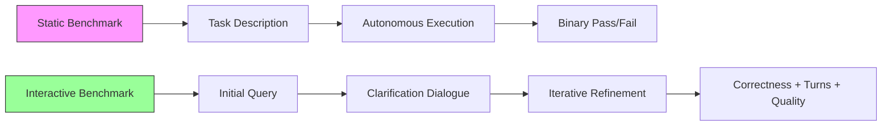

# The Dialogue Gap: Why Better Models Don't Make Better Coding Partners — and How Codex CLI's Interactive Architecture Closes It


---

## The Autonomous Fallacy

Every major coding agent benchmark — SWE-bench, Terminal-Bench, EvoCode-Bench — evaluates agents in a single mode: fully autonomous. The agent receives a task description, executes in isolation, and is judged on final output correctness[^1]. This evaluation paradigm has driven model development toward autonomous resolution rates while ignoring a fundamental truth: **real coding assistance is interactive**.

Two recent papers — Dialogue-SWEBench (arXiv:2606.13995)[^2] and SWE-Together (arXiv:2606.29957)[^3] — present the first systematic evidence that dialogue capability is a distinct dimension of coding agent performance, orthogonal to autonomous code generation ability. Their central finding is stark: better coding models do not always correspond to better dialogue models[^2].

This matters for Codex CLI practitioners because the tool's TUI architecture is fundamentally dialogue-driven, and understanding this gap informs how you configure your agent sessions for maximum productivity.

---

## What the Research Shows

### Dialogue-SWEBench: The Structured Interaction Protocol

Dialogue-SWEBench constructs a benchmark where users never touch code directly — all software engineering tasks are performed strictly through dialogue[^2]. The benchmark uses a persona-grounded user simulator to evaluate agents across two axes simultaneously: task resolution rate and dialogue quality.

Key results:

- A novel **schema-guided agent** that structures its clarification questions around a task schema improves over strong baselines by 3–14%[^2]
- Dialogue quality metrics (clarity, relevance, minimal unnecessary turns) correlate poorly with raw model capability rankings[^2]
- The benchmark reveals that agents with the highest autonomous SWE-bench scores sometimes produce the worst interactive experiences — asking irrelevant questions, ignoring user corrections, or steamrolling past clarifications[^2]

### SWE-Together: Reconstructing Real Sessions

SWE-Together takes a different approach: rather than synthetic dialogue, it curates 109 repository-level tasks from 11,260 **real user-agent coding sessions**[^3]. A reactive LLM-based user simulator preserves original user intents and provides corrective feedback when the agent's progress requires it.

The evaluation measures both final repository correctness and the **number of corrective feedback turns** required during interaction[^3]. This dual metric captures a crucial distinction: an agent that produces correct code after five user corrections is a worse collaborator than one that gets it right after one clarification, even if both achieve the same resolution rate.



---

## The Three Failure Modes

Both papers identify recurring patterns where dialogue breaks down in coding agents:

### 1. Clarification Avoidance

Agents trained on autonomous benchmarks learn to proceed without asking questions, even when the task specification is genuinely ambiguous[^2]. In Dialogue-SWEBench, agents that never ask clarifying questions resolve fewer tasks than those that ask one or two targeted questions early.

### 2. Correction Blindness

SWE-Together reveals that some agents continue their original approach after receiving corrective feedback, effectively ignoring the user[^3]. This manifests as the agent acknowledging the correction verbally ("You're right, I'll fix that") but then producing code that perpetuates the original mistake.

### 3. Over-Questioning

The inverse problem: agents that ask excessive clarifying questions before acting, creating "dialogue paralysis"[^2]. Users in the recorded sessions frequently abandoned agents that asked more than three consecutive questions without producing any code.

---

## Codex CLI's Interactive Architecture

Codex CLI is architecturally positioned to address the dialogue gap through several features that create structured interaction patterns rather than relying on raw model dialogue capability.

### Plan Mode: Structured Clarification Before Execution

Invoked with `/plan` or Shift+Tab, Plan Mode tells the model to gather context, ask clarifying questions, and build a plan before writing any code[^4]. This directly addresses the clarification avoidance failure mode by creating an explicit phase boundary:

```bash
# Plan mode forces the agent to dialogue before acting
codex --plan "Refactor the auth module to use JWT tokens"
```

The agent must produce a reviewable plan and surface uncertainties before any file modifications occur. This mirrors the schema-guided approach that Dialogue-SWEBench found most effective[^2].

### The ask_user_question Tool: Constrained Dialogue

Rather than free-form clarification (which leads to over-questioning), Codex CLI's `ask_user_question` tool presents users with a tabbed questionnaire UI containing structured choices[^5]:

- Single-choice questions for binary decisions (framework, provider, approach)
- Multi-choice questions for feature selection
- Custom option fields for edge cases
- Tab navigation so users can skip irrelevant questions

This constrained dialogue format reduces the corrective feedback turns that SWE-Together measures by front-loading decisions into a structured format rather than iterating through ambiguity.

### /side Conversations: Preserving Intent Context

The `/side` command opens a parallel conversation whose transcript is separate from the parent task[^6]. This architectural choice prevents the correction blindness failure mode by keeping exploratory dialogue out of the main execution context — the agent's primary task state isn't polluted with tangential discussion.

```mermaid
graph TD
    A[Main Task Thread] --> B[Code Generation]
    A --> C[/side Exploration]
    C --> D[Clarify Architecture]
    C --> E[Discuss Trade-offs]
    D --> F[Decision Injected Back]
    E --> F
    F --> B

    style C fill:#ff9,stroke:#333
    style A fill:#9cf,stroke:#333
```

### Interactive vs Autonomous: The exec Boundary

Codex CLI's most important architectural decision for the dialogue gap is the explicit boundary between interactive mode (`codex`) and autonomous mode (`codex exec`)[^7]:

| Mode | Dialogue | Use Case |
|------|----------|----------|
| `codex` (TUI) | Full interactive dialogue | Exploratory work, ambiguous tasks |
| `codex exec` | Zero interaction | CI/CD, scripted automation |
| `codex exec --approval-mode writes` | Checkpoint-only | Semi-autonomous with approval gates |

This separation means practitioners can choose the interaction level appropriate to task ambiguity rather than forcing every task through the same pipeline.

### AGENTS.md Dialogue Directives

AGENTS.md supports encoding dialogue preferences that guide when the agent should ask versus proceed[^8]:

```markdown
## Dialogue Policy

- ASK before modifying any public API signature
- ASK if the task involves more than 3 files
- PROCEED without asking for formatting, linting, or test fixes
- NEVER ask about code style — follow .editorconfig
```

These directives address the over-questioning failure mode by giving the agent explicit boundaries for when dialogue is warranted versus when it should act autonomously.

---

## Configuring for Collaborative Effectiveness

Based on the research findings, here are configuration patterns that optimise Codex CLI for interactive coding sessions:

### Profile: Collaborative Mode

```toml
[profiles.collaborative]
model = "gpt-5.6-sol"
approval_policy = "on-request"

[profiles.collaborative.features]
plan_mode_default = true
```

Starting every session in plan mode ensures the agent surfaces ambiguity before acting, matching the schema-guided approach that produced 3–14% improvements in Dialogue-SWEBench[^2].

### Profile: Semi-Autonomous Mode

```toml
[profiles.semi-auto]
model = "gpt-5.6-terra"
approval_policy = "writes"

[profiles.semi-auto.features]
plan_mode_default = false
```

For well-specified tasks where the AGENTS.md provides sufficient constraints, the `writes` approval mode (shipped in v0.144)[^9] creates natural checkpoint dialogue without full plan-mode overhead.

### Reducing Corrective Turns via Hook Feedback

PostToolUse hooks can provide automated feedback that substitutes for user corrections:

```toml
[hooks.post_tool_use.lint_check]
command = "eslint --format compact ${file}"
on_failure = "report_to_agent"
```

When the hook reports a failure back to the agent, it acts as structured corrective feedback — the same mechanism that SWE-Together measures as "user corrections"[^3], but automated and instantaneous.

---

## Implications for Evaluation

The dialogue gap research suggests that Codex CLI users should evaluate their agent configurations not just by resolution rate but by **collaborative efficiency**:

1. **Turns to resolution** — How many back-and-forth exchanges before the task is complete?
2. **Correction ratio** — What fraction of user messages are corrections versus new instructions?
3. **Clarification precision** — When the agent asks questions, are they relevant and well-timed?

Codex CLI's session transcripts (JSONL files under `~/.codex/sessions/`) provide the raw data for this evaluation[^10]. Teams that track these metrics alongside resolution rate will identify configuration improvements invisible to autonomous benchmarks.

---

## The Broader Pattern

The dialogue gap reflects a structural mismatch in how coding agents are developed versus how they are used. Autonomous benchmarks reward agents that maximise single-shot correctness, while real-world productivity depends on minimal-friction collaboration.

Codex CLI's architecture — with its explicit plan mode, structured clarification tools, side conversations, and configurable dialogue directives — provides the scaffolding to exploit this insight. The research suggests that teams investing in their AGENTS.md dialogue policies and interactive configuration profiles will see productivity gains invisible to those optimising purely for autonomous task completion.

The lesson is counterintuitive: sometimes the best agent response is a well-timed question, not more code.

---

## Citations

[^1]: Yang, J., Jimenez, C. E., Wettig, A., Liber, K., Narasimhan, K., & Press, O. (2024). SWE-bench: Can Language Models Resolve Real-World GitHub Issues? *ICLR 2024*. https://arxiv.org/abs/2310.06770

[^2]: Dialogue-SWEBench: A Benchmark for Dialogue-Driven Coding Agents (June 2026). arXiv:2606.13995. https://arxiv.org/abs/2606.13995

[^3]: Wu, Y., Zhao, Z., Li, S., Lee, H. H., Zhu, J., Wu, S., Yu, T., Li, S., Zhang, L., Fan, X., & Li, S. (2026). SWE-Together: Evaluating Coding Agents in Interactive User Sessions. arXiv:2606.29957. https://arxiv.org/abs/2606.29957

[^4]: OpenAI. Codex CLI Features — Plan Mode. https://developers.openai.com/codex/cli/features

[^5]: OpenAI/Codex GitHub Issue #9926 — Interactive ask_user_question tool (tabbed questionnaire UI). https://github.com/openai/codex/issues/9926

[^6]: Codex CLI Conversation Branching: /side, /fork, and Plan Mode Workflows. https://codex.danielvaughan.com/2026/04/21/codex-cli-conversation-branching-side-fork-plan-mode-workflows/

[^7]: OpenAI. Non-interactive Mode — codex exec. https://developers.openai.com/codex/noninteractive

[^8]: OpenAI. AGENTS.md Documentation. https://developers.openai.com/codex/agents-md

[^9]: OpenAI. Codex CLI v0.144.0 Release Notes (July 9, 2026) — Writes approval mode. https://github.com/openai/codex/releases/tag/rust-v0.144.0

[^10]: OpenAI. Codex CLI Session Lifecycle Documentation. https://developers.openai.com/codex/cli/features
