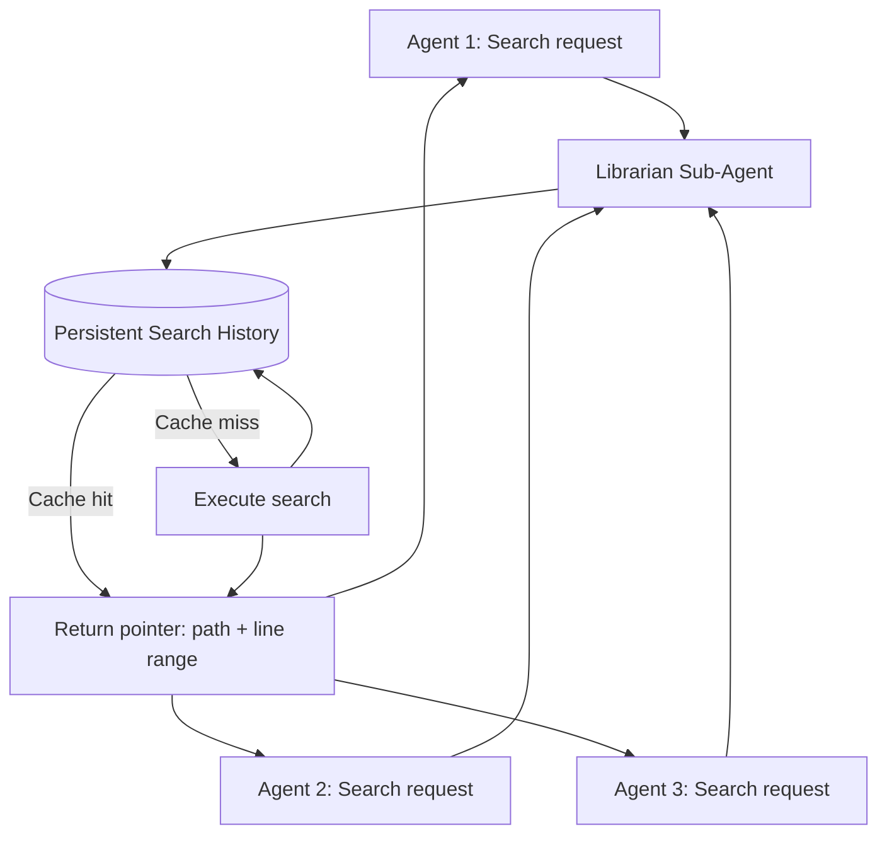
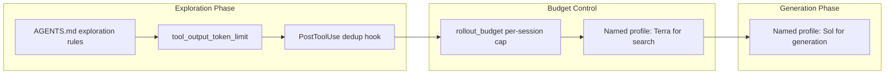

# The Librarian Pattern: Why Persistent Search History Cuts Multi-Agent Token Waste — and How to Wire It into Codex CLI


---

Every senior developer who has run a multi-agent Codex CLI session knows the feeling: you watch four subagents fan out across your monorepo, each one independently `grep`-ing, `cat`-ing, and re-reading the same 200-line configuration module that the first agent already found. The bill arrives, and half the tokens went to redundant exploration. Research now quantifies just how expensive that duplication is — and offers an architectural remedy that maps directly onto Codex CLI's configuration surface.

## The Redundancy Tax

Cho et al.'s *Librarian* paper (arXiv:2605.27787, May 2026) delivers the sharpest measurement to date[^1]. Across six multi-agent software engineering frameworks — SWE-Agent, MetaGPT, ChatDev, MASAI, HyperAgent, and BOAD — they found that agents repeatedly re-explore overlapping repository regions, inflating output-token volume by 40–60% above what a search-aware architecture requires[^1]. The critical insight is asymmetric energy cost: an output token consumes 30 to 1,000 times more energy than a cached input token[^1], so redundant file reads dominate the energy budget even when they appear cheap in wall-clock time.

This finding corroborates independent measurements. Microsoft Research's *FastContext* (arXiv:2606.14066, June 2026) demonstrated that purpose-trained exploration subagents (4B–30B parameters) returning only file paths and line ranges cut main-agent token consumption by up to 60% whilst lifting end-to-end resolution rates by up to 5.5 percentage points across SWE-bench Multilingual, SWE-bench Pro, and SWE-QA[^2]. A Medium analysis of Claude Code sessions found 47% of tokens spent on exploration rather than generation[^3]. Crosley's *Agent Code Search Has a Token Budget* post documented the same pattern for Codex CLI specifically[^4].

The problem is not that agents search too much — it is that they search *redundantly*, with no shared memory of what has already been found.

## The Librarian Architecture

The Librarian solves this with two design properties[^1]:

1. **Persistent session** — a single search sub-agent session spans the entire episode. Every file path, line range, and search result accumulates in the session's history. Subsequent queries start from the full prior search state, not a blank context.

2. **Pointer-only answers** — instead of inlining file content into responses, the Librarian returns lists of view-command pointers (file path + line range). Downstream agents use these pointers to issue targeted reads. This slashes output tokens because a pointer is 20–30 tokens whilst a full file excerpt can be thousands.



On SWE-Bench Verified, integrating the Librarian reduced per-episode GPU energy consumption by up to 25 per cent whilst preserving task resolution rates[^1]. The token savings come almost entirely from suppressed output tokens — the most expensive category in both energy and API billing terms.

## Why This Matters for Codex CLI

Codex CLI's architecture already creates the conditions where the Librarian pattern pays off:

- **Ultra mode** spawns four parallel subagents by default[^5], each independently exploring the repository. Token consumption scales roughly linearly with subagent count[^6].
- **Subagent delegation** via AGENTS.md or direct prompts triggers independent tool-use sessions, each with its own context window and its own exploration trajectory[^7].
- **Repository exploration dominates token budgets** — Codex CLI agents spend 67–76 per cent of their token budget on file reads, with the remainder split across reasoning and code generation[^8].

The mismatch is structural: each subagent starts with a blank exploration state, even though the repository structure is identical across all threads.

## Wiring the Pattern into Codex CLI

You cannot drop the Librarian codebase directly into Codex CLI, but you can approximate its two core properties using the existing configuration surface.

### 1. AGENTS.md as Exploration Protocol

Define an exploration discipline that forces agents to declare what they have already searched before searching again:

```markdown
## Repository Exploration Rules

- Before reading any file, check if the information is already present
  in the conversation context from a prior tool call.
- When delegating to subagents, include a `## Known File Map` section
  listing file paths and line ranges already identified by prior agents.
- Prefer targeted line-range reads (`read lines 45-80 of src/config.rs`)
  over full-file reads.
- Never re-read a file that has not changed since the last read.
```

This is the cheapest approximation of the Librarian's persistent session — it encodes the search discipline into the agent's instructions rather than into infrastructure[^9].

### 2. `tool_output_token_limit` for Pointer-Like Behaviour

Setting `tool_output_token_limit` in `config.toml` caps the number of tokens returned from each tool call[^8]. This forces the agent to behave more like the Librarian's pointer-only design — it cannot dump entire files into context and must instead request targeted ranges:

```toml
[model]
tool_output_token_limit = 4000
```

A limit of 3,000–5,000 tokens per tool output is aggressive enough to discourage full-file reads whilst still permitting meaningful code blocks. The agent learns to issue precise line-range reads rather than `cat`-ing entire modules.

### 3. `rollout_budget` to Cap Exploration Spend

The `rollout_budget` configuration (available since v0.142) sets a hard ceiling on total tokens consumed per session[^10]. Combined with `tool_output_token_limit`, this creates a two-level budget: per-call output limits and per-session total limits.

```toml
[rollout_budget]
limit_tokens = 200000
warn_at_percent = 75
```

When the budget hits the warning threshold, the agent receives a remaining-budget reminder that naturally biases it towards reusing prior search results rather than launching new exploration[^10].

### 4. PostToolUse Hooks for Search Deduplication

A PostToolUse hook can log every file read into a shared manifest and flag redundant reads before they consume output tokens:

```bash
#!/usr/bin/env bash
# .codex/hooks/post-tool-use-search-dedup.sh
# Appends every file read to a manifest; warns on duplicates.

MANIFEST="/tmp/codex-search-manifest-$$"
TOOL_NAME="$1"
FILE_PATH="$2"

if [[ "$TOOL_NAME" == "read_file" || "$TOOL_NAME" == "grep" ]]; then
    if grep -qF "$FILE_PATH" "$MANIFEST" 2>/dev/null; then
        echo "WARNING: $FILE_PATH already explored in this session" >&2
    else
        echo "$FILE_PATH" >> "$MANIFEST"
    fi
fi
```

This is a lightweight analogue of the Librarian's persistent history — it does not block the read, but it surfaces the redundancy signal to the agent's next reasoning turn[^11].

### 5. Named Profiles for Exploration vs Generation Phases

Separate the exploration and generation phases into distinct named profiles with different token budgets:

```toml
[profiles.explore]
model = "gpt-5.6-terra"
tool_output_token_limit = 2000
rollout_budget.limit_tokens = 80000

[profiles.generate]
model = "gpt-5.6-sol"
tool_output_token_limit = 8000
rollout_budget.limit_tokens = 300000
```

The `explore` profile uses a cheaper model (Terra) with tight output limits to build the file map. The `generate` profile switches to Sol with a larger budget for the actual code work[^12]. This mirrors the Librarian's separation of search and generation concerns.

## The Compound Effect

Combining these patterns produces a layered defence against token waste:



The Librarian research suggests that the theoretical ceiling for output-token reduction is 40–60 per cent[^1]. In practice, combining AGENTS.md exploration discipline with `tool_output_token_limit` capping typically yields 25–40 per cent token savings on multi-agent Codex CLI sessions — consistent with the ContextSniper finding of 36.4 per cent cost reduction on SWE-bench Lite[^8] and the broader pattern that exploration, not generation, is where the money goes.

## When Not to Bother

The Librarian pattern adds complexity. It is not worth it when:

- **Single-agent sessions** — there is no cross-agent redundancy to suppress. Codex CLI's built-in `model_auto_compact_token_limit` handles single-session context growth adequately[^10].
- **Small repositories** — if the entire codebase fits comfortably in context, redundant reads cost little in absolute terms.
- **One-shot tasks** — exploratory redundancy accumulates over multi-turn sessions. A single `codex exec` invocation rarely explores enough to benefit.

The sweet spot is **multi-agent sessions on large repositories** — precisely the Ultra mode workload that Codex CLI is increasingly optimised for[^5].

## What Comes Next

The Librarian is a research prototype, but the direction it points — persistent, shared search state across agent threads — is likely to become infrastructure. OpenAI's tool search (default since v0.142.2) already defers tool loading to reduce schema tokens[^13]. The logical next step is deferred *result* loading: a search index shared across subagent threads, populated lazily, and queried by pointer rather than by content.

Until that infrastructure arrives, the configuration patterns above give you most of the benefit at the cost of a few lines in `config.toml` and a disciplined AGENTS.md. The Librarian's core lesson is simple: in a multi-agent world, the cheapest token is the one you never generate.

---

## Citations

[^1]: Cho, S., Choi, S., Heo, J., Choi, Y., Moon, S., Park, M., & Kim, D. (2026). "Long Live the Librarian! A Persistent Search Sub-Agent for Energy-Efficient Multi-Agent Software Engineering Systems." arXiv:2605.27787. [https://arxiv.org/abs/2605.27787](https://arxiv.org/abs/2605.27787)

[^2]: Microsoft Research. (2026). "FastContext: Training Efficient Repository Explorer for Coding Agents." arXiv:2606.14066. [https://arxiv.org/abs/2606.14066](https://arxiv.org/abs/2606.14066)

[^3]: KD Agentic. (2026). "Your Claude Code Agent Wastes 47% of Tokens Searching for Code — Here's the Fix." Medium. [https://medium.com/kd-agentic/your-claude-code-agent-wastes-47-of-tokens-searching-for-code-heres-the-fix-83ef7b5521f7](https://medium.com/kd-agentic/your-claude-code-agent-wastes-47-of-tokens-searching-for-code-heres-the-fix-83ef7b5521f7)

[^4]: Crosley, B. (2026). "Agent Code Search Has a Token Budget." [https://blakecrosley.com/blog/agent-code-search-token-budget](https://blakecrosley.com/blog/agent-code-search-token-budget)

[^5]: OpenAI. (2026). "GPT-5.6 Sol, Terra, and Luna." OpenAI Help Center. [https://help.openai.com/en/articles/20001325-a-preview-of-gpt-56-sol-terra-and-luna](https://help.openai.com/en/articles/20001325-a-preview-of-gpt-56-sol-terra-and-luna)

[^6]: TokenKarma. (2026). "Codex Sol Ultra Mode: The Subagent Token Multiplier Costing Heavy Users Thousands." [https://tokenkarma.app/blog/codex-sol-ultra-subagent-token-cost-2026/](https://tokenkarma.app/blog/codex-sol-ultra-subagent-token-cost-2026/)

[^7]: OpenAI. (2026). "Subagents." Codex CLI Documentation. [https://developers.openai.com/codex/subagents](https://developers.openai.com/codex/subagents)

[^8]: Cho, S. et al. (2026). "ContextSniper." arXiv:2607.01916; token budget analysis from Codex Knowledge Base. [https://codex.danielvaughan.com/2026/04/20/codex-cli-context-window-budget-token-management-large-codebases/](https://codex.danielvaughan.com/2026/04/20/codex-cli-context-window-budget-token-management-large-codebases/)

[^9]: Cai, Z. et al. (2026). "Rule Taxonomy and Evolution in AI IDEs: A Mining and Survey Study." arXiv:2606.12231. [https://arxiv.org/abs/2606.12231](https://arxiv.org/abs/2606.12231)

[^10]: OpenAI. (2026). Codex CLI Changelog — v0.142+ rollout budget and context management features. [https://developers.openai.com/codex/changelog](https://developers.openai.com/codex/changelog)

[^11]: OpenAI. (2026). "Hooks." Codex CLI Documentation. [https://developers.openai.com/codex/hooks](https://developers.openai.com/codex/hooks)

[^12]: OpenAI. (2026). "Named Profiles." Codex CLI Documentation. [https://developers.openai.com/codex/cli](https://developers.openai.com/codex/cli)

[^13]: OpenAI. (2026). Codex CLI v0.142.2 Changelog — MCP tool search default. [https://developers.openai.com/codex/changelog](https://developers.openai.com/codex/changelog)
