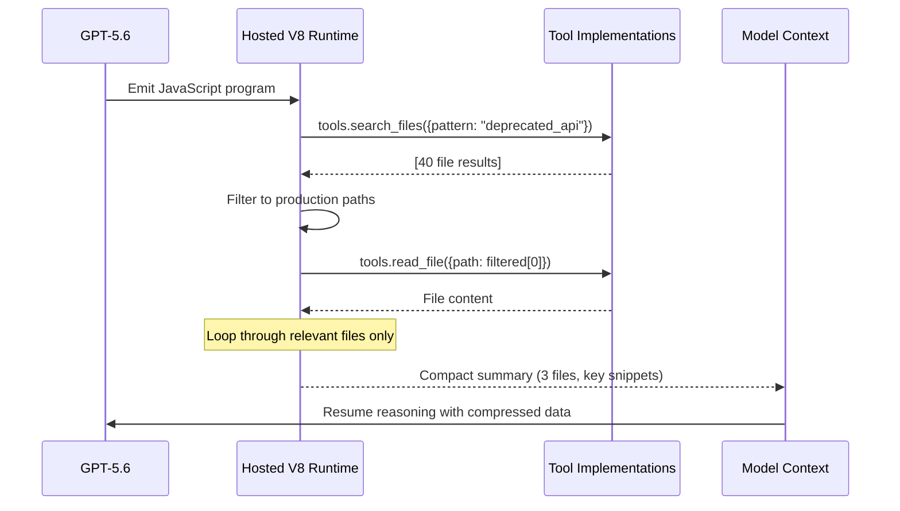

# Programmatic Tool Calling: How GPT-5.6's JavaScript Orchestration Layer Cuts Codex CLI Round-Trips and Token Costs


---

When GPT-5.6 went generally available on 9 July 2026, most coverage focused on the three-tier model family and Ultra mode's cooperative subagents.[^1] Buried beneath those headlines was a feature that changes the economics of every tool-heavy Codex CLI session: **Programmatic Tool Calling** — a mechanism that lets the model write and execute JavaScript to coordinate tools inside an isolated V8 runtime, rather than ping-ponging intermediate results back through the context window.[^2]

For Codex CLI developers running multi-step workflows — searching repositories, aggregating test results, filtering API responses — this collapses what was previously a chain of sequential model turns into a single orchestrated program. Fewer round-trips means fewer tokens, lower latency, and less opportunity for the model to lose coherence mid-chain.

## The Problem: Round-Trip Bloat in Tool-Heavy Sessions

Consider a typical Codex CLI workflow: search a codebase for all usages of a deprecated API, filter to production files, extract the surrounding context, then summarise the migration effort. Under traditional tool calling, each step requires:

1. Model reasons about what to do next
2. Model emits a tool call
3. Runtime executes the tool and returns results
4. Model ingests the full result into context
5. Model reasons about the next step

For a search returning 40 files, the model sees all 40 results in context before deciding to filter. Those intermediate tokens accumulate — research shows agents spend 67–76% of their token budget on file reads alone.[^3] Every round-trip adds reasoning overhead, and every intermediate result inflates the context window.

## How Programmatic Tool Calling Works

Programmatic Tool Calling inverts the pattern. Instead of the model calling tools one at a time through the API loop, the model writes a JavaScript program that:

- Calls multiple tools in parallel
- Uses loops and conditionals to process results
- Filters and aggregates intermediate data locally
- Returns only the compressed, relevant output to the model's context[^2]

The program executes in a fresh, isolated V8 runtime hosted by OpenAI. The runtime supports top-level `await` but provides no Node.js APIs, no filesystem, no network access (except through declared tools), and no persistent state between executions.[^4]



## API Mechanics

To enable Programmatic Tool Calling, add it as a hosted tool in the Responses API request and configure which functions the program may invoke:

```json
{
  "model": "gpt-5.6-sol",
  "tools": [
    { "type": "programmatic_tool_calling" },
    {
      "type": "function",
      "name": "search_files",
      "allowed_callers": ["programmatic", "direct"],
      "parameters": { "type": "object", "properties": { "pattern": { "type": "string" } } },
      "output_schema": { "type": "array", "items": { "type": "object" } }
    }
  ]
}
```

The `allowed_callers` parameter controls access:[^4]

| Value | Behaviour |
|-------|-----------|
| `["direct"]` (default) | Model calls tool through the standard API loop |
| `["programmatic"]` | Only generated JavaScript can invoke it |
| `["direct", "programmatic"]` | Both modes available |

Including `output_schema` alongside `parameters` gives the V8 runtime typed return values, making the generated JavaScript more reliable.[^4]

## Response Structure

When the model uses programmatic calling, the response contains three item types:[^4]

1. **`program`** — The generated JavaScript with a `call_id` and opaque `fingerprint`
2. **`function_call`** — Individual tool invocations made by the program, each with a `caller.caller_id` matching the parent program
3. **`program_output`** — The final result with `status` ("completed" or "incomplete")

For client-executed tools (your MCP servers, local commands), the runtime pauses at each invocation, returns control to your application to execute the tool, then resumes with the result.

## What This Means for Codex CLI

Codex CLI v0.144.x uses the Responses API internally to communicate with GPT-5.6.[^5] When the model decides a multi-step tool workflow benefits from programmatic coordination, it emits a JavaScript program that the Codex runtime executes through its existing tool infrastructure. This happens transparently — you don't need to configure it manually.

The practical implications:

### Fewer Context Window Tokens

Intermediate tool outputs stay in the V8 sandbox. If you search 200 files and only 8 are relevant, 192 file contents never enter the model's context. With `rollout_budget` already limiting total session spend, programmatic calling extends how far that budget stretches.[^6]

### Reduced Coherence Collapse Risk

Research shows 60–69% of coding agent failures occur after the agent reaches the correct functions — coherence collapse during the edit phase.[^7] By compressing the search-and-filter phase into a single program execution, the model enters its editing phase with a cleaner, shorter context, reducing the probability of mid-task confusion.

### MCP Server Compatibility

MCP tools configured in `config.toml` are eligible for programmatic invocation when `allowed_callers` includes `"programmatic"`.[^4] This means your custom code-search MCP servers, database query tools, and API clients can all be orchestrated programmatically:

```toml
# ~/.codex/config.toml
[mcp_servers.codebase-search]
command = "/usr/local/bin/codebase-mcp"
```

The model can then write JavaScript like:

```javascript
const results = await tools.codebase_search({ query: "deprecated_auth_v1" });
const production = results.filter(r => !r.path.includes("test/"));
const summaries = await Promise.all(
  production.slice(0, 5).map(r => tools.read_file({ path: r.path }))
);
text(JSON.stringify(summaries.map(s => ({ path: s.path, lines: s.relevant_lines }))));
```

### Parallel Tool Execution

The V8 runtime supports `Promise.all`, meaning tools declared as independent can execute concurrently. For Codex CLI sessions involving multiple MCP servers — a database query tool, a documentation search tool, and a code search tool — parallel invocation eliminates sequential waiting.[^2]

## When Programmatic Calling Activates

The model chooses programmatic calling autonomously based on task structure. OpenAI's guidance identifies ideal scenarios:[^4]

- **Bounded tasks with predictable control flow** — searching, filtering, aggregating
- **Dependent call chains** — where later arguments derive from earlier results
- **Large intermediate outputs** — test results needing pass/fail compression
- **Deduplication and ranking** — processing raw data before model judgment

It does **not** activate for:
- Single lookups or actions
- Tasks requiring semantic judgment between every step
- Approval-sensitive operations (Codex CLI's `writes` mode still gates these)
- Final validation requiring citations

## AGENTS.md Patterns for Programmatic Workflows

You can guide the model toward programmatic tool use by encoding workflow structure in AGENTS.md:

```markdown
## Search Workflow

When searching for code patterns across the repository:
1. Use parallel file search to identify all matches
2. Filter results to production code (exclude test/, fixtures/, vendor/)
3. Read only the top 10 most relevant files
4. Summarise findings in a structured format before proposing changes

Prefer batch operations over sequential file-by-file reads.
```

This nudges the model toward emitting a single coordinated program rather than individual tool calls, though the decision ultimately depends on the model's assessment of task structure.

## Cost Impact Analysis

The token economics are straightforward. Consider a workflow that previously required 8 model turns at ~500 reasoning tokens per turn plus ingesting 4,000 tokens of intermediate tool output:

| Approach | Model Reasoning Tokens | Context Tokens | Total |
|----------|----------------------|----------------|-------|
| Sequential tool calling | ~4,000 | ~4,000 | ~8,000 |
| Programmatic calling | ~800 | ~600 | ~1,400 |

The savings compound with `rollout_budget` — at Sol's \$5/\$30 per million tokens, a session that previously consumed \$0.24 in intermediate processing drops to approximately \$0.04.[^1] [^6]

⚠️ Exact savings vary significantly by workflow. Tasks with small intermediate outputs or those requiring judgment between steps may see minimal improvement.

## Limitations and Caveats

- **No persistent state**: Each program runs in a fresh V8 instance — no accumulating context across multiple programmatic calls within a session
- **No Node.js**: Only vanilla JavaScript with `await`. No `fs`, `path`, `child_process`, or npm packages[^4]
- **Client-side execution pauses**: For MCP tools running locally, the runtime pauses at each invocation waiting for your tool to respond — true parallelism only works for OpenAI-hosted tools
- **Azure compatibility**: Known issues exist with GPT-5.6 on Azure OpenAI when Codex sends programmatic tool calling payloads[^8]
- **No approval integration**: Programmatic calls bypass Codex CLI's per-command approval flow — the approval happens at the program level, not per-tool-invocation within the program

## Configuration for Codex CLI Developers

For most workflows, programmatic tool calling works transparently with GPT-5.6 Sol and Terra. To maximise its effectiveness:

```toml
# ~/.codex/config.toml
model = "gpt-5.6-sol"
model_reasoning_effort = "medium"

# Ensure rollout_budget is generous enough for programmatic programs
rollout_budget = 200000
```

For named profiles targeting batch operations:

```toml
[profiles.batch-analysis]
model = "gpt-5.6-terra"
model_reasoning_effort = "low"
# Terra at $2.50/$15 with programmatic calling
# gives the best cost-per-completed-task for search-heavy workflows
```

## The Bigger Picture

Programmatic Tool Calling represents a shift in where orchestration logic lives. Previously, multi-tool coordination required either:

- **Harness-level orchestration** — your code deciding what to call when
- **Model-level sequential reasoning** — the model figuring it out turn by turn, burning tokens

Now there's a third option: the model writes the orchestration plan as executable code, runs it in a sandbox, and returns only the useful result. This is closer to how experienced developers think — sketch a script, run it, work with the output — and it maps cleanly to Codex CLI's existing philosophy of agent-as-developer.[^9]

For Codex CLI teams already using MCP servers, the immediate action is ensuring your tool schemas include `output_schema` alongside `parameters`, giving the V8 runtime the type information it needs to generate reliable JavaScript. Beyond that, the model handles the rest.

## Citations

[^1]: OpenAI, "GPT-5.6 Sol, Terra, Luna — General Availability Announcement," 9 July 2026. https://openai.com/products/release-notes/
[^2]: OpenAI Developers (@OpenAIDevs), "Programmatic Tool Calling lets GPT-5.6 write and run JavaScript to coordinate complex tool workflows," X/Twitter, 9 July 2026. https://x.com/OpenAIDevs/status/2075274027434922130
[^3]: Qu et al., "ContextSniper: Token Reduction for SWE-bench," arXiv:2607.01916, July 2026.
[^4]: OpenAI, "Programmatic Tool Calling — API Guide," July 2026. https://developers.openai.com/api/docs/guides/tools-programmatic-tool-calling
[^5]: OpenAI, "Codex CLI Changelog — v0.144.0," 9 July 2026. https://developers.openai.com/codex/changelog
[^6]: OpenAI, "Configuration Reference — rollout_budget," 2026. https://developers.openai.com/codex/config-reference
[^7]: Kim et al., "TRAJEVAL: Training-Free Trajectory Decomposition for Coding Agent Diagnosis," arXiv:2603.24631, March 2026.
[^8]: GitHub Issue #31875, "Codex CLI with Azure OpenAI gpt-5.6-sol fails due to Codex-specific tools," July 2026. https://github.com/openai/codex/issues/31875
[^9]: OpenAI, "Codex CLI Features," 2026. https://developers.openai.com/codex/cli
