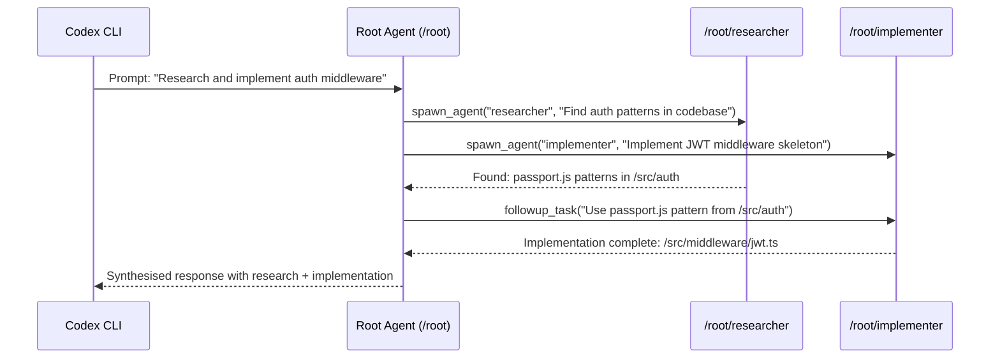

# The Responses API Multi-Agent Beta: How Server-Side Subagent Spawning Changes Codex CLI's Parallelism Model


---

When GPT-5.6 went generally available on 9 July 2026, the headline features — Programmatic Tool Calling, the three-tier model family, ChatGPT Work — dominated coverage.[^1] Less discussed was a feature that fundamentally alters how Codex CLI handles complex tasks: the **Responses API Multi-Agent Beta**, which lets GPT-5.6 spawn and coordinate cooperative subagents *server-side* within a single API request.[^2]

This is architecturally distinct from Codex CLI's existing local subagent orchestration. Understanding the difference — and knowing when to use which layer — is now essential for any developer running multi-step workflows.

## Two Layers of Parallelism

Codex CLI has supported subagents since early 2026, governed by `[agents]` configuration in `config.toml`.[^3] These are *client-side* orchestration primitives: the CLI spawns multiple threads, each making independent Responses API calls, with the host process managing routing, waiting, and result collection.

The Responses API Multi-Agent Beta introduces a *server-side* equivalent. When `multi_agent.enabled` is set to `true` in a Responses API request, the root model gains the ability to spawn a tree of subagents that execute concurrently on OpenAI's infrastructure.[^2] The subagents share the request's model and available tools, coordinating through primitives like `spawn_agent`, `followup_task`, and `send_message`.

```mermaid
graph TD
    A[Developer Prompt] --> B[Codex CLI Host Process]
    B --> C{Parallelism Layer?}
    C -->|Client-Side| D[CLI Thread Pool<br/>max_threads config]
    C -->|Server-Side| E[Responses API<br/>multi_agent.enabled]
    D --> F[Thread 1: API Call]
    D --> G[Thread 2: API Call]
    D --> H[Thread N: API Call]
    E --> I[Root Agent /root]
    I --> J[/root/researcher]
    I --> K[/root/implementer]
    I --> L[/root/reviewer]
    J --> M[Synthesised Response]
    K --> M
    L --> M
```

The critical distinction: client-side orchestration requires the CLI to define agent roles, route messages, and merge results. Server-side multi-agent delegates all coordination to the model itself — the CLI receives a single, synthesised response.

## Enabling Server-Side Multi-Agent in Codex CLI

Codex CLI exposes the Responses API multi-agent capability through the `[features]` section of `~/.codex/config.toml`:[^4]

```toml
[features]
multi_agent = true

[agents]
max_threads = 6
max_depth = 1
```

With `multi_agent = true`, the model becomes eligible to spawn subagents when it determines parallel work would materially improve speed or quality.[^3] The CLI passes `multi_agent.enabled = true` in its Responses API calls, and the model handles the rest.

### Server-Side Configuration

The Responses API accepts a `max_concurrent_subagents` parameter (default: 3) that caps active subagent turns across the entire spawned tree.[^2] This is distinct from the CLI's `max_threads` setting, which controls client-side thread concurrency.

```toml
# Client-side: how many CLI threads can run in parallel
[agents]
max_threads = 6
max_depth = 1

# Server-side: controlled via API parameter
# max_concurrent_subagents = 3 (default, set in API request)
```

⚠️ As of v0.144.1, Codex CLI does not expose `max_concurrent_subagents` as a config.toml key — it uses the API default of 3. Custom values require direct API usage or the Agents SDK.

## How Server-Side Spawning Works

When the model decides to parallelise, it emits coordination events over the response stream:[^2]

1. **spawn_agent** — creates a new subagent with a hierarchical path (e.g., `/root/researcher`)
2. **followup_task** — assigns additional work to an existing subagent, triggering a new turn
3. **send_message** — passes information to a running subagent without triggering a turn
4. **wait** — blocks the root agent until specified subagents complete
5. **close_agent** — terminates a subagent thread

The parent sees these as tool calls in its reasoning trace. Each subagent maintains its own context window but shares the request's model and tool definitions.[^2]



## When Server-Side Beats Client-Side

Not every task benefits from server-side multi-agent. The model will spawn subagents when parallel work decomposition is natural — but you should understand the trade-offs:

| Dimension | Client-Side (CLI Threads) | Server-Side (Responses API Beta) |
|-----------|--------------------------|----------------------------------|
| Orchestration | You define roles in TOML | Model decides decomposition |
| Context isolation | Complete (separate API calls) | Shared tools, separate context windows |
| Cost visibility | Per-thread token counts | Aggregated in single response |
| Latency | Network-bound per thread | Server-internal coordination |
| Determinism | High (you control routing) | Lower (model-directed) |
| Max parallelism | `max_threads` (default 6) | `max_concurrent_subagents` (default 3) |

**Use server-side multi-agent when:**
- The task naturally decomposes into parallel subtasks (codebase exploration + implementation + review)
- You want the model to decide decomposition dynamically
- Subagents need to exchange intermediate results without round-tripping through the CLI[^2]

**Use client-side orchestration when:**
- You need deterministic control over which model handles each subtask
- You want per-agent sandbox isolation (each CLI thread can have different permissions)
- Cost accounting needs per-agent granularity
- The workflow requires different models for different roles (e.g., Sol for planning, Luna for bulk file operations)

## Token Cost Implications

Server-side multi-agent multiplies token consumption. Each spawned subagent performs its own reasoning, consuming input and output tokens independently.[^3] With GPT-5.6 Sol at \$5/\$30 per million tokens (input/output), a three-subagent workflow can easily triple per-task cost versus a sequential approach.[^5]

The `rollout_budget` configuration provides a hard ceiling:

```toml
[budget]
rollout_token_budget = 500000
```

This caps total token consumption across all subagent activity within a session.[^6] When the budget is exhausted, the CLI terminates gracefully rather than allowing runaway parallel spend.

## Interaction with Ultra Mode

GPT-5.6 Sol Ultra uses the same multi-agent infrastructure but with a crucial difference: Ultra mode spawns subagents *proactively* without requiring `multi_agent.enabled` in config — it's an intrinsic behaviour of the Ultra reasoning mode.[^7] The subagents are "trained to cooperate and allowed to communicate with each other during a task."[^7]

This means:

- **Sol/Terra/Luna with `multi_agent = true`**: model *may* spawn subagents when beneficial
- **Sol Ultra**: model *will* spawn subagents as part of its reasoning strategy, consuming approximately 2–3× base Sol tokens[^7]

```toml
# Ultra mode: subagents are implicit
model = "gpt-5.6-sol-ultra"

# Pair with a budget to prevent runaway cost
[budget]
rollout_token_budget = 750000
```

## Sandbox and Security Considerations

Server-side subagents inherit the tool set of the root agent. In Codex CLI, this means they operate within whatever sandbox and approval policy the session was started with:[^8]

- **workspace-write** sandbox: all subagents are constrained to the working directory
- **approval_policy**: applies uniformly — a `writes` approval mode gates all subagent file modifications
- **PreToolUse hooks**: fire for every tool call from every subagent, not just the root

This is a meaningful security advantage over some client-side patterns where thread isolation might inadvertently grant broader permissions. The server-side model ensures a single, consistent permission boundary.

## Known Limitations (July 2026)

1. **No per-subagent model routing** — all subagents use the same model as the root. Mixed-model strategies require client-side orchestration.[^2]
2. **Debugging opacity** — subagent reasoning traces are aggregated. The CLI's `/agent` command shows client-side threads but cannot inspect server-side subagent internals.[^3]
3. **WebSocket recommended** — HTTP may suffice for simple workflows, but multi-agent coordination benefits from WebSocket's lower latency and streaming capabilities.[^2]
4. **Shutdown bug** — shutdown or nonexistent subagents may count toward the spawn limit (tracked in issue #23219).[^9]
5. **macOS x86_64 crash** — Codex CLI 0.142.5 on x86_64 macOS can hit a SIGTRAP crash on GPT-5.6 Sol shell calls due to a V8 JIT entitlement bug (issue #30861).[^10]

## Practical Configuration Recipe

For a senior developer running complex refactoring tasks with Codex CLI v0.144+:

```toml
# ~/.codex/config.toml

[features]
multi_agent = true
shell_tool = true

[model]
default = "gpt-5.6-sol"

[agents]
max_threads = 4        # Client-side ceiling
max_depth = 1          # Prevent recursive fan-out

[budget]
rollout_token_budget = 600000

[sandbox]
mode = "workspace-write"
network = "disabled"
```

This configuration enables server-side subagent spawning while maintaining cost control through the rollout budget, constraining client-side parallelism to prevent resource exhaustion, and enforcing workspace-write sandbox boundaries on all agent activity.

## The Architectural Shift

The Responses API Multi-Agent Beta represents a quiet but significant evolution in how Codex CLI operates. Previously, all parallelism was *external* to the model — the CLI managed threads, the developer defined roles, and the host process merged results. Now, parallelism can be *internal* to the model's reasoning process.

This doesn't obsolete client-side orchestration. The two approaches are complementary: server-side for model-directed dynamic decomposition, client-side for developer-directed deterministic workflows. The developers who get the best results will be those who understand which layer to engage for each class of problem.

---

## Citations

[^1]: OpenAI, "GPT-5.6 Goes GA — Sol, Terra, Luna," 9 July 2026. [https://openai.com/index/gpt-5-6-ga/](https://openai.com/index/gpt-5-6-ga/)

[^2]: OpenAI, "Multi-agent — Responses API Guide," OpenAI API Documentation, July 2026. [https://developers.openai.com/api/docs/guides/responses-multi-agent](https://developers.openai.com/api/docs/guides/responses-multi-agent)

[^3]: OpenAI, "Subagents — Codex Documentation," ChatGPT Learn, July 2026. [https://developers.openai.com/codex/subagents](https://developers.openai.com/codex/subagents)

[^4]: OpenAI, "Advanced Configuration — Codex CLI," ChatGPT Learn, July 2026. [https://developers.openai.com/codex/config-advanced](https://developers.openai.com/codex/config-advanced)

[^5]: OpenAI, "GPT-5.6 Pricing — Sol \$5/\$30, Terra \$2.50/\$15, Luna \$1/\$6 per 1M tokens," OpenAI Platform, July 2026. [https://openai.com/pricing](https://openai.com/pricing)

[^6]: Codex Knowledge Base, "GPT-5.6 Sol, Terra, and Luna: What the Three-Tier Model Preview Means for Codex CLI Developers," 26 June 2026. [https://codex.danielvaughan.com/2026/06/26/gpt-5-6-sol-terra-luna-preview-codex-cli-model-tiers-pricing-ultra-mode-configuration/](https://codex.danielvaughan.com/2026/06/26/gpt-5-6-sol-terra-luna-preview-codex-cli-model-tiers-pricing-ultra-mode-configuration/)

[^7]: Developers Digest, "GPT-5.6 Sol Ultra Coming to Codex with Cooperative Subagents," July 2026. [https://www.developersdigest.tech/blog/gpt-56-sol-ultra-codex-subagents](https://www.developersdigest.tech/blog/gpt-56-sol-ultra-codex-subagents)

[^8]: OpenAI, "Agent Approvals & Security," Codex Documentation, July 2026. [https://developers.openai.com/codex/agent-approvals-security](https://developers.openai.com/codex/agent-approvals-security)

[^9]: GitHub Issue #23219, "Codex Desktop: shutdown/nonexistent subagents appear to count toward spawn_agent thread limit," openai/codex. [https://github.com/openai/codex/issues/23219](https://github.com/openai/codex/issues/23219)

[^10]: Nexgismo, "GPT-5.6 Sol Ultra in Codex: What Developers Need to Know," July 2026. [https://www.nexgismo.com/blog/gpt-5-6-sol-ultra-codex-developer-guide](https://www.nexgismo.com/blog/gpt-5-6-sol-ultra-codex-developer-guide)
