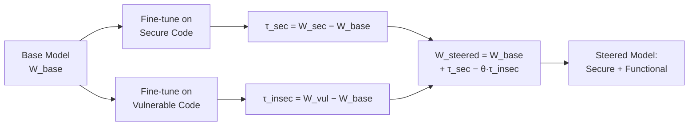
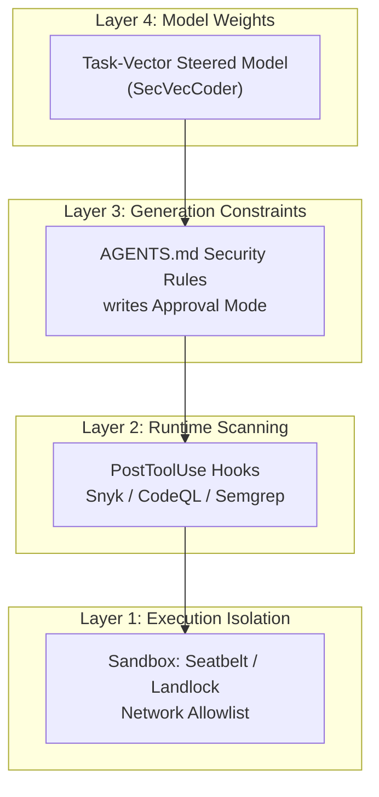

# SecVecCoder and the Defence-in-Depth Stack: How Task-Vector Security at the Model Layer Complements Codex CLI's Runtime Protections


---

Every Codex CLI practitioner knows the runtime defence stack: sandboxed execution, approval policies, PostToolUse hooks wired to Snyk or CodeQL, AGENTS.md constraints encoding security requirements. These are essential. But they all share a common property — they operate *after* the model has already generated code. A new paper from the University of Waterloo demonstrates that you can intervene earlier, at the model-weight layer, steering code generation models to produce secure code *by default* using task-vector arithmetic. The technique, called **SecVecCoder**, improves the rate of trustworthy (simultaneously functional and secure) code completions by 2.1–36.0 percentage points across six open-source coding models, at negligible inference cost [^1].

For teams running Codex CLI with custom model providers — Ollama, LM Studio, or vLLM serving open-weight models — this opens a new defensive layer that sits beneath AGENTS.md and above the sandbox.

## The Problem: Functionality and Security Are Competing Objectives

Most secure code generation research treats security as a post-hoc filter: generate code, scan it, fix the vulnerabilities. Codex CLI's PostToolUse hooks follow this pattern — they catch problems after generation. The trouble is well-documented: AI-assisted commits introduce 15–18% more security vulnerabilities than human-only commits [^2], and runtime scanning creates a 4.6× review bottleneck [^2].

SecVecCoder's insight is that functionality and security are entangled in the model's weight space. Standard fine-tuning on secure code often *degrades* functional correctness, because the security-relevant and functionality-relevant weight directions overlap and interfere [^1]. You need a technique that can steer both directions simultaneously.

## How Task Vectors Work

Task vectors are a concept from alignment research. The idea is elegantly simple:

1. **Fine-tune** a base model on secure code examples to get weights W<sub>sec</sub>
2. **Fine-tune** the same base model on vulnerable code examples to get weights W<sub>vul</sub>
3. **Compute vectors**: τ<sub>sec</sub> = W<sub>sec</sub> − W<sub>base</sub> and τ<sub>insec</sub> = W<sub>vul</sub> − W<sub>base</sub>
4. **Apply arithmetic**: W<sub>steered</sub> = W<sub>base</sub> + τ<sub>sec</sub> − θ · τ<sub>insec</sub>

The final formula (the "secure-anchored" operator) simultaneously moves the model *toward* the secure direction and *away from* the insecure direction, controlled by a steering strength θ [^1].



Three operators were tested: negation (suppress insecure only), contrast (steer along the difference vector), and secure-anchored (the full formula above). Secure-anchored consistently performed best [^1].

## The Numbers That Matter

SecVecCoder was evaluated on six models across three families using the CodeGuard+ benchmark, which jointly measures functional correctness (unit tests pass) and security (CodeQL static analysis clean) via a **sec-pass@1** metric [^1] [^3].

| Model | Base sec-pass@1 | SecVecCoder sec-pass@1 | Improvement |
|---|---|---|---|
| Qwen2.5-Coder-3B | 66.5% | 90.4% | +23.9pp |
| Qwen2.5-Coder-7B | 60.0% | 96.0% | +36.0pp |
| DeepSeek-Coder-1.3B | 57.6% | 73.4% | +15.8pp |
| DeepSeek-Coder-6.7B | — | 68.2% | +2.1pp (min) |
| StarCoder2-3B | — | 74.8% | significant |
| StarCoder2-7B | — | 70.6% | significant |

The technique generalises to **unseen vulnerability types** — CWEs not present in training — with improvements reaching 39.1 percentage points on specific models [^1]. Nine CWE classes were trained (including CWE-089 SQL injection, CWE-079 XSS, CWE-078 OS command injection, CWE-787 out-of-bounds write), and four held-out CWEs (CWE-020 improper input validation, CWE-119 buffer overflow, CWE-502 deserialisation, CWE-732 incorrect permissions) showed consistent gains [^1].

### Training Cost and Inference Overhead

This is where SecVecCoder becomes practically interesting for Codex CLI workflows:

- **Training**: 0.68–1.80 GPU-hours on an NVIDIA A6000 — 8–12.5% of SafeCoder's cost [^1]
- **Inference latency**: mean overhead of **0.6%** relative to the base model [^1]
- **No special decoding**: the steered model runs with standard sampling; no constrained decoding, no beam search, no rejection sampling

A weekend GPU rental to fine-tune two LoRA adapters, compute the task vectors, and apply the arithmetic. Then serve the steered model through Ollama exactly as you would the original.

## Fitting SecVecCoder into the Codex CLI Security Stack

Codex CLI's security model operates on two axes: **approval policy** (suggest, auto-edit, writes, full-auto) and **sandbox mode** (workspace-write, network-disabled, custom allowlists) [^4]. PostToolUse hooks add a third layer of runtime scanning. SecVecCoder adds a fourth: **model-layer security**.



### Configuring a Steered Model as a Custom Provider

Once you have a SecVecCoder-steered model served via Ollama, the Codex CLI configuration is straightforward [^5]:

```toml
# ~/.codex/config.toml

[model_providers.secvec]
name = "SecVecCoder-Qwen-7B"
base_url = "http://localhost:11434/v1"

[profiles.secure-dev]
model_provider = "secvec"
model = "secveccoder-qwen7b:latest"
approval_policy = "writes"
```

Launch with:

```bash
codex --profile secure-dev "Implement the authentication middleware"
```

The model itself is now biased toward secure patterns, and the `writes` approval policy catches any file mutations for human review. PostToolUse hooks provide the final scanning gate.

### Pairing with PostToolUse Security Hooks

The defence-in-depth principle means no single layer is trusted exclusively. A steered model reduces the *rate* of vulnerable code, but PostToolUse hooks catch what slips through:

```toml
# In config.toml or AGENTS.md hooks section
[[hooks.post_tool_use]]
event = "post_tool_use"
tool = "write_file"
command = "semgrep --config=auto --error $CODEX_FILE_PATH"
on_failure = "reject"
```

SecVecCoder's 96.0% sec-pass@1 on Qwen-7B [^1] means the hook fires on roughly 4% of generated code rather than 40% — a meaningful reduction in review fatigue and interruption cost.

### AGENTS.md Security Encoding

AGENTS.md already encodes security requirements declaratively. With a steered model, these become reinforcing rather than corrective:

```markdown
## Security Requirements

- All SQL queries MUST use parameterised statements (CWE-089)
- User input MUST be sanitised before shell execution (CWE-078)
- File paths MUST be validated against directory traversal (CWE-022)
- Deserialisation of untrusted data MUST use allowlisted types (CWE-502)

Note: The configured model profile uses task-vector security steering.
PostToolUse hooks provide runtime verification as a secondary gate.
```

## The Fine-Tuning Strategy Matters: LPO over SFT

Not all fine-tuning approaches produce equally useful task vectors. SecVecCoder compared three strategies [^1]:

- **SFT** (supervised fine-tuning): standard next-token prediction loss
- **SafeCoder-style**: three-way loss combining functionality, secure likelihood, and vulnerable unlikelihood
- **LPO** (Localised Preference Optimisation): focuses gradient updates on tokens that *differ* between secure and vulnerable versions

LPO produced task vectors where the secure and insecure directions were genuinely *opposed* (cosine similarity −0.515 to −0.720), whilst SFT vectors pointed in nearly the *same* direction (cosine similarity +0.332 to +0.765) [^1]. The implication: SFT-derived vectors partially cancel out when you apply the secure-anchored formula. LPO vectors amplify the correction.

For practitioners: if you are building task vectors for your own security domains, use preference-based fine-tuning, not standard SFT. The training data requirement is modest — the SVEN dataset used by SecVecCoder contains just 803 paired examples (380 Python, 423 C/C++) [^1].

## What This Does Not Solve

Task-vector steering is a generation-time intervention. It cannot:

- **Enforce architectural constraints**: if your AGENTS.md mandates a specific authentication library, the model may still choose alternatives. Runtime hooks remain necessary [^6].
- **Prevent logic errors**: SecVecCoder targets CWE-class vulnerabilities (injection, memory safety, privilege errors), not business-logic correctness. The 71% logic-error rate observed in constraint decay research [^7] is orthogonal.
- **Replace sandbox isolation**: a steered model that never generates `os.system(user_input)` still runs inside Codex CLI's Seatbelt/Landlock sandbox. ⚠️ Defence-in-depth means *every* layer stays active.
- **Scale to frontier models**: the technique requires weight access. OpenAI's GPT-5.6 Sol/Terra/Luna models are API-only — you cannot extract and modify their weights. Task vectors are practical only for open-weight models served through custom providers [^5].

## The Broader Trajectory: Model-Layer Security as Standard Practice

SecVecCoder is not isolated. The broader research direction — sometimes called "safety arithmetic" — applies task-vector techniques to alignment, toxicity reduction, and now code security [^8]. The Safety Arithmetic framework by Arteaga et al. showed that steering parameters and activations at test time can achieve safety alignment without retraining [^8]. SecVecCoder demonstrates that the same principle works for the specific, measurable domain of CWE-class vulnerabilities in generated code.

For Codex CLI teams running mixed model strategies — GPT-5.6 Luna for fast iterations, open-weight models for cost-sensitive or air-gapped workloads — SecVecCoder offers a way to bring the open-weight security profile closer to the safety-tuned commercial models. The configuration is a profile switch:

```toml
[profiles.fast]
model = "gpt-5.6-luna"
# Relies on OpenAI's built-in safety tuning

[profiles.local-secure]
model_provider = "secvec"
model = "secveccoder-qwen7b:latest"
# Task-vector steered for CWE-class security
```

## Practical Next Steps

1. **Fine-tune two adapters** on the SVEN dataset using LPO — one on secure examples, one on vulnerable examples. Total training: under 2 GPU-hours [^1].
2. **Compute and apply the task vectors** using the secure-anchored formula with θ between 1.0 and 1.5 [^1].
3. **Serve the steered model** via Ollama or vLLM with a Codex CLI custom provider configuration.
4. **Layer runtime defences**: keep PostToolUse hooks, the `writes` approval mode, and sandbox isolation active.
5. **Measure the delta**: compare sec-pass@1 between your base and steered model on your own codebase's vulnerability patterns.

The investment is modest — a weekend of GPU time and a config.toml profile. The return is a measurably lower vulnerability injection rate at the point of generation, before any runtime scanning fires.

---

## Citations

[^1]: Wang, F., Das, A., Nagappan, M., and Asokan, N. (2026). "Functional and Secure Code Generation with Task Vectors." arXiv:2607.07881. University of Waterloo. [https://arxiv.org/abs/2607.07881](https://arxiv.org/abs/2607.07881)

[^2]: Opsera (2026). "2026 AI Coding Impact Benchmark." Cited via OpenAI Codex Security review coverage. [https://www.openaitoolshub.org/en/blog/openai-codex-security-review](https://www.openaitoolshub.org/en/blog/openai-codex-security-review)

[^3]: He, J., Vechev, M. et al. (2023). "CodeGuard+: Measuring Code LLMs' Ability to Generate Both Secure and Correct Code." Introduced alongside constrained-decoding secure code generation research. [https://www.emergentmind.com/topics/secure-code-generation-methods](https://www.emergentmind.com/topics/secure-code-generation-methods)

[^4]: OpenAI (2026). "Codex CLI Features: Approval Policy and Sandbox." Codex CLI documentation. [https://developers.openai.com/codex/cli/features](https://developers.openai.com/codex/cli/features)

[^5]: OpenAI (2026). "Codex CLI Advanced Configuration: Custom Model Providers." [https://developers.openai.com/codex/config-advanced](https://developers.openai.com/codex/config-advanced)

[^6]: Dente, A., Satriani, F., and Papotti, P. (2026). "Constraint Decay in Backend Code Generation." arXiv:2605.06445. [https://arxiv.org/abs/2605.06445](https://arxiv.org/abs/2605.06445)

[^7]: Dente, A., Satriani, F., and Papotti, P. (2026). Ibid. Logic errors constituting 71% of failures in constrained backend generation tasks.

[^8]: Arteaga, C. et al. (2024). "Safety Arithmetic: A Framework for Test-time Safety Alignment of Language Models by Steering Parameters and Activations." arXiv:2406.11801. [https://arxiv.org/abs/2406.11801](https://arxiv.org/abs/2406.11801)
