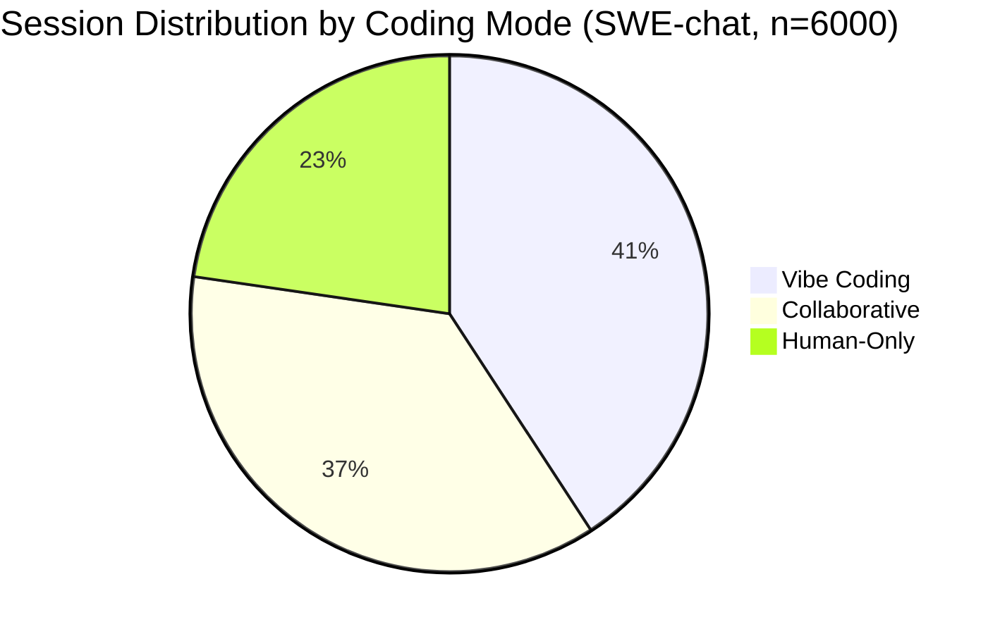
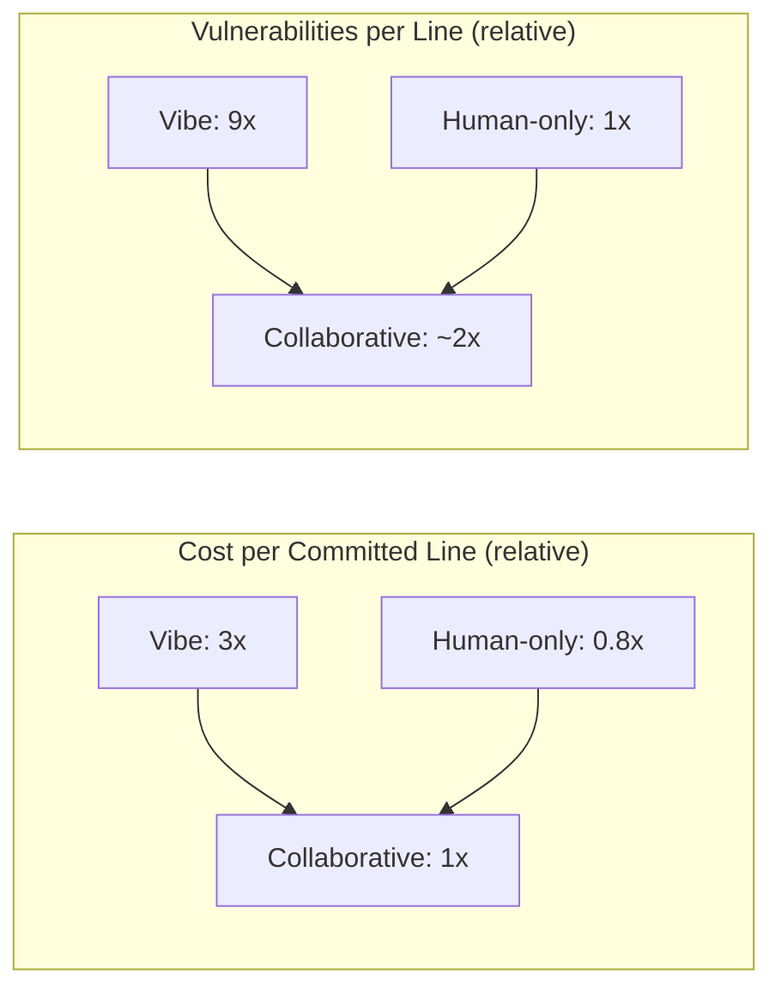

# SWE-Chat and the Bimodal Reality: Why 41 Per Cent of Sessions Are Pure Vibe Coding — and How Codex CLI Profiles Let You Choose Your Mode Deliberately


---

## The Data We Were Missing

Until April 2026, every claim about how developers actually use coding agents was anecdotal. SWE-chat changed that. Published by Baumann, Padmakumar, Li, Yang, Yang, and Koyejo at Stanford's SALT-NLP lab, SWE-chat is the first large-scale observational dataset of real coding agent sessions collected from open-source developers in the wild [^1]. It contains 6,000 sessions, more than 63,000 user prompts, and 355,000 agent tool calls — all from production use, not laboratory tasks [^1].

The headline finding is stark: coding patterns are **bimodal**. Developers do not use coding agents on a smooth spectrum from "light assistance" to "full delegation." They cluster into discrete modes with radically different cost, security, and quality profiles [^1].

---

## Three Modes, Three Cost Curves

SWE-chat identifies three distinct collaboration modes [^1]:

| Mode | Share of Sessions | Agent Code Authorship | Characteristics |
|------|------------------|-----------------------|-----------------|
| **Human-only** | 22.7% | ~0% | Agent assists with comprehension, debugging, git operations |
| **Collaborative** | 36.5% | 1–99% of committed lines | Human and agent jointly contribute |
| **Vibe coding** | 40.8% | >99% of committed lines | Agent authors virtually everything |

The trajectory is alarming: over the three-month observation window, vibe coding's share **doubled** from 20 per cent to over 40 per cent of sessions [^1].



---

## The Efficiency Paradox

Vibe coding appears productive — the agent writes everything. But the numbers tell a different story:

- **Token cost:** Vibe coding consumes roughly **3× more tokens per committed line** than collaborative coding [^1]
- **Code survival:** Only **44 per cent of all agent-produced code** survives into user commits [^1]
- **Security:** Vibe-coded commits introduce **9× more vulnerabilities** per committed line than human-only code, and **5× more** than collaborative code [^1]
- **Duration:** The 99.9th-percentile turn duration exceeds **100 minutes**, yet agents rarely pause to ask for clarification [^1]
- **Pushback:** Users push back against agent outputs in **44 per cent of turns** — regardless of mode [^1]

Collaborative coding achieves the best trade-off across all measured dimensions: cost, quality, security, and code survival rate [^1].



---

## Why This Matters for Codex CLI Configuration

The SWE-chat findings reveal that most developers **drift** into vibe coding without a conscious decision. The observation window shows the share climbing steadily — suggesting that once an agent can handle a task, developers progressively delegate more, regardless of whether full delegation is optimal for that task [^1].

Codex CLI's named profile system [^2] gives you the mechanism to make this choice **deliberately** rather than by drift. A profile bundles model selection, approval policy, sandbox configuration, and token budgets into a single switchable unit [^2].

---

## Configuring Profiles for Each Mode

### The Collaborative Profile

Collaborative coding — where the human and agent co-author — delivers the best efficiency. Configure it with guardrails that keep the human in the loop:

```toml
# ~/.codex/collaborative.config.toml
model = "gpt-5.6-terra"
approval_mode = "auto-edit"

[sandbox]
mode = "workspace-write"
network = "off"

[limits]
rollout_budget = 50000
tool_output_token_limit = 4000

[hooks.post_tool_use]
command = "run-tests-on-change"
```

Key choices:

- **`auto-edit` approval mode**: file changes happen immediately, but shell commands still require confirmation — keeping the human involved in consequential actions [^3]
- **`rollout_budget = 50000`**: a moderate budget that encourages focused work rather than unbounded exploration [^4]
- **`tool_output_token_limit`**: prevents context bloat from large file reads, forcing the agent to be selective [^4]
- **`gpt-5.6-terra`**: the balanced workhorse model — sufficient reasoning without Sol's cost [^5]

### The Vibe Coding Profile (Sandboxed)

When you deliberately choose full delegation — greenfield prototyping, throwaway spikes — configure it with maximum autonomy but maximum containment:

```toml
# ~/.codex/vibe.config.toml
model = "gpt-5.6-sol"
approval_mode = "full-auto"

[sandbox]
mode = "workspace-write"
network = "allowlist"
allowed_domains = ["registry.npmjs.org", "pypi.org", "api.github.com"]

[limits]
rollout_budget = 200000

[hooks.post_tool_use]
command = "security-scan-on-write"

[hooks.stop]
command = "run-full-test-suite"
```

Key choices:

- **`full-auto`**: no interruptions, matching the vibe coding pattern — but the sandbox and hooks provide the safety net the SWE-chat data shows is needed [^3]
- **Network allowlist**: prevents the 9× vulnerability rate from becoming an exfiltration vector [^6]
- **`security-scan-on-write` hook**: compensates for the security gap SWE-chat identifies by running static analysis after every file write [^7]
- **`stop` hook**: ensures the test suite passes before the agent reports completion [^7]

### The Review Profile

For security-sensitive work where the SWE-chat vulnerability data demands extra caution:

```toml
# ~/.codex/review.config.toml
model = "gpt-5.6-sol"
approval_mode = "suggest"

[sandbox]
mode = "read-only"
network = "off"

[auto_review]
enabled = true
risk_threshold = "low"
```

---

## Switching Modes Deliberately

With profiles defined, switching is a single flag:

```bash
# Start a collaborative session (default for most work)
codex --profile collaborative "Refactor the auth middleware to use JWT"

# Spike a prototype in vibe mode
codex --profile vibe "Build a CLI tool that parses CloudFormation templates"

# Security-sensitive review
codex --profile review "Audit the payment processing module for OWASP Top 10"
```

You can also set `CODEX_PROFILE=collaborative` in your shell RC file to make collaborative mode the default, requiring explicit opt-in for vibe coding [^2].

---

## The 44 Per Cent Pushback Problem

SWE-chat's finding that users push back in 44 per cent of turns [^1] suggests a structural mismatch: agents proceed confidently where humans would pause. The `writes` approval mode introduced in Codex CLI v0.144.0 [^8] offers a middle ground — allowing declared read-only actions whilst prompting for writes. This maps directly to the collaborative pattern where human judgment gates consequential changes.

```toml
# Alternative: writes-only approval (v0.144.0+)
approval_mode = "writes"
```

---

## Measuring Your Own Mode Distribution

The SWE-chat methodology classifies sessions by the ratio of agent-authored lines in commits. You can approximate this locally:

```bash
# Count agent-authored lines in recent commits
git log --since="1 week ago" --author="codex" --stat | \
  grep -oP '\d+(?= insertion)' | \
  awk '{sum += $1} END {print "Agent lines this week:", sum}'
```

If your ratio is climbing towards 100 per cent without a deliberate decision, it may be time to shift towards the collaborative profile that SWE-chat shows delivers better outcomes per token spent.

---

## Implications for AGENTS.md

The bimodal pattern suggests that AGENTS.md instructions should encode **which mode is appropriate for which task type**:

```markdown
## Coding Mode Guidance

- **New features in existing modules**: Use collaborative mode. Run tests after each
  logical change. Pause for human review at API boundary decisions.
- **Greenfield prototypes in /experiments/**: Vibe coding acceptable. Ensure sandbox
  network is restricted. Run security scan before committing.
- **Security-critical paths (/auth/, /payment/, /crypto/)**: Review mode only. No
  autonomous edits. All changes require explicit approval.
```

This converts the implicit drift SWE-chat observes into explicit protocol.

---

## Citations

[^1]: Baumann, J., Padmakumar, V., Li, X., Yang, J., Yang, D., & Koyejo, S. (2026). "SWE-chat: Coding Agent Interactions From Real Users in the Wild." arXiv:2604.20779. Available at: [https://arxiv.org/abs/2604.20779](https://arxiv.org/abs/2604.20779)

[^2]: OpenAI. (2026). "Advanced Configuration — Named Profiles." Codex CLI Documentation. Available at: [https://developers.openai.com/codex/config-advanced](https://developers.openai.com/codex/config-advanced)

[^3]: OpenAI. (2026). "Agent Approvals & Security." Codex CLI Documentation. Available at: [https://developers.openai.com/codex/agent-approvals-security](https://developers.openai.com/codex/agent-approvals-security)

[^4]: OpenAI. (2026). "Configuration Reference." Codex CLI Documentation. Available at: [https://developers.openai.com/codex/config-reference](https://developers.openai.com/codex/config-reference)

[^5]: OpenAI. (2026). "GPT-5.6: Frontier intelligence that scales with your ambition." Available at: [https://openai.com/index/gpt-5-6/](https://openai.com/index/gpt-5-6/)

[^6]: OpenAI. (2026). "Codex CLI v0.144.1 Release Notes." GitHub. Available at: [https://github.com/openai/codex/releases/tag/rust-v0.144.1](https://github.com/openai/codex/releases/tag/rust-v0.144.1)

[^7]: OpenAI. (2026). "Codex CLI Hooks Documentation." Available at: [https://developers.openai.com/codex/cli](https://developers.openai.com/codex/cli)

[^8]: OpenAI. (2026). "Codex CLI v0.144.0 Release Notes." GitHub. Available at: [https://github.com/openai/codex/releases/tag/rust-v0.144.0](https://github.com/openai/codex/releases/tag/rust-v0.144.0)
