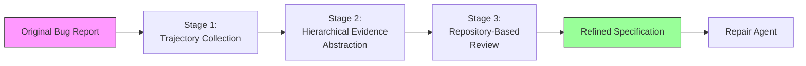
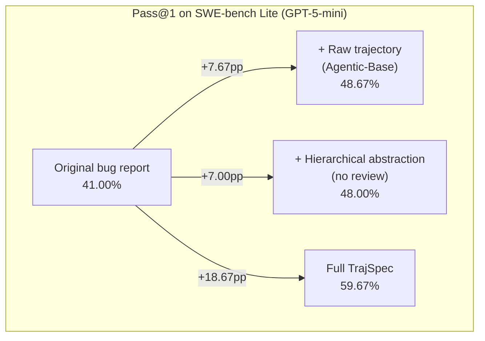

# TrajSpec and the Specification Bottleneck: Why Your Bug Reports Are the Weakest Link in Agent-Driven Repair — and How Codex CLI Closes the Gap


---

Coding agents have become remarkably good at generating patches. The bottleneck has shifted. Al Fahim et al. demonstrate in their July 2026 paper *Bug Report Specification Refinement with Trajectory Guidance for Automated Program Repair* that the specification fed to the agent — the bug report — is now the dominant constraint on repair success [^1]. Their system, TrajSpec, enriches sparse bug reports with trajectory-derived evidence and lifts Pass@1 from 41% to 72% on SWE-bench Lite [^1]. That is not a model upgrade or a harness redesign; it is a pre-processing step that rewrites the prompt.

This article unpacks what TrajSpec does, why specification quality matters more than model capability for repair tasks, and how you can apply the same principles inside Codex CLI today.

## The specification bottleneck

Most bug reports describe symptoms: "lowercase QDP commands fail." They omit the failure mechanism (case-sensitive regex in the parser), the behavioural requirement (commands should be case-insensitive), and the implementation scope (two call sites, not one) [^1]. When a repair agent receives only the symptom, it localises one of the two sites, patches it, and produces a partial fix that passes some tests but fails others.

TrajSpec quantifies this gap. On SWE-bench Lite's 300 instances, GPT-5-mini with original bug reports achieves 41.00% Pass@1. With TrajSpec-refined reports, the same model on the same harness (Mini-SWE-Agent V2) achieves 59.67% — a 45.53% relative improvement [^1]. The agent, the model, and the sandbox are identical. Only the input changed.

## How TrajSpec works

TrajSpec operates in three stages, none of which assume a correct patch exists.



### Stage 1 — Trajectory collection

An exploratory agent run executes against the pre-fix repository using the original bug report. The run produces an ordered sequence of thought–action–observation tuples: diagnostic reasoning, code inspections, grep results, and test output [^1]. Crucially, TrajSpec does not validate whether any resulting patch is correct. The trajectory is treated as raw investigative evidence, not as a repair attempt.

### Stage 2 — Hierarchical evidence abstraction

The raw trajectory is distilled into three repair-relevant dimensions, each organised at three levels of granularity [^1]:

| Dimension | High-level | Mid-level | Low-level |
|-----------|-----------|-----------|-----------|
| **Failure mechanism** | Source-code behaviour explaining symptoms | Diagnostic relationships | Concrete observations (e.g. missing regex flag) |
| **Behavioural requirement** | Expected behaviour in the reported scenario | Functional constraints | Specific input/output pairs |
| **Implementation scope** | Affected code locations | Module-level boundaries | Line-level references |

This hierarchy is the key innovation. Simply appending the raw trajectory to the prompt (the "Agentic-Base" baseline) yields only 48.67% Pass@1 — better than the original 41%, but far below TrajSpec's 59.67% [^1]. The structure matters.

### Stage 3 — Repository-based review

An LLM-based reviewer cross-references the draft specification against the pre-fix repository. Unsupported claims are removed, uncertain claims are revised, and repository-validated details are added [^1]. Ablating this stage drops Pass@1 from 59.67% to 48.00% — a 19.55% decrease [^1].

## Cross-agent generality

The refined specifications are not tuned for a single harness. On a 100-instance stratified sample [^1]:

| Repair agent | Original | TrajSpec | Relative gain |
|-------------|----------|----------|---------------|
| Agentless | 41% | 71% | +73.17% |
| AutoCodeRover | 47% | 72% | +53.19% |

Agentless uses decomposed fault localisation; AutoCodeRover uses integrated search. Both benefit substantially, suggesting TrajSpec's specifications contain agent-agnostic diagnostic value [^1].

## Cost economics

TrajSpec's pre-processing is cheap. With GPT-5-mini, report generation costs \$0.087 per instance (224K input, 16K output tokens). The downstream repair cost actually *decreases* by 24% in input tokens because the agent wastes fewer turns on exploration [^1]. With MiniMax M2.5, the total overhead drops to \$0.019 per instance [^1].

For Codex CLI users paying per token, this arithmetic is compelling: spend \$0.09 enriching the specification, save more than that on repair, and triple the success rate.

## Mapping TrajSpec to Codex CLI

TrajSpec is a research prototype. But its three-stage pattern maps cleanly onto Codex CLI primitives available today.

### Encoding specification structure in AGENTS.md

The three dimensions TrajSpec uses — failure mechanism, behavioural requirement, implementation scope — belong in your AGENTS.md as a bug-fix prompt template [^2]:

```markdown
## Bug Fix Protocol

When fixing a bug, first establish three things before writing any patch:

1. **Failure mechanism**: What code path produces the observed symptom?
   Run the failing test, trace execution, identify the root cause.
2. **Behavioural requirement**: What should the correct behaviour be?
   Check tests, documentation, related passing cases.
3. **Implementation scope**: Which files and functions need changes?
   Use `rg` to find all call sites, not just the first match.

Do not propose a patch until all three are documented in your reasoning.
```

This mirrors TrajSpec's hierarchical abstraction without requiring a separate enrichment pipeline [^2] [^3].

### Using codex exec for trajectory collection

TrajSpec's first stage — an exploratory agent run — maps directly to `codex exec` with `--output-schema` [^4]:

```bash
codex exec \
  --model gpt-5.6-terra \
  --approval-mode suggest \
  --output-schema '{"type":"object","properties":{"failure_mechanism":{"type":"string"},"behavioural_requirement":{"type":"string"},"implementation_scope":{"type":"array","items":{"type":"string"}}},"required":["failure_mechanism","behavioural_requirement","implementation_scope"]}' \
  "Investigate this bug without fixing it. Reproduce the failure, trace the root cause, identify all affected code locations. Bug: $(cat issue.md)"
```

This produces a structured JSON specification that can be piped into a second `codex exec` call for the actual repair:

```bash
codex exec \
  --model gpt-5.6-sol \
  --approval-mode auto-edit \
  "Fix the following bug using this specification: $(cat spec.json)"
```

The two-pass pattern — cheap model for investigation, capable model for repair — mirrors TrajSpec's cost economics [^4] [^5].

### PostToolUse hooks for repository review

TrajSpec's third stage validates claims against the repository. In Codex CLI, a PostToolUse hook can enforce this automatically [^6]:

```json
{
  "hooks": {
    "PostToolUse": [
      {
        "matcher": {"tool_name": "apply_patch"},
        "command": "python3 .codex/hooks/validate_scope.py",
        "timeout_ms": 10000
      }
    ]
  }
}
```

The hook script verifies that every file the agent proposes to modify was identified during the investigation phase. If the agent attempts to patch a file outside its documented implementation scope, the hook returns exit code 2, blocking the edit and feeding the discrepancy back into the agent's context [^6].

### GitHub Actions integration for automated enrichment

For teams running Codex in CI, the `openai/codex-action@v1` GitHub Action can automate the full enrichment-then-repair pipeline [^7]:


```yaml
- name: Enrich bug specification
  uses: openai/codex-action@v1
  with:
    codex_args: >
      exec
      --model gpt-5.6-luna
      --approval-mode suggest
      "Investigate issue #${{ github.event.issue.number }} without fixing it.
       Output failure mechanism, behavioural requirement, and implementation scope."

- name: Repair with enriched specification
  uses: openai/codex-action@v1
  with:
    codex_args: >
      exec
      --model gpt-5.6-terra
      --approval-mode auto-edit
      "Fix the bug described in the enriched specification above."
```


This mirrors the TrajSpec pipeline end-to-end: trajectory collection (Luna, cheap), followed by repair (Terra, balanced) [^7] [^5].

## What this means for specification design

TrajSpec's ablation results tell a clear story about what matters in bug specifications:



Raw trajectories help modestly. Hierarchical structure without review helps similarly. But the combination — structured evidence validated against the repository — delivers nearly triple the gain of either component alone [^1]. The lesson for practitioners: structured, verified context beats unstructured dumps every time.

## Limitations and open questions

TrajSpec was evaluated exclusively on Python repositories in SWE-bench Lite [^1]. Whether the gains transfer to compiled languages with different debugging patterns (stack traces, core dumps, type errors) remains untested. ⚠️

The trajectory collection stage requires executing an agent run against the pre-fix repository, which presupposes a reproducible environment. For production incidents where reproduction is non-trivial, this stage may need adaptation. ⚠️

The paper does not evaluate TrajSpec with Codex CLI specifically, though the agent-agnostic results across Mini-SWE-Agent V2, Agentless, and AutoCodeRover suggest the gains should generalise [^1]. ⚠️

## Practical takeaways

1. **Specification quality dominates model capability for repair tasks.** A 45–73% relative improvement from better prompts outpaces most model upgrades.
2. **Structure your bug reports around three dimensions**: failure mechanism, behavioural requirement, implementation scope. Encode this in AGENTS.md.
3. **Use two-pass repair workflows**: cheap investigation model, then capable repair model. The investigation pays for itself in reduced downstream exploration.
4. **Validate agent claims against the repository** before they reach the patch stage. PostToolUse hooks or a dedicated review step catch scope creep early.
5. **Automate the pipeline** with `codex exec` and GitHub Actions. The \$0.09 enrichment cost per instance is negligible against the repair success gains.

---

## Citations

[^1]: Al Fahim, S. M. F., Rafi, M. N., Ahasanuzzaman, M., Ma, Z., Kim, D. J., Wang, S., & Chen, T.-H. (2026). Bug Report Specification Refinement with Trajectory Guidance for Automated Program Repair. arXiv:2607.07882. [https://arxiv.org/abs/2607.07882](https://arxiv.org/abs/2607.07882)

[^2]: OpenAI. (2026). Custom instructions with AGENTS.md. ChatGPT Learn. [https://developers.openai.com/codex/guides/agents-md](https://developers.openai.com/codex/guides/agents-md)

[^3]: OpenAI. (2026). Best practices for Codex CLI. ChatGPT Learn. [https://developers.openai.com/codex/learn/best-practices](https://developers.openai.com/codex/learn/best-practices)

[^4]: OpenAI. (2026). Non-interactive mode. ChatGPT Learn. [https://developers.openai.com/codex/noninteractive](https://developers.openai.com/codex/noninteractive)

[^5]: OpenAI. (2026). Codex CLI changelog — v0.144.0. ChatGPT Learn. [https://developers.openai.com/codex/changelog](https://developers.openai.com/codex/changelog)

[^6]: OpenAI. (2026). Hooks. ChatGPT Learn. [https://developers.openai.com/codex/hooks](https://developers.openai.com/codex/hooks)

[^7]: OpenAI. (2026). Codex GitHub Action. ChatGPT Learn. [https://developers.openai.com/codex/github-action](https://developers.openai.com/codex/github-action)
