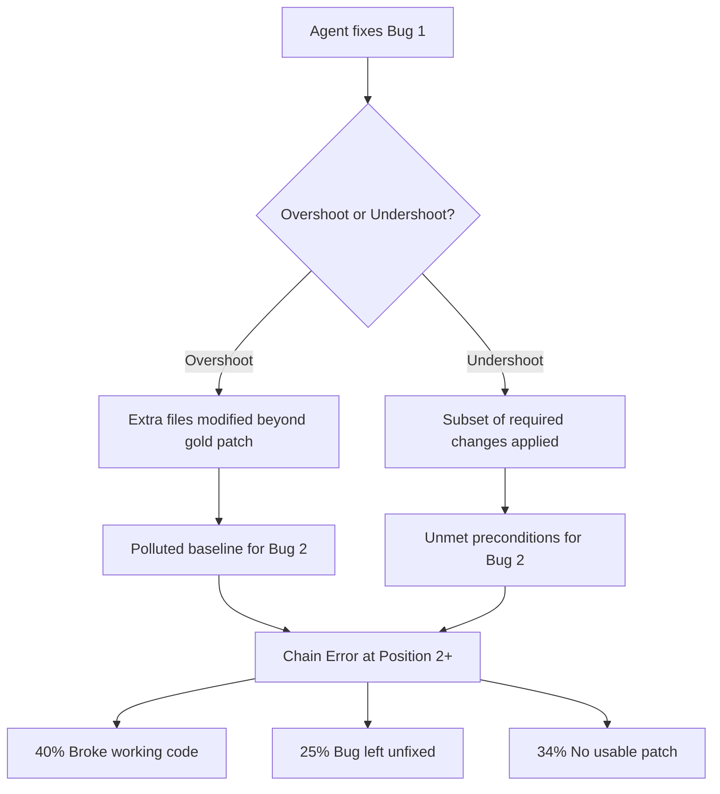

# ChainSWE and the 70% Drop: Why Sequential Bug-Fixing Breaks Every Coding Agent — and How to Wire Chain-Resilient Maintenance into Codex CLI


---

## The Single-Bug Illusion

Every mainstream coding-agent benchmark — SWE-bench, SWE-bench Verified, SWE-bench Pro — resets the repository to a clean state between issues [^1]. Fix a bug, score a point, wipe the slate. This is convenient for leaderboard operators but bears no resemblance to the maintenance work most developers actually do: a Monday morning spent chasing three related defects through the same service, each fix landing atop the previous one, each introducing subtle state that shapes how the next issue should be approached.

ChainSWE, published on 1 July 2026 by researchers across Georgia Tech, UCL, NYU, Wisconsin–Madison, Cornell, Stanford, and Northeastern, is the first benchmark that refuses to reset [^2]. It chains 304 real bug-fix tasks into 100 sequences across 54 Python repositories, requiring agents to fix bugs 2, 3, 4, and 5 on top of whatever the agent actually produced for bug 1 — not on top of the gold patch. The results are sobering.

## The Numbers

Seven frontier models were evaluated under three regimes: **Oracle** (each bug starts from the perfect gold-patch state), **Sequential** (each bug starts from the agent's own prior output), and **Sequential + Memory** (sequential with context-management strategies applied).

### Per-Bug Accuracy by Regime

| Regime | Mean Per-Bug Accuracy | Mean Chain Success |
|--------|----------------------|-------------------|
| Oracle | 58.9% | 20.0% |
| Sequential | 36.5% | 17.0% |
| Sequential + Memory | 36.9% | 17.0% |

The shift from Oracle to Sequential represents a **38% relative decline** in per-bug accuracy [^2]. The drop is not uniform across models: GPT-4.5 loses 29%, whilst DeepSeek-V4-Pro loses 48% [^2].

### Positional Decay (Length-3 Chains)

The degradation accelerates with chain depth:

| Chain Position | Oracle | Sequential | Degradation |
|---------------|--------|------------|-------------|
| Position 1 | 58.6% | 57.1% | −2% |
| Position 2 | 64.3% | 39.3% | −39% |
| Position 3 | 67.0% | 27.7% | −59% |

By position 3, under the Summarise context strategy, performance drops by up to **70%** compared to Oracle [^2]. The agent is not getting harder problems — Oracle accuracy actually *rises* at deeper positions because the benchmark filters for naturally solvable bugs. The agent is simply drowning in its own accumulated state.

## Why Chains Break Agents

ChainSWE's error taxonomy identifies **chain errors** — failures caused not by the bug's inherent difficulty but by the agent's prior modifications. Of 663 downstream failures at positions 2 and 3, **48% are chain errors** [^2]. These fall into two categories:

**Overshoot.** The agent modifies files beyond the gold-patch scope. A defensive refactor at position 1 that touches a utility module pollutes the baseline for position 2, where the bug lives in that same module. Overshoot accounts for a 9:1 ratio of failures versus undershoot [^2].

**Undershoot.** The agent ships only a subset of a multi-file fix. Position 2's tests then fail because preconditions established by the missing changes are unmet.

The downstream consequences split into three buckets: **broke working code** (40%), **left the bug unfixed** (25%), and **produced no usable patch** (34%) [^2].



## Context Strategies: Less Is More

ChainSWE tested three context-management approaches across all models:

| Strategy | Relative Decline (Oracle → Sequential) |
|----------|----------------------------------------|
| Baseline (full history carry-over) | −33% |
| Summarise (LLM-condensed context) | −40% |
| Sub-Agent (delegated file edits) | −41% |

The counterintuitive finding: **carrying raw history outperformed active rewriting** [^2]. Summarisation loses critical details — a renamed variable, a moved import — that downstream fixes depend on. Sub-agent delegation introduces coordination overhead and inconsistent state. Only GPT-4.5 showed any benefit from summarisation (+7.3 points), and even then only marginally [^2].

This aligns with earlier findings from TokenPilot [^3] and context-engineering research [^4]: aggressive compression destroys the structural signals that sequential work depends on.

## Mapping ChainSWE to Codex CLI

Codex CLI's architecture already contains several mechanisms that address chain degradation, though they require deliberate configuration for sequential maintenance workflows.

### Session Resumption as Chain Continuity

Every Codex CLI session is persisted as a JSONL transcript in `~/.codex/sessions/` [^5]. When you resume a session with `codex --resume`, the model reconstructs context from the full transcript rather than from a compressed summary. This mirrors ChainSWE's finding that raw history outperforms summarisation.

For a multi-bug maintenance session:

```bash
# Start the chain — fix bug 1
codex --resume chain-auth-fixes "Fix the token refresh race condition in auth.py per issue #4201"

# Continue the chain — fix bug 2 atop your bug 1 changes
codex --resume chain-auth-fixes "Now fix the session expiry handling in session.py per issue #4203"
```

The `--resume` flag ensures every prior tool call, file edit, and test result remains in context — precisely the "baseline history" strategy that ChainSWE found most robust.

### Compaction Configuration for Chain Preservation

Codex CLI's auto-compaction triggers when context exceeds `model_auto_compact_token_limit` [^6]. For chain workflows, this is dangerous — compaction is effectively the "Summarise" strategy that ChainSWE showed degrades performance by 40%. Configure it carefully:

```toml
# ~/.codex/maintenance.config.toml
model = "o3"
model_auto_compact_token_limit = 900000  # Push threshold high for 1M-context models
model_auto_compact_token_limit_scope = "body_after_prefix"  # Exclude AGENTS.md from count
tool_output_token_limit = 32000  # Preserve full test output between chain steps
```

Activate with `codex --profile maintenance`.

### AGENTS.md as Chain Protocol Anchor

ChainSWE's overshoot problem — agents modifying files beyond the required scope — maps directly to specification anchoring via `AGENTS.md` [^7]. A maintenance-focused `AGENTS.md` section can constrain the agent's patch scope:

```markdown
## Sequential Maintenance Protocol

When fixing bugs in sequence:
1. ONLY modify files explicitly mentioned in the issue or required by failing tests
2. After each fix, run the full test suite — not just the tests for the current issue
3. If a fix requires touching a file modified in a previous fix, state which prior change you are building on
4. Do NOT refactor, rename, or reorganise code beyond what the fix strictly requires
5. Before marking a fix complete, verify that all previously-passing tests still pass
```

This directly addresses the 40% "broke working code" failure mode by enforcing regression verification between chain positions.

### Rollout Budget as Chain Cost Ceiling

ChainSWE reports chain costs ranging from \$0.20 to \$6.80 per chain [^2]. Codex CLI's rollout budget feature provides a hard ceiling:

```toml
[features.rollout_budget]
enabled = true
limit_tokens = 500000      # Cap total chain token spend
reminder_interval_tokens = 50000  # Warn every 50K tokens
```

This prevents the pathological case where an agent spends 80% of its budget on position 1 overshoot, leaving insufficient budget for positions 2–5.

### PostToolUse Hooks for Chain-Error Detection

The undershoot and overshoot categories map to deterministic verification that can run after every tool invocation. A PostToolUse hook can check patch scope:

```markdown
## PostToolUse — Patch Scope Verification

After any file write:
1. Run `git diff --stat` and verify only expected files are modified
2. If files outside the current issue's scope are touched, pause and explain why
3. Run the full test suite, not just issue-specific tests
4. Report any newly failing tests that were passing before this fix
```

### Multi-Model Chain Routing

ChainSWE shows model-specific degradation varies dramatically — GPT-4.5 loses 29% whilst DeepSeek-V4-Pro loses 48% [^2]. Codex CLI profiles allow switching models mid-chain based on position:

```toml
# ~/.codex/chain-start.config.toml — positions 1-2
model = "o4-mini"  # Cost-efficient for early positions where degradation is low

# ~/.codex/chain-deep.config.toml — positions 3+
model = "o3"  # Higher capability for positions where chain errors compound
```

## The Broader Lesson

ChainSWE reveals that **isolated benchmarks systematically overstate agent capability** for the work developers actually do. A model scoring 58.9% on Oracle mode delivers only 27.7% at position 3 in sequential mode — a gap that no amount of prompt engineering closes. The 48% chain-error rate means nearly half of downstream failures are self-inflicted wounds from prior positions.

For Codex CLI practitioners, the practical takeaways are:

1. **Preserve raw history** — resist the urge to compact mid-chain
2. **Constrain patch scope** — overshoot is the dominant failure mode at a 9:1 ratio
3. **Run full regression suites between positions** — not just issue-specific tests
4. **Budget across the chain** — not per-position
5. **Use higher-capability models for deeper chain positions** where errors compound

The maintenance chain is where coding agents earn or lose developer trust. ChainSWE gives us the first rigorous measurement of that gap, and Codex CLI gives us the configuration surface to start closing it.

## Citations

[^1]: Yang, C. et al. (2024). "SWE-bench: Can Language Models Resolve Real-World GitHub Issues?" *ICLR 2024*. [https://arxiv.org/abs/2310.06770](https://arxiv.org/abs/2310.06770)

[^2]: Jin, Q. et al. (2026). "ChainSWE: Benchmarking Coding Agents on Multi-Bug Software Maintenance." *arXiv:2607.02606*. [https://arxiv.org/abs/2607.02606](https://arxiv.org/abs/2607.02606)

[^3]: TokenPilot: Cache-Efficient Context Management for LLM Agents. *arXiv:2606.17016*. [https://arxiv.org/abs/2606.17016](https://arxiv.org/abs/2606.17016)

[^4]: Context Engineering for Codex CLI: Write, Select, Compress, Isolate. Codex Knowledge Base, June 2026. [https://codex.danielvaughan.com/2026/06/10/context-engineering-codex-cli-write-select-compress-isolate-june-2026/](https://codex.danielvaughan.com/2026/06/10/context-engineering-codex-cli-write-select-compress-isolate-june-2026/)

[^5]: Codex CLI Session Persistence and Resume. OpenAI Developer Documentation, 2026. [https://learn.chatgpt.com/docs/cli/reference](https://learn.chatgpt.com/docs/cli/reference)

[^6]: Codex CLI Configuration Reference. OpenAI Developer Documentation, 2026. [https://learn.chatgpt.com/docs/config-file/config-reference](https://learn.chatgpt.com/docs/config-file/config-reference)

[^7]: Codex CLI AGENTS.md Guide. OpenAI Developer Documentation, 2026. [https://learn.chatgpt.com/docs/config-file/agents-md](https://learn.chatgpt.com/docs/config-file/agents-md)
